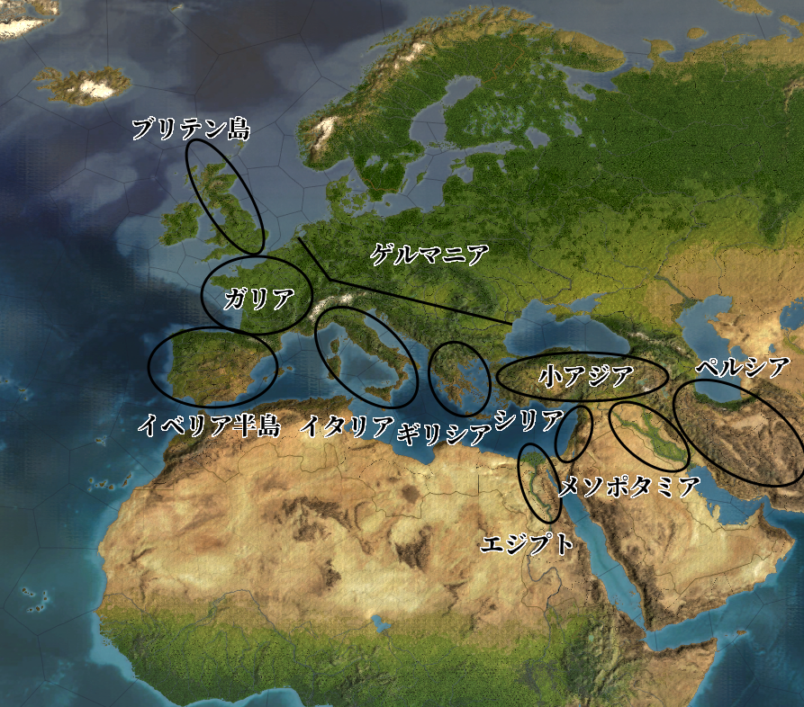
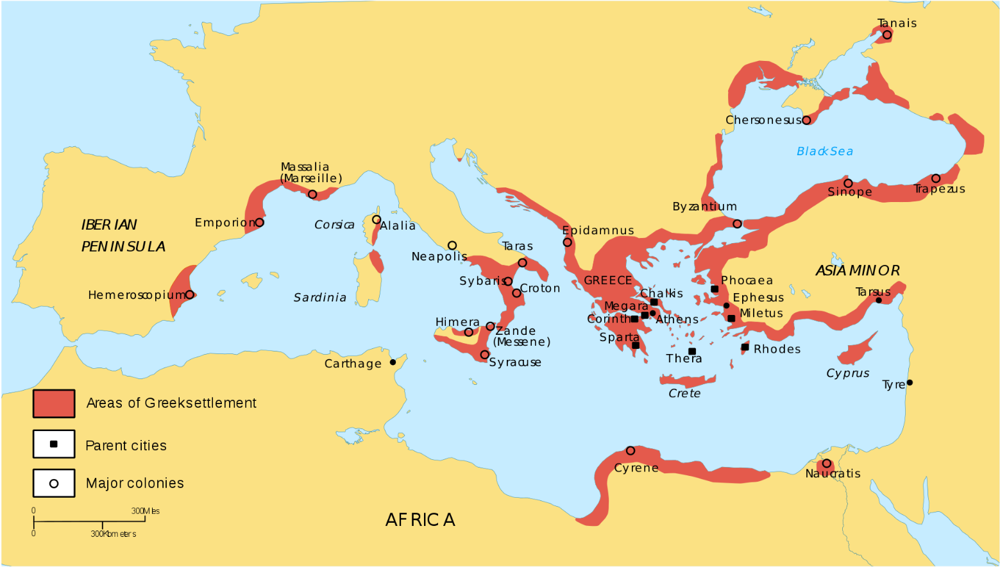
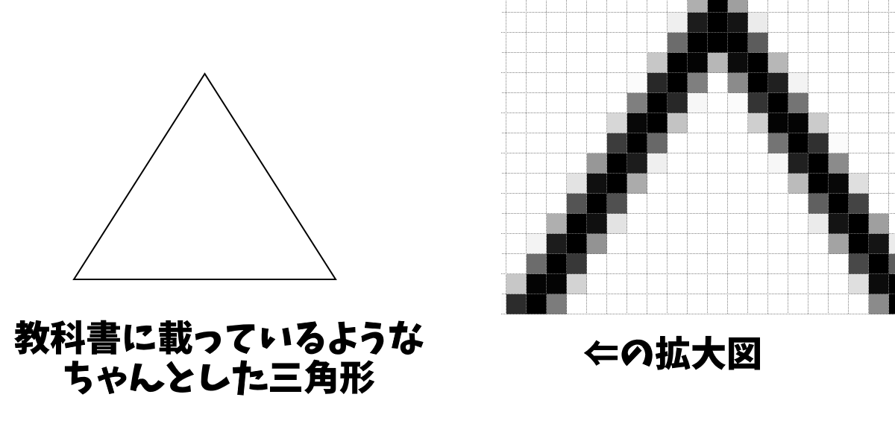
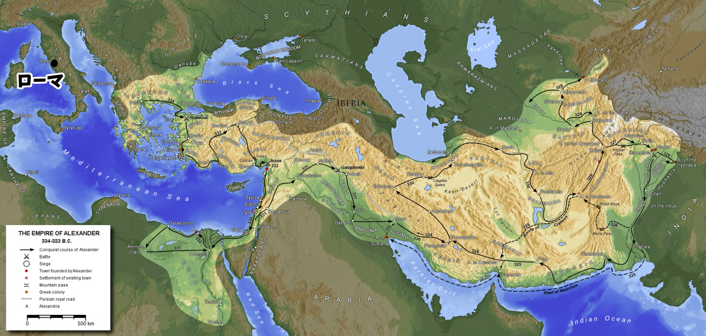

# 古代ギリシア

  
古代の、ペルシア以西の地形図。  
Paradox Interactive社のEuropa Universalis IVより  
  
・人類最古の文明は、“二つの川の間”、即ちメソポタミアに始まる  
・言ってみれば、人類最初の先進国こそメソポタミアであり、その他は田舎だった  
・しかし、いつまでもメソポタミアだけが先進国だとは限らない  
  
・メソポタミアで誕生した文明は、やがて隣接地域へ伝播していった  
・例えばエジプト文明は、メソポタミア文明の影響も受けて誕生した  
・シリア、小アジア、ペルシアにも文明が伝播した  
・こうして、メソポタミアの隣接地域もまた、文明が根を張る先進国と化した  
  
・そしてついに、ギリシアへも文明が伝播する  
⇒つまりギリシアに文明が伝播した当初は、東方地域こそ先進国。ギリシアはまだまだ田舎だった、という話になる  
  
・しかしそんな田舎も、やがて力を蓄え、先進国に挑戦できるぐらい強くなっていく  
⇒当時の覇権国、アケメネス朝ペルシア帝国が攻め込んできても追い返せるようになる。ペルシア戦争である。その後、ギリシアはペロポネソス戦争に続く戦国時代に突入し、アレクサンドロス大王の登場によって一時、統一される事になる  
・そんな中、現代まで続く欧米系の西洋思想の生誕地ともなったのが、このギリシアなのである  
  
・勿論、ギリシアはメソポタミアで発祥した文明の子孫と言うべき要素もある  
・だから、現代まで続く西洋文明の源泉はメソポタミア、と見る事も可能ではある  
・それでも「西洋思想」という括りで見た場合、現代欧米文明は、古代ギリシアの直系の子孫である  
  
・近代アメリカ合衆国の哲学者ホワイトヘッドは、はっきりこう言っている  

  「欧州の哲学的伝統の一般的特徴を最も確実に言うのであれば、「プラトンへの一連の脚注で構成されている」となる」  
  ※アルフレッド・ノース・ホワイトヘッド著『過程と実在』（原題”Process and Reality”）。ちなみにこの台詞は、原文だと”The safest general characterization of the European philosophical tradition is that it consists of a series of footnotes to Plato.”  
  
・プラトンは、古代ギリシアの哲学の巨人、その一人である  
※どんな事を考えた人かは後で詳しくやります  
・西洋思想は近現代に至るも、古代ギリシアの思想をベースにしているという話である  
・換言すれば、近現代の西洋思想であっても、古代ギリシアの影響下にあるのだ  
  
・そんな偉大な思想体系がどうして古代ギリシアで生まれたのか  
・一つには、時期的なものがあるだろう。丁度この時期は、世界的に農業生産量が増えた時期だった  
・農業生産量が増えたという事はつまり、沢山農作物が取れるようになったという事である  
・農作物が沢山取れるならば、「食う為に毎日働く」必要のない人間という者が出てくる  
・要は、働かずとも下僕が食糧を生み出してくれる、一種の貴族のような者達が出てくる訳である  
  
・こういう人達は、「食う為に毎日働く」に比べれば当然、暇である  
・そして暇を持て余した人というのは、得てして小難しい事を考え始めるものなのである  
⇒例えば「この世界はどうやってできているのか？」とか  
※これは洋の東西を問わない。例えば、古代ギリシア思想が形成されるのと同時期、中華王朝でも諸子百家と呼ばれる様々な思想家が現れて、東洋思想の基本を形作った。実は中華王朝でも当時、農業生産量が増えて、「食う為に毎日働く」必要のない人間が大量に出現していたのである  
  
・そして、古代ギリシアの［ポリス］と呼ばれる都市国家は、これを是とする文化を持っていた  
・「食う為に働くなんてのは、奴隷がするもの」「高貴な市民は、暇を楽しみ、思索にふけるもの」  
・そういう、［スコレー］と呼ばれる暇を高貴とする文化が、古代ギリシアにはあったのである  
・古代ギリシアの市民達は、しばしば［アゴラ］と呼ばれる広場で議論を戦わせた  
・その中から、古代ギリシア思想が現れてくるのである  
  
## ●古代ギリシア思想の源流  
・古代ギリシア思想をざっくり分けるやり方に「ソクラテス以前」「ソクラテス以後」というのがある  
・要は、ソクラテスという哲学者の影響を受ける以前、以後で分けるというものである  
・あまりいい分け方ではないのだが、とにかく便利な分け方でもある  
・そういう訳で、本稿でも「古代ギリシア思想の源流」として、ソクラテス以前を紹介しよう  
  
  
### 〇神話から哲学へ  
・どんな文明でもそうだが、最初の学問とは宗教であり、【神話】である  
・古代ギリシアも御多分に漏れず、最初の学問は神話だった  
⇒いわゆるギリシア神話。ギリシア人は、彼らの神話を【ミュトス】と呼んだ  
  
・ほぼあらゆる神話が最初は口伝であったように、ギリシア神話もやはり最初は口承だった  
・そんなギリシア神話も、やがて文字に起こされるようになる  
※この文字起こしされたギリシア神話も、言ってみれば、西洋文学の元ネタである。現代日本の小説やゲーム、漫画等が西洋文学から元ネタを取ってくる事があるが、その西洋文学の元ネタがギリシア神話、という訳である  
  
・神話を文字にしたと言えば、やはりトロイア戦争を描いた［ホメロス］が有名  
・ホメロスの代表作その１が［『イリアス』］  
⇒トロイア戦争に於けるギリシア側の英雄アキレウスと、トロイア側最高の名将ヘクトールとの戦いを描いた叙事詩  
・ホメロスの代表作その２が［『オデュッセイア』］  
⇒ギリシア勢がトロイアを攻め落とした後の話。「トロイの木馬」の語源ともなった木馬作戦をも考案した英雄オデュッセウスが、帰国の航海中遭難する話。オデュッセウスは数多の困難を経て、故郷へ帰国する  
  
・ギリシア神話に於ける天地創造を文字化した人物としては、［ヘシオドス］がいる  
⇒ギリシア神話の最高神ゼウスが、元はクロノスという神の子供で、父殺しを成し遂げて…みたいな話は、彼の書いた『神統記』に記されている  
  
・最初の頃、ギリシア人は全てを宗教（つまりギリシア神話）によって説明していた  
・例えば雷が鳴るのも、雨が降るのも、全部神がこうしたから、という感じ  
・しかしやがて、「迷信に頼るのやめませんか」というような人達が出てきた  
・「自分の五感で観察して、自分の頭で考えましょう」というような人々である  
  
・迷信に頼る事を止め、自ら観察し、考える人間の登場  
・それこそが、現代まで続く哲学、そして科学の誕生でもあった  
※昔は、学問と言えば全部哲学だった。強いて言えば、神学以外の学問が全部哲学だった。つまり、今我々が信仰していると言ってもいいぐらい頼りにしている科学も、元はと言えば哲学だったのである  
  
### 〇最初の哲学者  
・迷信に頼る事を止め、自ら観察し、考える人間。哲学者  
・その最初の一人は、西洋哲学に於いては一般に、【タレス】であるとされる  
⇒ギリシア人の植民市が多数あったイオニア地方にあるギリシア人都市、［ミレトス］の出身  
  
タレスも活動したアルカイック期（ポリス社会が勃興してからペルシア戦争まで）の、古代ギリシア人の活動範囲。赤く塗られているのが、ギリシア人が何らかの範囲で支配していた領域。小アジアの南西部にある”Miletus”がミレトス  
Dipa1965, CC BY-SA 4.0 &lt;https://creativecommons.org/licenses/by-sa/4.0&gt;, via Wikimedia Commons  
https://upload.wikimedia.org/wikipedia/commons/2/2b/Greek_Colonization_Archaic_Period.sv  
  
・タレスは、「この世界はどうやってできているのか」を考えた  
・その際、神話に頼る事はなかった  
⇒もし神話に頼った場合、それこそ『神統記』にあるように、「最初にカオス（混沌）という神がいた。そこにガイアという大地の神が誕生し…」みたいになってしまう  
  
・タレスは目前にある世界を観察し、そこから真理を探究しようとした  
⇒こういう態度を【テオーリア（観想）】と言う  
・そしてついに彼は、「万物の根源（【アルケー】）は【水】」であると結論した  
  
・この瞬間、哲学、少なくとも西洋哲学はこの世界に産声をあげた  
⇒信仰ではなく、合理的に、いわば理性によって真理を探究する。少なくとも西洋哲学という枠で見ると、それは、彼のアルケーを求める知的活動こそが、初であった  
  
・いわばタレスは、最初の西洋哲学者であり、西洋哲学の祖なのである  
### 〇“泣く哲学者”  
・タレスは神話から離れ、「目前にある世界を観察し、そこから真理を探究」した  
・非常に現代の科学っぽい、大きな一歩である  
  
・とは言え、時代は古代。望遠鏡も顕微鏡もない時代である  
・観察には自ずと限界があり、観察から得られる知見にもやはり、限界がある  
・その為、タレスを含む［ミレトス学派］の考察は、結果だけ見ればぱっとしない  
⇒タレスに触発されたのか、ミレトスには哲学者が何人か現れた。有名なところでは二人。そこで、この時期に現れたミレトスの哲学者三人（タレスを含めるから三人）を、総称してミレトス学派と呼ぶ  
  
・［アナクシマンドロス］は、万物の根源（アルケー）を「無限定なるもの」だとした  
・［アナクシメネス］は、アルケーを「空気」だとした  
⇒タレスの「アルケーは水」というのを合わせて見ても、やはり結果だけ見るとぱっとしない。何と言うか、「何となくの思い付きで言ってないか？」感が否めない  
  
・次に大きな一歩を踏み出したのは、“泣く哲学者”【ヘラクレイトス】であった  
⇒タレスが死んだ直後ぐらいに産まれた哲学者。ミレトスの北にあるエフェソスの出身  
  
・彼は万物の根源（アルケー）を【火】としているが、ここに目新しさはない  
・ヘラクレイトスが成した最大の業績は、よく引用される言葉に象徴されている  
  
  「万物は流転する」(Panta rhei)  
  
・彼が考えたのは、「永遠不変の存在はなんてものは、存在しない」という事である  
・この辺の説明は『史上最強の哲学入門』があまりにも分かりやすいので引用する  
  
  　たとえば、硬い石でも叩けば割れるし、仮に割れなくてもその石同士をこすり合わせれば、割れないまでも表面が少しは削れるだろう。少しでも削れるということは、まったく永遠不変であるとはいえない。永遠という長い時間を想定すれば、その石もいつかは壊れて砂になり消え去ってしまうことは自明の理である。  
  　でも、だとすると、「細かい砂」になった石は、その後どうなるのだろうか？  
  　それはやっぱり砂なのだから、大地（土）の一部になるに違いない。だが、よく考えてみると、その大地から木がはえてきてリンゴがなるのである。ということは、リンゴは、あの砕いた石が変化したものであるということになる。  
  （中略）  
  　そして、彼は直観する。石は土になり、土は木になり、木はリンゴになる。それらの変化ははたしてデタラメに起こるのであろうか？　いや違う。そこには、万物共通の何らかのルールがあるはずだ。そう彼は考えたのだ。  
  　彼は、そのルールのことを**ロゴス**（法則）と名づけた。  
    
  （飲茶著『史上最強の哲学入門』河出文庫）  
  
・現代の科学者は、単に「目前にある世界を観察」するだけではない  
・「何かしらの法則に従って、この世はこうなってる筈だ」と考え、法則を探し出そうとする  
・そう、ここに、現代の科学に通じる態度が誕生したのである  
・即ち、「目前にある世界を観察し、法則を探し、真理を探究する」という態度である  
  
・こうして、現代科学の主要な要素が誕生した  
・即ち、探究する真理（この時点では万物の根源（【アルケー】が対象）  
・即ち、「目前にある世界を観察」する態度（古代ギリシアで言う【テオーリア（観想）】）  
・即ち、世界を支配する法則（古代ギリシアで言う【ロゴス】）  
※ロゴスは、様々な訳がある。言葉、理性、理法、論理等  
  
  
### 〇“笑う哲学者”  
・科学の基礎を築いたヘラクレイトスだが、やり残した仕事が無い訳ではない  
・それは、アルケーの探求である  
⇒ぶっちゃけ、「この人は、アルケーは××だと考えました」という形で見ると、タレスもヘラクレイトスも大した違いはない。現代人から見れば、水だろうが火だろうが「何言ってんの？」である  
  
・この仕事を完成させたのは、“笑う哲学者”【デモクリトス】である  
⇒ペルシア戦争期に産まれ、ペロポネソス戦争期を生きた哲学者。Assasin’s Creed Odysseyにもいる  
  
・彼は、アルケーを［原子］だと考えた  
・そう、近現代物理学の基本となる、あの原子である  
⇒理科でやったように、この世界に存在するあらゆるものは、原子から成り立っている。その原子の集まり方によって、水分子とか、酸素分子とか、鉄分子とか、様々な分子が作られる。そしてそれぞれの分子がまた集まって、人間の身体から土、空気、海…あらゆるモノが作られている、というもの  
  
・デモクリトスは、この原子論を、古代に…それも西暦が始まる前に考え出した人間である  
・古代ギリシアは、顕微鏡も望遠鏡も無い時代に、近現代物理学の基本へ到達していたのである  
※一応、現代物理学の原子とデモクリトスの言う原子はちょっと違うのだが、大枠では同じと言っていい  
  
・デモクリトスは、人間もまた多数の原子の集合体に過ぎないと言っていた人物である  
⇒「人間死んだらどうなるかって？　人間を構成していた原子がまた別の何かを構成する原子になるだけであって、死後の世界なんか考えたって仕方ない。だから、人生を目一杯、笑って楽しく過ごそう」…これが“笑う哲学者”デモクリトスである  
  
・こうして、ソクラテス以前の哲学は、一つの到達点を見た  
・それはまた、【自然哲学】の到達点でもあった  
⇒自然を、つまり世界を、合理的に考察し説明しようとする哲学の事。現在一般に言われる「科学」に極めて近いものと言える  
  
  
### 〇その他のソクラテス以前の哲学者  
・今まで、タレス、ヘラクレイトス、デモクリトスという三人の巨人を挙げた  
・挙げたが、勿論、他にもソクラテス以前の哲学者はいる  
・そこで、今まで紹介しなかったソクラテス以前の哲学者の有名どころを紹介していく  
  
・先の三人に並ぶぐらいの有名人が、“サモスの賢人”【ピタゴラス】である  
⇒その名の通り、サモス島出身。サモス島はミレトスの近くにある島で、ピタゴラス自身もタレスと同時代の人間である。ピュタゴラスとも呼ばれる  
  
・ピタゴラスは、数学者でもあり哲学者でもあり、また宗教家でもある  
・↑のように言うと分かりづらいが、要は「【数】を信仰する数学者」だと考えるとよい  
・彼はアルケーを【数】であるとし、数を信仰する教団を立ち上げている  
⇒彼は数学者であり、様々なものを計算した。それこそ後の天文学のような星の軌道もそうだし、綺麗な音の組み合わせというのも、数字で計算した。そうやって色々と計算する中で、「この世の全ては数字で計算できる」「万物の根源は数字だ」となり、数字を崇めた  
※いわゆるピタゴラスの定理も、ピタゴラス教団が発見したものである  
  
・実を言えば、ヘラクレイトスはピタゴラスの影響を受けている  
・ロゴスという発想の背景に、ピタゴラスの思想がある事は否定し得ない  
  
・ヘラクレイトスに影響を与えたのがピタゴラスなら、デモクリトスに影響を与えた哲学者もいる  
・それが［エレア派］の始祖［パルメニデス］である  
  
・彼は、ヘラクレイトスの「万物は流転する」のような考え方に異を唱えた  
⇒「存在するものというのは、変化しない」「ある石を細かく砕いていけば確かに目には見えなくなるし、消滅したように見える」「だがそれは人間の感覚によって捉えられなくなっただけで、石という存在が消滅という変化を起こした訳ではないのだ」という感じ  
  
・確かにこれも一理ある  
・一方で、ヘラクレイトスの流転論のような、石⇒砂⇒土⇒木⇒果実のような変化も認められる  
・この両者を吟味して、原子論という到達点へ至ったのが、デモクリトスなのである  
  
・ソクラテス以前の哲学者として最後に、［エンペドクレス］を挙げておこう  
・彼は、後に中世で真理とされ、錬金術や西洋魔術の基本となった四大元素を初めて提唱している  
⇒万物の根源（アルケー）は、［「火」「空気」「水」「土」］の四つである。この四つがくっついたり離れたりする事で、様々なモノが生み出される…というもの  
※現代のゲームでよく採用される「地、火、風、水」みたいな属性というシステムも、元を辿ればエンペドクレスの四大元素へ辿り着く  
  
  
## ●ソクラテス  
### 〇当時のアテナイとソフィスト  
・世界史でやったように、古代ギリシアの歴史は↓のように進む  
  
　ポリス社会の勃興期⇒ペルシア戦争⇒戦乱の時代⇒アレクサンドロス大王の登場⇒ヘレニズム期  
  
・ギリシアではポリス社会が勃興し、先進国にも対抗できる力をつけていく  
・タレスが生きていたような時代ともなると、地中海のかなりの地域に植民していたぐらいである  
⇒タレスを紹介した時載せた地図参照  
  
・そして、この力を付けたギリシアに対し、当時の覇権国、アケメネス朝ペルシア帝国が攻め込んでくる  
⇒これがいわゆるペルシア戦争。マラソンの元となったマラトンの戦いや、スパルタ王レオニダスが炎門テルモピュライで玉砕した戦いも、ペルシア戦争の一幕である  
  
・このペルシア戦争に、ギリシアは勝利する  
・それは、ギリシアというかつての田舎が、覇権国に勝てるほど強くなった証でもあった  
  
・ところで古代のギリシアは、「ギリシア」という一つの国としてまとまってはいない  
・各地にある都市が、それぞれ国家として振る舞い、互いに争っていた  
※と言っても、血で血を洗う戦国時代というほど深刻に争っていた訳ではない。ペロポネソス戦争以降はそうなるが…  
  
・これがペルシア戦争以降になると、ギリシアの中心として頭角を現す国が二つあった  
・即ち、世界初の民主主義国家アテナイと、軍国主義国家スパルタである  
・この両国は、ギリシアの覇権を巡って大戦争を引き起こす  
⇒いわゆるペロポネソス戦争。この戦争以降、ギリシアは戦乱の時代へ突入する。最終的にアレクサンドロス大王が出てきて、この戦乱を一旦、終わらせる訳である  
  
・次にお題とするソクラテスは、このアテナイの人間である  
・時期的には、ペルシア戦争の後半に産まれ、ペロポネソス戦争の時代を生きた人物である  
・彼の思想には、当時のギリシアとアテナイの状況が深く関わっている  
・という訳で、まずは当時のアテナイの状況から  
  
・ペルシア戦争の時点で、アテナイは民主主義国家だった  
⇒特に、ペルシア戦争中のサラミスの海戦によって、（富裕市民だけでなく）全ての市民が政治に参加するようになった  
・当然だが、民主主義国家では、演説の上手い政治家は有利である  
⇒アテナイの場合は直接民主主義を採用しているから余計である。市民が暇を持て余している（暇を持て余してこそ高貴な市民）が故に、国民全員が一堂に会して議論する直接民主主義が行われていた。故に、広場に集まった全国民の前で、最も上手い演説を披露し、また政治家同士の討議で勝てた者こそが、権力を握れたのである  
  
・そうなってくると、アテナイでは演説の上手さと討論の強さこそ立身出世の要となる  
・即ち、【弁論術】こそが極めて重要になってくるのである  
・となれば、アテナイの若者への教育の中心が弁論術となるのは、当然であった  
  
・当時、アテナイには【ソフィスト】と呼ばれる教師集団がいた  
⇒ギリシアの中心となりつつあったアテナイには知識人が続々と集まった。彼らは金銭を受け取って、若者に教育を施した。その際「徳を教える」と触れ回って仕事を得たという  
  
・このソフィストの第一世代として、代表とも言える有名人が【プロタゴラス】である  
※他にも第一世代の有名人としては［ゴルギアス］もいる  
・プロタゴラスの哲学は、【人間は万物の尺度である】と述べた相対主義で特徴づけられる  
  
・例えば、ある絵が美しいか、美しくないか。これは結局、人によって変わる  
・例えば、ある行動が善であるか、悪であるか。これもやっぱり、人によって変わる  
⇒「いや、そうとは限らんのじゃない？　それこそ、絶対悪はあり得るんじゃないの？」と思う人もいるだろうから、ここで極端な例を挙げよう。中東では今でも、「名誉殺人」という風習がある。ある女性が「未婚なのに性交渉をした（強姦による被害を含む）」「親が決めた婚姻を拒否した」「自由恋愛をした」というような場合、その女性を「一族の名誉を汚す」ものとして殺す、という風習である。多分、ほぼ十割の日本人はこれを悪と思うだろうが、勿論、名誉殺人を実行している方は、基本的には善のつもりでやっているとみてよい  
  
・よって、絶対の価値なんてものはない  
・善悪とか美醜とか、そういうのは「その人がその人の尺度で決めたもの」と言うしかない  
・それぞれの価値基準に優劣はなく、平等。「世の中は人それぞれだ」と考えるべきだ  
・…というのが、プロタゴラスの哲学の骨子である  
  
・プロタゴラスの哲学自体は、非常に穏当な、何なら現代的な考え方である  
・例えば「欧米的な価値観が正しく先進的」なんてのは、まさしく偏見である  
・欧米的な価値観、日本的な価値観、キリスト教的な価値観、仏教的な価値観…全て等しく、価値がある  
・そういう考え方こそが、現代に於いて推奨される、相対的なものの考え方である  
  
・ただ、この考え方を無制限に拡張すると、面倒な事になる  
・特に、「絶対の価値なんてものはない」という部分がまずい  
・例えば、以下のような事件を想定しよう  
  
  AさんとBさんがいるとする。ＢさんがＡさんの配偶者を殺した。そして、その復讐に、ＡさんがＢさんを殺した。  
  
・これが現代日本起きた場合、ＡもＢも、等しく殺人罪で裁かれる事になる  
・どちらも殺人罪である事に違いはなく、いわば、どちらも悪である  
※勿論、情状酌量などによって、刑期が変わるという事は考えられる。しかし、「人を殺せば悪」という、絶対の価値があるので、等しく殺人罪が適用される  
・しかし、「絶対の価値なんてものはない」とすると、話は違ってくる  
⇒先にＢがＡの配偶者を殺したのだから、Ｂが悪、これは間違いない。Ａはこれに制裁を与えただけであり、悪ではない。それどころか善ですらありえる。即ち、悪いのはＢなのだから、それに比べればＡは相対的に善である。…こんな風になってしまう  
  
・まぁそれでも、これぐらいならまだましだろう  
・もっと悪い場合を考えてみよう  
・先の例で、復讐として、ＡがＢの一家全員を皆殺しにしたとしよう  
⇒仮にそうであっても、「いや、Ｂが先に手を出したのだから、Ｂという巨悪を根絶やしにする必要があるのだ」「Ｂが配偶者を殺した時の残虐さを考えれば、これぐらいでようやくつりあうのだ」といった風に説明できれば、Ａを善の立場にする事ができてしまう。絶対の価値（この場合は「人を殺せば悪」）が完全に不在だと、こんな風に話がおかしな方向へ行ってしまうのである  
  
・実際におかしな方向へ行ってしまったのが、ペロポネソス戦争期のアテナイである  
・アテナイ人はソフィストに教えられた弁論術を使って［詭弁］を弄していった  
例：メロス島がアテナイとの同盟から離脱した際、アテナイはメロス島を攻め、男は全て死刑、女子供は全て奴隷にする、という過酷な懲罰を行った。これは、アテナイの広場で「メロス島の奴らは悪い事をしたのだからこれぐらいすべきだ」と主張する者がいて、それに市民が喝采を送り、可決された結果実行に移された  
  
・ソフィストもソフィストで、教師とは言え基本的には外人である  
・なので立場は不安定であり、下手に「お前ら相対主義言うても限度があるやろ」とか言えない  
・そういう訳で、弁論術という技術はきちんと教えるが、それをどう使うかにはあまり干渉しなかった  
※ソフィストは相対主義者であったとか、危険思想の持ち主であったと言われる事もあるが、実際のところ、弁論の技術を教える教師に過ぎなかったらしい。勿論プロタゴラスの哲学は相対主義を特徴とするが、ソフィストは一般に立場が不安定な外国人であり、権利が著しく制限されていた。故に普通のソフィストは、思想を開陳しないよう意識して抑えていたようだ  
  
・こうしてアテナイの民主主義は早くも衆愚政治へと堕し、覇権を狙い、大戦争と突き進んでいった  
※民主主義国家の特徴の一つとして、民衆が破滅的な大戦争を引き起こす場合がある。「覇権国家になるんじゃ！」「てっぺんとったるで！」みたいな感じでノリノリになった民衆を、政治家が止められない（もしくは、むしろ煽る）パターン。フランス革命後のフランス共和国もそういうところあるし、何なら昭和期の大日本帝国もそういうところある  
  
  
  
### 〇ソクラテスの思想  
・このような状況下のアテナイにいたのが、【ソクラテス】である  
・このソクラテスは、現代に於いても極めて重要な地位を占める  
・例えば以前紹介したホワイトヘッドの↓これ  
  
  「欧州の哲学的伝統の一般的特徴を最も確実に言うのであれば、「プラトンへの一連の脚注で構成されている」となる」  
  
・そのプラトンの師匠であり、思想的な源泉。それはソクラテスである  
・現代まで続く西洋思想は、言ってみればソクラテスに始まるのである  
・また、ソクラテスは倫理学の祖とされる事も多い  
・即ち、極度の相対化が蔓延るアテナイで「絶対的な価値はある」と言ったのがソクラテスなのである  
※ソフィストの説明の際挙げた殺人の例で言えば、「単なる殺人だろうが敵討ちによる殺人だろうが、殺人は殺人でしょ。等しく悪だし、やっちゃ駄目でしょ」みたいな事を言ったのが、ソクラテスである  
  
・分かりやすい例として、［ノモス］と［ピュシス］を挙げよう  
  
・古代ギリシアには［ノモス］という言葉があった  
・これは本来、慣習とか伝統とか、そういう規範を指す言葉だった  
・ソクラテスの時代、ソフィストの指導を受けたアテナイの人々は、ノモスを嫌った  
⇒「ノモスなんぞ、自由を束縛する因習に過ぎん」「大事なのは自然、つまり［ピュシス］だ！」「自然を見てみろ、弱肉強食の世界だ。人間社会もそうあるべきじゃないのか！」「ピュシスは自然であり必然だ、［ノモス］は人為であり、必然ではない！」みたいな感じ  
※そんなんだからメロス島の男は全員死刑、女子供は全員奴隷とかやるのである  
  
・これに対して、ソクラテス（や彼に続いたプラトン）はノモスを擁護した  
⇒「いや、お前らちょっと冷静になって考えてみろよ」「普通に考えたら、お前らのやっとる事は醜悪やぞ？」「普通に考えたら、ノモスも尊重せんといかんやろ」という感じ  
  
・確かに、善悪や美醜の判断は、人それぞれである  
・しかし、「普通ならこうなるだろう」というような、絶対的な価値は、何処かにある筈だ  
・言い換えれば、真理がある筈だ。そう考えたのがソクラテスであった  
  
・そういう意味での彼の思想は、以下の台詞に集約できると言えるだろう  
  一番大切なことは、単に生きることではなく、【善く生きる】ことである  
  
・上記の台詞を理解するのに有用な台詞もある  
  生きるために食べよ、食べるために生きるな  
  財産や名誉を得る事のみ執心し、己の魂を善くする事に努めないのを恥とは思わないのか  
  
  
・特に後者は【魂への配慮】とも呼ばれる考え方である  
⇒古代ギリシア語で魂を【プシュケー】と呼ぶ為、魂への配慮を「プシュケーへの気遣い」などと呼ぶ場合もある  
  
・さて。善く生きよ、というソクラテスの主張は、まぁ理解できるものである  
・とは言え、具体的にどうしたらいいのか？  
・この点について、ソクラテスは【徳（アレテー）】を重視している  
※アレテーの本来の意味は、卓越性とか優越性とかそういうの。そこから、正義とか勇気みたいな「人間特有の卓越性」みたいな意味に転じ、徳みたいな意味で使われるようになった  
  
・アレテーは魂の善性にして美、即ち［善美の事柄］であり、人はこれを探求すべきだとした  
・即ち、アレテー（徳）を知らなければ、善く生きる事はできない（［知徳合一］）  
・そしてまた、アレテーを知れば、善く生きずにはいられない筈である  
⇒言い換えれば、善き行いをせずにはいられない筈である（［知行合一］）  
※アレテー（徳）を知ったのに善く生きようと思えないなら、それは知ったつもりになっただけで本当に知れた訳ではない  
・こうして、アレテー（徳）を備えた者は、幸福な善き人生を歩む事ができる（［福徳一致］）  
  
・ソクラテスは、このように唱えたのである  
  
・しかしこのようなソクラテスの思想は、当時のアテナイには受け入れられなかった  
・ソクラテスは「神々を信仰せず、若者を堕落させている」として裁判にかけられ、死刑となった  
・ここで有名な逸話が、死刑直前、弟子の【クリトン】が獄中のソクラテスを訪ねた逸話である  
  
・実は、死刑になったと言ってもソクラテスに同情する者はそれなりにいた  
・牢屋の万人も鍵を開けていて、逃げようと思えばいつでも逃げられる状態にあったのである  
・弟子のクリトンは、死刑なんて判決は間違っている、脱獄して生き延びてくれと言う  
・これに対してソクラテスは、不正に不正で対抗しても仕方ない、とするのである  
⇒確かに、「私を死刑にするというのは正しくない、不正義だ」というのは、このソクラテス自身も思う。一方で、裁判は法に則って行われており、合法だ。違法な裁判ならともかく、合法な判決に逆らって脱獄するというのは違法であり、正しくない。不正義だ。私が今不正義によって死のうとしているとは言え、自らもまた不正義を成して悪人になるつもりはない…と、こんな感じ  
  
※以前、「単なる殺人だろうが敵討ちによる殺人だろうが、殺人は殺人でしょ。等しく悪だし、やっちゃ駄目でしょ」みたいな事を言ったのがソクラテスだと言った。このように、ソクラテスは「悪は悪であり、してはならない」というような絶対的な価値観はあると信じ、これを求めたのである。倫理学の祖に相応しい人生だったと言えよう  
  
※尚、この辺のソクラテスの死の直前を描いた作品として、【『クリトン』】というものがある。そのまま、ソクラテスを訪ねたあの弟子の名前を使っている。書いたのは、同じくソクラテスの弟子の【プラトン】  
  
### 〇虻のような者  
・さて、そんないかにも人格者、人徳者なソクラテスだが…  
・実際には、アテナイでは嫌われ者として通っていた  
※と言うか、嫌われ者だったから死刑になったのである  
  
・何でそんなに嫌われていたのか？  
・という事で、【デルフォイの神託】から始まる有名な逸話から紹介する  
  
・ギリシア中央部に、デルフォイという地があった  
・ここはギリシアでも最も神聖な場所の一つで、神託を下す神殿があった  
・ここで、ソクラテスの友人が「ソクラテスより賢い人間はいない」という神託を受けた  
⇒これがいわゆる、デルフォイの神託  
  
・驚いたのはソクラテスで、彼は自身を無知な人間だと思っていた  
・そこで、ソクラテスは当時知者と呼ばれた人を質問攻めにした  
例：「皆の幸せのために、今こそ改革を！」みたいな演説をしている政治家がいるとする。ソクラテスはその政治家に「皆の幸せって何ですか？」と質問する。恐らく政治家は、「正義の実現だ」とか言うだろう。するとソクラテスはまた、「じゃあ正義って何ですか？」と問う。これをひたすら繰り返す  
  
・当然だが、こんな事をされたら誰でも、いつかは答えられなくなる  
・これを繰り返した結果、ソクラテスは【無知の知】と一般に呼び習わされる確信を得る  
  
・ソクラテスは、自分が無知だと知っている  
・世間一般の人々は、「自分はものを知っている」と思い込んでいるだけ  
・つまりソクラテスは、「自分が無知だと知っている」という分だけ、一般の人々よりは賢い  
・これが、一般に無知の知と呼ばれるものである  
⇒これの自覚には、デルフォイの神殿に刻まれていた【汝自身を知れ】という言葉も影響していたとされる  
  
・こうして、ソクラテスは人々に話しかけ、自らの無知を自覚させようとした  
・知を愛し、知を探求する者にしてあげようとした  
※この、【フィロソフィア（愛知）】という言葉は、後に【哲学】という意味の単語となった  
  
・言い換えれば、ソクラテスは人々を、「真理とは何か」を探求する人にしてあげようとした  
⇒徳を求め、徳を知り、知徳合一、知行合一、福徳一致を達成する幸福な人間にしてあげようとした  
  
・が、ここで冷静に考えてほしい  
・まるで感動的な話みたいに言ったが、これ、かなり性格が悪い  
・それこそ先の、質問攻めの例なんかは最高に性格が悪い  
⇒当たり前だが、質問者はただ質問するだけでいいが、答える者はそれなりにしっかりした答えを考え、言わねばならない  
  
  
・正直、「なるほど俺は、自分が無知だと分かってる分他よりマシって事か」もあんまり性格よくない  
・しかもソクラテスは、「よっしゃ！　一般アテナイ人に、自分は無知だと気付かせたろ！」になるのだ  
・その上やり方は、基本的には先の質問攻めのやり方だった  
⇒さっきから「質問攻め」と表現しているこれを、【問答法（ディアレクティケー）】と呼ぶ。この方法はまた、それによって相手を知者にするという観点では、［助産術］等とも呼ばれる  
  
・彼はそれをアテナイの広場で、つまり公衆の面前で行った  
・言ってみれば、アテナイの人々に恥をかかせまくったのである  
・これで嫌われない方が、どうかしている  
  
・一方で、権力者に恥をかかせまくるソクラテスの姿は、若者達には頼もしく映った  
・当時の一般ギリシア男性と同様少年性愛者だったのもあって、ソクラテスの周囲には若者が集った  
※そりゃあ若者を堕落させたとか言われますわ  
※しかも、彼の弟子がペロポネソス戦争期にやらかしまくり、アテナイは負ける。例えばアルキビアデスはアテナイの終身名誉戦犯とでも言うべき存在だが、ソクラテスの愛弟子である。アルキビアデスの少年時代にソクラテス自身が口説いているぐらいには、愛弟子である。そら処刑されますわ  
  
※ちなみにこのソクラテス、Assasin’s Creed Odysseyにも主要なキャラクターとして出演している。彼自身の胡散臭さ、そして的確に問答法で他人を苛つかせる様子がこの上なく的確に表現されている。ゲームとしても名作なので、是非一度プレイしてみてほしい  
  
  
  
## ●プラトン  
### 〇ソクラテスの著述家として  
・実を言うと、ソクラテス自身は著書を残さなかった  
・と言うか、彼は文書が大嫌いだった  
⇒書かれたものは「死んだ会話」だとか、「書き言葉が記憶を破壊する」だとか、とにかくそんな次元で文書というものを嫌った  
  
・そういう訳で、ソクラテス自身の著作というのは残っていない  
・残っているのは、弟子がまとめた「ソクラテスはこんな事言ってました」みたいな本である  
・そういう本を書いた代表例が、【プラトン】である  
⇒先に紹介した【『クリトン』】もこの手の本。またこの本の前には、ソクラテスが死刑になった裁判を描いた【『ソクラテスの弁明』】も書いている。  
※こういった著作から、「ソクラテスっていうのは多分こういう事を言ってたんだろう」という風にまとめる研究が行われている。その成果が、先にソクラテスという項で紹介した内容である  
  
・ただプラトンの著作は、途中から方向性が明らかにおかしくなる  
・最初は「ソクラテスはこういう事を言ってました！」という記録みたいな本を書いていた  
・それが、「ソクラテスはこういう状況ならこう言ったでしょう」みたいな本に変わっていく  
⇒そしてその中で、「これ本当にソクラテスか？」「プラトン、お前これ、お前が言いたいことをソクラテスってキャラクターに喋らせてるだけじゃないか？」みたいになっていってしまうのである  
  
・例えば、【『饗宴』】【『国家』】［『パイドン』］あたりは全部怪しいと言われている  
【『饗宴』】　　：ソクラテスが仲間と恋について語り合う場面を描いた本  
【『国家』】　　：ソクラテスが政治や理想国家について議論した場面を描いた本  
［『パイドン』］：ソクラテスの死刑当日を描いた本  
  
・これのせいで、今でもソクラテスの思想の細かいところは分かっていない  
⇒言い換えれば、「これプラトンの思想なの？　ソクラテスの思想なの？」という領域が大量にある状態なのである  
  
### 〇イデア論  
・ソクラテスは、結局のところ「善く生きる」という事を追求した哲学者だったと言える  
⇒そしてその為に、「善とは何か。徳とは何か。真理とは何か。そういう事を追求しよう！」という哲学者だった  
・ソクラテスの弟子だったプラトンは、彼の真理探究の姿勢を受け継いだ  
・彼の導き出した真理こそが、【イデア】論である  
  
・このイデアを説明する為に、三角形を例にして説明しよう  
※何故か、イデアについて調べると極めて高い確率で三角形が例に出されている。なのでここでも三角形を使う  
・黒板に、三角形を書いたとする  
・当然だが、どんなに慣れた人が書いたところで、チョークで書いた以上ギザギザした三角形になる  
・慣れない人が書いたなら、角が丸っこくなってしまっている場合もあるだろう  
・何なら、線が露骨に曲がっている場合すらもあるかもしれない  
  
・しかし、である。人は、そんな三角形を「三角形を書いてるんだな」と認識できる  
・勿論厳密な三角形ではないが、「まぁこれは三角形だな」と認識し得る  
・これは、何故なのか？  
  
・実際の所、人間は「厳密な三角形」など見た事はない筈である  
・数学の教科書に載っているような三角形だって、顕微鏡で拡大すれば、その線はギザギザである  
  
  
  
・そう、人間は皆、「厳密な意味での三角形」を見た事など無いのだ  
・なのに、人間は、「厳密でない三角形」を見て、「ああ三角形か」と認識できる  
・どうしてなのか？  
  
・これについて、プラトンはイデアという発想を持ち出す  
・実は、人は「厳密な三角形」「理想の三角形」「究極の三角形」と呼ぶべきものを知っているのである  
・即ち、人間は皆、生まれながらに「三角形のイデア」というものを知っているのである  
⇒だからこそ、現実世界で「三角形のイデア」に似たものを見ると、人は「三角形のイデア」を思い出す。即ちイデアを【想起（アムネーシス）】し、結果、「ああこれ三角形か」となる…そういう理屈である  
  
・プラトンによれば、人間はかつて、［イデア界］で暮らしていた  
⇒イデア界は、「天国」「楽園」「エデン」みたいなものと思えばよい。イデアがゴロゴロしている  
・しかし堕落してしまい、［現象界］へ追放されてしまった  
※現象界は、この現実世界の事を言っていると思えばよい  
・それでも、イデア界にいた頃の記憶が僅かにある為、イデアを想起する事ができるのである…と言う  
※また、人間はかつてイデア界にいた事から、本能的にイデアを求めるとする。この欲求を【エロース】と言い、想起を行う上での助けとなる  
  
・プラトンによれば、現象界、つまりこの現実世界には、何一つイデアは無い  
・この現実世界は、イデア界が映し出した影のようなもので、全ては偽物なのである  
・この事を、プラトンは［洞窟の比喩］によって説明する  
⇒もし仮に、生まれた時から洞窟に放り込まれ、鎖に繋がれた奴隷がいるとする。彼は昔から両手両足を拘束されており、歩いた事すらない。何なら首も満足に動かせず、洞窟の壁しか見た事がない。だからこの奴隷は、壁に映った影しか見た事がない（左図を参照）  
  
・現象界に生きる我々は、丁度、この奴隷のようなものだとプラトンは言う  
⇒犬や牛の像が映した影を見て生きる奴隷のように、我々は、イデアが投影した影を見て生きている  
  
  
  
  
  
Veldkamp, Gabriele and Maurer, Markus, CC BY-SA 3.0 &lt;https://creativecommons.org/licenses/by-sa/3.0&gt;, via Wikimedia Commons  
https://upload.wikimedia.org/wikipedia/commons/1/14/Plato_-_Allegory_of_the_Cave.png  
・勿論、イデアには色々ある  
・三角形のイデアもあれば、机のイデアも、馬のイデアもある筈である  
・そういった様々なイデアの中でも特に大切なのが、【善のイデア】だとプラトンは言う  
  
・善のイデアは、全てのイデアの根源である  
⇒三角形のイデアも、机のイデアも、馬のイデアも、全てはこの善のイデアから生み出されたのだ、とプラトンは述べている。だからこそ、知を愛する者は善のイデアを求めるし、そうすべきなのだ、としている  
  
  
### 〇後の時代の準備  
・さて、このイデア論。何かに似ていないだろうか  
・そう。キリスト教の発想に非常に似ているのである  
・勿論、プラトンの頃、キリスト教は影も形もない  
※プラトンは、ペロポネソス戦争以降の、古代ギリシアの戦乱の時代の人。イエス・キリストが誕生したとされる西暦元年から、三、四百年ほど前の人である  
  
・しかし、例えば善のイデア  
・これ、善のイデアとか言うから分かりづらいが、「神」だとすればすっきりしないだろうか？  
ビフォー：三角形のイデアも、机のイデアも、馬のイデアも、全てはこの善のイデアから生み出されたのだ  
アフター：三角形のイデアも、机のイデアも、馬のイデアも、全ては神から生み出されたのだ  
  
・それに、イデアとかイデア界なんて発想もそれっぽい  
・イデア界という楽園から追放されて、不完全な肉の身体を得たとか、すごくキリスト教っぽい  
  
・実際のところ、キリスト教は誕生後、プラトン哲学を吸収して形を整えていく  
・だからプラトン哲学とキリスト教が似ているのは当たり前と言えば当たり前である  
  
・例えば、後のローマ帝国の時代になると、［新プラトン］主義と呼ばれる学派が現れる  
・これは、プラトンのイデア論を発展させた学派である  
・新プラトン主義では、「世界は一者なる存在から流出し、一者へ還っていく」とされた  
・そしてこの思想はキリスト教に組み込まれた  
⇒「世界は神から流出し、やがて神へ還っていく」になった訳である  
  
・このように、プラトンは一神教によく似合う理論を作っていた  
・しかし忘れてはならないのは、プラトンはキリスト教誕生以前の人間だという事である  
・プラトンは、古代ギリシア世界、つまり多神教の世界に生きていた  
・それこそ、多神教とは絶対に相容れない筈の一神教  
・その一神教に丁度いい理論を、百年以上前から構築していた  
  
・これは、興味深い事実と言えるだろう  
  
### 〇国家論  
・プラトンは、国家についても語っている  
・プラトンは明らかに、敬愛する師匠を殺した民主主義を憎んでいた  
・当然、民主主義を否定する理論を構築するのだが、それを魂から説き起こしたのが特徴的である  
  
・彼は魂について、［魂の三分説］というものを説いている  
・これは即ち、魂は三つの要素から成るというものである  
１：【理性】／イデアの認識等を行い、知性に関わる。また、他の二つの要素を指揮する  
２：【気概（意志）】／行為や決断に関わる  
３：【欲望】／感覚や欲求に関わる  
  
・プラトンによれば、魂の三要素は、様々なものに対応する  
・例えば、徳も大きく三種類に分けられ、魂の三要素に対応しているという  
１：【知恵】／魂で言う【理性】に対応する徳  
２：【勇気】／魂で言う【気概（意志）】に対応する徳  
３：【節制】／魂で言う【欲望】に対応する徳  
※尚、この三種の徳を調和させる【正義】を徳に加え、総称して［四元徳］と言う  
  
・プラトンによると、こういった魂の三要素や三種の徳は、あるべき国家の形を導くと言う  
・即ち、理想的な国家は、人民を三種の階層に分ける  
・優れた【理性】と、【知恵】という徳を備えた者達による、【統治者階級】  
・優れた【気概（意志）】と、【勇気】という徳を備えた者達による、【防衛者階級】  
・優れた【欲望】と、【節制】という徳を備えた者達による、【生産者階級】  
  
・魂の三要素の一つ、理性は魂の最も重要な部分であり、他の要素を指揮、統率する  
・理性が統率するからこそ、魂は安定する  
・同様に、国家もまた、優れた理性を持つ者が統治しなければ安定しない  
  
・ソクラテスを受け継ぐプラトンにとって、優れた理性を持つ者とは知を愛する者である  
・知愛。フィロソフィア。即ち、哲学  
・そう、理性に優れ知恵という徳を備えた者とは即ち、哲学者である  
・ここからプラトンは、理想の政治とは【哲人王】による【哲人政治】であるとしている  
⇒優れた哲学者が王になる。そういう政治を行ってこそ、理想国家となる  
  
・プラトンが開いた学園【アカデメイア】は、勿論の事、哲学者養成学校だった  
・これは本来、彼が理想とした哲人政治を行える人材を養成する為のものであった  
※ちなみに、プラトンがアカデメイアと命名した訳ではない。元々アカデメイアという土地（アテナイ近郊の神域）があって、そこに学園を作ったので、地名のままアカデメイアと呼ばれたのである  
  
・尚、哲人王を作る彼の試みは、失敗に終わった  
・アカデメイアからは哲人王は出なかったし、プラトンが哲人王に導こうとした王も駄目だった  
・しかし、彼のアカデメイアから、“万学の祖”と呼ばれる知の巨人が現れるのである  
## ●アリストテレス  
・倫理分野第一章で、【ポリス的動物】というのでやった、【アリストテレス】  
・このアリストテレスこそは、古代ギリシアの知の集大成にして、最大の巨人である  
・その最大の功績は、“万学の祖”という呼び名によって称えられている  
  
・以前述べたように、古代ギリシアでは基本的に、全ての学問が哲学だった  
⇒強いて言えば、神学は哲学ではなかった…というぐらいだろう。何せ、「宗教に頼るのはやめて、自分の目で観察して、自分の頭で考えようよ」が哲学の出発点だった訳で  
  
・アリストテレスの凄いところは、古代ギリシアのあらゆる学問（哲学）に精通していた事にある  
・しかもその学問を、綺麗に整理整頓してしまった  
・彼の業績から、様々な学問が生まれた  
⇒論理学、倫理学、政治学、物理学、天文学、気象学、生物学、植物学、地学、詩学…今でも各地の大学で研究されている様々な学問が、彼から誕生した。まさに彼は“万学の祖”であり、現代の多くの学者にとって、直系の祖先なのである  
  
・彼は、古代ギリシアの戦乱の時代末期から、アレクサンドロス大王期にかけて生きた人間である  
※忘れてる人も多いと思うので、古代ギリシアの歴史をここで振り返り  
  
　ポリス社会の勃興期⇒ペルシア戦争⇒戦乱の時代⇒アレクサンドロス大王の登場⇒ヘレニズム期  
  
・タレスなんかはポリス社会が勃興して、ギリシア人が強くなってきた頃の人物  
・ヘラクレイトスとかは、タレスより一世代後で晩年にペルシア戦争が始まった、ぐらいの人物  
・ソクラテスは、ペルシア戦争から戦乱の時代初期の人物  
・プラトンは戦乱の時代の人物  
・そしてアリストテレスが、戦乱の時代末期からアレクサンドロス大王期  
  
・アリストテレスは、少年期のアレクサンドロス大王の家庭教師をした事もある  
・そんな彼は、若い頃はアカデメイアでプラトンに直接学んだ  
・しかしアリストテレスは、思想的にはプラトンと対立する事になる  
・まずはその辺の事情から見ていこう  
  
  
### 〇アリストテレスの反イデア論  
・アリストテレスは、プラトンのイデア論に真っ向から異議を唱えた  
・根本的な問題として、「イデアの実在を証明できるか？」と言うとできない  
⇒まぁそれはそう。この世はイデアの映し出した影であって、イデアはイデア界（天国）にある…というのがプラトンの話なので、「じゃあイデア界に行けなきゃ証明も糞もないじゃん」という話になる  
※勿論これが宗教ならば、宗教の理論としては非常によくできているし、そういうものとして価値がある。なのだが、プラトンもアリストテレスも哲学者である  
  
・じゃあ、証明できるかどうかは横に置いておいて、イデア論は何かの役に立つのか？  
・と言うと、結局役に立たない  
・勿論、だからと言ってアリストテレスは真理を探究しなかった哲学者ではない  
・言い換えれば、アリストテレスもまた、「モノの本質とは何か」を考えた  
・その基本的態度は、以下のようなものであった  
  
  結局のところ、「人間がそういったイデアを仲介した仕組みで、世界を認識している」と想定したところで、何か新しい理解が得られるわけではない。だって、やっぱり「馬を見て、馬だと思った」ということ以外に、何の変わりもないからだ。  
  （中略）  
  むしろアリストテレスは、そんなイデアなんか持ち出すよりも、「現実の馬」をじっくりと観察して、「四本足だ」とか「タテガミがある」とか「ヒヅメがある」とか、そういう馬固有の性質をたくさん集めて、「馬とはどういうものか」をきちんと定義した方がよっぽどものの役に立つと考えた。  
    
  （飲茶著『史上最強の哲学入門』河出文庫）  
  
・例えば三角形の本質は、「三つの直線から成る」「三角の和が180度」といったもの  
・例えば机の本質は、「四本足である」「天板が載っている」といったもの  
・こういうものこそ本質であって、イデアとかは関係ない  
・これが、アリストテレスの基本的な考え方である  
  
・勿論、ただ本質だけがあっても、モノはそこに存在し得ない  
⇒机の本質は「四本足である」「天板が載っている」等だが、そういうものを実際に木とか鉄で作ってやらないと、机として存在できない  
  
・こういうところから、彼は【形相（エイドス）】と【質料（ヒュレー）】という二つの概念を説く  
・即ち、机で言えば「四本足である」「天板が載っている」みたいな本質をエイドスと呼ぶ  
・ここに、材料であるところのヒュレーが結びつくと、モノとして成立する…という感じ  
⇒プラトンは、イデアという本質だけでモノは成立し得る、と言った人。逆にアリストテレスは、「四本足である」「天板が載っている」みたいな本質だけじゃ駄目で、現実に机として存在する為には、木とか鉄みたいな材料が必要だよ、と言った人  
  
・こういったエイドス、ヒュレーという発想を、別の見方をする事もできる  
・即ち、［可能態］、［現実態］、［始動因］、［目的因］という発想である  
  
・例えば、あらゆる木材は、机の材料として使用可能である  
⇒木材が必ず、机の材料として使われるとは限らない。言い換えれば、木材は必ずヒュレーとして、机のエイドスと結合し、机になるとは限らない。が、どんな木材であっても、机の材料になり得るのは確か  
・このような場合、木材は「机の［可能態］」である、と言う  
  
・ところで、現実に木材が机になったとしよう  
・その際、「何故木の机がここに存在するのか？」と問うたとする  
・この問いには、答え方が二つある筈である  
・一つ目は、原因を答えるやり方。即ち、「誰かが木材を加工にして机にしたからである」  
⇒こういうのを、［始動因］と呼ぶ  
・二つ目は、目的を答えるやり方。即ち、「モノを置く机が必要だったからである」  
⇒こういうのを、［目的因］と呼ぶ  
  
・ともあれ、木材は、それだけでは机の［可能態］でしかなかった  
・それが、［始動因］や［目的因］によって、加工され、現実に机となった  
・言い方を変えれば、木材というヒュレーが机のエイドスを得て、木の机となった  
⇒これを、［現実態］と呼ぶ  
  
・ここまで述べてきた、エイドスとかヒュレーとかいった議論は、【『形而上学』】という本に載っている  
※これは本来、アリストテレスの講義ノートである。アリストテレスもまた、プラトンと同じように［リュケイオン］という学園を持っていた（リュケイオンは本来地名である、というところまでプラトンのアカデメイアと同じ）。そこでアリストテレスが授業をする際に使っていたノートが、今に伝わっているのである  
※尚、アリストテレスを祖とし、彼に続いた哲学者を【逍遥学派（ペリパトス派）】と言うのだが…この学派は、基本的にはリュケイオンで学んだ哲学者の総称として使われる  
※ちなみにこの『形而上学』なるノート、本来の題名は『第一哲学』である。後にアリストテレスの講義ノートを整理した人が、このノートを自然学の後に置いて「自然学の後の書」と呼んだ。これが「自然を越えたものを扱う書」みたいな意味になり、学問の名前になり、日本でも「形而上学」という「形ある自然より上のものを扱う学問」という言葉が誕生したのである  
  
  
### 〇政治学  
・万学の祖たるアリストテレスは、政治学の祖でもある  
・彼はそのものずばりな名前の【『政治学』】という本を書いている  
・人間は【ポリス的動物】だ、という文言もこの本に出ている  
  
・彼はこの本の中で、「現実にはどんな統治体制があり得るか？」を分析している  
・分析の結果、主に三種類あると結論づけた  
１：一人による支配／王制  
２：少数による支配／貴族制  
３：多数による支配／［共和制］  
  
・この三種類の中でどれが一番いいか、となる訳だが…  
・アリストテレスが偉いのは、「これが一番！」「他はカス！」としなかった事  
・即ち、「どれもこれも欠点があり、腐敗する危険性がある」としたのである  
  
１：一人による支配／王制⇒腐敗して独裁政治になり得る  
２：少数による支配／貴族制⇒腐敗して寡頭制になり得る  
３：多数による支配／共和制⇒腐敗して［衆愚政治］になり得る  
  
・アリストテレスが最終的に推したのは、［共和制］である  
・その理由として、【中庸（メソテース）】の得やすさを挙げている  
⇒即ち、金持ちは貧乏人からカネを搾り取る事しか考えておらず、逆に庶民は金持ちに搾取されるばかり。こういうような極端な状態だと、まともな国とは言えない。中庸な国家こそが求められる。そういう意味では、共和制は基本的に国民主権で全国民が政治に（何らかの形で）参加するので、中庸を得やすい  
  
・そんな共和制ですら、駄目な時は駄目  
・衆愚政治に堕して、その国は混迷し、やがて革命が起こる。そういうもんだ  
・アリストテレスはそう言える、現実感を持っていた訳である  
  
※こうして見ると、古代に生きていたアリストテレスの方が、現代の人間よりも冷静で的確な視点を持っているようにも見える。何せ、今の特に欧米諸国は「民主主義じゃない国はカス！」「民主主義にすれば何だって解決する！」と思っている訳で。だからこそ2010年代初頭、中東で同時多発的に起きた暴動を「民主主義革命だ！」「アラブの春だ！」と褒めそやし、支援した。結果、そのアラブの春が起きた国は大体ボロボロになったのである  
  
  
### 〇倫理学  
・ソクラテスは倫理学の祖とされる  
・が、アリストテレスもまた、倫理学の祖と言っていい人物である  
・彼の倫理学的な思想については、【『ニコマコス倫理学』】にまとめられている  
※これは、様々な講義ノートや著作の草案を、息子のニコマコスらがまとめたもの  
※「アリストテレスの著作、なんか講義ノートばっかりだな？」と思うかもしれないが、実はアリストテレスの著作はその多くが失伝してしまっており、残っているのは自分用の講義ノートやメモランダムばっかりである。逆に言うと、アリストテレスの著作を読んで「わっかりづらいなー」と思った場合、その原因は、「そもそも自分用メモだから」という事である  
  
・アリストテレスは、人は常に、何らかの善を求めて活動しているとする  
⇒これは実際そうで、「他者から見ると善とは言えない」善であったとしても、その人自身は善を求めて行動している。例えば楽をするという善を求めて、大学の授業をサボる訳である  
・そんな善の中でも、最高の善。それ単体で善であり、他の善の手段とならないもの  
・これを、［最高善］と呼ぶ  
・そしてアリストテレスは、最高善とは［幸福（エウダイモニア）］であるとした  
  
・この幸福とは要するに、究極の徳（アレテー）に即した生活を送る事である  
・アリストテレスは、これを【観想（テオーリア）的生活】と呼んだ  
・ここでアリストテレスがやっぱり偉いのは、その現実主義である  
⇒「だから最高善を探求しよう！」「最高善を知れば幸せになれるぞ！」となりそうなものだが、これって要するに「仙人になれば幸せになれるぞ！」「だから修行しよう！」と言ってるようなもの。アリストテレスはその現実主義から、「まぁそんな無茶苦茶言うてもしょうがないわな」となる  
  
・そこで、アリストテレスはもっと現実的な徳を追求した  
・普通の人間でも実践可能な徳を考えよう。そういう徳に即して生きよう  
・そんな彼によれば、徳には二種類ある  
  
・まず、【知性的徳】  
・これは、学問の学習によって得られる知（【知恵】）と、実践的な知（【思慮】）によって得られる  
・即ち、知恵と思慮がどちらもうまく働いている状態を、知性的徳と呼ぶ  
⇒学問的な知恵だけで頭でっかちになってしまっていたり、逆に「俺は現場の叩き上げだから」と学問的な研究を馬鹿にしていたりするようだと、知性的徳のある人とは言えない  
  
・とは言え、頭がいいだけではいい人とは言えない  
・頭はいいがそれ故に他人を馬鹿にしてパワハラするようなのは悪人だし、徳に即しているとは言えない  
・そこで、【習性的徳】というものも求められる  
・善行を繰り返す中でその善行を習慣化した状態を、こう言っている  
  
  
・ところで、アリストテレスの政治学を見た時、彼が極端を嫌った話をした  
・彼はよい国家を目指す上で、【中庸（メソテース）】を重視した訳である  
・この中庸という考え方は、徳を考える上でも使われている  
  
・例えば知性的徳がまさにそれで、知恵に振り切っても、思慮に振り切ってもよくないという話である  
・同様に習性的徳についても、「じゃあ善行って何だよ」というと、中庸な行動を言っている  
例：敵の大軍に一人で突っ込んでいくのは蛮勇である。しかし、戦闘を拒否し敵前逃亡するのは臆病である。その中間に、適切な、中庸な行動がある。人はそれを、勇気という徳とするのである。そして勇気ある行動を繰り返す内に、それが習慣化されたら、習性的徳を身に付けたと言える。  
  
・このように、中庸は倫理を語る上でも重要とされる  
・…と言うか、実を言えば、アリストテレスは倫理を基盤に政治学を論じている  
⇒プラトンが魂と徳から国家を論じたのと同じ  
  
・アリストテレスの倫理学で、国家を論じる基盤となり得るのは、【友愛（フィリア）】と【正義】である  
・彼にとって、人間はポリス的動物、つまり社会を作る習性のある存在である  
・そんな人間が作る社会で、人々を共同体に繋ぎとめるのが、前出の友愛と正義であった  
・友愛は、単純に「人々が相互に善を与え合う」「人々が徳に即して互いを尊重」ぐらいに思えばいい  
・問題は正義で、結構複雑なので分類して説明しよう  
  
・まず、正義は大きく二つに分けられる。［全体的正義］と［部分的正義］である  
・この両者は表裏一体になっている  
⇒要するに、「全ての人々は法を守りましょう」というのが全体的正義。一方で、全ての人々が法を守るには、法が正義と呼べるものでなければならない。個別の事象に対して適切かつ公正を保つ…即ち、部分的正義と呼ばれるものが、法になっていなければならない  
  
・では、部分的正義とはどうやって達成するか  
・アリストテレスは、部分的正義の達成には、二種類の正義が必要だとしている  
１：【配分的正義】  
⇒報酬や名誉を配分する際には、それぞれの能力や功績に応じてすべきだ、というもの  
２：【調整的正義】  
⇒窃盗や詐欺というものが起きると、ある人が相応しくない物を持っていたり、ある人が相応しいものを持っていなかったりする状況となる。これを調整する正義。例えば窃盗なら、盗んだ者には罰を、盗まれた者には補償を与える  
  
  
## ●ヘレニズム期  
・ペルシア戦争後、ギリシアは戦乱の時代に突入した  
・アテナイとスパルタが覇権を競ったペロポネソス戦争に始まる、血で血を洗う戦国時代である  
・この戦乱の時代を終わらせたのは、マケドニア王国であった  
・古代ギリシアの中でも北の外れにあったこの国に現れた英雄が、アレクサンドロス大王である  
・大王はギリシアの都市国家を次々と攻略、征服する  
・そして東への大遠征を開始し、南はエジプト、東はインドの入口までの大帝国を築き上げた  
  
アレクサンドロス大王の大帝国。明るい部分が、アレクサンドロス大王が征服した領域。  
Generic Mapping Tools, CC BY-SA 3.0 &lt;http://creativecommons.org/licenses/by-sa/3.0/&gt;, via Wikimedia Commons  
https://upload.wikimedia.org/wikipedia/commons/4/40/MacedonEmpire.jpg  
  
・しかしこの大帝国は、アレクサンドロス大王の死と共に崩壊する  
・と言うのは、大王が急死してしまったのである  
⇒それも、時機が最悪だった。大王の死は、言ってしまえば、「よし、遠征も大体終わったし、国としての体制を整えよう」という時期に起こったのである。それも三十二歳という、まだまだこれからという年齢。できたばかりの大帝国が、これで混乱しない方がおかしい  
  
・大王も、この状況では自らの死後、大帝国の維持は不可能だと悟っていたのかもしれない  
・彼は結婚し子供ももうけてはいたが、「最強の者が帝国を継承せよ」と遺言して死去  
・以後、彼の部下達は「我こそは大王のディアドコイ（後継者）」を名乗り争い始める  
・ディアドコイ戦争の開幕である  
  
・以後、かつてアレクサンドロス大王に征服された地域は、戦乱の時代へ突入する  
・こうしてギリシア（及びエジプト）以東という、当時の先進国が混乱する時代がやってきた  
・そんな中で、当時弱小の都市国家に過ぎなかったローマが力を蓄え、イタリア半島を征服する  
・やがて、都市国家ローマはローマ帝国となり、地中海の覇権を握るのである  
・さて、アレクサンドロス大王の大遠征は、古代ギリシア文化を広い地域へ広める役割も果たした  
・例えば言語。大王の登場までは、ギリシア語はギリシア人だけが使うものだった  
・しかし大王の遠征の結果、大王に支配された地域では以後、ギリシア語が共通語となった  
・同様に、ギリシア人の思想、習俗等も広がった  
・ギリシア人文化は、広がった先で混じり合い、新たな文化や思想を生んでいった  
・このような新しい文化を【ヘレニズム】と呼ぶ  
・また、ポストアレクサンドロス大王となる時期を、ヘレニズム期と呼ぶ事もある  
  
・このような変化は、一般に、【世界市民】主義を生んだと言われる事もある  
⇒【コスモポリタニズム】とも。今まではポリス（都市）の中にいる者だけが仲間であり市民だったが、これからは世界全体に住む者が仲間であり市民である、みたいな思想  
※今でも、意識高い系のキラキラした人達が好きな思想。実は、西暦紀元前のこの時期に、既にあったのである  
  
・この時期は、プラトンやアリストテレスを受け継ぐ新たな思想が生まれた  
・特に、「この新しい時代、どうやって生きていけばいいんだ？」という思想が生まれていった  
⇒ヘレニズム文化とか世界市民主義だとか言ってると、キラキラした理想社会のように見えるが、実際にはディアドコイ戦争に始まる戦乱の時代である。しかも、昔からずっと存在してきた国家ではなく、アレクサンドロス大王以降に生まれた、新しい国家によるものだ。それはまぁ、「どうやって生きていけばいいんだ」となって当然である  
・本項では、その中から二つを紹介する  
  
  
  
### 〇ストア派  
・ヘレニズム期の哲学者【ゼノン】を祖とする【ストア】派は、要するに【禁欲主義】である  
  
・ストア派は、人が不幸になる原因を、欲望に負けるからだとした  
⇒太ると分かっているのに、美味しいものを食べたいという欲望から暴食したり。明日寝不足になると分かっているのに、もっと遊びたいという欲望から遅くまで遊んだり…  
  
・快楽を求める欲望に負けない、強い理性を養う  
・その為に、ストア派は禁欲的な修行を提案する  
  
・禁欲修行の果てに、人は自らの［パトス］（情念、欲望）を抑え込む強い理性を身に付けられる  
・この理性は、【ロゴス（世界理性）】に繋がるものである  
⇒かつて、ヘラクレイトスが「石が砂になり砂が土になり、土から木が生えてくる…というような変化の裏には、何かしらの法則がある筈だ」と考え、その法則をロゴスと呼んだ。一方ストア派は、自然界を貫く「神の摂理」、もしくは「神そのもの」をロゴスと呼んだ  
  
・ストア派によれば、人間は禁欲修行の果てに、ロゴスに従って生きる事ができるようになると言う  
・ロゴスに従い、パトスに惑わされず、理性的で幸福な生き方ができる、という訳である  
・このような境地を、ストア派は【アパテイア（不動心）】と呼ぶ  
・また、この発想を表した言葉が、【自然に従って生きよ】である  
  
・このストア派は、後にローマ帝国で流行した  
・と言うのは、ローマ人は本来、「暗くて真面目」な民族なのである  
※後にアテナイの文化を受け入れて、今のラテンのイメージにある「陽気で女たらしで仕事はしない」みたいな人々になっていくが、初期は暗くて真面目だった  
・そんなローマ人にとって、ストア派は受け入れやすい思想だったのである  
  
・例えば、五賢帝の一人［マルクス・アウレリウス・アントニヌス］はストア派の哲学者でもあった  
※『自省録』を書いたのもこの人  
・また、初期のローマ皇帝ネロの家庭教師［セネカ］もストア派の哲学者である  
※いわゆるネロ・クラウディウス。ローマ皇帝としては五代目で、マルクス・アウレリウス・アントニヌスより百年以上前の皇帝である  
  
・勿論皇帝関係者以外にも、ローマ帝国の有名なストア派はいる  
・例えば［エピクテトス］は、最も影響力の大きいストア派哲学者の一人であると言われる  
⇒時期的には、ネロが皇帝に即位する直前に生まれた人。マルクス・アウレリウス・アントニヌスが生まれてから十年ほどで死んでいる  
  
・このストア派の思想は、基本的にキリスト教と相性が良い  
・例えば、エピクテトスは運命を神の摂理であるとしている  
・そして、運命がどんなものでも「耐えよ、控えよ」と言っている  
・「お前キリスト教徒じゃないの？？？」となるぐらいキリスト教っぽい思想である  
  
・それ故に、ストア派はプラトンの思想と並んで、キリスト教思想に影響を与えていく事になる  
・その辺の話はまた、後で  
  
  
  
### 〇エピクロス派  
・【エピクロス】派もまた、ヘレニズム期の哲学者【エピクロス】を祖とする学派である  
・エピクロスの思想は、極めて現代的な思想である  
・彼の思想は、ざっくり言ってしまえば「普通に生きるのが一番」である  
⇒即ち、「朝普通に起きて、普通に飯食って、夜普通に寝る。そういう、普通の生活が一番幸せだよ」と言ったのである  
  
・彼は人間の欲望を肯定したので、【快楽主義】者と呼ばれる  
・快楽主義と言うとヤバそうな字面だが、彼の快楽主義は一般に想像されるものとは違う  
⇒エピクロス派の快楽というのは、「夜は寝たい」とか「ご飯を食べたい」とか、そういう「普通の欲望を満たす」事を言う  
  
・と言うのは、極端な欲求は一過性のもので、むしろ苦痛につながってしまい得るのである  
・例えば「美味しいものを食べまくりたい！」という欲求  
・これが満たされるのは確かに快楽だが、お腹が満腹になれば終わりだし、やりすぎれば身体を壊す  
⇒肝硬変、尿路結石、腎不全、痛風等々  
  
・故に、エピクロスは、快楽主義という字面に反して、そういう刹那的な欲望は否定する  
・そうではなく、「普通の欲望」を満たして「普通に生きる」、というのが彼の快楽主義である  
・このような普通に生きる境地を、エピクロス派では【アタラクシア】と呼び、理想とする  
  
・また、アタラクシアを実現するべくエピクロス派で言われたのが【隠れて生きよ】である  
・これは要するに、「田舎でのんびり暮らしましょう」というような意味である  
⇒間違っても、人里離れた山の中で世捨て人のように暮らせ、みたいな意味ではない。「都会にいるとどうしても、一過性の、極端な欲望に晒されがちだよね」「だから田舎で、ゆっくりのんびり暮らしましょう」程度の意味で捉えるべきである  
  
・実際、エピクロス自身も自らの理想を実現すべく［エピクロスの園］を開いた  
・これは生活の場を兼ねた学園で、社会との関りを避けて自足的な生活を送った  
・彼はこの学園で、友人達と満ち足りた人生を送ったという  
  
・ちなみに、エピクロスが最も重視した、究極とでも言うべき快楽は「友愛」である  
・エピクロスは晩年、病に苦しんだが、その苦痛を友との思い出が忘れさせてくれると述べている  
  
  わたしの生涯が終わらんとする日でもあるこの祝福された日を迎えながら、わたしは君に次のようなことを書き記しておく、排尿の困難や赤痢の症状は相変わらず続いており、その度を越えた苦痛は去らないでいる。しかしわたしは、君とこれまでに交わした対話を想い起こすことで、現における喜びをこれらすべての苦痛に対抗させているのです。  
    
  ディオゲネス・ラエルティオス著加来彰俊訳『ギリシア哲学者列伝』（岩波文庫）  
  
  
・こうして見ると、エピクロスは非常に現代人好みの、モダンな思想を持っていたと分かる  
・故にこそ、エピクロス派は、宗教の時代を生き延びる事ができなかった  
  
・実はエピクロスは、神についても非常に現代人っぽい考え方をしていた  
・「そもそも、神のような偉大な存在が、人間のような矮小な存在に心を砕くだろうか？」  
・「そんな訳がない。神は人間とは無関係に過ごしているのだ」  
・「だから、人間は神様の事なんか気にする必要はないんだよ」  
⇒まぁ実際、人間に心を寄せる神がいるのなら「こんなん許してええんか？」みたいな事件は古今東西、枚挙にいとまがない訳で。エピクロスの考え方は、非常に現代人っぽいと言える  
  
・しかしだからこそ、エピクロス派は宗教万能の時代を生き延びる事はできなかった  
・ローマ帝国は、その末期にキリスト教を国教とする  
・その崩壊後は、中世がやってくる  
・「キリスト教が全て」「キリスト教徒でない者は人ではない」という時代である  
⇒エピクロスの思想はルネサンスに至って再び注目されるが、それは、エピクロス派が滅んでから千年経った後の話であった  