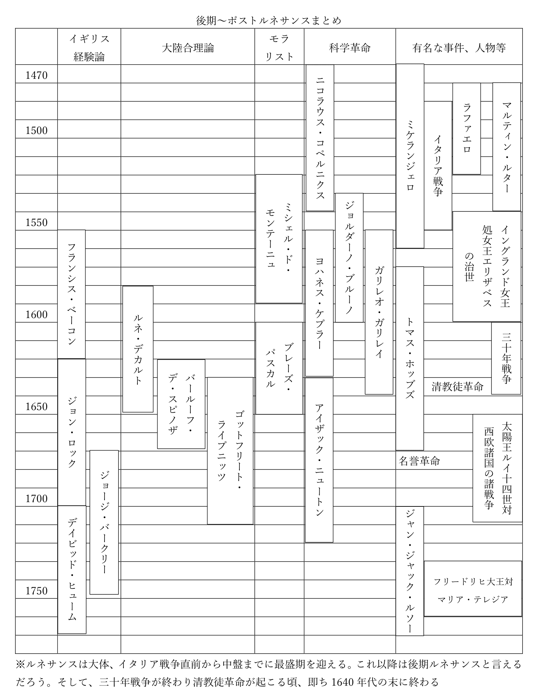

# 倫理分野第三章　西洋思想：後期～ポストルネサンス

  

・基本的に、ルネサンスはイタリア戦争中盤ぐらいまでが最盛期である  
・イタリア戦争末期以降のルネサンスは、後期ルネサンスと呼ぶ事ができる  
※イタリア戦争自体は1492年に始まって1559年に終わる  
  
・後期ルネサンスは、大体1650年までには終わる  
・その後は、言ってみればポストルネサンス、即ちルネサンス後の時代である  
  
・この後期ルネサンスからポストルネサンスにかけての思想は、五つの潮流に分けられる  
・その五つの潮流を、これから一つずつ見ていこう  
・まずは、モラリストから  
※今後、題材が変わるたびに前掲の「後期～ポストルネサンスまとめ」を見てどの辺の話をしているのか確認しましょう  