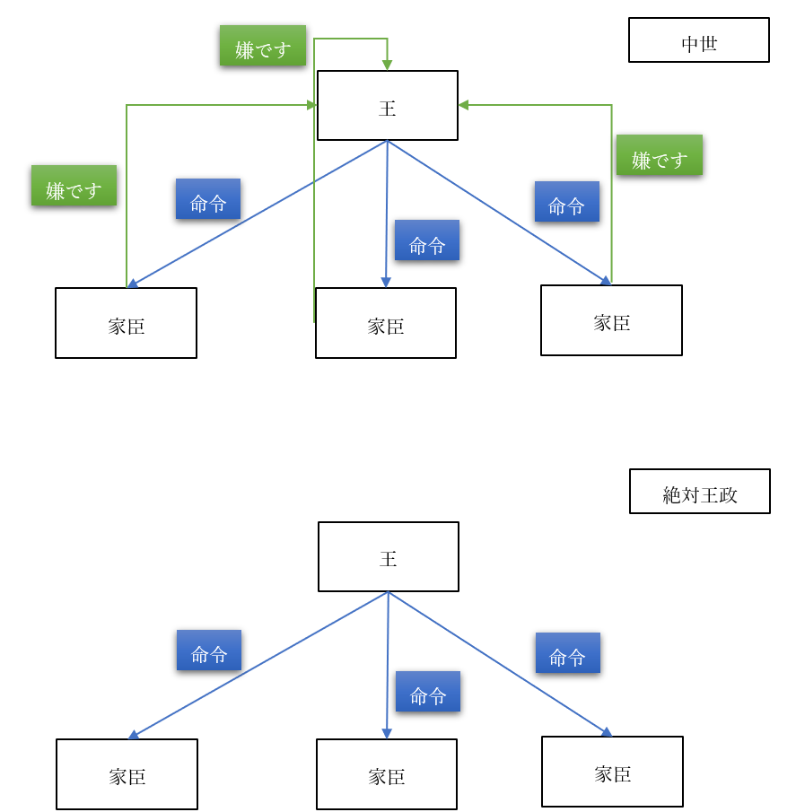

# 社会契約説

## ●王権神授説  
・中近世の欧州では、王政が主流だった  
・つまり、ほぼあらゆる国が王国だった  
・王国でない国があったとしても、実質的な王にあたる存在がいた  
  
・と言っても、中世に於ける王の権力は弱い  
・そもそも中世の王とは、「貴族筆頭」であって絶対的な支配者ではなかった  
・故に、家臣（貴族）は王の命令に対し、「嫌です」と言える力を有していた  
・だからこそ、中世を通して各国の王は、中央集権化を進める  
・それは、家臣の「嫌です」と言える力を一つ一つ、取り除いていく作業だった  

  

・国の一番上に王がいて、その下に家臣が沢山いる  
・その家臣は一人ひとり、王の命令に対して「嫌です」と言える  
・その「嫌です」と言える権力を全て、取り除いた状態  
・国の一番上に王がいて、その下に家臣が沢山いて、王の命令には誰も逆らえない状態  
・これこそが、中世を通して各国の王が渇望し、近世の後半になると完成する絶対王政である  
  
・絶対王政下の国家では、「国王＝国家」という図式になる  
※太陽王ルイ十四世が、家臣に「そんなことをなさっては国家と民のためになりません」と諫言されたのに答えて言ったとされる、「民だけでよい」「朕は国家なり」は絶対王政を象徴する名台詞である。絶対王政下、統治権を保持し行使したのは、王だった  
  
・このような体制下ではやはり、「何で王様にはそこまでの権力があるの？」という素朴な疑問が出てくる  
・そういった疑問に回答し、王政を正当化する学説が【王権神授説】である  
※フランス王国の法学者ボダンや神学者ボシュエ、『家父長制論』を書いたイングランド王国の思想家フィルマーらが主な提唱者  
  
・元々、王が権力を持つ事の説明として、「神に愛されているから」というのがあった  
⇒欧州に於いて貴族や王というのは軍人であり、戦争の勝者であった。そして、戦争で勝てるのは「神に愛されているから」（負けるのは愛されていないから）であり、神に愛されているから権力があるし支配者になれるのだ、みたいな理屈があった  
・中世末から近世はじめになると、王権神授説として理論化される  
  
・王権神授説の骨子は、以下のようなものである  
・「王権は神から付与されたものであり、王は神に対してのみ責任を負う」  
・「神の代理人たる王への反抗は神への反抗であり、誰も王の支配に反抗する事は許されない」  
  
  
  
## ●近世の戦乱  
・絶対王政が完成するのは、教科書的には1453年に始まる近世である  
・近世前期にもなるとようやく絶対王政の原型ができてきて、後期に入ってついに完成する  
  
・ところで、その近世だが、実は戦乱の時代であった  
・例えば近世前期だけでも、欧州全域を巻き込んだ大戦争が二つある  
⇒イタリア戦争と三十年戦争。近世前期の前半に起こったのがイタリア戦争、近世前期の終盤に起こったのが三十年戦争  
・このイタリア戦争の後半に宗教改革が起こり、宗教改革を受けて三十年戦争が起こる  
  
・三十年戦争は、凄惨を極めた戦争であった  
⇒略奪、強姦、虐殺何でもござれな戦争だった。「ヨーロッパの人口がここまで減ったの、この後世界大戦までないのでは」と言われるぐらいである  
  
・三十年戦争が凄惨を極めた理由は、主に二つある  
・一つ目は、傭兵による戦争だった事  
⇒カネで戦争の為に雇われた、兵隊が傭兵。当時、傭兵に対する給金は低く（日常的に略奪が必要なぐらい）、しかも戦争が休戦となるとまとめてクビになった。クビになった傭兵は、強盗団になるしか生きる道がなかった。…三十年戦争は、全ての軍隊が、こういう傭兵を使っていた。そら大変な事になるわ  
・二つ目は、宗教戦争という側面があった事  
⇒宗教改革によって、カトリックから分離した新たなキリスト教、プロテスタントが誕生した。この両者は、「神の教えを誤って理解している最悪の連中」「そもそも神を信じてないだけ、まだ異教徒の方がマシ」という感じで憎悪し合っていた。そら大変な事になるわ。例えばカトリックの軍がプロテスタントの都市（マクデブルク）を落とした時、人口二万五千の内二万が殺されたとされる  
  
・そんな戦争であったから、三十年戦争後は「やり過ぎないようにしましょう」という思想が出てくる  
・その代表が、国際法の父とも呼ばれるフーゴー・【グロティウス】である  
⇒主著は［『戦争と平和の法』］  
・彼は「いくら戦争でもやっちゃいけない事ってあるでしょ」と言った人間である  
・そのような発想から、やがて、現代の戦時国際法というものもできていくのである  
  
  
  
  
## ●社会契約説  
### 〇概要  
・三十年戦争は凄惨な戦争だった一方、欧州中を巻き込んだ大戦争でもあった  
・実を言えば、三十年戦争の直前にも、宗教を原因とする戦争がいくつもあった  
・この事実は、「王は神の代理人」という理論を、無邪気に信じられない人々を生んだ  
・その結果誕生してくるのが、【社会契約説】である  
  
・社会契約説は、統治権を誰が、どうして持つのかを考えるという意味では王権神授説と同じである  
・また、社会契約説は必ずしも王政と対立するものでもなかった  
・一方で、社会契約説は［市民革命］を経て現代的な民主主義政体に至る道筋も作った  
※封建的、あるいは絶対主義による絶対王政的な政府を打倒して、近現代的な社会（民主主義や資本主義を軸とする社会）を作り出した革命を、一般に市民革命と呼んでいる。代表例は名誉革命、アメリカ独立戦争、フランス革命  
  
・社会契約説は、主に【ホッブズ】【ロック】【ルソー】の三人によって提唱、発展させられた  
・それぞれ言っている事は当然違うが、共通するものもある  
  
・例えば、この三人は全員、権力を正当化する際、合意を根拠とする  
※王権神授説は神を根拠とした  
  
・また三人とも、人間の【自然状態】から考えたというのも共通  
⇒人がいるだけで社会も法律も政治も何もない状態、原始時代的な状態を自然状態と呼ぶ。特にホッブズとロックは、「自然状態の人間ってどんなのだろう」「当時は王とかいないけど今はいる。って事は、自然状態の人間は何らかの合意を結んで、王という存在を承認した筈だ」「じゃあどんな合意を結んだんだろう」という形で話を展開する  
  
・更に言えば、【自然権】という発想も三人共通である  
⇒自然状態、つまり原始時代的な状態で人が有する権利を【自然権】と呼ぶ。三人とも、自然状態の人間は自然権を持つ、と考えた。例えば「いくら原始人でも、「自分の身を守る」って権利はあるでしょ」みたいな感じ  
  
・最後に、【自然法】という発想も三人共通のものであった  
⇒人間の自然な本性、正義に基づいた法をこう呼ぶ。例えば「普通に考えたら、他人を殺しちゃ駄目でしょ」みたいなもの  
※逆に、ある時代、ある社会に於いて現実に有効な、人が作った法律を［実定法］と呼ぶ。現代日本の憲法とか刑法とか商法とかなんていうものはまさに実定法  
  
・以下、三人の社会契約説をそれぞれ見て行こう  
  
  
  
### 〇トマス・ホッブズ  
・代表作は【『リヴァイアサン（レビヤタン）』】  
・三十年戦争が始まった年に丁度三十歳、という世代の、イングランドの哲学者  
  
・彼は三十年戦争という凄惨な戦争を目の当たりにした  
・更に、三十年戦争末期のイングランドで起きた［清教徒革命（ピューリタン革命）］も体験し、亡命している  
⇒“殉教王”チャールズ一世という王様があまりにも無能すぎて、溜まりに溜まった不満が大爆発した反乱。これは宗教的な不満も込みのもので、イングランドで主流ではなかった宗派（清教徒）が反乱軍の主力となった。勝利した反乱軍は王を処刑、更に中心人物のクロムウェルが恐怖政治を布いた。クロムウェルの恐怖政治は、近現代でよく見る「軍事政権」「軍事独裁」「独裁政権」などと言われるものの先駆だった  
  
・こういった経験故に、ホッブズにとって、王権神授説は信じるに値しないものだった  
・こうして彼は、社会契約説を考えるようになる  
  
・彼はまず、人間の【自然状態】はどんなものかと考えた  
・そしてそれは、【万人の万人に対する闘争状態】であると結論した  
⇒人間は【自己保存】、つまり自分が生き延びる事を至上命題とする生命体であると考えた。即ち、［「人間は人間に対して狼である」］のだ。それ故に自然状態では、人々は食料をはじめとする資源を奪い合い殺し合う、YouはShockな状態になると考えた  
  
・万人の万人に対する闘争状態では、いかにもまずい  
・そこで人々は、全ての【自然権】を【国家】に譲渡する、という合意を結んだ  
・即ち、社会契約を結んだ  
⇒これが国家の起源であり、それ故に国家（そして国家の主たる王）は人々を支配できる。こう考えたのが、ホッブズの社会契約説である  
  
・これは、現代でも通用する、極めて先進的な思想である  
・例えば、「何故戦争はなくならないのか？」という問いに、明確に答える事ができる  
・と言うのは、現代は「人間にとっての国家」はある。だから同じ国民同士ならそうそう殺しあわない  
・しかし、「国家にとっての国家」が存在しない。国連はあるがいかにも力不足である  
・だからこそ、国家間の関係は「万人の万人に対する闘争状態」となり、戦争が頻発する  
・戦争をなくしたいのなら、「国家にとっての国家」を作れ。…このように、明確に答えられるのである  
  
  
・ホッブズの社会契約説をまとめると以下  
|                      |                                                  |  
|----------------------|--------------------------------------------------|  
|自然状態              |【万人の万人に対する闘争状態】                    |  
|契約                  |自然権を【放棄】、国家へ【全面的に譲渡】          |  
|主権                  |［国家、王］（自然権を全て譲渡されている為）      |  
|国家に対する人民の抵抗|［認められない］（自然権を全て譲渡してしまった為）|  
|特徴                  |【絶対王政】とも親和性が高い                      |  
  
  
### 〇ジョン・ロック  
・代表作は【『統治二論（市民政府二論）』】【『人間悟性論』】  
・清教徒革命直前に生まれた、イングランドの哲学者  
※既に見たように、イギリス経験論の父と呼ばれ、［タブラ・ラサ］を指摘した人物でもある。これについて書いてあるのが『人間悟性論』で、これから述べる社会契約説について書いているのが『統治二論』  
  
・彼は清教徒革命直前に生まれ、クロムウェルの恐怖政治下のイングランドで育った  
・クロムウェルの死後、イングランド人は王を呼び戻す  
・しかし呼び戻された王は、思想的には親カトリックであった  
⇒これがまずかった。当時のイングランド人はほぼほぼプロテスタントであり、しかも、カトリックを「独裁者のヤバい宗教」だと思っていた。故に「ヤバい独裁者はNG」という形で再び王への反感が高まり、最終的に、また反乱が起こる。反乱側は当時ネーデルラント連邦共和国の総督だったウィレム三世を、新たな王として迎え入れた。これが【名誉革命】である  
・ジョン・ロックは、名誉革命の直後に死んだ哲学者である  
  
・そんなロックは、人間にとって、食料をはじめとする資源は豊富なものだと考えた  
・即ち、自然状態の人々は、資源を奪い合い、殺しあう必要はなかった  
・故に自然状態はむしろ平和だと、【自由】で平等であるとしている  
・人々はそれぞれの自然権を尊重しあい、平穏な暮らしをする筈だ、と  
⇒この時ロックが考えた自然権は、【自由】という権利のみならず、自らの【生命】を守る権利もある。また、【所有】もしくは【財産】の権利、即ち、ある人が労働によって獲得したものはその人の所有物になる、という権利も想定している  
※所有もしくは財産の権利は分かりづらいので例を挙げよう。自然の森の中にあるものは誰のものでもない。しかし、誰かが「木の実を集める」という労働をして木の実を手に入れたのであれば、それはその人の所有物（財産）になる  
  
・しかし、人間は［過ち］を犯す生き物であり、それによって［人の権利］が侵害される可能性はある  
・そこで人々は、［国家］に［自然権］を守ってもらうよう、［統治権］を【委託（信託）】した…  
・この社会契約が国家の起源である、ロックはそう結論づけた  
・だからこそ国家（王や議会）は人々を支配できるのだ、と  
  
・彼のこの思想は、名誉革命を理論化するものとなった  
・名誉革命は結局、何をどう繕っても「反乱を起こして王を追い出した」ものである  
・ロックの理論を使えば、「そんな事していいの？」に対して「いいんだ！」と言える  
⇒「人々は、自然権を守ってもらう、という委託契約を王や政府と結んだんだ」「暴政するような暴君は委託契約違反だ、追い出していいんだ！」という形  
  
  
・勿論、ロックの社会契約説は、必ずしも王制と対立するものではない  
・ただ、絶対王政的な王との相性が悪いのは確かである  
・何せ、ロックの考え方からすると、王が王足り得るのは国民から委託を受けたからである  
・国民は、委託契約違反があれば契約解除を求めて反乱を起こせる立場にある  
・つまりロックの考え方は【国民主権（主権在民）】であり、また国民に【抵抗権（革命権）】を認めている  
⇒それこそ、後の【アメリカ独立戦争】はロックの思想の影響によって起こっている。即ち、「イギリス政府の暴政に対し、アメリカは抵抗し独立する」という形である。また、後の【フランス人権宣言】も彼の影響を受けている  
  
・逆に言えば、ロックの思想は［立憲君主制］的な王制とは相性がいい  
⇒君主（王）はいるにはいるが、絶対的な権力を持っている訳ではない。憲法があり、「王（政府）はこういう圧政をしてはいけません」「王（政府）は国民にこういう権利があると認めます」みたいな事が書いてあり、王（政府）はそれを守らねばならない…というような類の体制をこう呼ぶ。現代イギリスや現代日本は典型的な立憲君主制である  
  
・また、ロックの思想は【間接民主主義（議会制民主主義）】とも相性がいい  
⇒国民が選挙で代議士（国会議員とか）を選び、その代議士が政治を行う、という類の政体  
※現代日本も、立憲君主制かつ間接民主主義という政体を採用している  
・何せロックの思想に於いては、主権は国民が持っている  
・だったら国民が政治を行うべきだが、何千万人もいる国民が一堂に会して議論する…というのは非現実的  
・なら、国民の代表（代議士）を選んで、そいつらに議論して政治をやって貰おう…という形  
  
・もっと言うと、ロックの思想は現代イギリスの政治制度の理論的根拠にもなっている  
・即ち、現代イギリスは［議会］主権であるとよく言われる  
・つまり、イギリスで一番偉いのは［立法権］を持つ議会である  
⇒この議会の承認がなければ、誰も、あらゆる統治権を行使できない…という発想を元に、現代イギリスの統治機構は作られている。王も内閣も、議会の下にある。それこそ2009年までは、裁判所すらも議会の指揮下にあった  
※彼は現代国家の基本、［権力分立］についても語っているが、それについてはまた後程  
  
・ロックの社会契約説をまとめると以下  
|                      |                                                                                                                                                |  
|----------------------|------------------------------------------------------------------------------------------------------------------------------------------------|  
|自然状態              |［自由、平等、平和、独立］但し時折誰かが［過ちを犯す］                                                                                          |  
|契約                  |【自然権】を守ってもらう【委託契約】                                                                                                            |  
|主権                  |【国民主権】、但し【間接民主制】的な国民主権                                                                                                    |  
|国家に対する人民の抵抗|【認められる】（暴政のような委託契約違反があればOK）                                                                                            |  
|特徴                  |【議会】政治と親和性が高い【名誉革命】を正当化後の【アメリカ独立戦争】、【アメリカ独立宣言】にも影響また、王制とも立憲君主制という形で並立できる|  
  
### 〇ルソー  
・ジャン＝ジャック・ルソーは、ジュネーヴ共和国生まれの哲学者である  
・代表作【『社会契約論』】【『人間不平等起源論』】  
⇒時期的にはジョン・ロックの一世代後の人物。この時期は、イギリス以外の欧州国家が次々と絶対王政を完成させた、いわば絶対王政の完成期である。絶対王政を基礎とした社会秩序を［アンシャン・レジーム］などと呼ぶが、ルソーはそのアンシャン・レジームの完成期に、フランス王国で活躍した哲学者である  
  
・彼を簡潔に表現するなら「実現不可能な高い理想を掲げた男」  
⇒教員免許持ちの人間には、「自分は子供を捨てた割に教育学の本を書いた男」としても有名。これも言ってみれば「実現不可能な高い理想」である  
※ヒモだった時期が一番幸せだったと正直に告白する男でもあり、露出狂で何度も捕まっており、また横暴な女性の前に跪いて許しを請うプレイが大好きで…なんだこいつは（困惑）  
  
・そんなルソーだが、論文を書かせたら当代一流であり、四十手前になってから思想家として活躍する  
・彼は、自然状態こそが人類の理想郷であると考えた  
・自然状態の人々は、【自愛】と【憐み】を持ち、平等で自由である  
⇒私有財産というものが生まれてしまった為に、人は不平等になり、不自由になった  
※ここから、ルソーの考えは原則【自然に帰れ】となる  
  
・理想は自然に帰る事。人間が自然状態で持っていた自由、［自然的自由］を回復する事  
・しかし流石のルソーにも、今更自然に帰れないという事ぐらいは分かっていた  
・そこで、人々は社会契約という合意によって、新しい自由を手に入れるべきだと主張する  
・即ち、［社会的自由（市民的自由）］という、新しい自由である  
  
・これはどうやったら手に入るのか？  
・【一般意思】（公共の利益を考える気持ち）を以って、皆で【話し合って】物事を決めるのだ  
・そうする事によって、新しい自由が初めて手に入る。ルソーはそう論じたのである  
⇒【特殊意志】（自分の事だけを考える）で話し合いに参加してもしょうがない。【全体意思】（皆が自分の事だけを考えている状態）で話し合いをしても、やっぱり意味がない。一般意思に従って、皆で話し合う事で決まり事ができる。そういう決まり事に従う事で、人は初めて自由になれる、という考え方  
  
・ルソーはこのように考える為、ロック的な議会政治を否定する  
⇒ルソーもロックも国民主権という意味では同じである。一応、ルソーは［人民主権］という言葉を使うが、ともあれ主権が誰にあるかという意味では立場を同じくする。しかしルソーは、間接民主主義を否定する  
・間接民主主義では、選挙の時にしか人々に自由はない、とルソーは考えるのである  
・民主主義をやるのであれば、【直接民主主義】でなければ意味がない、というのがルソーの立場である  
  
・ルソーの思想は、彼の死後十年もすれば始まる［フランス革命］に大きな影響を与えた  
・但し、いかんせんルソーの言う事は、実現不可能な高い理想であった  
⇒それこそ、何千万人もいる国民を一箇所に集めて話し合いなんて物理的に無理  
・そういう訳で、革命時に出た【フランス人権宣言】は、むしろ【ロック】の色が濃い  
  
・ルソーの社会契約説をまとめると以下  
|                      |                                                                                    |  
|----------------------|------------------------------------------------------------------------------------|  
|自然状態              |［理想郷。自由、自足、平等、調和］人は【自愛】と【憐み】を持つ                      |  
|契約                  |【一般意思】に基づく【話し合い】                                                    |  
|主権                  |【国民主権】、但し【直接民主制】的な国民主権ルソー本人は［人民主権］と称する        |  
|国家に対する人民の抵抗|【認められる】                                                                      |  
|特徴                  |【直接民主制】と親和性が高い⇒後に【フランス革命】へ影響を与える王制とは並立し得ない|  
  
  
  
ここまでの、統治体制の理論的根拠まとめ  
|              |          |  |                          |  |                                  |  |                                      |  
|--------------|----------|--|--------------------------|--|----------------------------------|--|--------------------------------------|  
|説            |王権神授説|⇒|ホッブズの社会契約説      |⇒|ロックの社会契約説                |＋|ルソーの社会契約説                    |  
|正当化する政体|絶対王政  |  |絶対王政                  |  |間接民主制（立憲君主制を含む）    |  |直接民主制                            |  
|自然状態      |          |  |万人の万人に対する闘争状態|  |平和。但し、時々誰かが過ちを犯す  |  |平和。理想郷                          |  
|社会契約      |          |  |自然権を王・国へ譲渡      |  |自然権を政府に守ってもらう委託契約|  |一般意思に基づく、国民全員での話し合い|  
  
※現代日本は、基本的にはロックの思想を理論的な根拠にしている、と言えるだろう  