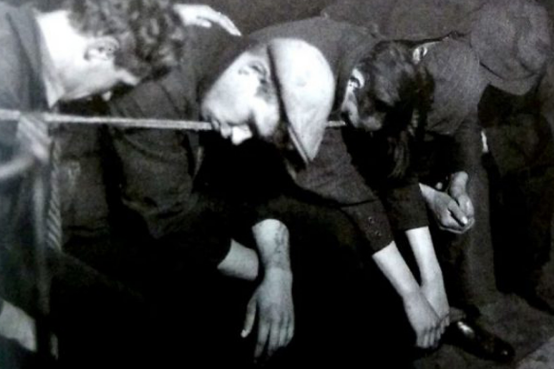
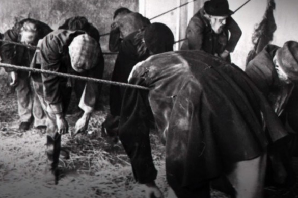

# 空想的社会主義

  
|                                                                                                                                                                                             |  
|---------------------------------------------------------------------------------------------------------------------------------------------------------------------------------------------|  
|本節で扱う思想家一覧                                                                                                                                                                         |  
|サン＝シモン伯クロード・アンリ（1760年10月17日 - 1825年5月19日） ロバート・オーウェン（1771年5月14日 - 1858年11月17日） フランソワ・マリー・シャルル・フーリエ（1772年4月7日 - 1837年10月10日）|  
  
  
  
  
## ●資本主義というレビヤタン  
・アダム・スミスは「公平な観察者」から見て共感される範囲内で、利己心を肯定した  
・功利主義者は、皆が幸せになれるように、「最大多数の最大幸福」を目指そう、とした  
・では実際には、世の中はどうなったか？  
・ここでちょっと、産業革命期の、イギリスの様子を覗いてみよう  
⇒アダム・スミスが理論的根拠を与えた資本主義による社会体制、その成立を加速させたのが産業革命である。産業革命が最初に起こったのはイギリスであり、資本主義がどのような社会を形作ったか、この時期のイギリスを見れば分かるだろう  
※産業革命が起きた時期は、だいたい革命の時代の前後である  
  
・当時、ロンドン等の都市部にある工場で働く労働者の労働時間は、著しく長かった  
・労働時間は当然のように十時間を越えていた。十歳の子供でも、普通に十四時間とか働いた  
⇒今回紹介するロバート・【オーウェン】は、労働者の労働環境があまりにも悪すぎる、もっと労働時間を短くしてやるべきだと訴えた人物である。そして実際に、スコットランドの［ニュー・ラナーク］に所有する工場で、一日十時間労働を導入した。ちなみに現代日本の法定労働時間は八時間であり、これ以上の労働は原則違法である。当時の労働環境がいかに悪かったか分かる  
  
・また労働者の賃金は安く、その上公害に対する意識とかそういうものもなく、街は汚かった  
・労働者達は安い酒（ジン）を飲んで酔い潰れ、もしくは暴れて憂さを晴らした  
⇒ジンは従来の酒に比べて安く、またアルコール度数が高い為手早く酔えた。「このお酒すごい！」「すぐ酔えてアッパラパーになって、つらい現実とか、将来の不安とか、何もかもどうでもよくなれる！！」となる訳である  
※現代日本でも、労働者の待遇が悪すぎるせいか、手早く酔える酒で現実を忘れる人が増えている模様  
  
  
・まだまだある。例えば家すらない労働者は、宿に泊まるしかなかった訳だが…  
・棺桶をベッド代わりに使って寝る宿ならまだ、上等  
・椅子に座って、縄に頭を載せて寝る宿もある  
・もっと酷いのだと、立ったまま縄にもたれかかって寝る宿もある  
  
  
  
・勿論、先に触れたように、こういう過酷な環境で働いていたのは大人だけではない  
・十歳とかそれぐらいの児童であっても、過酷な労働を強いられていた  
・児童労働の代表例は、住宅の煙突掃除と炭鉱労働であったが…  
・例えば煙突掃除中、燻った火によって蒸し焼きになる児童というのも多かった  
  
・このように、産業革命期の庶民は、過酷な環境に置かれていた  
・彼らの雇い主は、労働者たる庶民の環境に頓着しなかった  
・どころか、「児童労働禁止？」「そんな事をしたら経済が崩壊するぞ！」とか言い出す始末  
  
・人々が自由に金儲けを追求する資本主義社会とは、結局、ヘーゲルの言う「市民社会」だったのである  
  
## ●社会主義の誕生  
・当然と言えば当然だが、こういう状況に心を痛める人々もいた  
・こんな酷い世界を変えていかねばならない、という人々である  
・こうして出てきた思想を、一般に【社会主義】と呼ぶ  
  
・社会主義には、大きく分けて【空想的社会主義】と【科学的社会主義】がある  
・前者の呼称は、後者による蔑称のようなものなのだが、今でも一般にこれが使われている  
・ともあれ、先に登場したのは空想的社会主義であった  
・空想的社会主義は、基本的には人道主義の一種みたいなものだと考えていいだろう  
⇒「アダム・スミスの言うような、自由で開かれた市場での、自己の利益の追求。それ自体はいいかもしれない」「けどそのせいで、縄にもたれかかって寝るような労働者が出てきてるんだぞ！」「彼らに、人間らしい生活をさせてやれるような社会が必要なんじゃないのか！」みたいな感じ  
  
・空想的社会主義の特徴として、理想社会を想定した者が多い、というところがある  
・即ち、人々は皆平等であり、失敗者はおらず、皆が成功者であり、幸福である  
・土地も工場も、何もかもが「皆」の持ち物であり、それを巡って争う必要はない  
・生きていくのにカネを持つ必要もなく、自給自足が達成されている社会  
・そういう社会である  
  
・イギリスに於いては、先に紹介したロバート・【オーウェン】が代表者となる  
・彼はいわゆる実業家という奴であり、数々の工場の経営を成功させて富を築いた  
・が、彼は困窮する労働者の救済をむしろ使命とし、特にその後半生は社会改革家と呼ぶに相応しい  
  
・彼は困窮する労働者の救済に関して、対処療法的な慈善活動をその手法とはしなかった  
・労働者を低い賃金でこき使う社会、そのものを変えようとした訳である  
・実際、彼は労働組合の父とでも言うべき存在である  
・そして彼が、その私財を投じて作ろうとした理想社会が［ニュー・ハーモニー平等村］である  
  
・この村は、見事に大失敗した  
・まぁ当然と言えば当然の話であった  
・人間は資本主義社会を作れる程度には賢いが、理想社会をやれない程度には愚かなのである  
・この失敗後も、オーウェンは精力的に労働者擁護の社会運動を展開している  
  
・一方、フランス地域には代表者が二人いる  
・【サン＝シモン】伯クロード・アンリと、フランソワ・マリー・シャルル・【フーリエ】である  
  
・フーリエはフランス革命前に、商人の家に生まれた  
・革命によって財産を失い、フランス革命や、革命を主導した富裕市民層を批判した  
・富裕市民層とは、要するに資本家、金持ちであり、工場長とか会社社長とかである  
・即ち、労働者を低賃金で長時間、こき使っていた者達である  
  
  
・産業革命が富裕市民層を台頭させ、彼らがフランス革命の主力となった  
・この事実を考えると、フランス革命という流血と暴力の群体も、産業革命が生み出したと言える  
・現代的な資本主義的な社会、産業社会こそが、フランス革命を生み出したとも言えるのである  
  
・資本主義が、迷信を払う理性の光だなんてとんでもない  
・ロンドンやパリに住む金持ちどもは、自分達を文明国民だと思っているが、思い違いも甚だしい  
・文明国というのは、人間が人間らしく生きていける国を言うのだ  
・そのような発想から、彼は「文面国民」に軽視されてきた農村社会に目を向けた  
  
・あまり大きくなく、自給自足で生活できる農村  
・国家による統制もなく、財産を巡った争いもない、理想的な農村  
・彼はこれを［ファランジュ］と呼び、そういうものを作ろうと実際に活動もしたのだった  
⇒実際のところは、資金不足で作れなかった模様  
  
・一方サン＝シモン伯は、以前紹介したオーギュスト・コントの師匠にあたる人物である  
・フランス革命前に生まれ、若い頃はアメリカ独立戦争に行った事もあるフランス貴族である  
・彼は、これからの時代、偉いのは貴族でもなければ農民でもなく、「生産者」であるとした  
・そして「生産者」たる経営者と社員、資本家と労働者は、互いに協力し合う関係になるべきだとしている  
⇒これからの時代のキリスト教とは、教会で礼拝するようなものではない。資本家と労働者が互いの欲望を抑え、慈しみ合うものだと説いた  
※高度経済成長期の日本なんかは実際、こんな感じであったと言える  