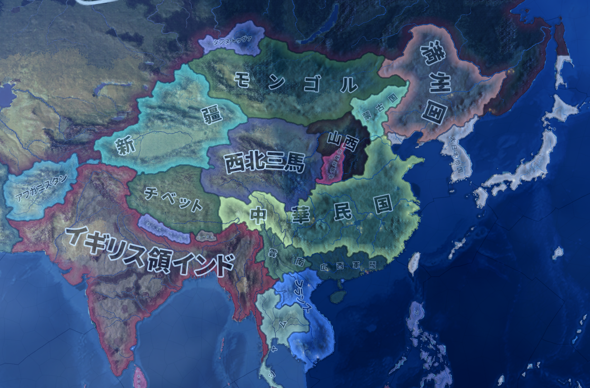

# 恐るべき子供達

  
|                                                                                                                                                                                                                 |  
|-----------------------------------------------------------------------------------------------------------------------------------------------------------------------------------------------------------------|  
|本節で扱う思想家（？）一覧                                                                                                                                                                                       |  
|“レーニン”ウラジーミル・イリイチ・ウリヤノフ（1870年4月22日 - 1924年1月21日） “スターリン”ヨシフ・ヴィッサリオノヴィチ・ジュガシヴィリ（1878年12月18日 - 1953年3月5日） 毛沢東（1893年12月26日 - 1976年9月9日）|  
  
  
・フランス革命にナポレオン戦争と、欧州を騒がせた続けた革命の時代は終わった  
・革命の時代が終わってから世界大戦が始まるまでの間が、いわゆる資本の時代、そして帝国の時代である  
※日本で言えば、江戸時代後期から明治維新、そして日清日露戦争、という時期  
  
・この二つの時代は、イギリスが世界最強の大英帝国として繁栄した時代である  
・そしてまた、欧州各国が世界中を征服し、植民地として支配していった時代でもある  
  
・この時代、欧州は比較的平和であった  
⇒「こいついつも戦争してるな」という言葉が似合う欧州諸国だが、資本の時代や帝国の時代にやっていたのは、植民地獲得競争であった。その為本国同士の戦争は起こらず、戦争するとしても「アフリカの国を征服して植民地にする」とか「アジアのある地域をどっちが植民地にするかで喧嘩する」みたいなのばかりだった  
  
・前章のマルクスとエンゲルスは、まさにこの時期の人間である  
・J.S.ミルなんかも、革命の時代と言うよりは資本の時代の人という感がある  
  
・この時代は、社会主義関係以外にも特筆しておくべき思想潮流があり、思想家がいる  
・しかしながら、前章で「この後、社会主義の“恐るべき子供達”が出てきます」と言った訳で…  
・そうであれば、あの後どうなったのかという話を先にするのが筋だろう  
  
  
  
## ●ソ連の誕生  
・一般に、「社会主義or共産主義の国と言えば？」と言って出てくるのはソ連である  
・正式名称、ソヴィエト社会主義共和国連邦。現代のロシア連邦の前身である  
・マルクス、エンゲルスの後継者として国を作った者の代表が、この国である  
  
・では、ソ連は本当にマルクスとエンゲルスの後継者なのか？  
・この二人の信奉者を［マルクス主義］者と呼ぶが、ソ連は［マルクス主義］者が作ったと言えるのか？  
  
・既に見たように、「マルクスの言った事」と「マルクスの言った事として広まったもの」は違う  
・マルクスは生前、「あいつらが共産主義者なら俺は共産主義者じゃねーよ」みたいな発言もしている  
⇒マルクスの生前から、マルクス＝エンゲルスの理論に共鳴した者達は多かった。その者達に、マルクスは「何勘違いしてるんだこいつら」と言っていた訳である  
  
・もっと言えば、ソ連は第一次世界大戦中、ロシア帝国で起きた［ロシア革命］によって誕生するが…  
・まずもってこのロシア革命そのものが、マルクス＝エンゲルスの理論から外れている  
・マルクスによれば、社会主義革命の前提は「資本主義による経済発展が極限に達する」である  
・そうなると、資本家と労働者の対立も極限に達し、社会主義革命になる…これがマルクスの理論である  
  
・その社会主義革命が、経済的には遅れた農業国家のロシア帝国で起きたのである  
・勿論ロシア帝国だって、植民地にされてしまったような地域に比べれば進んでいたが…  
・少なくとも欧米列強国の中では、下から数えた方が早い  
・とてもではないが、「資本主義による経済発展が極限に達した」国ではない  
・そんな国で社会主義革命が起きたという時点で、マルクス＝エンゲルスの理論からは外れているのである  
  
・では、ソ連の社会主義革命の理論は、誰が提供したのか？  
・ソ連をはじめとする、共産主義勢力の理論は、一体誰が提供したのか？  
・ウラジーミル・イリイチ・ウリヤノフ  
・【レーニン】の筆名で知られる彼こそ、ソ連的な社会主義、共産主義の基礎理論の提供者である  
⇒ロシア革命を指揮し、初期のソ連の最高指導者となった人物  
  
・レーニンの有名な著書が、『帝国主義論』である  
・レーニンは「［帝国主義］はプロレタリア革命の前夜である」と言っている  
⇒帝国主義をざっくり言ってしまえば、「他国を征服して植民地にする、というのをバリバリやりましょう」という政策である。欧州各国は十六世紀から本格的に、アメリカ大陸や東南アジア諸島を征服、植民地として支配するようになり始めた。そして、革命の時代に起きた産業革命を経て、世界最強の地域となった欧州の国々は、資本の時代、帝国の時代にかけて、全世界を征服、植民地にしていったのである  
  
・要するにレーニンは、社会主義革命の前提を変えた訳である  
・「資本主義による経済発展が極限に達する」ではなく「その国が帝国主義を採るようになる」にしたのだ  
⇒資本主義とは搾取、収奪、独占の形式であって、その究極形が帝国主義だ…という形で、「だからロシア帝国で社会主義革命をしたっていいんだ。という訳で、皆で革命を起こそう！」としたのである  
  
・このように、ソ連という世界初の社会主義＝共産主義国家は、レーニンの理論によって誕生した  
・マルクス＝エンゲルスの理論を修正して作られたこの理論は、［マルクス＝レーニン主義］と呼ばれる  
  
  
## ●ソ連という悪魔  
・では、そうやって誕生したソ連はどうだったのか？  
・マルクス主義に於いては、社会主義革命によって資本家は打ち倒される筈であった  
・社会主義を実現した国は、労働者の楽園になる筈であった  
・マルクス＝レーニン主義に基づいて作られたソ連では、実のところ、どうなったのか？  
  
・結論から言えば、全く駄目だった  
・例えば労働者は、相変わらず地獄のような労働に従事させられた  
・マルクスの言う、「労働の疎外」のままであった  
⇒結果、ソ連は「労働の疎外なんてのは、マルクスが若い頃に言ってた世迷い事に過ぎない」「ガタガタ言ってないで働け、労働者」という形で、マルクスの言う「労働の疎外」を認めなくなった  
  
・ではどうして、社会主義は労働者の楽園になれなかったのか？  
・一応、教科書レベルでは分配が原因とされる  
⇒資本主義は自由競争の世界なので、頑張った成功者は沢山お金が貰える。一方、社会主義国家はこの自由競争こそが諸悪の根源であるとして、全ての労働者が平等に同じ給料を貰える、とする。故にどんなに頑張っても同じ給料しか貰えないから、労働者から働く意欲が失われた…という風に、社会主義がうまくいかなかった理由を説明する  
  
・ただ、この説明では納得しない人も多いだろう  
・それこそ現代の日本は、どんなに頑張っても基本的に同じ給料しか支払われない  
・と言うか、資本主義自体、ほっといたら資本家が労働者の給料を減らす世界である  
・上記の説明はあくまで教科書的な説明、と捉えた方がいい  
  
・では何故社会主義は失敗したのか？  
・詳しく説明すると長くなるので、よく言われる話の要点を列挙しよう  
  
１：国家が唯一最大の金持ちになった  
⇒「資本家が労働者をいじめる」から「金持ち（資本家）を抹殺して労働者だけの世界にしよう！」が社会主義である。だが結局、「国家（政治家、官僚）が労働者をいじめる」に変わっただけに終わった  
  
２：生産手段を国有化＆計画経済な為巨大な国家と巨大な官僚組織が必要  
⇒この国家と官僚に対するチェック機構がなく（ソ連に限らず、社会主義＝共産主義国家は全体主義的恐怖政治が基本）、国家と官僚が腐敗する一方になった  
  
３：計画経済は、貧乏な国ならともかくある程度以上豊かになると、細かい需要に対応できなくなる  
⇒例えば服。貧乏な国なら、国民全員に数着、国民の制服を配ればいい。しかし豊かになると、皆お洒落したくなる。そういう時、どんなデザインの服を何着生産、とか政府に決められますか？　という話  
  
４：生産手段を国有化したという事は、言ってみれば「国が唯一の超巨大企業になった」という事でもある  
⇒そして、「大企業しか存在しない」というのは、国を壊しかねない次元で経済を悪化させる  
  
・そしてまた、よくなかったのが、ソ連が全体主義的恐怖政治国家になってしまった点である  
⇒秘密警察が国民を監視していて、「最近の政府は駄目だなー」みたいな話をしていると、秘密警察が踏み込んできて逮捕される…とか。「お前は政府を批判した！」みたいな容疑がかかった場合、ロクな裁判もなしに射殺される…とか。ソ連は、そういう国家になってしまった  
  
・どうしてこうなるのかと言えば、マルクス主義、そしてマルクス＝レーニン主義が悪い  
・これらは、「理論上、社会主義が実現した国は労働者の楽園になる」というものである  
⇒この「理論上」というのが曲者で、「理論上起きないものが起きているのは、社会主義を邪魔する奴がいるからだ！」という話になり、槍玉に挙げられた人が収容所に送られたり殺されたりする。共産主義国家は必ずと言っていいほど自国民を虐殺するし、必ずと言っていいほど全体主義国家になって恐怖政治を布くが、その原因の一部はこういうところにある  
※まぁそれに、元々ロシア革命の時に、皇帝一家をその飼い犬に至るまで皆殺しにしてできた国なので…  
  
・特に、レーニンの後を襲った指導者がよくなかった  
・その名はヨシフ・ヴィッサリオノヴィチ・ジュガシヴィリ  
・［スターリン］の筆名で知られる、史上最大にして最悪の独裁者である  
  
・スターリンの治世下では、とにかく人が死んだ  
  
・特に大粛清と呼ばれる時期には、相当数の一般ソ連国民が殺された  
⇒公式記録だけ見ても、1937年と1938年の二年だけで六百七十万人殺されている。じゃあ公式記録にならなかったであろう分も含めたらどれぐらい増えるのか？　と言われると…うん……  
※ちなみにこの時、軍の将校もかなり殺された。結果、軍隊はガタガタになり、第二次世界大戦初期に大苦戦する羽目になる  
  
・他にも、ウクライナ地域で起きた飢饉では、わざとこの地域を見殺しにする政策を採った  
・結果、ウクライナ飢饉と呼ばれるこの飢饉では、一千万人が死んだと言われている  
・更に言えば、何十万人という人々が強制移住政策によって次々と死んでいったし…  
・第二次世界大戦では、敵に降伏した兵士の家族は逮捕され、収容所に送られた  
  
・更に言えば、周辺の中小国を侵略して領土を広げるというような事も派手にやっている  
・有名なところで言えば、いわゆるバルト三国は、完全に「近くにいて、弱いから」で侵略されて滅亡した  
・フィンランドもまた、スターリン治世下のソ連に侵略され、首都近辺の領土を大きく削られている  
  
・まさに教科書通りのザ・恐怖政治、ザ・独裁者である  
・労働者の楽園は、実現しなかったのである  
  
## ●共産主義という悪夢  
・ところで。社会主義は本来、一つの国の中で収まるものではない  
・社会主義の革命論にとって、「資本主義⇒社会主義」という進化は必然である  
・そして、第一次世界大戦の頃には、資本主義的な経済体制は世界中に広がっていた  
・つまり、世界中で社会主義革命が起きる事こそ、歴史の必然なのである  
・故にソ連は、社会主義革命、及び資本主義の社会主義への進化を促進しようとした  
  
・また、ソ連にはもう一つ、世界の社会主義革命を促進する事情があった  
・と言うのは、傍から見ると社会主義というのは、「金持ちを殺しましょう教」である  
⇒「資本主義は、資本家（金持ち）と労働者（庶民）が対立する」「この対立が極限に達すると革命が起こり、労働者の楽園ができる」…というこの理論は、実も蓋もなく言ってしまえば「金持ちを殺せば幸せになれる」「だから皆で金持ちを殺して幸せになりましょう」である。新手のカルト宗教やんけこれ  
  
・と言う訳で、ソ連は世界各国から睨まれていた  
・「何とかしてこのヤバい宗教国家潰さないと」みたいに思われていた  
・故に、ソ連以外の国でも革命を起こさせて、味方を増やしたかったのである  
  
・こうしてソ連は、世界各国に「金持ちを殺しましょう」教の宣教師を派遣していく  
・要するに、社会主義革命を誘発する為の工作員、スパイを送り込んでいくのである  
・また、第二次世界大戦では、ソ連は多くの国を征服した  
・征服した国に傀儡政権を作り上げ、そこを共産主義国家にする、というような手も使えた訳である  
  
・もっと言えば、社会主義というのは、反乱軍に好都合な考え方である  
・人間、どんなに不満があっていても、「政府に逆らう事は悪い事」という頭があると反乱に踏み切れない  
・しかし社会主義は「金持ちを殺せば幸せになれる」である  
・そして反乱を起こす側は大抵貧乏で、起こされる側は大抵金持ちなのである  
・結果、多くの反乱に社会主義が採用されもした  
  
・こうして、ソ連に続く共産主義国家が、多く作られた  
・では、それらの国は労働者の楽園になれたか？  
  
・まぁ当然だが、なれなかった  
  
・例えば、ソ連に次いで大きな共産主義国家となった、中華人民共和国  
・いわゆる「中国」と呼ばれるこの国は、第一次世界大戦直後ぐらいの頃には、影も形もなかった  
・この時期のいわゆる「中国」には、軍閥と呼ばれる一種の戦国大名が、各地にいた  
・言ってみれば、この時期の「中国」は、群雄割拠の戦国時代だったのである  
  
・この戦国時代を終結させ、民主主義国家を作ろうと言っていたのが、例えば［孫文］である  
・彼は［三民主義］という言葉をスローガンとして掲げ、戦国時代を終わらせようと努力した  
・しかし、うまくはいかなかった  
  
第二次世界大戦直前、1936年頃の図。だいぶ軍閥が淘汰されたが、それでも統一された国家には程遠い。と言うか、だからこそ大日本帝国も、いわゆる「中国」と呼ばれる地域の領土を切り取ろうとしたのである。ちゃんとした統一国家が存在しているなら、そこと同盟するとか、そこを裏から操ろうとか考える訳で…  
Paradox Interactive社のHearts of Iron IV（Japanese Language Mod使用）より  
  
・第二次世界大戦期になってもまだ、いわゆる「中国」は戦国時代だった  
・それでも、第二次世界大戦を通して、各地の戦国大名（軍閥）は淘汰されていく  
・第二次世界大戦が終わった時、残っていたのは二つの勢力だった  
・即ち、蒋介石率いる中華民国と、【毛沢東】率いる中華人民共和国である  
  
・戦後、この二勢力が争い、負けた中華民国は台湾へ亡命した  
・一方勝った中華人民共和国は、いわゆる「中国」として、この地域に君臨するようになったのである  
・こうして誕生した中華人民共和国は、どうだったか？  
  
・全く駄目だった  
  
・そもそもいわゆる「中国」の座を賭けた戦争でも相当殺しているが、まぁこれは別としよう  
・が、遅くとも1957年からは反対派の弾圧が本格化し、全体主義的恐怖政治が始まる  
・1958年からは、非現実的な農工業政策で二千万から五千万と言われる餓死者を出す  
⇒いわゆる大躍進政策  
・また1960年代には、紅衛兵と呼ばれる青少年を扇動し、反対派を虐待・虐殺している  
⇒こちらでも一千万単位で人が死んでいる  
  
・中華人民共和国は現代に至っても、少なくとも建前上、社会主義を捨てていない  
・そして、弾圧と虐殺は、今でも止まっていない  
⇒それこそ令和三年現在でも、少数民族（と言うか、戦後になってから征服された人達）たるウイグル人やチベット人をこの地上から消滅させるべく、中華人民共和国政府は活動を続けている  
  
・大国だけではない。社会主義を採用した国は何処も、労働者の楽園になれなかった  
・それこそ北朝鮮（朝鮮民主主義人民共和国）が労働者の楽園か？　という話だし…  
・カンボジア（民主カンプチア）には、共産主義政権の中で最も「ヤバい」独裁者が出現している  
⇒「金持ちを殺そう」「ところで知識人って金持ちだよね、カネがあるから教育受けられたんだし」「よし、知識人皆殺しにしよう！」というところから、本を読む者は死刑、海外旅行した事がある者は死刑、時計が読める者は死刑、眼鏡をかけていたら死刑、果ては手が綺麗だから死刑、みたいな事をやっていた  
  
・社会主義は結局、世界に悪夢を撒き散らしてしまったのである  
  
  
