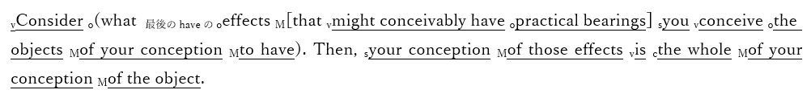

# 実用主義

  
|                                                                                                                                                                       |  
|-----------------------------------------------------------------------------------------------------------------------------------------------------------------------|  
|本節で扱う思想家一覧                                                                                                                                                   |  
|チャールズ・サンダース・パース（1839年9月10日 - 1914年4月19日）ウィリアム・ジェームズ（1842年1月11日 - 1910年8月26日）ジョン・デューイ（1859年10月20日 - 1952年6月1日）|  
  
  
  
  
## ●概説  
・アメリカとヨーロッパは、よく「欧米諸国」のように呼ばれ、一緒に語られる  
・実際、アメリカ合衆国は、主にイギリスからの移民が作った国であるから、似たような文化を持っている  
・しかし、「欧州」と「米国」で見ると、明らかに違いはある  
⇒本人達自身もそう思っている。欧州人は米国人を「やっぱり植民地人は、俺達文明国人と違って野蛮だなぁ」と思っているし、米国人は「欧州の連中は古い考えに凝り固まってて、本当に時代遅れだなぁ」と思っている  
  
・そんなアメリカの文化には、いくつかの特徴がある  
・一般的には、いわゆる［開拓者精神（フロンティア・スピリット）］が挙げられるが…  
⇒新しい技術や思想を恐れず、むしろ生み出し、また取り入れていく勇気を代表とする精神。科学的なやり方を好むアメリカ人が多い事も、この精神の影響があると言えるかもしれない  
  
・他にも色々ある。いくつか挙げてみよう  
  
１：反知性主義  
⇒反知的エリート主義とでも言ったらいいか。「大学の偉いセンセイがなんかごちゃごちゃ言ってるが、世の中、偉いセンセイが考える通りにはいかないんだよ！」みたいな感覚  
  
２：敬虔なプロテスタントである事  
⇒アメリカ人と言えば陽気で宗教とか関係ないと思っている人が多そうだが、その真逆。基本的に敬虔なキリスト教徒の国である。それこそ、アメリカ国民の過半数が進化論を信じるようになったのは2000年代である。敬虔なキリスト教徒の国だから、聖書に書いてある通り、世界も人間も神が六日間で作ったと信じていたのだ  
  
３：自由、勤勉、公正といった価値観を重視する  
⇒敬虔なキリスト教徒の国であり、特にプロテスタントが多い。だからこそ、プロテスタント的な価値観を重視する。自由を重視し、また、特に［清教徒（ピューリタン）］的な勤勉さを誇る。勤勉に働いて自由にカネを稼いで、その結果が尊重される事こそ公正である（福祉国家的な累進課税だの再分配だのは公正とは言えない。サボって稼いでない怠惰な連中にカネを払うな）、という感じ  
  
・そんなアメリカを特徴づける思想の一つに、【プラグマティズム】がある  
・資本の時代、そして帝国の時代に、北米で現れた思想である  
・様々な訳があるが、一般に［実用主義］と訳される  
・この思想をざっくり言ってしまえば、「それって何かの役に立つの？」と問うものである  
・例えば、哲学者が西暦紀元前以来追い求めてきた「真理」  
・「哲学者って昔っから「真理」を探してるけど、その「真理」って何かの役に立つの？」  
・そう問うたのが、プラグマティズムなのである  
  
・と言っても、そんな問いかけそのものは、昔から何度となくされてきたものであろう  
・ちょっと斜に構えた、今で言う中二病的な人が、何度も何度も言ってきた事だろう  
・プラグマティズムが偉かったのは、「役に立つならそれでいい」と言った事である  
・「「真理」にもし、何かしら役に立つ側面があるのならば、そこが大事なんだ」  
・「真理」がもし、実際の行動の役に立つのならば、そこが一番重要なんだ」  
・そう言ったのが、プラグマティズムなのである  
⇒そういう思想だから、実用主義と訳される訳である。また、この「プラグマティズム」という言葉は、ギリシア語で「行為」「行動」を意味する【プラグマ】に由来する  
  
・そんなプラグマティズムを始めた男が、アメリカ人のチャールズ・サンダース・【パース】である  
・彼の思想の根幹になる文は、しばしば【プラグマティズムの格率】の名で知られている  
  
 > Consider what effects that might conceivably have practical bearings you conceive the objects of your conception to have. Then, your conception of those effects is the whole of your conception of the object.  
  ※いわゆる「プラグマティズムの格率」は何パターンかある模様である。そこで、一番有名なものを載せている  
  
・英語がある程度以上できる人ならば分かると思うが、とんでもない悪文である  
・例えば、wikipedia日本語版に訳文が載っていたのだが…  
  
>  わたしたちの概念の対象が、けだし行動への影響を有するどのような効果を持つことができるとわたしたちが考えているのかについて、よくよく考えてみよ。そうすれば、これらの効果についてのわたしたちの概念こそは、その対象物についての私たちの概念そのもの全てである。  
  （[https://ja.wikipedia.org/wiki/%E3%83%97%E3%83%A9%E3%82%B0%E3%83%9E%E3%83%86%E3%82%A3%E3%82%BA%E3%83%A0](https://ja.wikipedia.org/wiki/%E3%83%97%E3%83%A9%E3%82%B0%E3%83%9E%E3%83%86%E3%82%A3%E3%82%BA%E3%83%A0)　令和三年十月十八日閲覧）  
  
・恐らく、「何言ってんだこいつ」と思った筈である  
・正直なところを言うと、こんな訳になってしまうのは、ある程度までは仕方のない話である  
・それぐらい、元の英文が酷いのである  
・一応、筆者がSVOCMつけたものと苦心して訳したものを下に載せよう  
  
  
  
>  あなたの思考の対象となるあなたの概念が、実用的な意味を持つ可能性のある効果を持つかどうか考えてみよ。そういった効果に対するあなたの概念は、あなたの概念の対象の全てである。  
  
・要するにプラグマティズムの格率は、こう言っているのだ  
・「あなたが考えている概念って、実際の行動に役立つ効果があるんですか？」  
・「あなたが考えている概念の本質ってのは、その効果の事なんですよ」  
  
・例えば、「人を殺してはいけません」という概念がある  
・この概念について、人はいつも「どうして人を殺してはいけないのか」と考えがちである  
・プラグマティズムの考え方では、そんな事を考えてどうするんだ、となる  
・「人を殺してはいけません」という概念が、実際にどう役立つのか考えなさい、となる  
⇒例えば、「人を殺してはいけません」という概念の存在は、ちょっとキレただけで他人を殺すようなやべー奴の存在を抑止できる。そういう、役に立つ効果がある。この役に立つ効果こそが、「人を殺してはいけません」という概念の本質である、というのがプラグマティズムの（一般的な）考え方である  
  
  
  
## ●プラグマティズムの発展  
・ところで、プラグマティズムという思想は、［形而上学クラブ］に端を発する  
・パースや、その友人ウィリアム・【ジェームズ】が参加していたこのクラブでの議論が、元になったのだ  
・そしてプラグマティズムを始めた男パースは、存命中は不遇であり、概ね無視され続けた男であった  
⇒正直、プラグマティズムの人として倫理の授業で習う側からすると、「あんな糞英文書いてたらそら無視されるわ」となるが…実際には、パースの父が目をかけていた弟子が彼を憎んでおり、パースの人生を妨害し続けたせいだ、と言われている  
※現在では、アメリカ合衆国史上、最も重要な哲学者にして論理学者の一人とされている  
  
・さて、プラグマティズムはアメリカ文化を特徴づける思想の一つである  
・概ね無視され続けた男の思想が、どうすればそんな重要な思想となれるのか？  
・実は、ウィリアム・ジェームズがプラグマティズムを紹介し、広めたのである  
⇒実際、彼は［『プラグマティズム』］という本を書いてもいる  
※ジェームズはパースの友人であり、徐々に貧困へと陥っていくパースを常に、応援し続けた  
  
・ただ、ジェームズとパースの思想は、どうも細かいところでは異なったようである  
・例えばプラグマティズムの格率を、先程「人を殺してはいけません」で解説した  
・実を言えば、これはジェームズの解釈である  
  
・パース自身は、プラグマティズムの格率を、道徳に使えるものではないと考えていた  
・あくまで、実用的な、科学的な法則に対して使うものだと考えていた  
・しかしジェームズは、道徳とか真理とか、そういうものにも使えると考えた訳である  
⇒つまりプラグマティズムはパースが始めたものだが、ジェームズなりに解釈したものが世に広がった、という形になる  
  
・ジェームズなりに解釈されて広がったプラグマティズムを特徴づける言葉が【真理の有用性】である  
  
・ある人が発見した「真理」に、何かしら役に立つ部分があるのであれば、それはまさしく「真理」である  
・それが論理的には間違った「真理」であろうと、関係ない  
・また、他人が考えている「真理」とは別のものであろうとも、やはり、関係ない  
・その人にとって、その「真理」が役に立つのであれば、それは間違いなく「真理」なのだ  
※分かりにくければ、「真理」を「信念」と言い換えてみましょう  
  
・ジェームズによって解釈されたプラグマティズムは、このように考える  
・だからプラグマティズム的に考えると、この世の中に真理は沢山ある事になる  
・それこそ、人の数と同等以上は存在する事になる  
・それでいいのだ、とプラグマティズムは考える  
・プラグマティズムの格率の言う通りである  
  
＞・要するにプラグマティズムの格率は、こう言っているのだ  
＞・「あなたが考えている概念って、実際の行動に役立つ効果があるんですか？」  
＞・「あなたが考えている概念の本質ってのは、その効果の事なんですよ」  
  
・役に立つものこそ真理であり、役に立たないものを真理とは言わない  
・理論的に正しかろうが何だろうが、役に立たないのならば真理ではない  
・真理の有用性とは、そういう事である  
  
・哲学者はソクラテス以来、永遠不変の真理を探し求めてきた  
・イマヌエル・カントは、その真理は「人間にとっての真理」だと喝破したが…  
・哲学者が「真理」という理想を求め続けていた事に変わりはない  
・プラグマティズムはそこに、「役に立つかどうかだよ」と、極めてアメリカ人的な冷水をかけたのである  
  
  
  
## ●そして道具主義へ  
・プラグマティズムを一種の思想運動と見た場合、その最終段階になるのがジョン・【デューイ】である  
⇒主著は［『哲学の改造』『民主主義と教育』］  
  
・しかしデューイは、自分の思想をプラグマティズムではなく【道具主義】と呼ぶ事が多かった  
・実際のところ、デューイはジェームズとは毛色が異なる。もっと言えば、パースとも異なる  
⇒デューイは哲学者だが教育学者でもある。一方ジェームズは哲学者にして心理学者。どうしても路線が変わってくる。尚、パースはどちらかと言うと科学者色が濃い。逆に言えば、だからこそプラグマティズムの格率の適用先から道徳とかを外していたと言える  
  
・勿論、「プラグマティズム」という思想の枠から大きく外れるほどではない  
・本当に「毛色が違う」という程度の話であり、実用性を重視する点は変わらない  
・では、どう毛色が違うのか？  
  
  
・彼は、知性や知識といったものを、人間が生きていく為の便利で実用的な「道具」だと考えた  
・即ち、人が何か問題にぶつかった時、人は「知性」という「道具」を使って解決しようとする  
・この時知性は、過去の知識や知恵を材料に、これから役立つ新たな知識、知恵、習慣を作る  
・このような働き方をする知性を、デューイは【創造的知性】と呼ぶ  
  
・また、デューイは創造的知性だけでなく、【実験的知性】という言葉も使う  
・知性が新たな知識、知恵、習慣を作る時、まず「こうではないか」という［仮説］を立てる  
・それを実験し、観察する事で［検証］する訳である  
・そういう一種の実験をする訳であるから、創造的知性であり、同時に実験的知性だと言う訳である  
  
・プラグマティズムは実用性を重視する  
・これを受け継ぐデューイは、知性にも道具としての実用性を求めた  
・そして彼はまた、教育学者でもあった  
・だからこそ彼は、［問題解決学習］を重視したのである  
  
・即ち、従来の知識伝授型の授業は、昔からある知識を生徒に与えるものである  
・しかし、実用的な道具としての知性を重視するデューイにとって、それだけでは充分ではない  
・目の前にある問題を解決する、創造的知性（実験的知性）の育成こそが重要なのである  
・だから生徒には何かしらの困難、課題、問題を与え、それを解決する練習をさせる  
・そうする事で、創造的知性（実験的知性）という道具を使う練習になる、という訳である  
