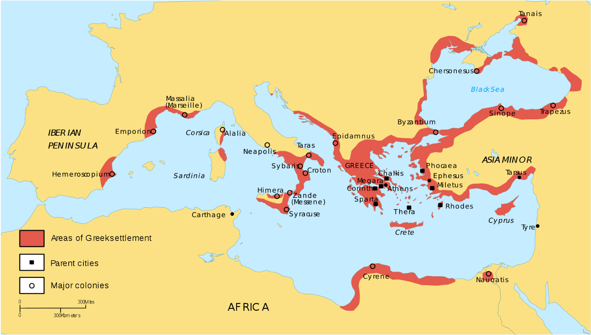
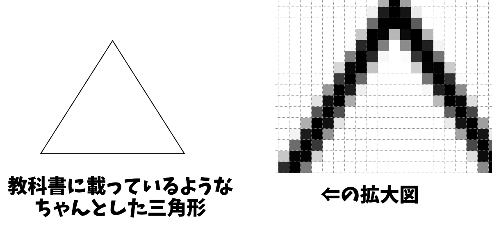
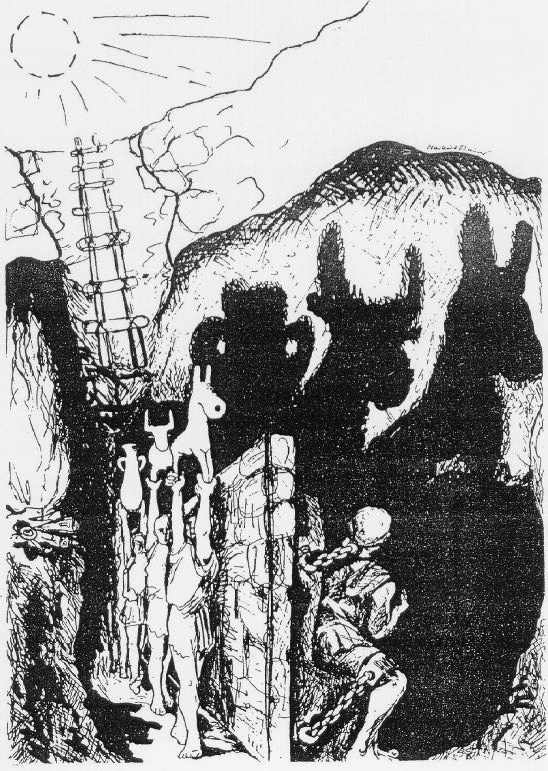
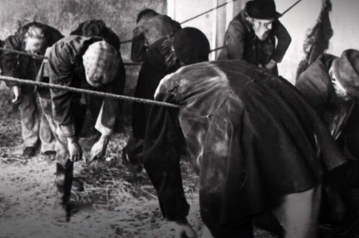

倫理分野　復習用資料集  
  
  
  
　この資料は、高校公民の政治分野をまとめたものです。  
　言ってみれば、「私家版教科書　高校公民　倫理分野」です。  
  
  
  
  
  
●凡例  
【】：極めて重要度の高いもの。何を措いても暗記するもの  
［］：高得点を目指すなら、また私大受験とかを考えているのであれば覚えておいた方がいいもの  
  
※暗記単語の基準として主に使用した書籍は以下  
倫理用語問題研究会編『山川　一問一答　倫理』（山川出版社）  
  
  
  
目次  
  
#界大合理論の発展89]()  
##################### [イギリス経験論91]()  
############################### [●フランシス・ベーコン91]()  
############################### [●イギリス経験論の発展93]()  
##################### [社会契約説96]()  
############################### [●王権神授説96]()  
############################### [●近世の戦乱98]()  
############################### [●社会契約説99]()  
########### [倫理分野第四章　西洋思想：理性の光105]()  
##################### [フランス啓蒙主義106]()  
############################### [●フランスの啓蒙思想家達の特徴107]()  
############################### [●百科全書派109]()  
############################### [●ラ・ブレード＝モンテスキュー男爵シャルル＝ルイ110]()  
############################### [●その後のフランス111]()  
##################### [ドイツ観念論112]()  
############################### [●イマヌエル・カント114]()  
############################### [●ドイツ観念論と革命の時代121]()  
############################### [●ゲオルク・ヴィルヘルム・フリードリヒ・ヘーゲル123]()  
##################### [社会学の誕生128]()  
########### [倫理分野第五章　西洋思想：資本主義の光と闇131]()  
##################### [資本主義と功利主義132]()  
############################### [●資本主義の成立133]()  
############################### [●功利主義135]()  
##################### [空想的社会主義139]()  
############################### [●資本主義というレビヤタン139]()  
############################### [●社会主義の誕生141]()  
##################### [社会主義143]()  
############################### [●二人のドイツ人143]()  
############################### [●革命論144]()  
############################### [●社会主義の定義146]()  
############################### [●史的唯物論147]()  
########### [倫理分野第六章　西洋思想：悪魔の遺産148]()  
##################### [“レス・エンファント・テリブレス恐るべき子供達”149]()  
############################### [●ソ連の誕生149]()  
############################### [●ソ連という悪魔151]()  
############################### [●共産主義という悪夢153]()  
##################### [社会民主主義156]()  
############################### [●ドイツの社会民主主義157]()  
############################### [●イギリスの社会民主主義158]()  
##################### [福祉国家の思想160]()  
############################### [●福祉国家160]()  
############################### [●ジョン・ボードリー・ロールズ162]()  
############################### [●アマルティア・セン164]()  
############################### [●雑談～ポスト福祉国家の時代166]()  
########### [倫理分野第七章　西洋思想：神なき時代168]()  
##################### [実用主義169]()  
############################### [●概説169]()  
############################### [●プラグマティズムの発展171]()  
############################### [●そして道具主義へ172]()  
##################### [前期実存主義174]()  
############################### [●神が死んだ世界で174]()  
############################### [●死に至る病―セーレン・オービエ・キルケゴール175]()  
############################### [●超人思想―フリードリヒ・ヴィルヘルム・ニーチェ180]()  
########### [倫理分野第八章　西洋思想：新しき神の世界で188]()  
##################### [新たな神話189]()  
##################### [後期実存主義192]()  
############################### [●カール・テオドール・ヤスパース192]()  
########### [倫理分野第三章　東洋思想193]()  
##################### [中華王朝（儒家以外）195]()  
############################### [●諸子百家の概要195]()  
############################### [●老荘思想197]()  
##################### [儒の思想（含墨家）201]()  
############################### [●孔子201]()  
############################### [●墨子204]()  
############################### [●孟子、荀子206]()  
############################### [●中近世の儒教210]()  
****  
  
  
  
  
# 倫理分野第一章　青年期の課題  
  
　~~倫理分野のつまんないところ~~  
　倫理分野では、大学で言えば哲学とか倫理学、及び心理学と言われるような分野を主に扱う。ところで、高校の公民を学ぶのは普通、十五歳から十八歳の、いわゆる青年と呼ばれる時期である。そこで、学習者の役に立つように…と、先に挙げたような学問の中から「青年期ってどんなもんなんですかね」「青年期ってどんな事が起こるんですかね」というような話を抽出したものが、この第一章となる。  
　勿論、全く同じ人間というのは一人として存在しない。故に百人いれば百通りの青年期がある。しかし皆同じホモ・サピエンス・サピエンスである以上、青年期にはある程度の類型が見出されるのも当然である。故に、本章の知識が役立つ事もあるだろう。本人の人生だけでなく、年下の友人との付き合いや子育ての際に役立つ可能性も、無いとは言えない。  
  
## 人間とは  
  
・これから、青年期の話をする  
・その青年期は、勿論、人間の青年期である  
⇒「じゃあそもそも、その人間ってどんな存在なの？」「人間の心理ってどうなってんの？」という話  
  
  
### ●人間の本質  
  
|                            |                                              |  
|----------------------------|----------------------------------------------|  
|考えた人                    |概念                                          |  
|【アリストテレス】          |【ポリス的動物】                              |  
|カール・フォン・【リンネ】  |【ホモ・サピエンス（叡智人、英知人）】        |  
|アンリ・ルイ・【ベルクソン】|【ホモ・ファーベル（工作人）】                |  
|ヨハン・【ホイジンガ】      |【ホモ・ルーデンス（遊戯人）】                |  
|ミルチャ・エリアーデ        |［ホモ・レリギオースス（宗教人）］            |  
|エルンスト・カッシーラー    |［ホモ・シンボリクス(アニマル・シンボリクム)］|  
  
  
・当然と言えば当然だが、「人間とは何か？」というのは古代以来、学問の題材の一つである  
・「人間の本質とは何か？」「人間と動物を分けるものは何か？」と色々考えられてきた  
  
・古代ギリシア哲学の巨人【アリストテレス】は、人間を【ポリス的動物】と評した  
・ポリスとは、古代ギリシア世界に多数あった、都市国家の事である  
⇒即ち、人間はポリス（＝都市国家）のような社会を作る動物である。言い換えれば、人間は社会的な動物である、と述べた。実際、人が複数いるところには必ずと言っていいほど、何かしらの形の社会が生まれる  
  
・十八世紀に生きた“分類学の父”カール・フォン・【リンネ】は、人を【ホモ・サピエンス】と呼んだ  
※彼は、現代まで続く植物の分類を創始したスウェーデン王国の学者である。今でも植物を「●●科●●属●●種」みたいに分類するが、当時知られていたあらゆる植物に対し、初めてこの分類を行ったのがリンネ。小中高の理科で学ぶ植物の分類は、いわばこの人の成果の延長にある  
・彼の言うホモ・サピエンスは“賢い人”、つまり叡智人を意味する  
⇒即ち、人間とは知性を持つ者であり、この点で他の動物と異なる。言い換えれば、世界の真理を明らかにする理性こそが、人間の本質である…という考え方  
  
・近代哲学者のアンリ・ルイ・【ベルクソン】は、人を【ホモ・ファーベル】と呼んだ  
・彼の言うホモ・ファーベルは“道具を作る人”、つまり“工作人”を意味する  
⇒即ち、人間の本質とは「物を作るような創造活動」であるとした。また、ホモ・サピエンス的な知性と理性を重視した在り方というのは、その創造活動を内省、反省する中で出てくるものである、としている  
※実際、人間は道具を作り、使うほぼ唯一の動物である。少なくとも、機械を作り車を走らせ飛行機を飛ばし、という次元で道具を作り、使うのは人間だけと言える  
  
  
・歴史学の大家ヨハン・【ホイジンガ】は、人を【ホモ・ルーデンス】と呼んだ  
・彼の言うホモ・ルーデンスは“遊ぶ人”、つまり“遊戯人”を意味する  
⇒勿論、遊ぶという意味では他の動物も遊ぶ。例えばイルカは他の動物を嬲り殺しにして遊ぶし、チンパンジーは他の動物をレイプして遊ぶ。しかし、“遊ぶ”という行為を文化の次元へ昇華させるのは、人間だけである。即ち、遊ぶ事こそが人間の本質である、という考え方  
※ぶっちゃけ、大学の教授の一番の仕事は“研究”という名の“遊び”である。大学教授が一番しなければならない仕事は勿論研究な訳だが、彼らは基本、自分の好きな事を研究している。だから言ってみれば、遊びである。しかしその遊びを真摯にやる事によって、学問が発展し、ひいては社会が発展する  
例１：歴史学者は、基本、古文書を読むのが趣味である。彼らは古文書を読むという趣味を仕事にしている。そのお陰で、我々は過去に何があったかが分かり、また過去の成功や失敗から学ぶ事もできる  
例２：蓮の葉は、雨に濡れない。雨粒が当たっても、全て水滴になって滑り落ちてしまう。ある植物学者が「不思議だなー」と思って調べた結果、蓮の葉の表面の構造が原因だと分かった。そして現代では、その蓮の葉の構造を真似して、テフロン加工のフライパンや防水スプレーが作られている。趣味で調べただけの、一見役に立たない知識が、思わぬところで役に立ったという形  
  
・宗教学の大家ミルチャ・エリアーデは、人を［ホモ・レリギオースス］と呼んだ  
・彼の言うホモ・レリギオーススは“神を信仰する人間”、即ち“宗教人”を意味する  
⇒確かに、神という（恐らくは空想上の）存在を作り出し、信仰するのは人間ぐらいなものである。「●●人の信仰を集める神」というのはいくらでも思いつくが、「牛に信仰されている神」とか「犬に信仰されている神」となるとちょっと思いつかない。即ち、信仰こそが人間の本質である、という考え方  
  
・近代哲学者のエルンスト・カッシーラーは、人を［ホモ・シンボリクス］と呼んだ  
※［アニマル・シンボリクム］とも  
・彼の言うホモ・シンボリクスは“象徴を扱う人”を意味する  
⇒確かに、象徴というものを扱うのは人間だけである。例えば信号機の赤と青は、それぞれ「止まれ」「進め」の象徴である。それこそ文字なんかも、象徴の一種である。そういう象徴を使う動物はと言うと、ちょっと思いつかない。小便でマーキング、とかならやるが、象徴は使わない。そういう、象徴を扱う者こそ人間である、という考え方  
  
  
・以上見てきたような人間の本質は、どれもこれも一定の説得力を持つ  
⇒人の形をしたチンパンジーにならないように、時には人間の本質とは何かを考察してみるのもいいでしょう  
  
### ●人間の心理  
#### 〇欲求段階説  
・当然だが、人間は様々な【欲求】を持っている  
⇒寝たいとか、遊びたいとか、食べたいとか  
・心理学で生まれた、欲求についての有名な学説が【マズロー】の欲求段階説である  
  
・この学説をざっくり言ってしまえば、以下のようになる  
・人は、様々な欲求を持っているが、その類型というのがある程度決まっている  
・即ち、人は最初に、睡眠欲や食欲のような欲を求める  
・上記の欲求が満足されると、今度は身の安全を求めるようになる  
・安全の欲求が満たされると、今度は所属と愛の欲求が発生する  
※誰かに仲間と認められたいとか、誰かに愛されたい…という欲求  
・所属と愛の欲求にも満足すると、今度は承認欲求が出てくる  
※自らが価値ある存在だと他者に認められたい、という欲求  
・承認欲求も満たされると、最後に【自己実現】という欲求が出現する  
※「あるべき自分」「なりたい自分」になろうと積極的に努力したい、という欲求  
  
⇒要するに、「人は最初、原始的で【生理的】な欲求に支配される。そういう欲求が満たされると、より高尚な、【精神的】な欲求が現れる。最後には、「あるべき自分」「なりたい自分」になろうと積極的に努力する、洗練された人間になる」というようなもの  
※生理的な欲求を［一次的欲求］と呼ぶ事もある  
※精神的な、高尚な欲求を［二次的欲求］とか［社会的欲求］と呼ぶ事もある  
※また、マズローの欲求段階説に於いて、自己実現以外の欲求を［欠乏欲求］と呼ぶ事もある。自己実現という精神的で高尚な欲求と違って、安全とか所属と愛というようなのは生理的で低劣なのだ  
  
  
#### 〇欲求不満  
・人間は、基本的には自分の欲求を満足させながら、周囲の状況に［適応］していくものである  
・一方で、人間の欲求とは、全て満たされるとは限らない  
・欲求が満たされなければ当然、【欲求不満（フラストレーション）】が発生する  
  
・例えば、複数の並立し得ない要求が同時に発生してしまう場合がある  
⇒これを【葛藤（コンフリクト）】と呼ぶ  
  
・葛藤は、大きく三つに分かれる  
１：【接近-接近型】  
⇒Aをしたい、けどBもしたい（漫画を読みたいし同時にゲームもしたい）  
２：【接近-回避型】  
⇒Aをしたい、けどBはしたくない（ゲームしたい、でも明日の試験で赤点取りたくない）  
３：【回避-回避型】  
⇒AはしたくないしBもしたくない（勉強したくないし、試験で赤点も取りたくない）  
  
・こういった欲求不満に遭遇した場合、解決する方法は三種類あると考えられる  
１：［合理的反応］  
⇒言葉通り、合理的に解決する  
例：勉強したくないし、試験で赤点取りたくない⇒赤点取りたくないなら勉強するしかないよね⇒勉強しよ  
２：［近道反応］  
⇒衝動的、短絡的に解決しようとする  
例：勉強したくないし、試験で赤点取りたくない⇒よし、カンニングしよう  
３：【防衛機制】  
⇒無意識に解決しようとする。これから詳しく解説する  
  
#### 〇防衛機制  
・オーストリア帝国生まれ、二重帝国育ちの心理学の大家がジークムント・【フロイト】である  
・このフロイトはその後の心理学に大きな影響を与えた  
・特に大きな影響として、【無意識】を大きく取り上げた、というものがある  
  
・現代日本人は、無意識という言葉を当たり前のように使っている  
例：「無意識にやってた」とか「そいつ嫌いだからか、無意識に避けてた」とか  
・しかしこの無意識、西洋思想に於いてはほぼ無視されてきた  
⇒「私がある行動を執ったとして、これは、「意識を持つ私」が、言ってみれば「意識的に」行ったものである」という風な考え方が主流だった。「やった時は自分で決断したと思ってたけど、今思えば、無意識の内にやりたいと思ってたんだなぁ」みたいな発想はほぼ、なかった  
  
・フロイトは、「人間は無意識によって突き動かされる」という風に考えた人物であった  
・これは、西洋思想に於いて一つの転換点でもあった  
・彼は無意識や、その表出と考えられる夢の分析によって、精神分析学の祖となった人物でもある  
※今となっては、消滅しつつある学問ではある。薬が発達してしまったので、精神医学（精神科とか心療内科とか）でもほぼ使われていない。ただ、一昔前はきちんとした学問として存在していた。例えばクトゥルフ神話TRPGは一昔前を題材にしているので、精神分析が大きな役割を持っている  
  
・フロイトが考えた防衛機制をざっくり言うと、以下のようになる  
  
・人間の意識には、意識できない領域がある  
・意識できない領域、つまり無意識には、様々な欲望、衝動が渦巻いている  
⇒遊びたいとか、難しいことはしたくないとか、気持ちいい事がしたいとか  
・この無意識に渦巻く欲望が、人間の自我に干渉してくる  
  
・とは言え、無意識の欲望に従ってばかりいると、社会生活が送れない  
・と言うか、まず幼児期の教育の段階で、欲望を抑えつけるように教育される  
・なので、人は無意識の欲望を、自我で抑えつけるようになる  
・この「無意識の欲望を抑えつける」というのは、繰り返す内に、無意識に行えるようになる  
・つまり、「無意識の欲望を無意識に制御する」という事ができるようになる  
  
・これが、フロイトの考えた防衛機制のざっくりとした説明である  
  
・フロイトが最初に考えた防衛機制は【抑圧】だが、その後、様々な防衛機制が提唱された  
・ざっくりと表にまとめて見てみよう  
  
|            |                                                                                                                                                                                                                                                                              |  
|------------|------------------------------------------------------------------------------------------------------------------------------------------------------------------------------------------------------------------------------------------------------------------------------|  
|防衛機制    |説明                                                                                                                                                                                                                                                                          |  
|【抑圧】    |不安や苦痛を生み出すような記憶や欲求を、無意識に排除する例：嫌な思いをさせられた相手との接触を、無意識の内に避けるようになる                                                                                                                                                  |  
|【合理化】  |（負け惜しみで）それらしい理由をつけて、欲求不満を正当化する例：試験で赤点を取って「元々そのつもりだった。あんなクソ教師の試験なんか赤点でいい」                                                                                                                              |  
|【同一視】  |欲求を満足させている人と自分を同一視して、欲求不満を解決した気分になる例：運動部でレギュラーになって大会で活躍したい、でもベンチにすら入れなかった、という高校生がいるとする。その高校生が、自分のチームのレギュラーを、自己と同一視する次元で熱烈に応援し、欲求不満を解消する|  
|【投射】    |自らの欲求不満の責任を他者に投射、言い換えれば責任転嫁する例：試験で赤点を取って「あのクソ教師の授業が悪いんだ。俺は悪くねぇ」                                                                                                                                                |  
|【反動形成】|欲求をなかなか満たせない不満を、実際の欲求とは逆の行為、態度によって発散する例：小学生男子にありがちな、「好きな子に意地悪する」例のアレ                                                                                                                                      |  
|【逃避】    |目前にある困難を解決できない不満を、その困難から逃げる事で発散する例：明日は試験。試験勉強しなきゃ。でもその前に部屋の掃除をしよう（以下勉強せず掃除し続ける）                                                                                                                |  
|【退行】    |いわゆる一つの幼児退行みたいな奴（幼児まで行かない場合もある）                                                                                                                                                                                                                |  
|【代償】    |満足できないある欲求を、別の欲求に置き換えて解決する例：勉強ができなくて試験では点が取れない（「試験で点を取る」という欲求を満足させられない）。そこで、運動部に所属してスポーツで活躍して誤魔化す                                                                            |  
|【昇華】    |満たされない本能的（原始的、生理的）欲求を、社会的価値の高い欲求置き換える例：「喧嘩で誰かをぶちのめしたい」という欲求を、「ボクシングやラグビーで活躍する」という欲求に置き換える                                                                                            |  
  
※現実には、防衛機制一つだけが働くとは限らない。前掲表で言うと合理化と投射の例なんかは、同時に発生してもおかしくない内容である  
※倫理使って受験する人は「それぞれの防衛機制を、例を挙げて説明しろ」と言われたらできるようにしておくと吉でしょう  
  
  
#### 〇ところで  
・倫理分野のあらゆる話について言っておかなければならない事がある  
・それは、「紹介された考え方が正しいと思う必要はない」という事  
※ぶっちゃけ倫理に限らず社会科は全部そう。何なら社会科に限らず大抵の教科に言える事でもある。ただ、特に倫理では強調しておいた方がいいのでここで改めて言っておく  
  
・今後も、倫理分野では様々な考え方を紹介していく  
・しかしそれらの考え方、思想が「正しい」と思う必要はない  
・「へー、そんな考え方もあるんだな」程度に思っておけばいい  
・何なら「何言ってんだこいつ、お馬鹿か？」と思っても構わない  
  
・例えば、先に紹介した欲求段階説は、心理学そのものよりも、心理学以外で有名な学説である  
・と言うのは、いかにも尤もらしいし「好ましい」というので、教育学や経営学で人気なのだ  
⇒教育者からしてみれば、「人は皆、最後には自己実現を目指す洗練された人間になるんだよ」なんていうのはとても都合がいい。また経営者（会社の社長とかそういう金持ち）からしてみても、都合がいい。労働者（庶民、従業員）が「仕事を通して自己実現しよう」なんて風に考えてくれれば、経営者が何もしなくても身を粉にして働く、都合のいい社畜の出来上がりである  
  
・じゃあ心理学の世界ではどうなのさと言うと、少なくとも今は、真面目に相手されていない  
・言い方を変えれば、全方位から批判されている  
・例えば、「大学生の中でも最も健康な1%だけを研究してできた理論ってマジ？」  
・例えば、「この理論、欧米的な社会でしか適用できないんですけど？」  
・例えば、「地域とか文化によって、重視される欲求って全然違いますが？」  
・…まぁ、こんな感じ  
・また、フロイトの理論も、現代心理学の第一線では全く通用しない  
※防衛機制という理論は今でも研究され続けているが、フロイトの理論一般はまるで通用しない  
  
・ただ、マズローにしろフロイトにしろ、「じゃあ紹介しない方がいいのか？」というと話は別である  
・それこそマズローの理論は、心理学の外では、今でも第一線で使われている  
⇒例えば、「承認欲求」というよく見る言葉に絡めてビジネス本で使われているのをよく見かける。全く何も知らない状態でそういう思想を読むより、事前知識を持っておいた方がいい  
・フロイトにしても、心理学はフロイトの理論に対する批判によって発展してきた面は大きい  
⇒現代の心理学全部を見ると凄い時間がかかってしまう。ならフロイトという心理学の発展の元となった人について、教養としてちょっとだけでも知っておく、というのはアリだろう  
  
・こうして見ると、倫理分野では特に、紹介された思想を「正しい」と思う必要はないという話になる  
・どちらかと言うと、教養として「そういう考え方もあるんだ」と知る事が大事  
・その上で、自分で調べてみたり、更には考察したりする事もできれば一番である  
※最初で言ったように、社会科なら全部そうだし、大抵の教科もそう。何なら本だって新聞だってtwitterだって、「正しい」と思う必要はない。が、倫理分野は思想を扱う分特に…という事で強調しました  
  
## 青年期とは  
  
・人間は誰であっても、最初から大人ではない  
・誰しも最初は赤ちゃんで、続いて幼稚園生のような児童期へと至る  
・その後、過渡期を経て成人期へ至る  
・この、言ってしまえば「子供から大人への過渡期」が【青年期】であると言える  
※具体的に何歳から何歳まで、というのは人によって変わる。一応、一般的には十歳から二十二歳ぐらいを指して言う  
  
・青年期は、最早純然たる子供ではない  
⇒例えば児童期までの子供は、基本的に男も女も声が高い。また普通、生殖もできない。しかし青年期に入ると、【第二次性徴】によって男子の声は低くなり、男女共に生殖可能になる。まるで、大人のように  
・とは言え、完全に大人、という訳でもない  
⇒大人とは何か、という定義の話になってしまうのであれだが…例えば、一般に、大人は仕事をして生計を立てる事が期待される。青年期の人間は、自らの仕事で生計を立てる事はあまり期待されない。学校に行って学を身に付けるとかそういう事が期待され、仕事をしているとしても修行期間のような見方をされる  
  
・最初に言ったように、青年期は過渡期な訳である  
・過渡期であるが故に、青年期の人間は、子供という「常に庇護されるべき対象」とは見做されない  
・一方で、大人という「自立した存在」とも、なかなか見做されない  
⇒ドイツ帝国生まれの心理学者クルト・【レヴィン】は、このような過渡期にある青年を、【マージナル・マン（境界人、周辺人）】と呼んだ  
  
・レヴィンはまた、成年は過渡期であるが故に、心理的に不安定になりやすいとも指摘している  
※例えば、「あなたはもう子供じゃないけど、一人前の大人としても扱いません」と言われたら「じゃあ何なんだよ。どっちかにしろ」となるのは当然の話である。その時々で「もう子供じゃないから」と言われて責任を求められ、「まだ大人じゃないから」と権限を制限されていれば、メンタルが鋼鉄でできてない限り多少なりともおかしくなる  
  
・勿論、青年期の人間が心理的に不安定になりやすいのは、周囲の環境だけが要因ではない  
・この時期は、いわゆる【アイデンティティ（自己同一性）】の確立が求められる  
⇒「アイデンティティの確立」は何か、というのをざっくり言ってしまえば、「『自分は何者か』『自分の目指す道は何か』『自分の人生の目的は何か』『自分の存在意義は何か』というような問いに対して答えられる状態」、と言えるだろう  
  
  
・これが子供であれば、「××さんちの長男」とかそういうのでよい  
・逆に大人であれば、「△△建設の職人」とか「◇◇大学の教授」といった感じで、所属を使う手がある  
・しかし青年は、こういう手が使えない  
・最早子供ではない以上、「××さんちの長男」的なのはもう使えない  
⇒本人自身も、身体が成熟してきているというのもあり、この手のものはあまり望まない  
・一方で、青年は所属を使う手も使えない  
⇒基本的に学生であり、数年で卒業すると分かっている以上、あまり有効ではない。既に仕事をしている場合でも、修行期間的な見方をされていると、「半人前なのに？」みたいな目をされる  
※子供にも大人にも属さないとされる、境界人的な性格がここで効いてきてしまう。要は、青年は頼りにできる集団に所属できないのである  
  
・大人でも所属を使って誤魔化す場合があり、ちゃんとはできていない事も多いアイデンティティの確立  
※そうやって誤魔化してるから、仕事人間が退職してから急速にボケた、みたいな話が出てくるのである  
・それを、所属する集団なしでやれと言う訳だから、それは心理的に不安定となって当然である  
  
・こういった青年期の特質を表す言葉は、色々ある  
  
・例えば、青年期は［自我意識］が発達する、などと言われる事がよくある  
⇒端的に言えば、「俺は俺だ」という意識をこう言う  
・この自我意識の発達を、【自我の目覚め】と呼ぶ場合もある  
⇒「俺は俺だ」という意識の発達により、自らの性格や容姿を気にするようになったり、自分なりの振る舞い方、生き方を確立しようとしたりする  
  
・他にも、世界大戦期の心理学者リタ・ホリングワースは【心理的離乳】を提唱した  
・即ち、赤ちゃんは物理的に離乳して児童期へ至り、いわゆる「子供」となる  
・同様に、子供は心理的に離乳（精神的に親離れ）して、精神的に自立する  
・この心理的離乳が青年期に行われる、という話  
  
・こういった青年期を表す言葉の中で特に有名なのが、【第二の誕生】である  
・フランス革命の直前まで生きた哲学者、ジャン・ジャック・【ルソー】の言葉  
・この言葉を理解するには、彼の書いた教育本【エミール】を見るのが早い  
  
  われわれは二度生まれる。一度目は生存するために、二度目は生きるために。一度目は人類の一員として、二度目は男性として、女性として。  
  
・一般的に、人間の誕生としては、赤ちゃんとして産まれた瞬間の話を言う  
⇒確かに、物理的にはそう考えるのが妥当。ただ、今この資料を読んでいる人が、「当時の事を覚えているか？」「当時の自分と今の自分は、精神的に同じ存在か？」と問われた場合、また別の問題な筈  
・では、「俺は俺だ」的な、自己の自我、人格が確立され、完成するのはいつの話か？  
・それこそが青年期であり、そういった自我、人格の確立こそが第二の誕生である…という話  
  
#### 〇青年期についてのあれこれ  
・今まで話してきた「青年期とは」というのは、近現代的な西欧的な社会を元にしている  
・もっと言えば、現代日本社会を元にしている  
・なので、時代や地域が変われば、話も変わる  
  
・例えば、青年期に起こる【第二次反抗期】  
・これ、同じ日本でも、今（令和一桁）と一昔前（昭和末期～平成初期）では全然違う  
・勿論、小学校高学年～中学校ぐらいで起きる反抗期、という意味では一緒なのだが…  
※ちなみに第一次は、赤ちゃんが歩けるようになった頃の、いわゆるイヤイヤ期  
  
・一昔前だと、尾崎豊の歌なんかが第二次反抗期の若者をよく描き、また彼らの共感も得ていた  
⇒盗んだバイクで走り出して（窃盗＆無免許運転）、学校に侵入して（不法侵入）、学校の窓ガラスを割って（器物損壊）、大人達は俺達を分かってくれない、みたいな歌  
※野蛮な上に甘ったれなのやばくないですか？（疑問）　やばいですね（確認）  
・これが今の第二次反抗期の若者であれば、『うっせぇわ』で済む訳である  
⇒歌詞を見れば分かるが、「俺らの事がわかんねぇんだったら黙ってろ」という趣旨になっている  
※随分平和になりましたね。日本人も成熟したなぁ…  
  
※ちなみに、これが昭和初期とかになると、少年犯罪として「将棋で負けたからナイフ取り出して刺した」とかそういうようなのが普通に出てくる。それを考えると、人ではなく物に当たってる分、一昔前の日本人も成長してるんですね  
※また、このような青年による大人への反抗を特徴とする文化を【若者文化（ユースカルチャー）】と呼ぶ事がある  
  
・同じ日本の、それも百年程度の変化であってもこれだけ違う  
・故に、もっと昔だったり、逆に地域が違ったりすれば、青年期というものも大きく変わる  
  
・例えば昔は一般に、青年期は存在しなかったと言われている  
・昔の子供は、【通過儀礼（イニシエーション）】によって、子供から大人になった…とされる  
⇒つまり、通過儀礼をやればそれで大人。子供から大人への過渡期はなし、という事  
※昔の日本でも、子供は「元服」という「通過儀礼」を済ませれば、それで大人と扱われた。当然、元服を済ませたばかりの十代の子が戦場で討死したり、責任を取って切腹したりもした  
  
・他にも、「未開社会の女性には、青年期が存在しない」と報告した学者もいる  
※二十世紀の文化人類学者［マーガレット・ミード］の事。サモア島での調査から、『サモアの思春期』という本を著してこの件を報告した。この本は彼女の死後、大論戦の種となる  
・また、昔の西欧社会にはそもそも、子供すら存在しなかったとさえ言われている  
⇒昔の西欧社会の子供とは「小さな大人」であって子供ではなかった、という論  
  
・こういった事情から、青年期というものは時代や地域によって話が変わるものだという事が分かるだろう  
  
## 青年期の人格形成  
  
### ●人格とは  
・青年期を通して、人はアイデンティティの【確立】を要求される  
・言い換えるとこれは、【人格（パーソナリティ）】の形成を要求される、という話でもある  
  
・一般に、人格は三つの要素から成るとされる  
１：［能力］（知能や技能）  
２：［気質］（感情的なもの。涙もろい等）  
３：［性格］（その人が意志を持って、こういう事をしやすい…というもの）  
  
・こういう人格や性格については、心理学や社会学といった複数の学問で研究されている  
※心理学に至っては、人格心理学という、まさにそのものみたいな名前の分野もある  
  
・例えば、先に出たフロイトの弟子カール・グスタフ・［ユング］  
・彼は、その人の心が外に向かうか内に向かうかで、人の性格を分類した  
・いわゆる、［内向性］、［外向性］という奴である  
※社交的で話好きなのが外向的の性格、内向的な性格はその逆  
※今では一般に使われているこの単語が、実際に大衆化されたのはユング以降である  
  
・エドゥアルト・［シュプランガー］も性格の分類を行った学者である  
※ドイツ帝国生まれの教育学者、哲学者であり、心理学者でもあった  
・彼の場合は、その人が追求する価値によって、性格を分類した  
⇒理論に重きを置くなら理論型、「カネこそ世の全て」みたいな人なら経済型、信仰に生きる人なら宗教型…というような感じ  
  
・アメリカ合衆国の二十世紀の社会学者デイビッド・【リースマン】もやはり、性格の分類をしている  
・彼の場合、個々人の性格と言うよりは、特定の社会集団によって規定される人の性格を論じた  
例１：近代以前の人間は、伝統志向型に分類される。権威への服従や、与えられた現実を（どんなに辛かろうとも諦めて）受け入れる、といった傾向がある  
例２：近代以前の時代から近代へと移り変わる激動の時代の人間は、内部指向型に分類される。権威者や保護者によって刷り込まれた道徳によって自己を律する傾向にある。即ち、道徳を破る事を罪と考え、その罪を犯さないようにする、という傾向がある  
例３：現代人は、【他人指向型】に分類される。他人が何をしているか、他人がどう動いているかに興味を持ち、それに合わせようとする。他人と同じでないと不安、他人と同じようにしていないと爪弾きにされないか不安、というような不安によって、こういう傾向が生まれる  
  
  
### ●理想（とされる）人格  
  
・現代日本は近現代の欧米的な文化を色濃く受け継いでいる  
・故に、近現代の欧米で理想とされたような人格が、望ましい人格とされやすい  
  
・この点でよく挙げられるのが、ゴードン・ワイアード・［オルポート］が考えたもの  
⇒二十世紀のアメリカ合衆国の心理学者。フロイトを否定する形で心理学を発展させた学者の一人  
・オルポートは六つの基準を挙げて、現代的で穏やかな人格こそ成熟した人格だと論じた  
例１：自分だけでなく他者にも関心を持つ  
例２：情緒が安定しているとか  
例３：他者を理解し尊重しまた他者と協調できる  
  
・また、以前挙げたマズローの欲求段階的な考え方も、望ましいものとされやすい  
・つまり、人は最終的に自己実現に向かうという考え方は、是とされやすい訳である  
・言ってみれば、肯定的な【生き甲斐】とか【生きる意味】を持つ者こそ是とされやすい  
  
・生き甲斐について、倫理分野でよく挙げられるのは［神谷美恵子］  
⇒大正生まれで昭和の末に死去した、日本の精神科医。ハンセン病患者の療養所で活動した  
・生きる意味について、倫理分野でよく挙げられるのはヴィクトール・【フランクル】  
⇒第二次世界大戦では強制収容所に入れられた、ユダヤ系の心理学者  
  
・特にフランクルは、その著書［『夜と霧』］と合わせて紹介される事が多い  
・彼は強制収容所にいるような一見不幸な人間でも、生きる意味があれば幸福を感じられると説いた  
⇒人は誰しも、自分の人生を意味あるものにしたいという【意味への意志】を持っている。これを健全に働かせて、生きる意味をしっかり保持していれば、どんな悲劇に直面していても人は幸せを感じられるのだ…というような感じ  
  
  
  
  
### ●人格形成  
#### 〇人格形成の困難  
・一般に教育現場や保護者は、「青年が、理想とされる人格を形成する」事を期待する  
・結局は本人次第なのだが、青年期に人格を形成した方がいいというのは間違いない  
⇒人格を形成しない、つまりアイデンティティを確立しないという事は、幼稚園生みたいなメンタルでずっと生きるという事なので…大抵の人にとってそれは嫌な筈なので、まぁやった方がよい  
  
・とは言え、人格を形成する、アイデンティティを確立する、と言っても簡単な話ではない  
・簡単じゃないから、「私は××社の企業戦士！」とか誤魔化してる成年も多いのである  
・青年期の場合、二次性徴によって身体が変化しているので余計である  
⇒ただでさえ身体が変化しているのに、自分らしい特性を身に付ける【個性化】や、社会に適応する為の知識や技能を身に付ける【社会化】までしなければいけない。そりゃあ大変に決まっている  
・しかも、所属集団という裏技の使用も禁じられている  
  
・そういった事情は置いておいても、人格の形成には、様々な変化と困難が伴う  
  
・例えば、【友情】や【愛情】といったものも大きく変化する  
⇒幼稚園とか小学校の頃（つまり完全な子供の頃）の友人と言うと、大人になってからも付き合いが続いている事は少ない。一方、青年期以降の友人は、一生の付き合いになる事もそれなりにある。これはつまり、青年期の人格形成によって、友情とか愛情というものが深まったのである  
※今思えば「あの頃の俺何考えてたんだろう」みたいな子供の頃の友人と、自分というものがある程度確立された青年期以降の友人、どっちが長続きしやすいかという話である。愛情だって、幼稚園生の頃の恋と高校生の恋では全然違う  
  
・一方で、深まったから何でもいい訳ではなく、［ヤマアラシのジレンマ］という困難も発生し得る  
⇒「あ、この人いい人じゃん。もっと仲良くしたい。もっと深く知り合いたい」と、距離感を近付けていったら、互いの嫌なところが見えてきてしまった…みたいな奴。青年期に特有のものではないが、まともな人格を得たばかりで深い友情、深い愛情の経験が少ない（言い方を変えれば他人との距離感を調節した経験が少ない）青年からしてみると、困難には違いない  
  
・また、青年期には【劣等感】も強くなりがちである  
・これは、青年期になって人格の形成が行われた結果、自他の境界が強くなって起こる  
⇒根本的に、児童期の完全な子供というのは、自他の境界が曖昧である。例えば、幼稚園や小学校低学年の教室で、一人が泣いたら次々と他の子も泣き始める…という事がよくある。これは、子供にとって自他の境界が曖昧なので、他人が悲しいと自分まで悲しくなって泣いてしまうのである。このように子供は、自分と他人の区別をつけるのが下手なので、他人が優秀で自分が負けているとなっても、劣等感を感じづらい  
⇒青年期になると人格の形成が進み、自分と他人を区別できるようになる。他人が悲しくても自分は関係ないと思えるようになる。しかし一方で、自分と他人を区別できるようになった結果、自分より優秀な他人を見た時の劣等感というものも、きちんと感じられるようになってしまう  
  
※要は、青年期に劣等感が強くなるというのは、「今までまともに感じていなかった劣等感という感情を、この歳になってはっきり認識できるようになった」という話。そして、新しい感情を投げつけられれば戸惑うのは人の理である  
#### 〇人格形成の研究  
・このように、青年期は変化の時期であり、人格の形成には困難も伴う  
・当然、このような困難を学問が研究していない訳がない  
・この手の研究で第一に挙げられるのは、やはりエリク・ホンブルガー・【エリクソン】であろう  
⇒ドイツ帝国生まれの二十世紀の心理学者。アイデンティティという概念を考えたのもこの人である。そしてこの人もまた、フロイトの影響を受けた人物である  
  
・エリクソンは、［ライフサイクル（人生周期）論］で有名である  
・彼は自らのライフサイクル論で、人間の人生を八つの発達段階に分けた  
・そしてそれぞれの段階に、解決すべき課題、即ち【発達課題】があるとした  
  
・例えば彼は、四十～六十五歳を壮年期、六十五歳以上を老年期としている  
・老年期なら、「この人生でよかったか」という質問に「よかった」と答えられるようにするのが課題  
・壮年期なら、後輩や自分の子供を含む、次世代を世話する事が課題  
⇒ここで「俺さえよけりゃあいいんだ」とやって課題をすっぽかしてると、周囲には誰もいなくなって、老年期が寂しくなるよ。そうなると「この人生でよかったか」という質問に「よかった」と答えるのは難しくなるよね…と、こういう感じ  
  
・彼は、自らの設定した発達段階に於いて、十二歳～十八歳を青年期とした  
・そしてこの青年期の発達課題こそ、【アイデンティティの確立】であるとした訳である  
  
・ちなみに発達課題という意味では、ロバート・ジェームズ・【ハヴィガースト】もよく挙げられる  
⇒二十世紀、アメリカ合衆国の教育学者  
・彼の青年期の発達課題は、結構詳しい。例えば…  
  
・同年代の男女と、より成熟した新しい関係を築くことができる  
・両親やその他の親族から精神的に自立する  
・行動の指針となる価値観や論理体系を身につけ、イデオロギーを持つ  
・社会的責任を果たすやり方を身につける  
  
・こんな（↑）感じ  
・「人格の形成」「アイデンティティの確立」といった大方針は一緒だが、より具体化されている  
  
・同じく発達課題を論じた人間として有名な人物として、ジャン・［ピアジェ］がいる  
⇒二十世紀、スイス誓約者同盟の心理学者  
・彼は児童心理学者なので、彼の設定した発達段階も児童期までである  
・ただ「子供から大人への過渡期」という意味では青年期と関係するのでここで紹介する  
  
  
・ピアジェは、子供の特徴として自己中心性を挙げる  
⇒我儘、という意味ではない。要は、「相手の立場でものを考えられない」という話。自分が楽しいと思うものは他者も楽しいと思う。かくれんぼする幼稚園児が目隠しして「隠れた！」と言ってるのは、まさに、「相手の立場でものを考えられない」自己中心性による  
  
・そして彼は、子供が成長して青年や大人に向かっていく上で大事なものとして、［脱中心化］を挙げた  
・脱中心化とはつまり、「相手の立場でものを考えられない」を脱する事である  
・「相手の立場でものを考えられる」というのが、脱子供の重要な要素であるとした訳である  
  
  
#### 〇その他人格形成あれこれ  
・ともあれ、青年期に人格を形成し、アイデンティティを確立するのは必要である  
・いわば、自己を確立する事は必要である  
  
・一方で、これが困難な仕事である事も間違いはない  
・時には、アイデンティティの【拡散（危機）】と呼ばれる困難に直面する事もある  
⇒「アイデンティティの拡散」とは要するに、アイデンティティの確立が上手くいかない状況の総称。「もう駄目だ」と思い詰めてしまうとか、本来やるべき事から逃げて全然関係ない事に没頭するとか  
※ここで実例を一つ。私の同窓で、大学で繰り返し留年し、「今年留年したら退学」となっても大学に行かなかった人がいました。じゃあ何してたかと言うと、公務員試験の勉強して、大学は退学になりましたが公務員試験に受かって地方公務員になりました。「本来やるべき事から逃げて全然関係ない事に没頭する」ですね。彼はその後しばらくして、メンタル壊して音信不通になりました  
  
・青年がこのような危機に直面するのは、分かり切っている  
・分かり切っているが故に、通常、社会は成年に対し、自らの発達課題を解決する猶予を与える  
・これがいわゆる【モラトリアム】というものである  
・現代日本で言えば、高校や大学はモラトリアムの一種と言えるだろう  
  
・前から何度も言っているが、青年はなかなかに無茶振りをされている  
・「社会集団の所属もなしに宙ぶらりんの状態で自己を確立しろ」と言われているのである  
・だから、モラトリアムも当然のものと言える  
  
・このモラトリアムは、当然だが、社会的責任を負わなくていい、いわば「ラク」な期間である  
・しかも現代日本の労働条件は地獄みたいになっており、普通はそんな地獄に飛び込みたいと思わない  
⇒この辺は経済分野でどうぞ  
  
・そうなってくると、「いつまでもモラトリアムでいたい」になるのは当然である  
・精神科医小此木啓吾は、そのような精神の人間を［モラトリアム人間］と呼んだ  
・いわゆる引きこもりや［ニート］の増加も、この文脈で捉えられる事がある  
  
# 読書案内  
  
・この後、倫理分野の第二章から古今東西の思想を取り扱う  
・その際、参考になる本をいくつか紹介しておく  
・ちなみにだが、文系の学者というのは日本語がへっっっっっっったくそな人が大変多い  
・歴史学者も酷いが、哲学者もなかなか酷いのが多い  
・その為、最初から哲学者の書いた「哲学入門」みたいなのを読むとだいたい死ぬ  
・という事で、少なくとも大学の教授とかやってないような人の本を中心に選んだ  
  
・飲茶著『史上最強の哲学入門』（河出文庫）  
・飲茶著『史上最強の哲学入門　東洋編』（河出文庫）  
⇒恐らくこの世で一番分かりやすい哲学入門。倫理の授業の時間使って皆でこれ読んで終わりでいいんじゃない？　ってなるぐらいよくできているし、分かりやすい。まずはここから入門するのをお勧めする。著者が『グラップラー刃牙』のファンで表紙に刃牙の作者の絵を使ってる程度にはファンキーな本なので、堅苦しいの抜きにして読める  
  
・出口治郎著『哲学と宗教全史』（ダイヤモンド社）  
⇒「倫理の授業の時間使って皆でこれ読んで終わりでいいんじゃない？」シリーズその２。古今東西の思想（哲学宗教問わず）を時系列に網羅している良著。この本に書いてある知識をしっかり頭に入れておけば、文学部の哲学科に進んでも困らないだろう。文章は平易だがそれでも何の知識もなく突撃すると討死しかねないので、先に『史上最強』シリーズを読んでおくと良い  
  
・ポール・ジョンション著『ソクラテス　われらが時代の人』（日経BP）  
⇒「思想史の大まかな流れについての概説書はもう読んだから、特定の哲学者にスポットを当てて詳しく解説したような本を見てみたい」という人に、最初の一冊としてお勧めしたい本。  
  
  
  
  
  
  
# 倫理分野第二章　西洋思想：源流  
  
・高校の倫理でも、思想史は古代からやる  
・何なら大学で哲学や倫理学に行っても、やっぱり古代からやる  
・「俺は近代の思想が知りてぇんだよ、何でわざわざ古代の話なんかしなきゃいけねぇんだ」  
・「俺は現代に生きてんだよ。現代の思想だけ知れば充分だろ」  
・…まぁ、当然の疑問である  
  
・実は、「現代の思想を知るのに一番早い方法は、古代から勉強する事」なのである  
・と言うのは、特に西洋思想は、積み上げ式なのである  
  
・例を挙げよう。まずAさんが、「あ」という思想を考えた  
・続いてBさんが、Aさんの思想に異を唱え、「い」という思想を提唱した  
・更にCさんが、Bさんの思想を批判し、「う」という思想を生み出した  
・今度はDさんが、Cさんの思想を批判し、「え」という思想を世に出した  
  
・実際の所、西洋思想はこれの繰り返しである  
・故に、近現代の哲学者の本を予備知識なしでいきなり読んだら、「何言ってんだこいつ」になるだろう  
⇒それは当然で、先の例でいえばDさんの書いた「え」という思想についての本を読んだとする。しかしこの「え」という思想は、そもそも「う」という思想の批判からできているので、「う」という思想が分かってないと、「え」についての本もよく分からない。じゃあ「う」という思想について勉強しようとすると、これも実は「い」という思想についての批判から出てきたものなので…と、繰り返しになる  
  
・だったら最初から順番に勉強すればいいじゃねーか、という話である  
・当然、「現代の倫理ってどんなの？」という話も、古代から勉強するのが近道  
・と言う訳で、本章では、西洋の思想を古代から現代まで見ていく事になる  
  
※ちなみに、特に近現代の哲学者の本を読んで「何言ってんだこいつ」となる理由は、もう一つ考えられる。それはずばり、「翻訳が下手糞だから」。「翻訳で読んだら何言ってるか分かんなかったけど、原著で読んだらそこまで難しい事言ってなかった」は哲学あるあるである。まぁ日本の文系学者が日本語下手糞ってのは結構あるあるなので…  
  
## 古代ギリシア  
  
古代の、ペルシア以西の地形図。  
Paradox Interactive社のEuropa Universalis IVより  
  
・人類最古の文明は、“二つの川の間”、即ちメソポタミアに始まる  
・言ってみれば、人類最初の先進国こそメソポタミアであり、その他は田舎だった  
・しかし、いつまでもメソポタミアだけが先進国だとは限らない  
  
・メソポタミアで誕生した文明は、やがて隣接地域へ伝播していった  
・例えばエジプト文明は、メソポタミア文明の影響も受けて誕生した  
・シリア、小アジア、ペルシアにも文明が伝播した  
・こうして、メソポタミアの隣接地域もまた、文明が根を張る先進国と化した  
  
・そしてついに、ギリシアへも文明が伝播する  
⇒つまりギリシアに文明が伝播した当初は、東方地域こそ先進国。ギリシアはまだまだ田舎だった、という話になる  
  
・しかしそんな田舎も、やがて力を蓄え、先進国に挑戦できるぐらい強くなっていく  
⇒当時の覇権国、アケメネス朝ペルシア帝国が攻め込んできても追い返せるようになる。ペルシア戦争である。その後、ギリシアはペロポネソス戦争に続く戦国時代に突入し、アレクサンドロス大王の登場によって一時、統一される事になる  
・そんな中、現代まで続く欧米系の西洋思想の生誕地ともなったのが、このギリシアなのである  
  
・勿論、ギリシアはメソポタミアで発祥した文明の子孫と言うべき要素もある  
・だから、現代まで続く西洋文明の源泉はメソポタミア、と見る事も可能ではある  
・それでも「西洋思想」という括りで見た場合、現代欧米文明は、古代ギリシアの直系の子孫である  
  
・近代アメリカ合衆国の哲学者ホワイトヘッドは、はっきりこう言っている  
  「欧州の哲学的伝統の一般的特徴を最も確実に言うのであれば、「プラトンへの一連の脚注で構成されている」となる」  
  ※アルフレッド・ノース・ホワイトヘッド著『過程と実在』（原題”Process and Reality”）。ちなみにこの台詞は、原文だと”The safest general characterization of the European philosophical tradition is that it consists of a series of footnotes to Plato.”  
  
・プラトンは、古代ギリシアの哲学の巨人、その一人である  
※どんな事を考えた人かは後で詳しくやります  
・西洋思想は近現代に至るも、古代ギリシアの思想をベースにしているという話である  
・換言すれば、近現代の西洋思想であっても、古代ギリシアの影響下にあるのだ  
  
・そんな偉大な思想体系がどうして古代ギリシアで生まれたのか  
・一つには、時期的なものがあるだろう。丁度この時期は、世界的に農業生産量が増えた時期だった  
・農業生産量が増えたという事はつまり、沢山農作物が取れるようになったという事である  
・農作物が沢山取れるならば、「食う為に毎日働く」必要のない人間という者が出てくる  
・要は、働かずとも下僕が食糧を生み出してくれる、一種の貴族のような者達が出てくる訳である  
  
・こういう人達は、「食う為に毎日働く」に比べれば当然、暇である  
・そして暇を持て余した人というのは、得てして小難しい事を考え始めるものなのである  
⇒例えば「この世界はどうやってできているのか？」とか  
※これは洋の東西を問わない。例えば、古代ギリシア思想が形成されるのと同時期、中華王朝でも諸子百家と呼ばれる様々な思想家が現れて、東洋思想の基本を形作った。実は中華王朝でも当時、農業生産量が増えて、「食う為に毎日働く」必要のない人間が大量に出現していたのである  
  
・そして、古代ギリシアの［ポリス］と呼ばれる都市国家は、これを是とする文化を持っていた  
・「食う為に働くなんてのは、奴隷がするもの」「高貴な市民は、暇を楽しみ、思索にふけるもの」  
・そういう、［スコレー］と呼ばれる暇を高貴とする文化が、古代ギリシアにはあったのである  
・古代ギリシアの市民達は、しばしば［アゴラ］と呼ばれる広場で議論を戦わせた  
・その中から、古代ギリシア思想が現れてくるのである  
  
### ●古代ギリシア思想の源流  
・古代ギリシア思想をざっくり分けるやり方に「ソクラテス以前」「ソクラテス以後」というのがある  
・要は、ソクラテスという哲学者の影響を受ける以前、以後で分けるというものである  
・あまりいい分け方ではないのだが、とにかく便利な分け方でもある  
・そういう訳で、本稿でも「古代ギリシア思想の源流」として、ソクラテス以前を紹介しよう  
  
  
#### 〇神話から哲学へ  
・どんな文明でもそうだが、最初の学問とは宗教であり、【神話】である  
・古代ギリシアも御多分に漏れず、最初の学問は神話だった  
⇒いわゆるギリシア神話。ギリシア人は、彼らの神話を【ミュトス】と呼んだ  
  
・ほぼあらゆる神話が最初は口伝であったように、ギリシア神話もやはり最初は口承だった  
・そんなギリシア神話も、やがて文字に起こされるようになる  
※この文字起こしされたギリシア神話も、言ってみれば、西洋文学の元ネタである。現代日本の小説やゲーム、漫画等が西洋文学から元ネタを取ってくる事があるが、その西洋文学の元ネタがギリシア神話、という訳である  
  
・神話を文字にしたと言えば、やはりトロイア戦争を描いた［ホメロス］が有名  
・ホメロスの代表作その１が［『イリアス』］  
⇒トロイア戦争に於けるギリシア側の英雄アキレウスと、トロイア側最高の名将ヘクトールとの戦いを描いた叙事詩  
・ホメロスの代表作その２が［『オデュッセイア』］  
⇒ギリシア勢がトロイアを攻め落とした後の話。「トロイの木馬」の語源ともなった木馬作戦をも考案した英雄オデュッセウスが、帰国の航海中遭難する話。オデュッセウスは数多の困難を経て、故郷へ帰国する  
  
・ギリシア神話に於ける天地創造を文字化した人物としては、［ヘシオドス］がいる  
⇒ギリシア神話の最高神ゼウスが、元はクロノスという神の子供で、父殺しを成し遂げて…みたいな話は、彼の書いた『神統記』に記されている  
  
・最初の頃、ギリシア人は全てを宗教（つまりギリシア神話）によって説明していた  
・例えば雷が鳴るのも、雨が降るのも、全部神がこうしたから、という感じ  
・しかしやがて、「迷信に頼るのやめませんか」というような人達が出てきた  
・「自分の五感で観察して、自分の頭で考えましょう」というような人々である  
  
・迷信に頼る事を止め、自ら観察し、考える人間の登場  
・それこそが、現代まで続く哲学、そして科学の誕生でもあった  
※昔は、学問と言えば全部哲学だった。強いて言えば、神学以外の学問が全部哲学だった。つまり、今我々が信仰していると言ってもいいぐらい頼りにしている科学も、元はと言えば哲学だったのである  
  
#### 〇最初の哲学者  
・迷信に頼る事を止め、自ら観察し、考える人間。哲学者  
・その最初の一人は、西洋哲学に於いては一般に、【タレス】であるとされる  
⇒ギリシア人の植民市が多数あったイオニア地方にあるギリシア人都市、［ミレトス］の出身  
  
タレスも活動したアルカイック期（ポリス社会が勃興してからペルシア戦争まで）の、古代ギリシア人の活動範囲。赤く塗られているのが、ギリシア人が何らかの範囲で支配していた領域。小アジアの南西部にある”Miletus”がミレトス  
Dipa1965, CC BY-SA 4.0 &lt;https://creativecommons.org/licenses/by-sa/4.0&gt;, via Wikimedia Commons  
https://upload.wikimedia.org/wikipedia/commons/2/2b/Greek_Colonization_Archaic_Period.sv  
  
・タレスは、「この世界はどうやってできているのか」を考えた  
・その際、神話に頼る事はなかった  
⇒もし神話に頼った場合、それこそ『神統記』にあるように、「最初にという神がいた。そこにガイアという大地の神が誕生し…」みたいになってしまう  
  
・タレスは目前にある世界を観察し、そこから真理を探究しようとした  
⇒こういう態度を【テオーリア（観想）】と言う  
・そしてついに彼は、「万物の根源（【アルケー】）は【水】」であると結論した  
  
・この瞬間、哲学、少なくとも西洋哲学はこの世界に産声をあげた  
⇒信仰ではなく、合理的に、いわば理性によって真理を探究する。少なくとも西洋哲学という枠で見ると、それは、彼のアルケーを求める知的活動こそが、初であった  
  
・いわばタレスは、最初の西洋哲学者であり、西洋哲学の祖なのである  
#### 〇“泣く哲学者”  
・タレスは神話から離れ、「目前にある世界を観察し、そこから真理を探究」した  
・非常に現代の科学っぽい、大きな一歩である  
  
・とは言え、時代は古代。望遠鏡も顕微鏡もない時代である  
・観察には自ずと限界があり、観察から得られる知見にもやはり、限界がある  
・その為、タレスを含む［ミレトス学派］の考察は、結果だけ見ればぱっとしない  
⇒タレスに触発されたのか、ミレトスには哲学者が何人か現れた。有名なところでは二人。そこで、この時期に現れたミレトスの哲学者三人（タレスを含めるから三人）を、総称してミレトス学派と呼ぶ  
  
・［アナクシマンドロス］は、万物の根源（アルケー）を「無限定なるもの」だとした  
・［アナクシメネス］は、アルケーを「空気」だとした  
⇒タレスの「アルケーは水」というのを合わせて見ても、やはり結果だけ見るとぱっとしない。何と言うか、「何となくの思い付きで言ってないか？」感が否めない  
  
・次に大きな一歩を踏み出したのは、“泣く哲学者”【ヘラクレイトス】であった  
⇒タレスが死んだ直後ぐらいに産まれた哲学者。ミレトスの北にあるエフェソスの出身  
  
・彼は万物の根源（アルケー）を【火】としているが、ここに目新しさはない  
・ヘラクレイトスが成した最大の業績は、よく引用される言葉に象徴されている  
  
  「」(Panta rhei)  
  
・彼が考えたのは、「永遠不変の存在はなんてものは、存在しない」という事である  
・この辺の説明は『史上最強の哲学入門』があまりにも分かりやすいので引用する  
  
  　たとえば、硬い石でも叩けば割れるし、仮に割れなくてもその石同士をこすり合わせれば、割れないまでも表面が少しは削れるだろう。少しでも削れるということは、まったく永遠不変であるとはいえない。永遠という長い時間を想定すれば、その石もいつかは壊れて砂になり消え去ってしまうことは自明の理である。  
  　でも、だとすると、「細かい砂」になった石は、その後どうなるのだろうか？  
  　それはやっぱり砂なのだから、大地（土）の一部になるに違いない。だが、よく考えてみると、その大地から木がはえてきてリンゴがなるのである。ということは、リンゴは、あの砕いた石が変化したものであるということになる。  
  （中略）  
  　そして、彼は直観する。石は土になり、土は木になり、木はリンゴになる。それらの変化ははたしてデタラメに起こるのであろうか？　いや違う。そこには、万物共通の何らかのルールがあるはずだ。そう彼は考えたのだ。  
  　彼は、そのルールのことを**ロゴス**（法則）と名づけた。  
    
  （飲茶著『史上最強の哲学入門』河出文庫）  
  
・現代の科学者は、単に「目前にある世界を観察」するだけではない  
・「何かしらの法則に従って、この世はこうなってる筈だ」と考え、法則を探し出そうとする  
・そう、ここに、現代の科学に通じる態度が誕生したのである  
・即ち、「目前にある世界を観察し、法則を探し、真理を探究する」という態度である  
  
・こうして、現代科学の主要な要素が誕生した  
・即ち、探究する真理（この時点では万物の根源（【アルケー】が対象）  
・即ち、「目前にある世界を観察」する態度（古代ギリシアで言う【テオーリア（観想）】）  
・即ち、世界を支配する法則（古代ギリシアで言う【ロゴス】）  
※ロゴスは、様々な訳がある。言葉、理性、理法、論理等  
  
  
#### 〇“笑う哲学者”  
・科学の基礎を築いたヘラクレイトスだが、やり残した仕事が無い訳ではない  
・それは、アルケーの探求である  
⇒ぶっちゃけ、「この人は、アルケーは××だと考えました」という形で見ると、タレスもヘラクレイトスも大した違いはない。現代人から見れば、水だろうが火だろうが「何言ってんの？」である  
  
・この仕事を完成させたのは、“笑う哲学者”【デモクリトス】である  
⇒ペルシア戦争期に産まれ、ペロポネソス戦争期を生きた哲学者。Assasin’s Creed Odysseyにもいる  
  
・彼は、アルケーを［原子］だと考えた  
・そう、近現代物理学の基本となる、あの原子である  
⇒理科でやったように、この世界に存在するあらゆるものは、原子から成り立っている。その原子の集まり方によって、水分子とか、酸素分子とか、鉄分子とか、様々な分子が作られる。そしてそれぞれの分子がまた集まって、人間の身体から土、空気、海…あらゆるモノが作られている、というもの  
  
・デモクリトスは、この原子論を、古代に…それも西暦が始まる前に考え出した人間である  
・古代ギリシアは、顕微鏡も望遠鏡も無い時代に、近現代物理学の基本へ到達していたのである  
※一応、現代物理学の原子とデモクリトスの言う原子はちょっと違うのだが、大枠では同じと言っていい  
  
・デモクリトスは、人間もまた多数の原子の集合体に過ぎないと言っていた人物である  
⇒「人間死んだらどうなるかって？　人間を構成していた原子がまた別の何かを構成する原子になるだけであって、死後の世界なんか考えたって仕方ない。だから、人生を目一杯、笑って楽しく過ごそう」…これが“笑う哲学者”デモクリトスである  
  
・こうして、ソクラテス以前の哲学は、一つの到達点を見た  
・それはまた、【自然哲学】の到達点でもあった  
⇒自然を、つまり世界を、合理的に考察し説明しようとする哲学の事。現在一般に言われる「科学」に極めて近いものと言える  
  
  
#### 〇その他のソクラテス以前の哲学者  
・今まで、タレス、ヘラクレイトス、デモクリトスという三人の巨人を挙げた  
・挙げたが、勿論、他にもソクラテス以前の哲学者はいる  
・そこで、今まで紹介しなかったソクラテス以前の哲学者の有名どころを紹介していく  
  
・先の三人に並ぶぐらいの有名人が、“サモスの賢人”【ピタゴラス】である  
⇒その名の通り、サモス島出身。サモス島はミレトスの近くにある島で、ピタゴラス自身もタレスと同時代の人間である。ピュタゴラスとも呼ばれる  
  
・ピタゴラスは、数学者でもあり哲学者でもあり、また宗教家でもある  
・↑のように言うと分かりづらいが、要は「【数】を信仰する数学者」だと考えるとよい  
・彼はアルケーを【数】であるとし、数を信仰する教団を立ち上げている  
⇒彼は数学者であり、様々なものを計算した。それこそ後の天文学のような星の軌道もそうだし、綺麗な音の組み合わせというのも、数字で計算した。そうやって色々と計算する中で、「この世の全ては数字で計算できる」「万物の根源は数字だ」となり、数字を崇めた  
※いわゆるピタゴラスの定理も、ピタゴラス教団が発見したものである  
  
・実を言えば、ヘラクレイトスはピタゴラスの影響を受けている  
・ロゴスという発想の背景に、ピタゴラスの思想がある事は否定し得ない  
  
・ヘラクレイトスに影響を与えたのがピタゴラスなら、デモクリトスに影響を与えた哲学者もいる  
・それが［エレア派］の始祖［パルメニデス］である  
  
・彼は、ヘラクレイトスの「万物は流転する」のような考え方に異を唱えた  
⇒「存在するものというのは、変化しない」「ある石を細かく砕いていけば確かに目には見えなくなるし、消滅したように見える」「だがそれは人間の感覚によって捉えられなくなっただけで、石という存在が消滅という変化を起こした訳ではないのだ」という感じ  
  
・確かにこれも一理ある  
・一方で、ヘラクレイトスの流転論のような、石⇒砂⇒土⇒木⇒果実のような変化も認められる  
・この両者を吟味して、原子論という到達点へ至ったのが、デモクリトスなのである  
  
・ソクラテス以前の哲学者として最後に、［エンペドクレス］を挙げておこう  
・彼は、後に中世で真理とされ、錬金術や西洋魔術の基本となった四大元素を初めて提唱している  
⇒万物の根源（アルケー）は、［「火」「空気」「水」「土」］の四つである。この四つがくっついたり離れたりする事で、様々なモノが生み出される…というもの  
※現代のゲームでよく採用される「地、火、風、水」みたいな属性というシステムも、元を辿ればエンペドクレスの四大元素へ辿り着く  
  
  
### ●ソクラテス  
#### 〇当時のアテナイとソフィスト  
・世界史でやったように、古代ギリシアの歴史は↓のように進む  
  
　ポリス社会の勃興期⇒ペルシア戦争⇒戦乱の時代⇒アレクサンドロス大王の登場⇒ヘレニズム期  
  
・ギリシアではポリス社会が勃興し、先進国にも対抗できる力をつけていく  
・タレスが生きていたような時代ともなると、地中海のかなりの地域に植民していたぐらいである  
⇒タレスを紹介した時載せた地図参照  
  
・そして、この力を付けたギリシアに対し、当時の覇権国、アケメネス朝ペルシア帝国が攻め込んでくる  
⇒これがいわゆるペルシア戦争。マラソンの元となったマラトンの戦いや、スパルタ王レオニダスが炎門テルモピュライで玉砕した戦いも、ペルシア戦争の一幕である  
  
・このペルシア戦争に、ギリシアは勝利する  
・それは、ギリシアというかつての田舎が、覇権国に勝てるほど強くなった証でもあった  
  
・ところで古代のギリシアは、「ギリシア」という一つの国としてまとまってはいない  
・各地にある都市が、それぞれ国家として振る舞い、互いに争っていた  
※と言っても、血で血を洗う戦国時代というほど深刻に争っていた訳ではない。ペロポネソス戦争以降はそうなるが…  
  
・これがペルシア戦争以降になると、ギリシアの中心として頭角を現す国が二つあった  
・即ち、世界初の民主主義国家アテナイと、軍国主義国家スパルタである  
・この両国は、ギリシアの覇権を巡って大戦争を引き起こす  
⇒いわゆるペロポネソス戦争。この戦争以降、ギリシアは戦乱の時代へ突入する。最終的にアレクサンドロス大王が出てきて、この戦乱を一旦、終わらせる訳である  
  
・次にお題とするソクラテスは、このアテナイの人間である  
・時期的には、ペルシア戦争の後半に産まれ、ペロポネソス戦争の時代を生きた人物である  
・彼の思想には、当時のギリシアとアテナイの状況が深く関わっている  
・という訳で、まずは当時のアテナイの状況から  
  
・ペルシア戦争の時点で、アテナイは民主主義国家だった  
⇒特に、ペルシア戦争中のサラミスの海戦によって、（富裕市民だけでなく）全ての市民が政治に参加するようになった  
・当然だが、民主主義国家では、演説の上手い政治家は有利である  
⇒アテナイの場合は直接民主主義を採用しているから余計である。市民が暇を持て余している（暇を持て余してこそ高貴な市民）が故に、国民全員が一堂に会して議論する直接民主主義が行われていた。故に、広場に集まった全国民の前で、最も上手い演説を披露し、また政治家同士の討議で勝てた者こそが、権力を握れたのである  
  
・そうなってくると、アテナイでは演説の上手さと討論の強さこそ立身出世の要となる  
・即ち、【弁論術】こそが極めて重要になってくるのである  
・となれば、アテナイの若者への教育の中心が弁論術となるのは、当然であった  
  
・当時、アテナイには【ソフィスト】と呼ばれる教師集団がいた  
⇒ギリシアの中心となりつつあったアテナイには知識人が続々と集まった。彼らは金銭を受け取って、若者に教育を施した。その際「徳を教える」と触れ回って仕事を得たという  
  
・このソフィストの第一世代として、代表とも言える有名人が【プロタゴラス】である  
※他にも第一世代の有名人としては［ゴルギアス］もいる  
・プロタゴラスの哲学は、【人間は万物の尺度である】と述べた相対主義で特徴づけられる  
  
・例えば、ある絵が美しいか、美しくないか。これは結局、人によって変わる  
・例えば、ある行動が善であるか、悪であるか。これもやっぱり、人によって変わる  
⇒「いや、そうとは限らんのじゃない？　それこそ、絶対悪はあり得るんじゃないの？」と思う人もいるだろうから、ここで極端な例を挙げよう。中東では今でも、「名誉殺人」という風習がある。ある女性が「未婚なのに性交渉をした（強姦による被害を含む）」「親が決めた婚姻を拒否した」「自由恋愛をした」というような場合、その女性を「一族の名誉を汚す」ものとして殺す、という風習である。多分、ほぼ十割の日本人はこれを悪と思うだろうが、勿論、名誉殺人を実行している方は、基本的には善のつもりでやっているとみてよい  
  
・よって、絶対の価値なんてものはない  
・善悪とか美醜とか、そういうのは「その人がその人の尺度で決めたもの」と言うしかない  
・それぞれの価値基準に優劣はなく、平等。「世の中は人それぞれだ」と考えるべきだ  
・…というのが、プロタゴラスの哲学の骨子である  
  
・プロタゴラスの哲学自体は、非常に穏当な、何なら現代的な考え方である  
・例えば「欧米的な価値観が正しく先進的」なんてのは、まさしく偏見である  
・欧米的な価値観、日本的な価値観、キリスト教的な価値観、仏教的な価値観…全て等しく、価値がある  
・そういう考え方こそが、現代に於いて推奨される、相対的なものの考え方である  
  
・ただ、この考え方を無制限に拡張すると、面倒な事になる  
・特に、「絶対の価値なんてものはない」という部分がまずい  
・例えば、以下のような事件を想定しよう  
  
  AさんとBさんがいるとする。ＢさんがＡさんの配偶者を殺した。そして、その復讐に、ＡさんがＢさんを殺した。  
  
・これが現代日本起きた場合、ＡもＢも、等しく殺人罪で裁かれる事になる  
・どちらも殺人罪である事に違いはなく、いわば、どちらも悪である  
※勿論、情状酌量などによって、刑期が変わるという事は考えられる。しかし、「人を殺せば悪」という、絶対の価値があるので、等しく殺人罪が適用される  
・しかし、「絶対の価値なんてものはない」とすると、話は違ってくる  
⇒先にＢがＡの配偶者を殺したのだから、Ｂが悪、これは間違いない。Ａはこれに制裁を与えただけであり、悪ではない。それどころか善ですらありえる。即ち、悪いのはＢなのだから、それに比べればＡは相対的に善である。…こんな風になってしまう  
  
・まぁそれでも、これぐらいならまだましだろう  
・もっと悪い場合を考えてみよう  
・先の例で、復讐として、ＡがＢの一家全員を皆殺しにしたとしよう  
⇒仮にそうであっても、「いや、Ｂが先に手を出したのだから、Ｂという巨悪を根絶やしにする必要があるのだ」「Ｂが配偶者を殺した時の残虐さを考えれば、これぐらいでようやくつりあうのだ」といった風に説明できれば、Ａを善の立場にする事ができてしまう。絶対の価値（この場合は「人を殺せば悪」）が完全に不在だと、こんな風に話がおかしな方向へ行ってしまうのである  
  
・実際におかしな方向へ行ってしまったのが、ペロポネソス戦争期のアテナイである  
・アテナイ人はソフィストに教えられた弁論術を使って［詭弁］を弄していった  
例：メロス島がアテナイとの同盟から離脱した際、アテナイはメロス島を攻め、男は全て死刑、女子供は全て奴隷にする、という過酷な懲罰を行った。これは、アテナイの広場で「メロス島の奴らは悪い事をしたのだからこれぐらいすべきだ」と主張する者がいて、それに市民が喝采を送り、可決された結果実行に移された  
  
・ソフィストもソフィストで、教師とは言え基本的には外人である  
・なので立場は不安定であり、下手に「お前ら相対主義言うても限度があるやろ」とか言えない  
・そういう訳で、弁論術という技術はきちんと教えるが、それをどう使うかにはあまり干渉しなかった  
※ソフィストは相対主義者であったとか、危険思想の持ち主であったと言われる事もあるが、実際のところ、弁論の技術を教える教師に過ぎなかったらしい。勿論プロタゴラスの哲学は相対主義を特徴とするが、ソフィストは一般に立場が不安定な外国人であり、権利が著しく制限されていた。故に普通のソフィストは、思想を開陳しないよう意識して抑えていたようだ  
  
・こうしてアテナイの民主主義は早くも衆愚政治へと堕し、覇権を狙い、大戦争と突き進んでいった  
※民主主義国家の特徴の一つとして、民衆が破滅的な大戦争を引き起こす場合がある。「覇権国家になるんじゃ！」「てっぺんとったるで！」みたいな感じでノリノリになった民衆を、政治家が止められない（もしくは、むしろ煽る）パターン。フランス革命後のフランス共和国もそういうところあるし、何なら昭和期の大日本帝国もそういうところある  
  
  
  
#### 〇ソクラテスの思想  
・このような状況下のアテナイにいたのが、【ソクラテス】である  
・このソクラテスは、現代に於いても極めて重要な地位を占める  
・例えば以前紹介したホワイトヘッドの↓これ  
  
  「欧州の哲学的伝統の一般的特徴を最も確実に言うのであれば、「プラトンへの一連の脚注で構成されている」となる」  
  
・そのプラトンの師匠であり、思想的な源泉。それはソクラテスである  
・現代まで続く西洋思想は、言ってみればソクラテスに始まるのである  
・また、ソクラテスは倫理学の祖とされる事も多い  
・即ち、極度の相対化が蔓延るアテナイで「絶対的な価値はある」と言ったのがソクラテスなのである  
※ソフィストの説明の際挙げた殺人の例で言えば、「単なる殺人だろうが敵討ちによる殺人だろうが、殺人は殺人でしょ。等しく悪だし、やっちゃ駄目でしょ」みたいな事を言ったのが、ソクラテスである  
  
・分かりやすい例として、［ノモス］と［ピュシス］を挙げよう  
  
・古代ギリシアには［ノモス］という言葉があった  
・これは本来、慣習とか伝統とか、そういう規範を指す言葉だった  
・ソクラテスの時代、ソフィストの指導を受けたアテナイの人々は、ノモスを嫌った  
⇒「ノモスなんぞ、自由を束縛する因習に過ぎん」「大事なのは自然、つまり［ピュシス］だ！」「自然を見てみろ、弱肉強食の世界だ。人間社会もそうあるべきじゃないのか！」「ピュシスは自然であり必然だ、［ノモス］は人為であり、必然ではない！」みたいな感じ  
※そんなんだからメロス島の男は全員死刑、女子供は全員奴隷とかやるのである  
  
・これに対して、ソクラテス（や彼に続いたプラトン）はノモスを擁護した  
⇒「いや、お前らちょっと冷静になって考えてみろよ」「普通に考えたら、お前らのやっとる事は醜悪やぞ？」「普通に考えたら、ノモスも尊重せんといかんやろ」という感じ  
  
・確かに、善悪や美醜の判断は、人それぞれである  
・しかし、「普通ならこうなるだろう」というような、絶対的な価値は、何処かにある筈だ  
・言い換えれば、真理がある筈だ。そう考えたのがソクラテスであった  
  
・そういう意味での彼の思想は、以下の台詞に集約できると言えるだろう  
  一番大切なことは、単に生きることではなく、【善く生きる】ことである  
  
・上記の台詞を理解するのに有用な台詞もある  
  生きるために食べよ、食べるために生きるな  
  財産や名誉を得る事のみ執心し、己の魂を善くする事に努めないのを恥とは思わないのか  
  
  
・特に後者は【魂への配慮】とも呼ばれる考え方である  
⇒古代ギリシア語で魂を【プシュケー】と呼ぶ為、魂への配慮を「プシュケーへの気遣い」などと呼ぶ場合もある  
  
・さて。善く生きよ、というソクラテスの主張は、まぁ理解できるものである  
・とは言え、具体的にどうしたらいいのか？  
・この点について、ソクラテスは【徳（アレテー）】を重視している  
※アレテーの本来の意味は、卓越性とか優越性とかそういうの。そこから、正義とか勇気みたいな「人間特有の卓越性」みたいな意味に転じ、徳みたいな意味で使われるようになった  
  
・アレテーは魂の善性にして美、即ち［善美の事柄］であり、人はこれを探求すべきだとした  
・即ち、アレテー（徳）を知らなければ、善く生きる事はできない（［知徳合一］）  
・そしてまた、アレテーを知れば、善く生きずにはいられない筈である  
⇒言い換えれば、善き行いをせずにはいられない筈である（［知行合一］）  
※アレテー（徳）を知ったのに善く生きようと思えないなら、それは知ったつもりになっただけで本当に知れた訳ではない  
・こうして、アレテー（徳）を備えた者は、幸福な善き人生を歩む事ができる（［福徳一致］）  
  
・ソクラテスは、このように唱えたのである  
  
・しかしこのようなソクラテスの思想は、当時のアテナイには受け入れられなかった  
・ソクラテスは「神々を信仰せず、若者を堕落させている」として裁判にかけられ、死刑となった  
・ここで有名な逸話が、死刑直前、弟子の【クリトン】が獄中のソクラテスを訪ねた逸話である  
  
・実は、死刑になったと言ってもソクラテスに同情する者はそれなりにいた  
・牢屋の万人も鍵を開けていて、逃げようと思えばいつでも逃げられる状態にあったのである  
・弟子のクリトンは、死刑なんて判決は間違っている、脱獄して生き延びてくれと言う  
・これに対してソクラテスは、不正に不正で対抗しても仕方ない、とするのである  
⇒確かに、「私を死刑にするというのは正しくない、不正義だ」というのは、このソクラテス自身も思う。一方で、裁判は法に則って行われており、合法だ。違法な裁判ならともかく、合法な判決に逆らって脱獄するというのは違法であり、正しくない。不正義だ。私が今不正義によって死のうとしているとは言え、自らもまた不正義を成して悪人になるつもりはない…と、こんな感じ  
  
※以前、「単なる殺人だろうが敵討ちによる殺人だろうが、殺人は殺人でしょ。等しく悪だし、やっちゃ駄目でしょ」みたいな事を言ったのがソクラテスだと言った。このように、ソクラテスは「悪は悪であり、してはならない」というような絶対的な価値観はあると信じ、これを求めたのである。倫理学の祖に相応しい人生だったと言えよう  
  
※尚、この辺のソクラテスの死の直前を描いた作品として、【『クリトン』】というものがある。そのまま、ソクラテスを訪ねたあの弟子の名前を使っている。書いたのは、同じくソクラテスの弟子の【プラトン】  
  
#### 〇虻のような者  
・さて、そんないかにも人格者、人徳者なソクラテスだが…  
・実際には、アテナイでは嫌われ者として通っていた  
※と言うか、嫌われ者だったから死刑になったのである  
  
・何でそんなに嫌われていたのか？  
・という事で、【デルフォイの神託】から始まる有名な逸話から紹介する  
  
・ギリシア中央部に、デルフォイという地があった  
・ここはギリシアでも最も神聖な場所の一つで、神託を下す神殿があった  
・ここで、ソクラテスの友人が「ソクラテスより賢い人間はいない」という神託を受けた  
⇒これがいわゆる、デルフォイの神託  
  
・驚いたのはソクラテスで、彼は自身を無知な人間だと思っていた  
・そこで、ソクラテスは当時知者と呼ばれた人を質問攻めにした  
例：「皆の幸せのために、今こそ改革を！」みたいな演説をしている政治家がいるとする。ソクラテスはその政治家に「皆の幸せって何ですか？」と質問する。恐らく政治家は、「正義の実現だ」とか言うだろう。するとソクラテスはまた、「じゃあ正義って何ですか？」と問う。これをひたすら繰り返す  
  
・当然だが、こんな事をされたら誰でも、いつかは答えられなくなる  
・これを繰り返した結果、ソクラテスは【無知の知】と一般に呼び習わされる確信を得る  
  
・ソクラテスは、自分が無知だと知っている  
・世間一般の人々は、「自分はものを知っている」と思い込んでいるだけ  
・つまりソクラテスは、「自分が無知だと知っている」という分だけ、一般の人々よりは賢い  
・これが、一般に無知の知と呼ばれるものである  
⇒これの自覚には、デルフォイの神殿に刻まれていた【汝自身を知れ】という言葉も影響していたとされる  
  
・こうして、ソクラテスは人々に話しかけ、自らの無知を自覚させようとした  
・知を愛し、知を探求する者にしてあげようとした  
※この、【フィロソフィア（愛知）】という言葉は、後に【哲学】という意味の単語となった  
  
・言い換えれば、ソクラテスは人々を、「真理とは何か」を探求する人にしてあげようとした  
⇒徳を求め、徳を知り、知徳合一、知行合一、福徳一致を達成する幸福な人間にしてあげようとした  
  
・が、ここで冷静に考えてほしい  
・まるで感動的な話みたいに言ったが、これ、かなり性格が悪い  
・それこそ先の、質問攻めの例なんかは最高に性格が悪い  
⇒当たり前だが、質問者はただ質問するだけでいいが、答える者はそれなりにしっかりした答えを考え、言わねばならない  
  
  
・正直、「なるほど俺は、自分が無知だと分かってる分他よりマシって事か」もあんまり性格よくない  
・しかもソクラテスは、「よっしゃ！　一般アテナイ人に、自分は無知だと気付かせたろ！」になるのだ  
・その上やり方は、基本的には先の質問攻めのやり方だった  
⇒さっきから「質問攻め」と表現しているこれを、【問答法（ディアレクティケー）】と呼ぶ。この方法はまた、それによって相手を知者にするという観点では、［助産術］等とも呼ばれる  
  
・彼はそれをアテナイの広場で、つまり公衆の面前で行った  
・言ってみれば、アテナイの人々に恥をかかせまくったのである  
・これで嫌われない方が、どうかしている  
  
・一方で、権力者に恥をかかせまくるソクラテスの姿は、若者達には頼もしく映った  
・当時の一般ギリシア男性と同様少年性愛者だったのもあって、ソクラテスの周囲には若者が集った  
※そりゃあ若者を堕落させたとか言われますわ  
※しかも、彼の弟子がペロポネソス戦争期にやらかしまくり、アテナイは負ける。例えばアルキビアデスはアテナイの終身名誉戦犯とでも言うべき存在だが、ソクラテスの愛弟子である。アルキビアデスの少年時代にソクラテス自身が口説いているぐらいには、愛弟子である。そら処刑されますわ  
  
※ちなみにこのソクラテス、Assasin’s Creed Odysseyにも主要なキャラクターとして出演している。彼自身の胡散臭さ、そして的確に問答法で他人を苛つかせる様子がこの上なく的確に表現されている。ゲームとしても名作なので、是非一度プレイしてみてほしい  
  
  
  
### ●プラトン  
#### 〇ソクラテスの著述家として  
・実を言うと、ソクラテス自身は著書を残さなかった  
・と言うか、彼は文書が大嫌いだった  
⇒書かれたものは「死んだ会話」だとか、「書き言葉が記憶を破壊する」だとか、とにかくそんな次元で文書というものを嫌った  
  
・そういう訳で、ソクラテス自身の著作というのは残っていない  
・残っているのは、弟子がまとめた「ソクラテスはこんな事言ってました」みたいな本である  
・そういう本を書いた代表例が、【プラトン】である  
⇒先に紹介した【『クリトン』】もこの手の本。またこの本の前には、ソクラテスが死刑になった裁判を描いた【『ソクラテスの弁明』】も書いている。  
※こういった著作から、「ソクラテスっていうのは多分こういう事を言ってたんだろう」という風にまとめる研究が行われている。その成果が、先にソクラテスという項で紹介した内容である  
  
・ただプラトンの著作は、途中から方向性が明らかにおかしくなる  
・最初は「ソクラテスはこういう事を言ってました！」という記録みたいな本を書いていた  
・それが、「ソクラテスはこういう状況ならこう言ったでしょう」みたいな本に変わっていく  
⇒そしてその中で、「これ本当にソクラテスか？」「プラトン、お前これ、お前が言いたいことをソクラテスってキャラクターに喋らせてるだけじゃないか？」みたいになっていってしまうのである  
  
・例えば、【『饗宴』】【『国家』】［『パイドン』］あたりは全部怪しいと言われている  
【『饗宴』】　　：ソクラテスが仲間と恋について語り合う場面を描いた本  
【『国家』】　　：ソクラテスが政治や理想国家について議論した場面を描いた本  
［『パイドン』］：ソクラテスの死刑当日を描いた本  
  
・これのせいで、今でもソクラテスの思想の細かいところは分かっていない  
⇒言い換えれば、「これプラトンの思想なの？　ソクラテスの思想なの？」という領域が大量にある状態なのである  
  
#### 〇イデア論  
・ソクラテスは、結局のところ「善く生きる」という事を追求した哲学者だったと言える  
⇒そしてその為に、「善とは何か。徳とは何か。真理とは何か。そういう事を追求しよう！」という哲学者だった  
・ソクラテスの弟子だったプラトンは、彼の真理探究の姿勢を受け継いだ  
・彼の導き出した真理こそが、【イデア】論である  
  
・このイデアを説明する為に、三角形を例にして説明しよう  
※何故か、イデアについて調べると極めて高い確率で三角形が例に出されている。なのでここでも三角形を使う  
・黒板に、三角形を書いたとする  
・当然だが、どんなに慣れた人が書いたところで、チョークで書いた以上ギザギザした三角形になる  
・慣れない人が書いたなら、角が丸っこくなってしまっている場合もあるだろう  
・何なら、線が露骨に曲がっている場合すらもあるかもしれない  
  
・しかし、である。人は、そんな三角形を「三角形を書いてるんだな」と認識できる  
・勿論厳密な三角形ではないが、「まぁこれは三角形だな」と認識し得る  
・これは、何故なのか？  
  
・実際の所、人間は「厳密な三角形」など見た事はない筈である  
・数学の教科書に載っているような三角形だって、顕微鏡で拡大すれば、その線はギザギザである  
  
  
  
・そう、人間は皆、「厳密な意味での三角形」を見た事など無いのだ  
・なのに、人間は、「厳密でない三角形」を見て、「ああ三角形か」と認識できる  
・どうしてなのか？  
  
・これについて、プラトンはイデアという発想を持ち出す  
・実は、人は「厳密な三角形」「理想の三角形」「究極の三角形」と呼ぶべきものを知っているのである  
・即ち、人間は皆、生まれながらに「三角形のイデア」というものを知っているのである  
⇒だからこそ、現実世界で「三角形のイデア」に似たものを見ると、人は「三角形のイデア」を思い出す。即ちイデアを【想起（アムネーシス）】し、結果、「ああこれ三角形か」となる…そういう理屈である  
  
・プラトンによれば、人間はかつて、［イデア界］で暮らしていた  
⇒イデア界は、「天国」「楽園」「エデン」みたいなものと思えばよい。イデアがゴロゴロしている  
・しかし堕落してしまい、［現象界］へ追放されてしまった  
※現象界は、この現実世界の事を言っていると思えばよい  
・それでも、イデア界にいた頃の記憶が僅かにある為、イデアを想起する事ができるのである…と言う  
※また、人間はかつてイデア界にいた事から、本能的にイデアを求めるとする。この欲求を【エロース】と言い、想起を行う上での助けとなる  
  
・プラトンによれば、現象界、つまりこの現実世界には、何一つイデアは無い  
・この現実世界は、イデア界が映し出した影のようなもので、全ては偽物なのである  
・この事を、プラトンは［洞窟の比喩］によって説明する  
⇒もし仮に、生まれた時から洞窟に放り込まれ、鎖に繋がれた奴隷がいるとする。彼は昔から両手両足を拘束されており、歩いた事すらない。何なら首も満足に動かせず、洞窟の壁しか見た事がない。だからこの奴隷は、壁に映った影しか見た事がない（左図を参照）  
  
・現象界に生きる我々は、丁度、この奴隷のようなものだとプラトンは言う  
⇒犬や牛の像が映した影を見て生きる奴隷のように、我々は、イデアが投影した影を見て生きている  
  
  
  
  
  
Veldkamp, Gabriele and Maurer, Markus, CC BY-SA 3.0 &lt;https://creativecommons.org/licenses/by-sa/3.0&gt;, via Wikimedia Commons  
https://upload.wikimedia.org/wikipedia/commons/1/14/Plato_-_Allegory_of_the_Cave.png  
・勿論、イデアには色々ある  
・三角形のイデアもあれば、机のイデアも、馬のイデアもある筈である  
・そういった様々なイデアの中でも特に大切なのが、【善のイデア】だとプラトンは言う  
  
・善のイデアは、全てのイデアの根源である  
⇒三角形のイデアも、机のイデアも、馬のイデアも、全てはこの善のイデアから生み出されたのだ、とプラトンは述べている。だからこそ、知を愛する者は善のイデアを求めるし、そうすべきなのだ、としている  
  
  
#### 〇後の時代の準備  
・さて、このイデア論。何かに似ていないだろうか  
・そう。キリスト教の発想に非常に似ているのである  
・勿論、プラトンの頃、キリスト教は影も形もない  
※プラトンは、ペロポネソス戦争以降の、古代ギリシアの戦乱の時代の人。イエス・キリストが誕生したとされる西暦元年から、三、四百年ほど前の人である  
  
・しかし、例えば善のイデア  
・これ、善のイデアとか言うから分かりづらいが、「神」だとすればすっきりしないだろうか？  
ビフォー：三角形のイデアも、机のイデアも、馬のイデアも、全てはこの善のイデアから生み出されたのだ  
アフター：三角形のイデアも、机のイデアも、馬のイデアも、全ては神から生み出されたのだ  
  
・それに、イデアとかイデア界なんて発想もそれっぽい  
・イデア界という楽園から追放されて、不完全な肉の身体を得たとか、すごくキリスト教っぽい  
  
・実際のところ、キリスト教は誕生後、プラトン哲学を吸収して形を整えていく  
・だからプラトン哲学とキリスト教が似ているのは当たり前と言えば当たり前である  
  
・例えば、後のローマ帝国の時代になると、［新プラトン］主義と呼ばれる学派が現れる  
・これは、プラトンのイデア論を発展させた学派である  
・新プラトン主義では、「世界は一者なる存在から流出し、一者へ還っていく」とされた  
・そしてこの思想はキリスト教に組み込まれた  
⇒「世界は神から流出し、やがて神へ還っていく」になった訳である  
  
・このように、プラトンは一神教によく似合う理論を作っていた  
・しかし忘れてはならないのは、プラトンはキリスト教誕生以前の人間だという事である  
・プラトンは、古代ギリシア世界、つまり多神教の世界に生きていた  
・それこそ、多神教とは絶対に相容れない筈の一神教  
・その一神教に丁度いい理論を、百年以上前から構築していた  
  
・これは、興味深い事実と言えるだろう  
  
#### 〇国家論  
・プラトンは、国家についても語っている  
・プラトンは明らかに、敬愛する師匠を殺した民主主義を憎んでいた  
・当然、民主主義を否定する理論を構築するのだが、それを魂から説き起こしたのが特徴的である  
  
・彼は魂について、［魂の三分説］というものを説いている  
・これは即ち、魂は三つの要素から成るというものである  
１：【理性】／イデアの認識等を行い、知性に関わる。また、他の二つの要素を指揮する  
２：【気概（意志）】／行為や決断に関わる  
３：【欲望】／感覚や欲求に関わる  
  
・プラトンによれば、魂の三要素は、様々なものに対応する  
・例えば、徳も大きく三種類に分けられ、魂の三要素に対応しているという  
１：【知恵】／魂で言う【理性】に対応する徳  
２：【勇気】／魂で言う【気概（意志）】に対応する徳  
３：【節制】／魂で言う【欲望】に対応する徳  
※尚、この三種の徳を調和させる【正義】を徳に加え、総称して［四元徳］と言う  
  
・プラトンによると、こういった魂の三要素や三種の徳は、あるべき国家の形を導くと言う  
・即ち、理想的な国家は、人民を三種の階層に分ける  
・優れた【理性】と、【知恵】という徳を備えた者達による、【統治者階級】  
・優れた【気概（意志）】と、【勇気】という徳を備えた者達による、【防衛者階級】  
・優れた【欲望】と、【節制】という徳を備えた者達による、【生産者階級】  
  
・魂の三要素の一つ、理性は魂の最も重要な部分であり、他の要素を指揮、統率する  
・理性が統率するからこそ、魂は安定する  
・同様に、国家もまた、優れた理性を持つ者が統治しなければ安定しない  
  
・ソクラテスを受け継ぐプラトンにとって、優れた理性を持つ者とは知を愛する者である  
・知愛。フィロソフィア。即ち、哲学  
・そう、理性に優れ知恵という徳を備えた者とは即ち、哲学者である  
・ここからプラトンは、理想の政治とは【哲人王】による【哲人政治】であるとしている  
⇒優れた哲学者が王になる。そういう政治を行ってこそ、理想国家となる  
  
・プラトンが開いた学園【アカデメイア】は、勿論の事、哲学者養成学校だった  
・これは本来、彼が理想とした哲人政治を行える人材を養成する為のものであった  
※ちなみに、プラトンがアカデメイアと命名した訳ではない。元々アカデメイアという土地（アテナイ近郊の神域）があって、そこに学園を作ったので、地名のままアカデメイアと呼ばれたのである  
  
・尚、哲人王を作る彼の試みは、失敗に終わった  
・アカデメイアからは哲人王は出なかったし、プラトンが哲人王に導こうとした王も駄目だった  
・しかし、彼のアカデメイアから、“万学の祖”と呼ばれる知の巨人が現れるのである  
### ●アリストテレス  
・倫理分野第一章で、【ポリス的動物】というのでやった、【アリストテレス】  
・このアリストテレスこそは、古代ギリシアの知の集大成にして、最大の巨人である  
・その最大の功績は、“万学の祖”という呼び名によって称えられている  
  
・以前述べたように、古代ギリシアでは基本的に、全ての学問が哲学だった  
⇒強いて言えば、神学は哲学ではなかった…というぐらいだろう。何せ、「宗教に頼るのはやめて、自分の目で観察して、自分の頭で考えようよ」が哲学の出発点だった訳で  
  
・アリストテレスの凄いところは、古代ギリシアのあらゆる学問（哲学）に精通していた事にある  
・しかもその学問を、綺麗に整理整頓してしまった  
・彼の業績から、様々な学問が生まれた  
⇒論理学、倫理学、政治学、物理学、天文学、気象学、生物学、植物学、地学、詩学…今でも各地の大学で研究されている様々な学問が、彼から誕生した。まさに彼は“万学の祖”であり、現代の多くの学者にとって、直系の祖先なのである  
  
・彼は、古代ギリシアの戦乱の時代末期から、アレクサンドロス大王期にかけて生きた人間である  
※忘れてる人も多いと思うので、古代ギリシアの歴史をここで振り返り  
  
　ポリス社会の勃興期⇒ペルシア戦争⇒戦乱の時代⇒アレクサンドロス大王の登場⇒ヘレニズム期  
  
・タレスなんかはポリス社会が勃興して、ギリシア人が強くなってきた頃の人物  
・ヘラクレイトスとかは、タレスより一世代後で晩年にペルシア戦争が始まった、ぐらいの人物  
・ソクラテスは、ペルシア戦争から戦乱の時代初期の人物  
・プラトンは戦乱の時代の人物  
・そしてアリストテレスが、戦乱の時代末期からアレクサンドロス大王期  
  
・アリストテレスは、少年期のアレクサンドロス大王の家庭教師をした事もある  
・そんな彼は、若い頃はアカデメイアでプラトンに直接学んだ  
・しかしアリストテレスは、思想的にはプラトンと対立する事になる  
・まずはその辺の事情から見ていこう  
  
  
#### 〇アリストテレスの反イデア論  
・アリストテレスは、プラトンのイデア論に真っ向から異議を唱えた  
・根本的な問題として、「イデアの実在を証明できるか？」と言うとできない  
⇒まぁそれはそう。この世はイデアの映し出した影であって、イデアはイデア界（天国）にある…というのがプラトンの話なので、「じゃあイデア界に行けなきゃ証明も糞もないじゃん」という話になる  
※勿論これが宗教ならば、宗教の理論としては非常によくできているし、そういうものとして価値がある。なのだが、プラトンもアリストテレスも哲学者である  
  
・じゃあ、証明できるかどうかは横に置いておいて、イデア論は何かの役に立つのか？  
・と言うと、結局役に立たない  
・勿論、だからと言ってアリストテレスは真理を探究しなかった哲学者ではない  
・言い換えれば、アリストテレスもまた、「モノの本質とは何か」を考えた  
・その基本的態度は、以下のようなものであった  
  
  結局のところ、「人間がそういったイデアを仲介した仕組みで、世界を認識している」と想定したところで、何か新しい理解が得られるわけではない。だって、やっぱり「馬を見て、馬だと思った」ということ以外に、何の変わりもないからだ。  
  （中略）  
  むしろアリストテレスは、そんなイデアなんか持ち出すよりも、「現実の馬」をじっくりと観察して、「四本足だ」とか「タテガミがある」とか「ヒヅメがある」とか、そういう馬固有の性質をたくさん集めて、「馬とはどういうものか」をきちんと定義した方がよっぽどものの役に立つと考えた。  
    
  （飲茶著『史上最強の哲学入門』河出文庫）  
  
・例えば三角形の本質は、「三つの直線から成る」「三角の和が180度」といったもの  
・例えば机の本質は、「四本足である」「天板が載っている」といったもの  
・こういうものこそ本質であって、イデアとかは関係ない  
・これが、アリストテレスの基本的な考え方である  
  
・勿論、ただ本質だけがあっても、モノはそこに存在し得ない  
⇒机の本質は「四本足である」「天板が載っている」等だが、そういうものを実際に木とか鉄で作ってやらないと、机として存在できない  
  
・こういうところから、彼は【形相（エイドス）】と【質料（ヒュレー）】という二つの概念を説く  
・即ち、机で言えば「四本足である」「天板が載っている」みたいな本質をエイドスと呼ぶ  
・ここに、材料であるところのヒュレーが結びつくと、モノとして成立する…という感じ  
⇒プラトンは、イデアという本質だけでモノは成立し得る、と言った人。逆にアリストテレスは、「四本足である」「天板が載っている」みたいな本質だけじゃ駄目で、現実に机として存在する為には、木とか鉄みたいな材料が必要だよ、と言った人  
  
・こういったエイドス、ヒュレーという発想を、別の見方をする事もできる  
・即ち、［可能態］、［現実態］、［始動因］、［目的因］という発想である  
  
・例えば、あらゆる木材は、机の材料として使用可能である  
⇒木材が必ず、机の材料として使われるとは限らない。言い換えれば、木材は必ずヒュレーとして、机のエイドスと結合し、机になるとは限らない。が、どんな木材であっても、机の材料になり得るのは確か  
・このような場合、木材は「机の［可能態］」である、と言う  
  
・ところで、現実に木材が机になったとしよう  
・その際、「何故木の机がここに存在するのか？」と問うたとする  
・この問いには、答え方が二つある筈である  
・一つ目は、原因を答えるやり方。即ち、「誰かが木材を加工にして机にしたからである」  
⇒こういうのを、［始動因］と呼ぶ  
・二つ目は、目的を答えるやり方。即ち、「モノを置く机が必要だったからである」  
⇒こういうのを、［目的因］と呼ぶ  
  
・ともあれ、木材は、それだけでは机の［可能態］でしかなかった  
・それが、［始動因］や［目的因］によって、加工され、現実に机となった  
・言い方を変えれば、木材というヒュレーが机のエイドスを得て、木の机となった  
⇒これを、［現実態］と呼ぶ  
  
・ここまで述べてきた、エイドスとかヒュレーとかいった議論は、【『形而上学』】という本に載っている  
※これは本来、アリストテレスの講義ノートである。アリストテレスもまた、プラトンと同じように［リュケイオン］という学園を持っていた（リュケイオンは本来地名である、というところまでプラトンのアカデメイアと同じ）。そこでアリストテレスが授業をする際に使っていたノートが、今に伝わっているのである  
※尚、アリストテレスを祖とし、彼に続いた哲学者を【逍遥学派（ペリパトス派）】と言うのだが…この学派は、基本的にはリュケイオンで学んだ哲学者の総称として使われる  
※ちなみにこの『形而上学』なるノート、本来の題名は『第一哲学』である。後にアリストテレスの講義ノートを整理した人が、このノートを自然学の後に置いて「自然学の後の書」と呼んだ。これが「自然を越えたものを扱う書」みたいな意味になり、学問の名前になり、日本でも「形而上学」という「形ある自然より上のものを扱う学問」という言葉が誕生したのである  
  
  
#### 〇政治学  
・万学の祖たるアリストテレスは、政治学の祖でもある  
・彼はそのものずばりな名前の【『政治学』】という本を書いている  
・人間は【ポリス的動物】だ、という文言もこの本に出ている  
  
・彼はこの本の中で、「現実にはどんな統治体制があり得るか？」を分析している  
・分析の結果、主に三種類あると結論づけた  
１：一人による支配／王制  
２：少数による支配／貴族制  
３：多数による支配／［共和制］  
  
・この三種類の中でどれが一番いいか、となる訳だが…  
・アリストテレスが偉いのは、「これが一番！」「他はカス！」としなかった事  
・即ち、「どれもこれも欠点があり、腐敗する危険性がある」としたのである  
  
１：一人による支配／王制⇒腐敗して独裁政治になり得る  
２：少数による支配／貴族制⇒腐敗して寡頭制になり得る  
３：多数による支配／共和制⇒腐敗して［衆愚政治］になり得る  
  
・アリストテレスが最終的に推したのは、［共和制］である  
・その理由として、【中庸（メソテース）】の得やすさを挙げている  
⇒即ち、金持ちは貧乏人からカネを搾り取る事しか考えておらず、逆に庶民は金持ちに搾取されるばかり。こういうような極端な状態だと、まともな国とは言えない。中庸な国家こそが求められる。そういう意味では、共和制は基本的に国民主権で全国民が政治に（何らかの形で）参加するので、中庸を得やすい  
  
・そんな共和制ですら、駄目な時は駄目  
・衆愚政治に堕して、その国は混迷し、やがて革命が起こる。そういうもんだ  
・アリストテレスはそう言える、現実感を持っていた訳である  
  
※こうして見ると、古代に生きていたアリストテレスの方が、現代の人間よりも冷静で的確な視点を持っているようにも見える。何せ、今の特に欧米諸国は「民主主義じゃない国はカス！」「民主主義にすれば何だって解決する！」と思っている訳で。だからこそ2010年代初頭、中東で同時多発的に起きた暴動を「民主主義革命だ！」「アラブの春だ！」と褒めそやし、支援した。結果、そのアラブの春が起きた国は大体ボロボロになったのである  
  
  
#### 〇倫理学  
・ソクラテスは倫理学の祖とされる  
・が、アリストテレスもまた、倫理学の祖と言っていい人物である  
・彼の倫理学的な思想については、【『ニコマコス倫理学』】にまとめられている  
※これは、様々な講義ノートや著作の草案を、息子のニコマコスらがまとめたもの  
※「アリストテレスの著作、なんか講義ノートばっかりだな？」と思うかもしれないが、実はアリストテレスの著作はその多くが失伝してしまっており、残っているのは自分用の講義ノートやメモランダムばっかりである。逆に言うと、アリストテレスの著作を読んで「わっかりづらいなー」と思った場合、その原因は、「そもそも自分用メモだから」という事である  
  
・アリストテレスは、人は常に、何らかの善を求めて活動しているとする  
⇒これは実際そうで、「他者から見ると善とは言えない」善であったとしても、その人自身は善を求めて行動している。例えば楽をするという善を求めて、大学の授業をサボる訳である  
・そんな善の中でも、最高の善。それ単体で善であり、他の善の手段とならないもの  
・これを、［最高善］と呼ぶ  
・そしてアリストテレスは、最高善とは［幸福（エウダイモニア）］であるとした  
  
・この幸福とは要するに、究極の徳（アレテー）に即した生活を送る事である  
・アリストテレスは、これを【観想（テオーリア）的生活】と呼んだ  
・ここでアリストテレスがやっぱり偉いのは、その現実主義である  
⇒「だから最高善を探求しよう！」「最高善を知れば幸せになれるぞ！」となりそうなものだが、これって要するに「仙人になれば幸せになれるぞ！」「だから修行しよう！」と言ってるようなもの。アリストテレスはその現実主義から、「まぁそんな無茶苦茶言うてもしょうがないわな」となる  
  
・そこで、アリストテレスはもっと現実的な徳を追求した  
・普通の人間でも実践可能な徳を考えよう。そういう徳に即して生きよう  
・そんな彼によれば、徳には二種類ある  
  
・まず、【知性的徳】  
・これは、学問の学習によって得られる知（【知恵】）と、実践的な知（【思慮】）によって得られる  
・即ち、知恵と思慮がどちらもうまく働いている状態を、知性的徳と呼ぶ  
⇒学問的な知恵だけで頭でっかちになってしまっていたり、逆に「俺は現場の叩き上げだから」と学問的な研究を馬鹿にしていたりするようだと、知性的徳のある人とは言えない  
  
・とは言え、頭がいいだけではいい人とは言えない  
・頭はいいがそれ故に他人を馬鹿にしてパワハラするようなのは悪人だし、徳に即しているとは言えない  
・そこで、【習性的徳】というものも求められる  
・善行を繰り返す中でその善行を習慣化した状態を、こう言っている  
  
  
・ところで、アリストテレスの政治学を見た時、彼が極端を嫌った話をした  
・彼はよい国家を目指す上で、【中庸（メソテース）】を重視した訳である  
・この中庸という考え方は、徳を考える上でも使われている  
  
・例えば知性的徳がまさにそれで、知恵に振り切っても、思慮に振り切ってもよくないという話である  
・同様に習性的徳についても、「じゃあ善行って何だよ」というと、中庸な行動を言っている  
例：敵の大軍に一人で突っ込んでいくのは蛮勇である。しかし、戦闘を拒否し敵前逃亡するのは臆病である。その中間に、適切な、中庸な行動がある。人はそれを、勇気という徳とするのである。そして勇気ある行動を繰り返す内に、それが習慣化されたら、習性的徳を身に付けたと言える。  
  
・このように、中庸は倫理を語る上でも重要とされる  
・…と言うか、実を言えば、アリストテレスは倫理を基盤に政治学を論じている  
⇒プラトンが魂と徳から国家を論じたのと同じ  
  
・アリストテレスの倫理学で、国家を論じる基盤となり得るのは、【友愛（フィリア）】と【正義】である  
・彼にとって、人間はポリス的動物、つまり社会を作る習性のある存在である  
・そんな人間が作る社会で、人々を共同体に繋ぎとめるのが、前出の友愛と正義であった  
・友愛は、単純に「人々が相互に善を与え合う」「人々が徳に即して互いを尊重」ぐらいに思えばいい  
・問題は正義で、結構複雑なので分類して説明しよう  
  
・まず、正義は大きく二つに分けられる。［全体的正義］と［部分的正義］である  
・この両者は表裏一体になっている  
⇒要するに、「全ての人々は法を守りましょう」というのが全体的正義。一方で、全ての人々が法を守るには、法が正義と呼べるものでなければならない。個別の事象に対して適切かつ公正を保つ…即ち、部分的正義と呼ばれるものが、法になっていなければならない  
  
・では、部分的正義とはどうやって達成するか  
・アリストテレスは、部分的正義の達成には、二種類の正義が必要だとしている  
１：【配分的正義】  
⇒報酬や名誉を配分する際には、それぞれの能力や功績に応じてすべきだ、というもの  
２：【調整的正義】  
⇒窃盗や詐欺というものが起きると、ある人が相応しくない物を持っていたり、ある人が相応しいものを持っていなかったりする状況となる。これを調整する正義。例えば窃盗なら、盗んだ者には罰を、盗まれた者には補償を与える  
  
  
### ●ヘレニズム期  
・ペルシア戦争後、ギリシアは戦乱の時代に突入した  
・アテナイとスパルタが覇権を競ったペロポネソス戦争に始まる、血で血を洗う戦国時代である  
・この戦乱の時代を終わらせたのは、マケドニア王国であった  
・古代ギリシアの中でも北の外れにあったこの国に現れた英雄が、アレクサンドロス大王である  
・大王はギリシアの都市国家を次々と攻略、征服する  
・そして東への大遠征を開始し、南はエジプト、東はインドの入口までの大帝国を築き上げた  
  
アレクサンドロス大王の大帝国。明るい部分が、アレクサンドロス大王が征服した領域。  
Generic Mapping Tools, CC BY-SA 3.0 &lt;http://creativecommons.org/licenses/by-sa/3.0/&gt;, via Wikimedia Commons  
https://upload.wikimedia.org/wikipedia/commons/4/40/MacedonEmpire.jpg  
  
・しかしこの大帝国は、アレクサンドロス大王の死と共に崩壊する  
・と言うのは、大王が急死してしまったのである  
⇒それも、時機が最悪だった。大王の死は、言ってしまえば、「よし、遠征も大体終わったし、国としての体制を整えよう」という時期に起こったのである。それも三十二歳という、まだまだこれからという年齢。できたばかりの大帝国が、これで混乱しない方がおかしい  
  
・大王も、この状況では自らの死後、大帝国の維持は不可能だと悟っていたのかもしれない  
・彼は結婚し子供ももうけてはいたが、「最強の者が帝国を継承せよ」と遺言して死去  
・以後、彼の部下達は「我こそは大王のディアドコイ（後継者）」を名乗り争い始める  
・ディアドコイ戦争の開幕である  
  
・以後、かつてアレクサンドロス大王に征服された地域は、戦乱の時代へ突入する  
・こうしてギリシア（及びエジプト）以東という、当時の先進国が混乱する時代がやってきた  
・そんな中で、当時弱小の都市国家に過ぎなかったローマが力を蓄え、イタリア半島を征服する  
・やがて、都市国家ローマはローマ帝国となり、地中海の覇権を握るのである  
・さて、アレクサンドロス大王の大遠征は、古代ギリシア文化を広い地域へ広める役割も果たした  
・例えば言語。大王の登場までは、ギリシア語はギリシア人だけが使うものだった  
・しかし大王の遠征の結果、大王に支配された地域では以後、ギリシア語が共通語となった  
・同様に、ギリシア人の思想、習俗等も広がった  
・ギリシア人文化は、広がった先で混じり合い、新たな文化や思想を生んでいった  
・このような新しい文化を【ヘレニズム】と呼ぶ  
・また、ポストアレクサンドロス大王となる時期を、ヘレニズム期と呼ぶ事もある  
  
・このような変化は、一般に、【世界市民】主義を生んだと言われる事もある  
⇒【コスモポリタニズム】とも。今まではポリス（都市）の中にいる者だけが仲間であり市民だったが、これからは世界全体に住む者が仲間であり市民である、みたいな思想  
※今でも、意識高い系のキラキラした人達が好きな思想。実は、西暦紀元前のこの時期に、既にあったのである  
  
・この時期は、プラトンやアリストテレスを受け継ぐ新たな思想が生まれた  
・特に、「この新しい時代、どうやって生きていけばいいんだ？」という思想が生まれていった  
⇒ヘレニズム文化とか世界市民主義だとか言ってると、キラキラした理想社会のように見えるが、実際にはディアドコイ戦争に始まる戦乱の時代である。しかも、昔からずっと存在してきた国家ではなく、アレクサンドロス大王以降に生まれた、新しい国家によるものだ。それはまぁ、「どうやって生きていけばいいんだ」となって当然である  
・本項では、その中から二つを紹介する  
  
  
  
#### 〇ストア派  
・ヘレニズム期の哲学者【ゼノン】を祖とする【ストア】派は、要するに【禁欲主義】である  
  
・ストア派は、人が不幸になる原因を、欲望に負けるからだとした  
⇒太ると分かっているのに、美味しいものを食べたいという欲望から暴食したり。明日寝不足になると分かっているのに、もっと遊びたいという欲望から遅くまで遊んだり…  
  
・快楽を求める欲望に負けない、強い理性を養う  
・その為に、ストア派は禁欲的な修行を提案する  
  
・禁欲修行の果てに、人は自らの［パトス］（情念、欲望）を抑え込む強い理性を身に付けられる  
・この理性は、【ロゴス（世界理性）】に繋がるものである  
⇒かつて、ヘラクレイトスが「石が砂になり砂が土になり、土から木が生えてくる…というような変化の裏には、何かしらの法則がある筈だ」と考え、その法則をロゴスと呼んだ。一方ストア派は、自然界を貫く「神の摂理」、もしくは「神そのもの」をロゴスと呼んだ  
  
・ストア派によれば、人間は禁欲修行の果てに、ロゴスに従って生きる事ができるようになると言う  
・ロゴスに従い、パトスに惑わされず、理性的で幸福な生き方ができる、という訳である  
・このような境地を、ストア派は【アパテイア（不動心）】と呼ぶ  
・また、この発想を表した言葉が、【自然に従って生きよ】である  
  
・このストア派は、後にローマ帝国で流行した  
・と言うのは、ローマ人は本来、「暗くて真面目」な民族なのである  
※後にアテナイの文化を受け入れて、今のラテンのイメージにある「陽気で女たらしで仕事はしない」みたいな人々になっていくが、初期は暗くて真面目だった  
・そんなローマ人にとって、ストア派は受け入れやすい思想だったのである  
  
・例えば、五賢帝の一人［マルクス・アウレリウス・アントニヌス］はストア派の哲学者でもあった  
※『自省録』を書いたのもこの人  
・また、初期のローマ皇帝ネロの家庭教師［セネカ］もストア派の哲学者である  
※いわゆるネロ・クラウディウス。ローマ皇帝としては五代目で、マルクス・アウレリウス・アントニヌスより百年以上前の皇帝である  
  
・勿論皇帝関係者以外にも、ローマ帝国の有名なストア派はいる  
・例えば［エピクテトス］は、最も影響力の大きいストア派哲学者の一人であると言われる  
⇒時期的には、ネロが皇帝に即位する直前に生まれた人。マルクス・アウレリウス・アントニヌスが生まれてから十年ほどで死んでいる  
  
・このストア派の思想は、基本的にキリスト教と相性が良い  
・例えば、エピクテトスは運命を神の摂理であるとしている  
・そして、運命がどんなものでも「耐えよ、控えよ」と言っている  
・「お前キリスト教徒じゃないの？？？」となるぐらいキリスト教っぽい思想である  
  
・それ故に、ストア派はプラトンの思想と並んで、キリスト教思想に影響を与えていく事になる  
・その辺の話はまた、後で  
  
  
  
#### 〇エピクロス派  
・【エピクロス】派もまた、ヘレニズム期の哲学者【エピクロス】を祖とする学派である  
・エピクロスの思想は、極めて現代的な思想である  
・彼の思想は、ざっくり言ってしまえば「普通に生きるのが一番」である  
⇒即ち、「朝普通に起きて、普通に飯食って、夜普通に寝る。そういう、普通の生活が一番幸せだよ」と言ったのである  
  
・彼は人間の欲望を肯定したので、【快楽主義】者と呼ばれる  
・快楽主義と言うとヤバそうな字面だが、彼の快楽主義は一般に想像されるものとは違う  
⇒エピクロス派の快楽というのは、「夜は寝たい」とか「ご飯を食べたい」とか、そういう「普通の欲望を満たす」事を言う  
  
・と言うのは、極端な欲求は一過性のもので、むしろ苦痛につながってしまい得るのである  
・例えば「美味しいものを食べまくりたい！」という欲求  
・これが満たされるのは確かに快楽だが、お腹が満腹になれば終わりだし、やりすぎれば身体を壊す  
⇒肝硬変、尿路結石、腎不全、痛風等々  
  
・故に、エピクロスは、快楽主義という字面に反して、そういう刹那的な欲望は否定する  
・そうではなく、「普通の欲望」を満たして「普通に生きる」、というのが彼の快楽主義である  
・このような普通に生きる境地を、エピクロス派では【アタラクシア】と呼び、理想とする  
  
・また、アタラクシアを実現するべくエピクロス派で言われたのが【隠れて生きよ】である  
・これは要するに、「田舎でのんびり暮らしましょう」というような意味である  
⇒間違っても、人里離れた山の中で世捨て人のように暮らせ、みたいな意味ではない。「都会にいるとどうしても、一過性の、極端な欲望に晒されがちだよね」「だから田舎で、ゆっくりのんびり暮らしましょう」程度の意味で捉えるべきである  
  
・実際、エピクロス自身も自らの理想を実現すべく［エピクロスの園］を開いた  
・これは生活の場を兼ねた学園で、社会との関りを避けて自足的な生活を送った  
・彼はこの学園で、友人達と満ち足りた人生を送ったという  
  
・ちなみに、エピクロスが最も重視した、究極とでも言うべき快楽は「友愛」である  
・エピクロスは晩年、病に苦しんだが、その苦痛を友との思い出が忘れさせてくれると述べている  
  
  わたしの生涯が終わらんとする日でもあるこの祝福された日を迎えながら、わたしは君に次のようなことを書き記しておく、排尿の困難や赤痢の症状は相変わらず続いており、その度を越えた苦痛は去らないでいる。しかしわたしは、君とこれまでに交わした対話を想い起こすことで、現における喜びをこれらすべての苦痛に対抗させているのです。  
    
  ディオゲネス・ラエルティオス著加来彰俊訳『ギリシア哲学者列伝』（岩波文庫）  
  
  
・こうして見ると、エピクロスは非常に現代人好みの、モダンな思想を持っていたと分かる  
・故にこそ、エピクロス派は、宗教の時代を生き延びる事ができなかった  
  
・実はエピクロスは、神についても非常に現代人っぽい考え方をしていた  
・「そもそも、神のような偉大な存在が、人間のような矮小な存在に心を砕くだろうか？」  
・「そんな訳がない。神は人間とは無関係に過ごしているのだ」  
・「だから、人間は神様の事なんか気にする必要はないんだよ」  
⇒まぁ実際、人間に心を寄せる神がいるのなら「こんなん許してええんか？」みたいな事件は古今東西、枚挙にいとまがない訳で。エピクロスの考え方は、非常に現代人っぽいと言える  
  
・しかしだからこそ、エピクロス派は宗教万能の時代を生き延びる事はできなかった  
・ローマ帝国は、その末期にキリスト教を国教とする  
・その崩壊後は、中世がやってくる  
・「キリスト教が全て」「キリスト教徒でない者は人ではない」という時代である  
⇒エピクロスの思想はルネサンスに至って再び注目されるが、それは、エピクロス派が滅んでから千年経った後の話であった  
  
## 初期キリスト教  
  
・前節では、西洋思想の源流として、古代ギリシアの思想を見てきた  
・実は、西洋思想にはもう一つの柱がある。それが【キリスト教】  
  
・ローマ帝国末期に、古代ギリシア哲学とキリスト教の融合が試みられる  
⇒と言っても八割方キリスト教で、ギリシア哲学はほぼ抹消されるのだが…基本的には、「キリスト教にとって都合のいいギリシア哲学」を吸収する形で、キリスト教思想が成長していく  
・そして中世に至って、欧州は「キリスト教こそ全て」という世界になる  
⇒「人間＝キリスト教徒」「キリスト教徒でない者は人ではない」「非キリスト教徒はむしろ狼に類するもので、殺して称賛されるもの」というような世界になっていく  
・こうして、中世の思想はキリスト教に支配されるのである  
  
・そんなキリスト教がどうやって生まれたのか  
・初期キリスト教の思想とはどんなものか  
・そういった話をするのが本節である  
  
  
### ●ユダヤ教  
・キリスト教の元になった宗教が【ユダヤ教】である  
⇒それこそイエス・キリストも、ある意味ユダヤ教徒だったと言えなくはない  
  
  
#### 〇ユダヤ教の特徴  
・一般に、特定の民族に信仰されている宗教を［民族宗教］と呼ぶ  
・ユダヤ教はまさにこれ  
・ユダヤ教の場合は、【ユダヤ人】に信仰されている  
⇒【イスラエル人】と呼ぶ場合もある。この辺の事情は後で詳しくします  
  
・ユダヤ教の特徴は、【一神教】だというところにある  
・即ち、天地を創造した全知全能の［唯一神］たる【ヤハウェ】のみが神  
⇒一神教では、他の宗教の神は一般的に、人々を惑わす悪魔と扱われる  
※ちなみに、ギリシア神話のように、複数の神がいる場合は【多神教】と呼ぶ。今の日本人も基本的に、多神教徒だと思っていい  
※ヤハウェは、昔はエホバと読むと思われていたので、古いキリスト教の文献だとエホバと書かれている場合も多い。新興宗教の「エホバの証人」のエホバも、要はヤハウェの事である  
  
・ヤハウェは人と契約を結んだり、契約違反に対して［裁き］を下したりする人間的な神である  
・こういう、人間的な要素を持つ神の事を［人格神］と呼ぶ事もある  
⇒即ち、ヤハウェは［唯一神］であり、［人格神］であり、［裁き（義）の神］である  
  
・全知全能の唯一神たるヤハウェは、ユダヤ人と契約を結んだ  
・これが、ユダヤ教の根幹であると言ってよい  
・契約を結んだユダヤ人は、義務を遂行せねばならない  
⇒いわゆる【律法（トーラー）】と呼ばれるものを守らねばならない  
・一方ヤハウェは、この世が終わる時、契約を結んだユダヤ人を救済する  
・この［終末］思想と［選民］思想が、ユダヤ教の特徴にして根幹と言える  
※ヤハウェとユダヤ人が結んだ契約を中心に据えた聖典が【旧約聖書】である  
  
・そして、終末の時、神が【救世主】を遣わす  
・この救世主を、【メシア】とか【キリスト】とか呼ぶのである  
⇒メシアはヘブライ語読み、キリストはギリシア語読み  
  
#### 〇ユダヤ教の成立  
・ユダヤ教の歴史は、古代でも相当古い時代に遡る  
⇒それこそ、文明がようやくメソポタミアの周辺に現れた時代に遡る。即ち、ギリシアにはまだ文明が届いていない（まだ原始時代だった）頃である。前回まででローマ帝国までの流れを軽く見たが、ここで一旦、時代を遡る事になる  
  
・旧約聖書によると、ユダヤ人の始祖はアブラハムである  
⇒メソポタミアの南端、シュメールの都市ウル出身であると言われている  
・アブラハムはカナン（イスラエル）へ移住した  
⇒現在、イスラエル国が実効支配する【パレスチナ】のあたりとされる。聖地【エルサレム】があるのも、この地域  
※この移住が、言ってみればユダヤ教の歴史の始まりと言える。つまり、アブラハムはユダヤ教の始祖という事にもなる。故に、ユダヤ教、及びユダヤ教を受け継ぐキリスト教、イスラム教を総称して「アブラハムの宗教」などと呼ぶ事も多い  
  
・アブラハムの子孫は、このカナン（イスラエル）で繁栄していた  
・彼らは［ヘブライ人］と呼ばれた  
・ヘブライ人は、カナン（イスラエル）に於ける飢饉から逃れるべく、エジプトへ移住する  
・ヘブライ人は当初厚遇されたが、後に迫害され、まとめて奴隷にされてしまう  
  
・奴隷化されたヘブライ人を率いてエジプトを脱出したのが【モーセ】である  
・また、モーセのエジプト脱出を描いたのが、旧約聖書の【『出エジプト記』】である  
  
・このモーセは、ユダヤ教に於いて極めて重要な役割を持つ  
・と言うのは、彼は旧約聖書の、いわゆるモーセ五書の著者とされているのである  
⇒『創世記』『出エジプト記』『レビ記』『民数記』『申命記』  
・そして、ユダヤ教の律法は、基本的にはこのモーセ五書に書いてあるのだ  
  
・有名どころでは、モーセの【十戒】がある  
・これは、出エジプトの脱出行の途中、シナイ山にてヤハウェから授かったものである  
・この十戒は、ユダヤ教の律法の典型例と言える  
  
・ともあれ出エジプト後、ヘブライ人はカナン（イスラエル）へ帰還する  
・ヘブライ人が、自らをイスラエル人と自称し始めるのはこの頃からである  
・ヘブライ語が形成されるのも、この頃の話である  
⇒旧約聖書は本来、ヘブライ語で書かれたもの。また、現在のイスラエル国の公用語もヘブライ語である  
  
・イスラエル人を自称するようになった彼らは、古代イスラエル王国を建国する  
・この国はヤハウェへの信仰を基盤にした、神権国家であった  
・その最盛期を作ったのが、伝説の王［ダヴィデ］と［ソロモン］である  
・ソロモンの死後、王国は南北に分裂する  
⇒北は引き続きイスラエル王国、南はユダ王国と呼ぶ  
・その後、イスラエル人の勢力は衰退の一途を辿る  
・古代ギリシアで言う、ポリスの勃興期にもなると北のイスラエル王国が滅亡  
⇒聖書に出てくるサマリア人というのは、基本的にはこの北のイスラエル王国の遺民である  
・またタレスが生きていた時代には、南のユダ王国も滅亡する  
  
・ユダ王国を滅ぼしたのは新バビロニア王国であった  
・ユダ王国の遺民は、その多くが新バビロニア王国首都バビロンへ連行された  
・この事件が、有名な【バビロン捕囚】である  
・また、イスラエル人は、「ユダ王国の遺民」という事でユダヤ人と呼ばれるようになった  
  
・以後、ユダヤ人は現代のイスラエル国を建国するまで、自分の国を持てなかった  
・常に他の国家、民族、宗教に支配された訳である  
・その中で、ユダヤ人は「ユダヤ教団」として生きていく道を選んだ  
・その中で、ユダヤ教も今の形にまとまっていったのである  
  
※「ユダヤ教は全知全能にして世界の創造者たる唯一神を奉じる」「ユダヤ教の神はユダヤ人しか救わない」という教義を見て、「何でそんな事になったん？？？」「唯一神なら全ての人を救ったらええやん？？？」となる人は当然多い。その理由は多くの場合、「ユダヤ人は千年単位で自分の国を持てず支配され続けた人達だから、そうでもしないと耐えられなかった」と説明される事が多い  
※ところでこの説明、要するに「弱者のルサンチマン（強者に対する嫉妬）」じゃない？　大丈夫これ？？  
  
・尚、旧約聖書にはしばしば、神の言葉を伝える【預言者】が現れる  
・彼らは未来を「予言」するのではなく、神の言葉を預かり、伝える者である  
・勿論、モーセも預言者である  
・他には、ユダ王国後期に活動した預言者［イザヤ］、ユダ王国滅亡前後の預言者［エレミヤ］も有名  
  
  
### ●イエス  
・ここまでの時代の流れを先に復習しよう  
  
|              |                                  |                                                                |                                                        |  
|--------------|----------------------------------|----------------------------------------------------------------|--------------------------------------------------------|  
|西暦紀元      |オリエント(ギリシアより東)        |ギリシア                                                        |思想史関係                                              |  
|前3500頃      |メソポタミアに文明が発祥          |                                                                |アブラハムの移住や、ヘブライ人のエジプト移住、出エジプト|  
|前3000頃      |エジプト王国の誕生                |                                                                |                                                        |  
|前2700頃      |メソポタミアに都市国家ができ始める|                                                                |                                                        |  
|前1600頃      |メソポタミア周辺へ文明が広がる    |                                                                |                                                        |  
|前1400頃      |                                  |                                                                |                                                        |  
|前8世紀       |分裂後のイスラエル王国滅亡        |ポリスの勃興期                                                  |                                                        |  
|前7\~5世紀前半|ユダ王国滅亡                      |                                                                |バビロン捕囚とユダヤ教の形成、タレスらの活動            |  
|前5世紀後半   |                                  |                                                                |ヘラクレイトスらの活動                                  |  
|前499\~449    |                                  |ペルシア戦争                                                    |ヘラクレイトスの晩年、ソクラテスの若い頃                |  
|前431\~337    |                                  |ペロポネソス戦争から始まる戦乱の時代                            |ソクラテス、プラトン、アリストテレス                    |  
|前336\~323    |アレクサンドロス大王の遠征        |アリストテレスも存命                                            |                                                        |  
|前323\~30     |ヘレニズム期                      |エピクロス派、ストア派の活動。初期はアリストテレスもまだ生きてる|                                                        |  
  
  
・ヘレニズム期は、ギリシア（及びエジプト）以東という、当時の先進国が陥った戦乱の時代である  
・そんな中で、都市国家ローマが力を蓄え、ローマ帝国となり、地中海の覇権を握る  
・ヘレニズム期が終わる頃には、地中海はローマ帝国の海となっていた  
  
・その直後。西暦元年前後に登場してくるのが、【イエス（・キリスト）】である  
⇒人名としてはイエス。キリストは、メシアと同じく「救世主」という意味。イエス・キリストという呼称は、言ってみれば「救い主たるイエス様」みたいな感じ  
※一応、西暦元年がイエスの誕生年という事にはなっている。ただこれは、言ってみれば、「神武天皇が即位した年を皇紀元年とする」のと同じ伝説的なものである。実際には、イエスの誕生年は西暦紀元前４年よりは前だろう、と考えられている  
  
・彼の登場の背景として、当時のユダヤ人が置かれていた状況を考える必要がある  
・当時、ユダヤ人はイスラエルにいた  
・そしてイスラエルは、ローマ帝国の支配下にあった  
・ユダ王国の滅亡から既に五百年が経っており、ユダヤ人は支配される事に飽き飽きしていた  
・故に、救世主の登場が待ち望まれていた  
・先に述べたように、ユダヤ教には終末思想がある  
・この「終末」は、現代の一般日本人が考えるものとは恐らく違う  
⇒現代の一般日本人からすると、この終末というのは「神の力によって（神の奇跡とか魔法的な意味で）この世界が崩壊する」という感じだと思われる。また救世主も、「崩壊する世界の中で、（神の奇跡とか魔法的な意味で）人々を救う」という感じでイメージする筈  
  
・実際のところ、少なくとも当時のユダヤ教徒は終末を、「悪徳蔓延るこの時代の終わり」と考えていた  
⇒「選ばれた民たるユダヤ人が劣った異民族に支配されている」「ユダヤ人の中からも、心が折れて異民族におもねる者が出てきている」みたいな状態を（物理的に）打破し、ユダヤ人による真のイスラエル王国が世界を支配するようになる、みたいなイメージ。だから神から遣わされる救世主も、優れた軍事指導者とかそういうイメージだった  
  
・イエス登場時のユダヤ教徒はこのような状況にあった  
・そんなユダヤ教徒は、大まかに言うと二つの派閥に分かれていた  
・一つは当時のエルサレム神殿の司祭を中心とした権力者グループの［サドカイ派］  
・もう一つは、律法の厳守を求めた庶民グループの【パリサイ派】である  
⇒パリサイ派は現代にも生き残り、ユダヤ教正統派と呼ばれている。現代でも、ユダヤ教は基本的にパリサイ派の流れを汲む。逆にサドカイ派はイエスが死んですぐの頃に壊滅してしまい、どういう教義だったのかすらよく分かっていない  
  
・さて、このような従来のユダヤ教を批判したのがイエスである  
・イエスは大工のヨセフ、聖母マリアの間に産まれたユダヤ人であった  
・［バプティスマのヨハネ］に洗礼された彼は、従来のユダヤ教に蔓延る【律法主義】を批判した  
⇒このヨハネは、イエスの先駆者として知られる人。彼もまた、従来のユダヤ教を批判した  
  
・ユダヤ教の根本は、神との契約と、それに基づく終末思想と選民思想にある  
⇒神の契約に於ける義務たる律法を守っていれば、神が救ってくださる、という事  
・故に、イエスの時代、ユダヤ人は律法を重視していた  
⇒「我々は神様との契約を守り、律法を守っています。だから神様、早く助けてください」みたいな  
  
・ところがイエスは、「律法守ってさえいりゃあいい」というユダヤ教徒の姿勢を批判したのである  
・例えばモーセの十戒には、【安息日】が定められている  
  「七日目はあなたの神、主の安息であるから、なんのわざをもしてはならない。あなたもあなたのむすこ、娘、しもべ、はしため、家畜、またあなたの門のうちにいる他国の人もそうである」  
  「主は六日のうちに、天と地と海と、その中のすべてのものを造って、七日目に休まれたからである。それで主は安息日を祝福して聖とされた」  
  （1955年日本聖書協会版『旧約聖書』出エジプト記第二十章十、十一節）  
  
・しかしイエスは、「安息日は人のためにあるもので、人が安息日のためにあるのではない」と述べた  
※1954年日本聖書協会版『新約聖書』マルコによる福音書第二章二十七節  
・例えば、目前で苦しんでいる者がいる時、イエスは安息日であってもその者を癒した  
⇒これは、厳格なユダヤ教的には働いている扱いで、マズい。しかしイエスは「律法によれば安息日は働いてはいけない、それは分かる」「けどだからと言って、目の前に苦しんでる病人がいるのに、安息日だからって放っておくのはいい事か？」「人を休ませる為に安息日があるのであって、安息日の為に人が苦しんだら本末転倒だろう？」とした訳である  
  
  
#### 〇信仰の転換点  
・このようなイエスの思想は、唯一神への信仰の転換点と見る事もできる  
・即ち、従来のユダヤ教に於けるヤハウェは、厳格な裁きの神であった  
⇒それこそ、旧約聖書を読むと「あ、俺の言いつけ破るんだー。じゃあ殺すね」みたいな勢いで人間を殺しまくっている。勿論、悪魔も人を殺してはいるのだが…悪魔なんか比較にならない次元で、自らに従わない人間を殺しまくっている。人数差を言うと、それこそ千倍とか万倍とかの世界である  
  
・一方、イエス（そして彼を受け継ぐキリスト教）のヤハウェは、慈愛の神である  
・例えば神は、【アガペー】と呼ばれる無差別の愛、無償の愛を人間に与えるとされる  
⇒よく、人間の愛であるところの【エロース】と対比される概念。プラトンはイデアを追求する人の欲求をエロースと呼んだが、元々この言葉は性愛、即ち肉体的な愛を表す言葉である。そこから、人の愛はどこかしら身勝手なところのあるエロース、神の広大無辺な慈悲による愛はアガペー、みたいに言われるようになった  
  
・イエスは、神の救いという喜ばしい知らせを【福音】と呼んだ  
・この言葉は後に、イエスの生涯やそこから得られる教えを示す言葉ともなった  
⇒故に、イエス以降新しくまとめられた聖書であるところの【新約聖書】には、【福音書】が沢山入っているのである  
※ちなみに、新約聖書に入っている福音書は［『マタイによる福音書』］［『マルコによる福音書』］［『ルカによる福音書』］［『ヨハネによる福音書』］の四種  
  
・故に、イエスは愛を説く  
・神はユダヤ人しか救わない狭量な神ではないし、形式的な律法を守らぬ者を殺す裁きの神でもない  
・広大無辺の慈悲で人々を救う、愛深き神である  
・汝もまた、【隣人愛】を大事にせよ、と  
  
  
・彼の愛に関する表現のいくつかは、非キリスト教徒でも聞いた事があるだろう  
・「汝の敵を愛せ」とか「右の頬を打たれたならば、左の頬を差し出しなさい」というような奴である  
⇒より正確には…  
  「『隣り人を愛し、敵を憎め』と言われていたことは、あなたがたの聞いているところである。しかし、わたしはあなたがたに言う。敵を愛し、迫害する者のために祈れ」  
  「『目には目を、歯には歯を』と言われていたことは、あなたがたの聞いているところである。しかし、わたしはあなたがたに言う。悪人に手向かうな。もし、だれかがあなたの右の頬を打つなら、ほかの頬をも向けてやりなさい」  
  （どちらも1954年日本聖書協会版『新約聖書』マタイによる福音書）  
  
・こういった有名な愛についての表現は、［山上の垂訓］と呼ばれる説教で出たものである  
・有名な「己の欲するところを人に施せ」も、この説教で出ている  
⇒この表現を、イエスの【黄金律】と呼ぶ場合もある。ちなみに、本稿でずっと引用している1954年日本聖書協会版だと「だから、何事でも人々からしてほしいと望むことは、人々にもそのとおりにせよ。これが律法であり預言者である」とある  
  
  
・イエスの思想の核心として、【二つの戒め】というものがある  
・これは、最も大切な律法とは以下の二つであるとするものである  
  「あなたは心をつくし、精神をつくし、力をつくして、あなたの神、主を愛さなければならない。」（1955年日本聖書協会版『旧約聖書』申命記第六章五節）  
  「あなた自身のようにあなたの隣人を愛さなければならない」（1955年日本聖書協会版『旧約聖書』レビ記第十九章十八節）  
  
※イエスは、律法を否定した訳ではない。安息日と同じで、「律法の為に人があるのではなく、人の為に律法がある事を忘れないようにね」と言った人物である。そういう意味ではユダヤ教の延長線上にある人物だが、一方で、愛を基軸にしたのは革新的であったと言える  
  
### ●初期キリスト教会  
・イエスによって、ヤハウェ信仰は万人に対するものへと変化した  
・ここに、【キリスト教】が［世界宗教］になる素地ができたのである  
⇒従来のユダヤ教ではユダヤ人しか救われない民族宗教だったが、イエスの教えは、神の教えを奉ずるあらゆる人が救われるという教えだった。ここに、唯一神を誰もが信仰する可能性が開かれたのである  
  
・ただ、このイエスの教えは、なかなか受け入れられなかった  
・イエスの生前からして、その教えに対する反発はあった  
⇒既に見たように、当時の一般ユダヤ教徒が求める救世主は、ユダヤ人を支配する異民族を打ち破ってくれる軍事指導者的なものだった。それに対し、イエスは「【神の国】はあなた方の心の内にある」というような事を言う。そりゃあ反発もされようというもの  
  
  神の国はいつ来るのかと、パリサイ人が尋ねたので、イエスは答えて言われた、「神の国は、見られるかたちで来るものではない。また『見よ、ここにある』『あそこにある』などとも言えない。神の国は、実にあなたがたのただ中にあるのだ」  
  （1954年日本聖書協会版『新約聖書』ルカによる福音書第十七章二十、二十一節）  
  
・そういう事情もあってついに、イエスは捕まって処刑されてしまう訳である  
・その三日後、有名なイエスの【復活】が起こる  
・そして、イエスの弟子達やその復活を信じる者達は、イエス派とでも呼ぶべきものを形成する  
・これが初期のキリスト教であり、キリスト教会である  
※【教会（エクレシア）】とは本来、イエスを信じる者達の集まりを意味する単語。それがやがて、建物的な意味での教会も意味するようになった  
※最初期のキリスト教の事を原始キリスト教と呼ぶ事もある  
  
・但し、イエスの生前と同様、初期のキリスト教もなかなか広まらなかった  
・積極的に危険宗教として弾圧されたと言うよりはむしろ、相手にされていなかった  
⇒イエスの時代のローマ帝国は、アウグストゥスが初代皇帝となる頃。多少足踏みはあるものの、まさにこれから全盛期を迎える上り調子の頃。そういう国は得てして余裕があり、況して多神教の国である。新しい宗教ができようが気にしない。仮にその宗教が「神は唯一」「お前のところの宗教は全部嘘」みたいな事を言ってても、さして問題にはならない  
※世界史とかでネロ帝による弾圧とかが話題にされやすい為、キリスト教が誕生してから一気に広がったイメージがあるのだが…実際には、ローマ帝国の調子がいい間はほぼ増えてない  
  
・キリスト教が広がり始めるのは、ローマ帝国にガタが来てからである  
・全盛期（五賢帝の時代）を過ぎると、さしものローマ帝国もガタガタになってくる  
⇒異民族の侵入、気風の退廃…アテナイの文化を受け入れたローマ人は際限なく堕落し、ローマ軍をローマ人で編成する事すら困難になっていった。「異民族の侵入を防ぐ為に異民族を雇って戦わせる」みたいな事態が常態化していく  
  
  
・不安な世情の中では、宗教に救いを求める人も出てくる  
・悪い言い方をすれば、キリスト教はローマ帝国の政情不安に乗じて急拡大した訳である  
・急拡大中は弾圧もされたが、やがてキリスト教はローマ帝国の側からも求められるようになった  
  
・と言うのは、ローマ人の気風が堕落し切ってしまって、誰もまともに仕事しなくなったのである  
⇒誰を雇っても賄賂ばっかり貰ってるし、何なら賄賂貰うだけで仕事しねぇじゃねぇかもう賄賂取ってもいいからせめて仕事しろ、みたいな。そういう次元で退廃しきってしまった  
・そんなローマ帝国でも唯一、ストア派的な禁欲主義と勤勉さを、キリスト教徒だけが保持し続けていた  
・こうしてキリスト教はローマ帝国の国教となり、欧州を支配する第一歩を踏み出すのである  
  
  
#### 〇初期キリスト教の思想と形成  
・宗教的な真理や命題を、【教義】と呼ぶ。キリスト教にも勿論教義はある  
※ちなみに教義や信仰について追及する学問は［神学］  
・キリスト教の教義として現在に知られているものは多くある  
・その教義の多くは、イエスの死後、ローマ帝国の時代に作られていったものである  
  
・例えば、イエスの死は人間の罪の贖いである、みたいな教義がある  
・旧約聖書にもあるように、最初の人類［アダム］は、自らの犯した［罪］によって楽園を追放された  
※法的には違法行為を、キリスト教的には神に背く事を［罪］と呼ぶ。この場合は、食べないようにと命じられていた知恵の木の実を食べた事  
・アダムの罪はその子孫たるあらゆる人類に受け継がれており、それ故に人は過ちを犯す  
・これを【原罪】と呼び、それ故に人は、神によって救われる事ができない  
⇒「この罪を何とかするべくイエスは神によって遣わされたのだ」「即ち、全人類の原罪を背負って代わりに死す事で、【贖罪】と成したのだ」「故にイエスを救い主として受け入れる者は、救われる」…というこの教義は、キリスト教の基本である。この教義もまた、イエスの死後に生まれたものである  
  
・イエスの死後しばらくは、イエスの直弟子や彼らに近い弟子によって広められた  
・このような弟子達を、［使徒］と呼ぶ  
・有名どころで言うと、【ペテロ（ペトロ）】や【パウロ】がいる  
・前者は、イエスの直弟子で、初期キリスト教布教の中心的な人物であった  
・後者は、［ローマの信徒への手紙（ローマ人への手紙）］とかを書いた人  
⇒この人は元パリサイ派ユダヤ教徒である。後に【回心】してキリスト教徒となった  
※回心は、元はと言えば仏教用語。要は改宗する事なのだが、「神に背いていた罪を認める」とか「悔い改めて」とかそういうのを強調してキリスト教へ改宗した、と言いたい時はこの用語を使う  
※ちなみに、神がその意志や真理を人間に示す事は［啓示］と呼ぶ。この用語も、仏教とかで使われる事もある  
  
・さて、使徒の時代が終わった後、次に教義的に大きな動きが起こるのはローマ帝国の末期である  
・この時期起こった大きな変化は二つ  
・一つは第一回ニケーア（ニカイア）公会議、もう一つは【アウグスティヌス】の登場である  
  
・まずは公会議から  
・そもそも、キリスト教というのは意外と、教義がいい加減な宗教である  
・例えば、キリスト教に於いて神はヤハウェのみである（一神教だから当たり前）  
・ところで、誰もが知っている通り、イエスは神の子である  
・「あれ？」「じゃあイエスも神なのでは？」「え、でもそうすると多神教にならない？？？」  
・…こういうところが多いのである  
  
・これは一見すると悪い事だが、悪い話ばかりではなかった  
・教義がいい加減だからこそ、「皆で話し合って正しい教義を考えよう」という考え方が生まれたのだ  
※もっと言えば、教義がいい加減だったからこそ、「皆で話し合って正しい教義を考えよう」「時代に合わせて教義を変えよう」という事が出来たとも言える。例えば、新旧聖書には、奴隷制が悪い、とは書いていない。だから、中近世のキリスト教世界には奴隷制が合法的に存在し得た。しかし近代に入ると「キリスト教の博愛と平等の精神から考えたら、奴隷制って駄目では？」という話になり、奴隷制はなくなった。時代に合わせて、考え方を変えたのである  
  
・「皆で話し合って正しい教義を考えよう」の具体化が、公会議である  
・ニケーア公会議ではまさに、「イエスも神なのでは？」が話し合われた  
・ここで正統とされたのが、父なる神とイエスと聖霊は一体である、という【三位一体説】である  
※この三位一体説、「何言ってんのか意味不明」とよく質問が出る。基本的にはこれ、「救世主だし、教祖様ポジでもあるし、できればイエスの神性は否定したくない」「でもイエスの神性を認めると多神教になる」という矛盾を「神とイエス（と聖霊）は一体！ひとつのもの！」「そういうもんだって信じろ！！」と強引に解決したもの、と考えるのが一番分かりやすい  
※この三位一体説を認める立場を、高校世界史なんかではアタナシウス派と呼ぶ。それ以外の場面では、ニカイア派とかカルケドン派とか呼ばれる場合が多い  
  
・続いて、アウグスティヌス  
・アウグスティヌスは、最大の【教父】と呼ばれた初期キリスト教きっての理論家である  
※教父は、キリスト教の初期、正統とされる教義と信仰の確立に貢献した者を言う。特にローマ帝国期は、異教徒との論争に勝ち抜いた功績を持つ者が多い  
  
・アウグスティヌスの最大の功績は、仏教的に言えば他力本願的な信仰を確立したところにある  
・実はこの頃までは、キリスト教にも「徳を積んで善人になりましょう」みたいなのがあった  
・「善行を重ねて修行しましょう」「徳を積んで義の人になり、天国へ行きましょう」みたいな  
・言い換えれば、「人は努力によって自ら救われる事ができる、努力せよ」みたいなのがあったのだ  
  
・この手の信仰は、大衆には広がらない事が多い  
・大衆はそもそも生きるのに精一杯で、修行も糞もないからである  
・今も昔も、節制は金持ちの贅沢なのだ  
  
・そういった、「努力せよ」型のキリスト教に対して「いや無理でしょ」と言った男  
・それがアウグスティヌスである  
・彼は元々マニ教の信者で、若い頃は堕落した生活を送っていた男でもある  
※その辺を赤裸々に綴ったのが【『告白』（『告白録』）】  
  
・彼は、だからこそ、この（↓）ような事を言った  
・「人は善行とかによって徳を高めて、それで救われるなんて事はないんだよ」  
・「人は不完全で罪深い存在で、信仰で神にすがる事によってのみ救われるんだよ」  
・即ち、神の【恩寵】によってのみ、人は救われるとしたのである  
  
・日本の仏教も、「修行せよ」型のものはやはり、広がったのは主に貴族だった  
・大衆に広がったのはやはり、仏様にすがれば救われる、とやりだしてからである  
⇒それこそ「南無阿弥陀仏と唱えるだけで救われる」なんていうのは典型  
・そう考えると、アウグスティヌスの功績は極めて大きいと言えよう  
  
・アウグスティヌスはまた、古代ギリシア哲学とキリスト教の融合を試みた、最初期の人物でもある  
・彼のような人が、特にプラトンの思想とキリスト教を融合させていった  
・それを受け継いで、中世のキリスト教思想が確立していくのである  
・古代ギリシア哲学関係で有名な彼の思想としては、徳に関するものがある  
・彼はプラトン的な四元徳より上位の徳として、キリスト教的な徳を設置した  
・それが【信仰、希望、愛】であり、これを【キリスト教的三元徳】と呼ぶ  
  
  
#### 〇中世キリスト教思想の確立  
・三位一体説やアウグスティヌスの教説を基に、中世のキリスト教思想が確立されていく  
  
・例えば、中世キリスト教思想では「教会が上、国家は下」というようなものがあった  
・即ち、キリスト教会の方が国家、王とか政府より偉い、というような思想である  
・これは明らかに、【アウグスティヌス】の教説の影響を受けている  
  
・彼の後期の著作【『神の国』】には、その旨が書いてあるのである  
・即ちこの世の、人の国というのは俗悪な［地上の国］である  
・［地上の国］は、この世の終わりに［神の国］に取って代わられる  
・それまでは、この地上に於いて神の国を代表するのは、教会である  
・…というような事が、彼の本には書いてあるのである  
  
・但し、ここまで見たキリスト教思想の発展には、負の側面があった事は忘れてはならない  
・以前も言ったが、中世（ローマ帝国崩壊後）の欧州はキリスト教の世界である  
・この時代、欧州は「キリスト教こそ全て」という世界になる  
⇒「人間＝キリスト教徒」「キリスト教徒でない者は人ではない」「非キリスト教徒はむしろ狼に類するもので、殺して称賛されるもの」というような世界になっていく  
・この中世キリスト教世界を見て、「イエスの教えどこ行った？」という話、実際ある  
・例えば中世盛期、十字軍の時代は「異教徒を殺す」事は疑う余地のない正義だった  
⇒イスラム教徒と交渉し、無血で聖地エルサレムを奪取した“最初のヨーロッパ人”フリードリヒ二世は、「アンチ・キリスト」として破門されている  
  
・また、中世に入ってしばらく経つと、教会は農民から税を取り立てるようになる  
・教会は貴族の農民支配に協力し、税の徴収を代行する事で収入を得るようになるのだ  
・中世のキリスト教は、言ってみれば、支配の宗教であった  
  
・このようなキリスト教の在り方が、隣人愛を説いたイエスからかけ離れているのは事実である  
・初期キリスト教によるキリスト教思想の確立が、そういう乖離の端緒である事は、否定し得ない  
  
・それこそ中世のローマ教会は、アウグスティヌスの影響下、イエスの思想から乖離した面がある  
・ローマ教会を中心としたキリスト教の一派を【カトリック】と呼ぶ  
⇒ローマ・カトリック教会とか、ローマ教会とか呼ぶ場合もある  
・既に見たように、「神の国」思想の影響により、中世では「教会が上、国家は下」であった  
・カトリックはこの思想に乗って、キリスト教世界の頂点に立とうと行動した  
・ローマ教会こそがキリスト教世界の頂点であり、その頂点に立つ【教皇（法王）】こそが世界の王  
・そうなるべく、行動した  
・例えば他の教会を攻撃し、世俗の王に対して政治的な干渉を繰り返した  
・中世欧州世界に於いて、教皇とは、世界の覇者を目指す有力な政治家であった…  
  
  
  
## 中世キリスト教思想と初期～盛期ルネサンス  
  
### ●スコラ学  
#### 〇中世とスコラ学概要  
・地中海を制したローマ帝国は、古代末期、東西に分裂する  
・東はビザンツ帝国として生き延びたが、古代末期から中世初期にかけて、西ローマ帝国は崩壊  
・いわゆる欧州と呼ばれる地域は、混沌の時代、戦乱の時代を迎える  
  
・この西ローマ帝国の崩壊は、要するに、ゲルマン人という蛮族の侵入によるものだった  
・ゲルマン人の侵入によって、ローマ帝国の高度な文明、文化は徹底的に破壊された  
・古代ギリシア、ローマの高度な思想も、その多くが失われてしまった  
⇒この破壊には、勿論キリスト教も関係している。基本的にギリシアの思想はキリスト教以前のものであり、キリスト教には都合の悪いものも多かった。それこそデモクリトスの「人間は所詮原子なんだから死後の世界なんか考えたって仕方ない」は、死後の世界の話で現実世界の生き方を規律せんとするキリスト教とは、最悪に近いほどの相性の悪さである  
※特に“万学の祖”アリストテレスの成果は、ほぼ全て失われてしまった  
  
・無論、ゲルマン人とキリスト教が作る中世は、古代の叡智全て破壊した訳ではなかった  
・それこそ、中世欧州の学術的な共通語はラテン語だが、これはローマ帝国の公用語である  
⇒中世の欧州を支配したゲルマン人は、ローマ帝国の遺産を破壊しながら、ローマ帝国の遺産を受け継ぎもした、という話  
  
・中世西欧の学問の中心となった神学にもやはり、同じような傾向が見られる  
・中世西欧の神学や哲学を総称して【スコラ】学などと言う  
※哲学ならスコラ哲学、神学ならスコラ神学、みたいな感じ  
・このスコラ学のテキストの代表例と言えば、アウグスティヌスの『告白録』や『神の国』である  
・即ち、古代ローマ帝国の叡智をテキストにしていた訳である  
  
  
#### 〇十二世紀ルネサンス  
・欧州の中世は大体、初期、盛期、後期に分けられる  
・世界の片田舎に過ぎなかった欧州は、盛期にもなると先進国と戦えるぐらい強くなる  
・強くなった欧州は、実際に、イスラム勢力という当時の先進国に戦いを挑むのである  
⇒大体十二世紀初頭から起きる、いわゆる十字軍やレコンキスタと呼ばれる一連の戦争である  
  
・ところで。先に、古代末から中世初頭の混乱で、古代の叡智の多くが欧州から失われたと言った  
・この古代の叡智は、実は、主にイスラム勢力によって保存されていた  
⇒例えばシリアやエジプトはイスラム勢力の拠点となった場所だが、ここは元はと言えば古代ローマ帝国の領土である。つまりそういう事  
  
  
・十字軍やレコンキスタといったイスラム勢力との戦争は、そのイスラム勢力との交流も引き起こした  
⇒イスラム勢力も一枚岩ではなかったので、欧州キリスト教勢力と戦うばかりではなく、商売相手として付き合う勢力もいた  
  
・この交流によって、イスラム勢力に保存されていた古代の叡智が、欧州へ流れ込んでくる  
・これがいわゆる、十二世紀ルネサンスである  
  
・十二世紀ルネサンスにより、イスラム世界から、古代ギリシア・ローマの遺産が流れ込み始めた  
・その中でも特に大きな影響力を持ったのが、“万学の祖”アリストテレスの著作であった  
・彼の著作はキリスト教の教義と全く矛盾するものでありながら、論破できなさそうな存在であった  
⇒アリストテレスの哲学の特徴として、「物事を理性的に考える」というものがある。「理性的」というのを、理論的とか、理屈でとか言い換えてもいい。そして理屈で考えると、カトリックは論破されがちである。「神様なんて本当にいるのか？」「キリスト教の神様って元はユダヤ人の神様だけど、ユダヤ人がどんなに困っても助ける気配ないよね？」「まぁ仮に神様がいるとして、んで、ローマ教皇が神様の代理人だって証拠は？」とか言われると基本、勝てない訳である  
  
・ここに、神学を中心に置いた中世西欧の学問は、窮地に立たされた  
・当然、その総本山たるスコラ学もである  
・その中で、例えばラテン・アヴェロエス主義という神学の敗北も現れた  
  
・ラテン・アヴェロエス主義は何か。それは端的に、［二重真理］説に求められる  
・「哲学（アリストテレス）の言う事と、神学（キリスト教）の言う事は違うかもしれない」  
・「でも、どっちも真実」  
・「そういう事でいいじゃないですか」  
・これが、端的に説明した場合のラテン・アヴェロエス主義であり、二重真理説である  
⇒要は、キリスト教神学ではアリストテレス哲学をどうやっても論破できないから、どっちも真実って事でいいじゃん、という妥協に走った。実質的な、神学の敗北宣言と言える  
  
・このような神学の窮地に現れたのが、ドミニコ修道会出身の神学者トマス・アクィナスだった  
・彼は［『神学大全』］の著者としても有名な、スコラ学の大成者である  
  
・トマス・アクィナスは、アリストテレスの思想を異端として排斥するのではなく、受け入れた  
⇒ただ受け入れるだけではなく「アリストテレス的な考え方をしても分からないものはある」と証明した。ここが彼の大成者たる所以である  
  
・現代の科学でも、「絶対に分からない」「絶対に証明できない」とされているものはいくつもある  
・それこそ宇宙がどうやって誕生したのかというのは、仮説を出す事こそできても、絶対に証明できない  
・そういう、「理性的に考えても分からない」事こそが、信仰の領分であり、神の領分である  
・…そうやってスコラ学と神学を守ったのが、トマス・アクィナスなのである  
  
  
・トマス・アクィナスによって大成された後も、スコラ学は続く  
・例えばウィリアム・オブ・［オッカム］は、トマス・アクィナス後のスコラ学者である  
  
・しかし、スコラ学は結局、トマス・アクィナス後は力を失っていく  
・折角トマス・アクィナスが守った神学も、弱まっていくのである  
・特に中世後期は、十字軍の失敗やら教皇の軍事的敗北やらで、キリスト教の権威が失墜する  
・信仰はどんどん弱まり、代わって理性の力が強くなっていった  
  
  
〇ちなみに  
・トマス・アクィナスは「理性では分からない部分を神の恩寵が補完する」みたいな事を言ってた人である  
・山川の倫理の教科書だと、その辺を雑に「二重真理」と言ってしまっている  
⇒そのせいで、トマス・アクィナスは二重真理説を奉じたラテン・アヴェロエス主義者だみたいな文章が載ってしまっているので、その辺注意  
※ちなみに実際、この辺は分かりにくかったようで、トマス・アクィナスの説いた話について、「これは二重真理だ、異端だ！」みたいに言ってた人もいる  
  
  
### ●ルネサンス  
#### 〇ルネサンスの一般教養  
・【ルネサンス】とは、一言で表現すれば、「古代ギリシア・ローマの叡智の、欧州への再導入」である  
・もしくは、「古代ローマや古代ギリシアのような、高度な文化を復活させよう」という文化運動である  
  
・だからこそ、十二世紀に起こったイスラム世界との交流も、十二世紀ルネサンスと称される  
・そして十三世紀後半から十四世紀初頭にかけて、ついにルネサンス本番がイタリアで始まる  
※一般には十四世紀とされるが、ルネサンス最初の一人が1265生まれ1321没なのでこう書いた  
※イタリアに於けるルネサンスを、一般にイタリア・ルネサンスと呼ぶ  
  
・イタリア・ルネサンス最初の重要人物は、【『神曲』】を書いた【ダンテ】(1265\~1321)であろう  
⇒彼の書いた『神曲』は、古代ローマの詩人ウェルギリウスと共に地獄、煉獄、天国を旅するという神秘的な内容の叙事詩である  
※現代の標準イタリア語の元になった作品でもある  
※また、現代日本のファンタジー作家やファンタジーゲーム制作者が、地獄や天国といった世界を描写する際、その典拠にする事もよく見られる  
  
・ダンテに続いて現れたのは、同郷の人間にしてダンテの崇拝者だった  
・即ち、【ボッカチオ（ボッカッチョ）】(1313\~1375)である  
⇒彼の代表作【『デカメロン』】は、彼が崇拝したダンテの『神曲』に対応して、『人曲』とも呼ばれている。あらすじとしては、〈黒死病（ペスト）〉を逃れた十人の男女が十日間、それぞれに物語るというものである  
  
・ボッカチオと同時期に活躍したのが、【ペトラルカ】（1304\~1374）である  
・代表作は『カンツォニエーレ抒情詩集』や『アフリカ』  
  
・ダンテ、ボッカチオ、ペトラルカの三人は、よくイタリア・ルネサンスの三大【人文主義】者と呼ばれる  
・人文主義とは、人本主義、人道主義などとも訳され、英語ではhumanismという  
・ヒューマニズムとは、このルネサンス期に誕生したのである  
⇒中世的な、教会と神を中心とした世界観に対し、人間や理性を中心とした世界観を提供したのが人文主義者である  
  
・人間や理性が中心と言っても、カトリックという宗教を否定した訳ではない  
・一般に人文主義者は、穏健と寛容を旨とした  
・故に人文主義者は、カトリックという旧来の権威を否定しない  
⇒理性を重視し、合理主義的な考え方を推奨しながらも、「妥協のない合理主義者」ではなく「他者に寛容な合理主義者」を目指した人々、と考えるとよい  
  
  
・このような中で理想とされたのは、古代ギリシアやローマの英雄のような、万能の天才であった  
・即ち、【万能人】とか【普遍人】と呼ばれるような人である  
⇒実際、古代ギリシア、古代ローマの英雄は万能の天才が多い。例えば偉大な哲学者ソクラテスは、同時に熟練の軍人であり、重装歩兵として複数の戦闘に参加している。古代に於いて、英雄は政治家であり、軍人であり、哲学者でもあるのが普通だった  
  
  
・イタリア・ルネサンスが始まってから約二百年  
・イタリアでは、1493年からイタリア戦争と呼ばれる大戦争が始まる  
・イタリア戦争直前からイタリア戦争中盤にかけて、イタリア・ルネサンスは最盛期を迎える  
・またその中で、万能を体現した天才も現れるのである  
  
・その代表は、【“万能の人”レオナルド・ダ・ヴィンチ】(1452\~1519)である  
⇒レオナルド・ダ・ヴィンチは『モナ・リザ』や『最後の晩餐』といった名画で知られる為、画家のイメージがある。しかし実際には、彼は万能の人であった。彼は音楽家であり、建築家であり、数学者であり、天文学者であり、生物学者であり、物理学者であり、地理学者であり、そういった知識を生かした発明家でもあった  
  
・また、レオナルドのライバル【ミケランジェロ】(1475\~1564)もまた、万能の人である  
⇒本業は彫刻家であり、『ダヴィデ』や『モーセ』の彫刻で知られる。しかし他の分野でも才能を発揮している。例えば、ローマのヴァチカン宮殿でも最高の格式を持つシスティーナ礼拝堂に、天井画『天地創造』や祭壇画『最後の審判』を描いたのは彼である  
  
・同時期の人物で、レオナルドとミケランジェロに並ぶ名声を誇るのが【ラファエロ】(1483\~1520)  
※この三人を合わせて、ルネサンスの三大巨匠などと言う場合もある  
・彼は万能の天才タイプではなく、また長生きもしていない  
・しかし、大規模な工房を率いた画家であり、その職人を動員して絵を描けた  
・それ故に、若くして死んだとは思えないほど多くの作品を遺している  
  
・ラファエロの作品としては、倫理の分野では特に、【アテネの学堂】が有名である  
⇒アカデメイアにいた頃のアリストテレスと、その師プラトンを描いたフレスコ画。倫理の教員が授業で使いがち。何なら倫理の教科書やら参考書やらも使いがち  
  
・無論、三巨匠以外にも、イタリア戦争直前～イタリア戦争期のイタリアには多くの代表人物がいる  
・例えば絵画の分野では、フィレンツッェ共和国出身の【ボッティチェリ】が有名  
⇒代表作は『ヴィーナスの誕生』やプリマヴェーラ『春』。特に『春』は、「ほら、ルネサンスになると欧州の絵も見れるもんになるでしょ？」みたいな形で、世界史の授業で使われがち  
  
  
#### 〇ルネサンスの思想  
・既に見たように、ルネサンスの思想の中心は人文主義である  
・中世的な神中心の世界観ではなく、近現代的な、人間中心の世界観  
・重視すべきは神への信仰ではなく、人間の理性  
・ただし、だからと言って旧来の権威を完全に否定する事もない  
・穏健で温厚な、寛容な合理主義  
・これが人文主義である  
  
・そんな人文主義者の中でも、特に分かりやすく人間中心主義を採ったのが【ピコ・デラ・ミランドラ】  
・彼は、「人間は自由意志によって、神のようにも獣のようにもなれる」とした  
・その旨を述べた彼の演説原稿【『人間の尊厳について』】は特に有名である  
⇒中世という神と教会と信仰の時代に於いて、人間はちっぽけな存在でしかなかった。神の慈悲にすがるしかない罪深い動物であった。それがルネサンスによって、「神のようにも獣のようにもなれる」と、人間という存在そのものが肯定されるようになったのである  
  
・ここまで、イタリアの人文主義者ばかり紹介してきた  
・勿論、ルネサンスはイタリア以外でも進行したし、イタリア以外にも人文主義者はいる  
  
・例えば、イタリア戦争期の低地地方には、偉大な人文学者【エラスムス】(1466\~1536)が登場する  
・彼は風刺文学の【『（痴）愚神礼賛』】を著し、当時の王侯貴族や堕落した教会を痛烈に批判した  
  
・実は、人文主義者には「理想の世界」を求める傾向がある  
・人文主義者は穏健で寛容だが、同時に合理主義者である  
・だから「カトリック教会なんてものは偽い物だ、潰せ」とかは言わない  
・一方で「今のカトリック教会堕落してない？」「改革して、もっといいものになろうよ」とかは言う  
・その一つの表現が、エラスムスの痴愚神礼賛だった訳である  
  
・同時期のイングランド王国の人文主義者【トマス・モア】の行動も、同じように説明できる  
・即ち彼は、平等で平和で幸福な、どこにも存在しない理想社会を描いた文学作品を著した  
・それこそが【『ユートピア』】である  
⇒彼もまた、理想の世界を求めてこういう本を書いた訳である。ちなみに現在、理想郷のことをユートピアと呼ぶのは彼のこの本が由来である  
  
  
・尚、ルネサンスの思想は人文主義だけではない  
・例えば、イタリア戦争期には近代政治学の祖とされる【マキャヴェリ】が登場している  
⇒どんなに公明正大な政治であっても国益を損ない国民が苦しむものは悪であり、どんなに悪逆非道な政治であっても国益を確保し国民を助けるものであれば善である…というような考え方を、中世以降の欧州では初めて提示したのが、彼である。主著は【『君主論』】  
  
・他にも同時期の有名人として、コペルニクスという人がいるのだが…  
・この人は後で扱った方が、話が分かりやすい。なので、ここでは一端置いておく  
### ●宗教改革  
#### 〇宗教改革の始動  
・欧州中を巻き込んだ大戦争、イタリア戦争は、1492年に始まって1559年に終わる  
・この大戦争の直前～戦争中に、ルネサンスは最盛期を迎える  
・イタリア戦争の後半ともなると、このルネサンスの影響を受けて、大きな思想的革命が起きる  
・それが、【宗教改革】である  
  
・宗教改革は、地理的には狭い意味でのドイツと呼ばれる地域を中心として起きた  
※スイスや低地地方、ポーランドといった地域を含まない意味でのドイツ  
  
・まず宗教改革の前提条件を、二つほど挙げておきたい  
  
・一つ目は、カトリックというものが嫌われていた、という事実である  
・それこそ、庶民からも貴族からもかなりの割合で嫌われていた  
・但しこれは、キリスト教が嫌われていた、という話ではない  
・神の代理人たる教会や教皇が嫌われていた、という話である  
⇒中世後期以来、教皇の権威は失墜しっ放し、教会の腐敗も腐敗するに任せている状態。しかも教会は、農民からの税の徴収を代行して、それで稼いでいた（徴収した税の十分の一が教会の収入になった）。そりゃあ庶民から嫌われるし、貴族も税の十分の一を持っていく教会を苦々しく思っていた  
  
・二つ目の理由として、聖書主義の登場がある  
・これは、ルネサンスの人文主義者の中から登場してきた考え方である  
・要するに、聖書というキリスト教信仰の基本中の基本に立ち返ろう、というような主義である  
  
・ところで、聖書には、「教皇」という単語は無い  
・何ならローマ・カトリック教会についても、全く載っていない  
・旧約聖書や新約聖書ができた頃には、教皇もカトリックも存在しないのだから、当然である  
・そんな聖書に戻ろう、という主義が出てきた  
・しかも、腐敗した教会や教皇が嫌われている中で、出てきた  
・これが、教皇やカトリックの否定に繋がって引き起こされた事件こそが、宗教改革と言えよう  
  
・宗教改革の直接の契機は、【免罪符（贖宥状）】の販売とマルティン・【ルター】の批判である  
  
・まずは、免罪符（贖宥状）について軽く解説しておこう  
※尚、名前についてはどちらでも好きな方を使えばよい。歴史家というのは逆張りが仕事みたいなところがあるので、定着した名前があると新しい名前を作り出して「こっちが正しい！」みたいな事をやりだすものなのである。免罪符と贖宥状もまた、その一種である。本稿では以降、免罪符を用いる  
  
・カトリックの教会では、告解というものがある  
・教会で神父様に秘密の部屋へ通され、自分の罪を告白する  
・すると、神父は「分かりました。私は貴方の罪が許されるよう、神にとりなしておきます」と言う  
・そして、「その代わり、〇〇をしなさい」と指示する  
  
・〇〇の内容は人によって違い、教会の掃除だったり、金持ちならば寄付だったりもする  
⇒掃除なら掃除で、本人が教会の掃除をしている間、神父が「神様、どうかこの者を許してやってください」と神にお願いする訳である。これが現代カトリックにも残る、告解という制度であった。  
  
・ところで、商売人ならば領収書が欲しいのは世の常である  
・本来、免罪符というのは、この告解に於ける領収書なのである  
⇒つまり、「貴方は贖罪として、教会に寄進をされました。ここに証明します」という領収書、証明書というのが、免罪符の起源である。これ自体は、カトリックの教義に則った、まっとうなものと言えるだろう  
  
・ただイタリア戦争期になると、この免罪符がかなり商業化していた  
⇒免罪符販売の有名な広告が、”So bald der Gülden im Becken klingt, Im huy die Seel im Himel springt”。即ち、「グルデン金貨が「チリン」と鳴れば、たちまち「スポン」と天国へ」  
  
・この状況に疑問を投げかけたのが、【ルター】である  
・ルターは極めて敬虔な修道士である  
・いつ地獄に落ちるかと怯えているような、小心でそれ故に真面目な宗教家であった  
※実際、キリスト教というのは、「俺は十戒をきちんと守ってるぜ！」とか言ってたら傲慢の罪で地獄行き、みたいなところがある。だからこそ、小心で真面目なルターは、敬虔なキリスト教徒として信仰の道を歩んでいた  
  
・ルターからすれば、教皇レオ十世の免罪符販売は、いくら何でも商業主義に過ぎた  
・と言ってもルターは最初、教皇を否定しようとか、カトリックをひっくり返そうとかは考えていない  
⇒ヴィッテンベルク大学で最初に出した【『九十五か条の論題』】も、「免罪符ってどういう理屈で売り出されてるの？」「考えてみたけど正直分かんないから、討論会でもしませんか」程度のものだった  
  
・ただ、ルターが小心で真面目な気質だったというのが、話を難しくした  
・真面目なルターはこの問題について真剣に考えた結果、こう↓考え始める  
・「あれ？　教皇とかローマ教会とか、聖書に書いてないんじゃないか？」  
・「あれ？　もしかして教皇とか教会って要らないのでは？」  
  
・そのような中で1520年、ルターは三冊の本を著す  
・即ち、『ドイツ貴族に与える書』、『教会のバビロニア捕囚』、【『キリスト者の自由』】  
⇒特に『キリスト者の自由』は、「キリスト者はすべてのものの上に立つ自由な主人であり、何人にも従属しない」という文言で有名  
・これらの本によって、ルターの思想は概ね完成する  
  
#### 〇ルターの思想  
・ルターの思想は、概ね三つの要素で定義づけられる  
  
・一つ目は【信仰義認】説である。  
・これは、「人は信仰によってのみ義とされる」というものである  
⇒つまり、古代ローマ帝国末期の教父アウグスティヌスが唱えた、「人は善行とかによって徳を高めて、それで救われるなんて事はないんだよ」「人は不完全で罪深い存在で、信仰で神にすがる事によってのみ救われるんだよ」という考え方の再確認であると見てよいだろう。ルターもまた、キリスト教の原点は［「信仰のみ」］と言っている  
  
・二つ目は、【聖書（聖書中心）】主義である  
・これは要するに、「聖書に書かれている事以外は教義として認められない」という話である  
・故にルターは、聖書に書かれていないローマ・カトリック教会や教皇という存在を認めない  
  
・三つ目は、【万人司祭（万人祭司）】説である  
・彼は、「聖書の正しい読み方は偉い聖職者が決めるものではない」と考えた  
・即ち、「信者一人一人が聖書と向き合い、自分で決めるものだ」と考えたのである  
  
・このような思想に至ったルターは、この時点で既に、カトリックを否定していたと見ていいだろう  
・故に、カトリック側がどのように働きかけてももう、事態が穏便に済むという可能性はなかった  
⇒小心だがそれ故に真面目なルターからしてみれば、現実世界の権力によるどのような脅しよりも、死後神によって永遠の地獄に落とされる方が怖い  
  
・そしてまた、当時のカトリックは様々な人々から嫌われていた  
・庶民は従来の圧政への不満を持ち、貴族も税を持っていかれて怒っていた  
・結果、ルターが火をつけた怒りは、カトリックから分離した新しいキリスト教を、次々と誕生させる  
⇒こうして誕生した新しいキリスト教を、まとめて【プロテスタント】と呼ぶ  
※カトリックを旧教とし、プロテスタントを【新教】とする場合もある  
  
  
#### 〇カルヴァン派  
・プロテスタントとは、宗教改革で誕生した新しいキリスト教の総称である  
・例えばルターの思想を信奉する者達は、ルター派と呼ばれる  
・そしてプロテスタントの二大派閥と言えば、ルター派と【カルヴァン】派である  
  
・カルヴァン派の祖ジャン・【カルヴァン】は、主にスイス地域で活動した宗教家である  
・フランス王国生まれだが、祖国を追われてスイス地域に亡命、【『キリスト教綱要』】を書く  
・この本で有名になった彼は、スイス地域のジュネーヴ共和国で神権政治を行っている  
  
・彼の思想の中心は、【予定説】である  
・即ち、「誰が地獄に落ち、誰が天国に行けるかは、予め神によって決められている」という思想である  
・ここだけ聞くと、普通の日本人は違和感を覚える  
・「何をどうしたって救われない人がいるなんて、なんて残酷なんだ」と  
・実際、そのように言ってカルヴァンを批判する欧州人も当時からいた  
  
・ただカルヴァン派の場合、この予定説をそのようには取らない  
⇒むしろ、「全ては神によって予定されているからこそ、神によって善人になると予定された人間だと確信して毎日を過ごしなさい」という思想に至る  
  
・実際のところ予定説は、神が全知全能であるとするならば、「そうなってしまう」ものでしかない  
・仮に、キリスト教の教えを守って生きている人がいるとする  
・神が全知全能なのであれば、その人がそういう善人になるという事を、事前に知っていて当然である  
  
・故に、彼の説に共鳴した者は多かった  
・特にカルヴァンは、【職業召命】観を強調した  
※ルターにも見られる思想だが、カルヴァンだとより強調されている  
  
・職業召命観を、商人を例に説明しよう  
・旧来のキリスト教では、商人のような営利事業は卑しい職業として地獄に落ちやすいとされてきた  
・しかしカルヴァン（やルター）は、その人の職業は、神の思し召しである（［召命］である）とする  
・特にカルヴァンは予定説を唱え、天国へ行くか地獄に落ちるかは神によって予め決まっているとする  
・だからこそ、「俺は天国へ行ける善人だと確信して、今日も勤勉に商売するんだ」となる訳である  
  
・ちなみに。この職業召命観を分析した二十世紀の社会学者にマックス・ヴェーバーがいる  
・こういった職業召命観を持つプロテスタントが広がると、人々が勤勉に働くようになる  
・プロテスタント、特にカルヴァン派の勤勉の精神が、後の資本主義経済を作り上げた…  
・そのような事が、彼の著書【『プロテスタンティズムの倫理と精神』】に書かれている  
  
・それはともかく。カルヴァンの思想はスイスを越えて広く広がっていった  
・特に、何かしらの商売をしている場合が多い市民階級にはよく広がった  
・だからこそ、商業で成り立つ低地地方や、ここと取引する者が多いイングランドにも広がった  
  
・広い地域に定着したが故に、カルヴァン派は異称が多い  
・例えば、イングランドのカルヴァン派は［清教徒（ピューリタン）］と呼ばれる  
⇒また、彼らの主義を「ピューリタン主義」という意味で［ピューリタニズム］とも呼ぶ  
※同じく、カルヴァン主義という意味で［カルヴィニズム］という言葉を使う場合もある  
  
  
#### 〇対抗宗教改革  
・既に見てきたように、宗教改革が深刻化したのは「カトリックが嫌われていたから」である  
・その理由の一つとして、「カトリックがあまりにも腐敗していたから」がある  
・その為、カトリックの側でも、「腐敗したカトリックを改革しよう」という機運が生まれていた  
・このような動きを、対抗宗教改革（反宗教改革）と言う。  
  
・対抗宗教改革の最初の運動は、1534年の［イエズス会］の結成であった  
・この修道会は、［イグナティウス・ロヨラ］やフランシスコ・ザビエルらが中心となって誕生した  
・ただ、イエズス会は、対抗宗教改革そのものよりはむしろ欧州外への宣教で有名である  
⇒戦国時代の日本へ宣教に来たのもイエズス会であり、何なら、イエズス会の結成に関わったザビエルも戦国の日本へ来たあのザビエルである  
  
・対抗宗教改革そのものは、1545年のトリエント公会議で本格化する  
⇒この公会議はカトリックの教義の厳密化、更にはカトリック教会の自己改革が議論された。プロテスタントに対抗できる理論の構築や、プロテスタントに対抗する為の改革であった  
  
  
  
# 倫理分野第三章　西洋思想：後期～ポストルネサンス  
  
  
```  
太陽王ルイ十四世対  
西欧諸国の諸戦争  
```  
後期～ポストルネサンスまとめ  
|    |                          |                                                                |                                |                                                |                                                          |  
|----|--------------------------|----------------------------------------------------------------|--------------------------------|------------------------------------------------|----------------------------------------------------------|  
|    |イギリス経験論            |大陸合理論                                                      |モラリスト                      |科学革命                                        |有名な事件、人物等                                        |  
|1470|                          |                                                                |                                |                                                |                                                          |  
|    |                          |                                                                |                                |```ニコラウス・コペルニクス```                  |```ミケランジェロ```                                      |  
|    |                          |                                                                |                                |                                                |```マルティン・ルター``````ラファエロ``````イタリア戦争```|  
|1500|                          |                                                                |                                |                                                |                                                          |  
|    |                          |                                                                |                                |                                                |                                                          |  
|    |                          |                                                                |                                |                                                |                                                          |  
|    |                          |                                                                |                                |                                                |                                                          |  
|    |                          |                                                                |```ミシェル・ド・モンテーニュ```|                                                |                                                          |  
|1550|                          |                                                                |                                |                                                |                                                          |  
|    |                          |                                                                |                                |```ジョルダーノ・ブルーノ```                    |```イングランド女王処女王エリザベスの治世```              |  
|    |```フランシス・ベーコン```|                                                                |                                |```ガリレオ・ガリレイ``````ヨハネス・ケプラー```|                                                          |  
|    |                          |                                                                |                                |                                                |                                                          |  
|    |                          |                                                                |                                |                                                |```トマス・ホッブズ```                                    |  
|1600|                          |```ルネ・デカルト```                                            |                                |                                                |                                                          |  
|    |                          |                                                                |                                |                                                |                                                          |  
|    |                          |                                                                |```ブレーズ・パスカル```        |                                                |```三十年戦争```                                          |  
|    |```ジョン・ロック```      |                                                                |                                |                                                |```三十年戦争```                                          |  
|    |                          |```ゴットフリート・ライプニッツ``````バールーフ・デ・スピノザ```|                                |                                                |```清教徒革命```                                          |  
|1650|                          |                                                                |                                |```アイザック・ニュートン```                    |                                                          |  
|    |                          |                                                                |                                |                                                |                                                          |  
|    |                          |                                                                |                                |                                                |                                                          |  
|    |```ジョージ・バークリー```|                                                                |                                |                                                |```名誉革命```                                            |  
|    |                          |                                                                |                                |                                                |                                                          |  
|1700|                          |                                                                |                                |                                                |                                                          |  
|    |                          |                                                                |                                |                                                |```ジャン・ジャック・ルソー```                            |  
|    |                          |                                                                |                                |                                                |                                                          |  
|    |                          |                                                                |                                |                                                |```フリードリヒ大王対マリア・テレジア```                  |  
|    |                          |                                                                |                                |                                                |                                                          |  
|1750|                          |                                                                |                                |                                                |                                                          |  
|    |```デイビッド・ヒューム```|                                                                |                                |                                                |                                                          |  
|    |                          |                                                                |                                |                                                |                                                          |  
|    |                          |                                                                |                                |                                                |                                                          |  
  
※ルネサンスは大体、イタリア戦争直前から中盤までに最盛期を迎える。これ以降は後期ルネサンスと言えるだろう。そして、三十年戦争が終わり清教徒革命が起こる頃、即ち1640年代の末に終わる  
  
・基本的に、ルネサンスはイタリア戦争中盤ぐらいまでが最盛期である  
・イタリア戦争末期以降のルネサンスは、後期ルネサンスと呼ぶ事ができる  
※イタリア戦争自体は1492年に始まって1559年に終わる  
  
・後期ルネサンスは、大体1650年までには終わる  
・その後は、言ってみればポストルネサンス、即ちルネサンス後の時代である  
  
・この後期ルネサンスからポストルネサンスにかけての思想は、五つの潮流に分けられる  
・その五つの潮流を、これから一つずつ見ていこう  
・まずは、モラリストから  
※今後、題材が変わるたびに前掲の「後期～ポストルネサンスまとめ」を見てどの辺の話をしているのか確認しましょう  
  
  
## モラリスト  
  
### ●モンテーニュ  
・イタリア戦争後期に起きたのが宗教改革である  
・宗教改革は、カトリックとプロテスタントによる、血で血を洗う宗教戦争をも引き起こした  
・特にイタリア戦争後は、そういう宗教戦争が頻発する  
・フランス王国もまた、ユグノー戦争と呼ばれる宗教内戦に陥り、混乱の時代を迎える  
  
・この混乱の時代に、官僚としても活躍した思想家がミシェル・ド・【モンテーニュ】である  
・当時、フランス王国はカトリックとプロテスタントで真っ二つに割れていた  
・特にカトリック強硬派は、プロテスタント絶滅こそ神の意志として暴れまわっていた  
・彼ら強硬派にとって、プロテスタントを殺す事は、絶対の正義であった  
  
・このような中で、モンテーニュは穏健派だった  
・他宗派への［寛容］を掲げた彼は、カトリックとプロテスタントの融和に努めた  
  
・彼の主著【『エセー随想録』】には、彼の寛容の精神があますところなく書かれている  
・モンテーニュはまた、絶対の正義というものに［懐疑］の目を向けた  
※思想史や哲学の分野で［懐疑論］とか言えば、普通は、「絶対の真理なんて、そんなものあるのか」というものである。モンテーニュの懐疑は、あくまで「絶対の正義」に向けられているので注意  
  
・「異端殺しは正義」「プロテスタント殺しは絶対の正義」  
・カトリック強硬派は、本当にそう思っていた  
⇒「人生で唯一笑ったのは、プロテスタント虐殺の報を聞いた時」という逸話のある王までいる時代である  
・そんな時代に対し、「そんな訳あるか」と叫んだのがモンテーニュである  
・彼は独断を批判し、自らにもまた【「」】と問いかけた人物である  
  
・穏健と寛容を旨とし、人間観察と内省によって人間の生き方を追求した者を【モラリスト】と呼ぶ  
・モンテーニュはまさに、最初のモラリストであった  
  
### ●パスカル  
・モンテーニュの死後に現れたフランスの天才が、ブレーズ・【パスカル】である  
・彼は基本的にはモラリストとされ、高校倫理ではモンテーニュの後継者として紹介される  
・勿論それは一面の事実なのだが、一方で彼は短命の天才であり、様々な分野に業績を残している  
⇒特に数学分野では、それこそ「パスカルの定理」なんてものも存在する  
  
・短命の天才故か、最も有名な著書は遺稿集の【『パンセ瞑想録』】である  
・実際、有名なだけあって彼の思想については、この本を読むのが一番よい  
  
・瞑想録で彼は、人間を【葦】に喩え、極めてか弱い、悲惨な存在であるとした  
・勿論、パスカルは人間を単に、か弱く悲惨なだけの存在だとした訳ではない  
・物理的に、また肉体的に弱くとも、人間には思考がある。精神がある  
・この思考、精神こそが尊いのだと彼は述べている  
  
  人間はひとくきの葦にすぎない。自然のなかで最も弱いものである。だが、それは考える葦である。彼をおしつぶすために、宇宙全体が武装するには及ばない。蒸気や一滴の水でも彼を殺すのに十分である。だが、たとい宇宙が彼をおしつぶしても、人間は彼を殺すものより尊いだろう。なぜなら、彼は自分が死ねることと、宇宙の自分に対する優勢とを知っているからである。宇宙は何も知らない。  
  
・時間や空間、物理的な意味では人間は弱いが、精神という面で見れば人間は強い  
・このような、弱さと強さ、悲惨さと偉大さが同居する人間の在り方を、彼は【中間者】と呼んだ  
  
・そして彼は、精神的な意味での人間の偉大さを賛美した  
・人間は確かに、か弱い葦である。しかし、ただの葦であってはならない  
・人間は【考える葦】でなければならない。そこに人間の偉大さがある。尊厳がある  
・人間はか弱く、長くても百年もすれば死ぬ  
・しかしその有限性から目を逸らさず、思考し続ける精神性にこそ、人間の偉大さと尊厳があるのだ  
※勿論、そういう事ができる人ばかりではない。人間の有限性から目を逸らし、日常に逃げ込んで何も考えない「ただの葦」になってしまう人もいる。そういう人々を、パスカルは［気晴らし］をしていると評した  
  
・パスカルは、言ってみれば、物理的な肉体よりも精神が偉大だと、精神を賛美した訳である  
・そして彼は、愛はもっと偉大だ、と考えた人物でもある  
・彼は、人間の精神を【幾何学的精神】と【繊細の精神】に分けた  
⇒いわゆる理性と呼ばれる、推論したり理論的に考えたりする精神が、幾何学的精神。逆に、直感や感性による、文学や芸術、愛に関係する精神が繊細の精神  
  
・当然彼は、繊細の精神を重視した  
・神の愛に従い、愛の秩序に従って生きてこそ安らぎが得られると、彼は考えたのである  
・ちなみに、後期～ポストルネサンスの時代、一般に重視されていくのは理性である  
・しかしパスカルは、理性たる幾何学的精神ではなく、愛たる繊細の精神を重視した  
・ここに、彼のモラリストたる所以があると言えよう  
  
## 科学革命  
  
・改めて言うが、古代の科学は、かなり進んでいた  
⇒物理学を「あとは顕微鏡開発して原子を確認するだけ」にしたデモクリトスは言うに及ばず。古代ローマ帝国にはコンクリートがあり、マンションが立ち並び、上下水道が完備され、便所も水洗式だった。原始的な蒸気機関すらあった  
  
・しかし、既に見たように古代末期から中世初期にかけて、古代の叡智の殆どは消し飛んだ  
・結果、欧州は迷信の時代に突入する  
⇒それこそ、錬金術すら、現代西洋科学に繋がる重要な要素となっている。錬金術という魔術的なものがそうなれるぐらい、中世は迷信の時代だった  
  
・この迷信の時代が終わり、近現代的な科学の時代がやってくる、その最大の転換点  
・それはやはり、古代の叡智を復活させんとする、ルネサンスであった  
・そして、近代科学の時代、その最初の一歩を記したのが、ニコラウス・【コペルニクス】であった  
⇒以前、マキャヴェリとかエラスムスみたいな盛期ルネサンスの思想を色々紹介した時に、「この人も同時代の有名人なんだけど、後で説明した方が分かりやすいから…」と言って説明しなかった人。大体、ミケランジェロと同世代  
  
・コペルニクスが唱えた【地動説】が、全ての発端と言っても過言ではない  
・この辺の話を軸に、近代科学思想の萌芽となった【科学革命】を見ていこう  
  
  
### ●地動説と天動説  
・古来、欧州人は天空を神聖視してきた  
・林檎は木から落ちるが、天空に輝く星々は落ちてこない  
・その理由を、欧州人は解明できなかった。宇宙を神秘として見ていた  
※よく「ニュートンは林檎の木の実が落ちるところを見て万有引力を発見した」とか言われるが、実際のところ、引力自体は中世の時点で既に知られていた。と言うか、だからこそ、「じゃあ何で星々は落ちてこないんだ」となり、「落ちてくる筈のものが落ちてこない。神秘だなぁ」となっていた訳である。「地球は神が創造した世界の中でも特別な地位にあるから、落ちてこないんだ」と言う者もいた  
  
・さて、中世以来、ローマ・カトリック教会は【天動説】を支持していた  
・神が創造した世界の中でも、特別な地位にある地球。この地球は、動く事はない  
・太陽を含む星々が、地球の周囲を回っているのである…そんな感じの説である  
・迷信と言えばそれまでだが、実はこの説、万学の祖たるアリストテレスも支持していたものでもある  
※そういう意味では中世のキリスト教徒を責めてばかりもいられない  
  
・しかし実際のところ、地動説は古代ギリシアの時代には既に提出されているものである  
・ルネサンスが進行すれば出てきてしまうのは、当然であった  
・イタリア戦争終盤、コペルニクスが、『天球回転論（天球の回転について）』を著した  
・これは、欧州への地動説の再導入であった  
  
・コペルニクスの地動説は欧州中に広がった  
・やがてイタリアにも伝わり、哲学者ジョルダーノ・［ブルーノ］もこれを支持した  
・しかし時期が悪かった  
・イタリア戦争後半に始まった宗教改革を受けて、カトリック側も対抗宗教改革を進めていた  
・この時期のローマ・カトリック教会は、腐敗の根絶と権威復活に必死であった  
・権威復活を目指す教会と教皇にとって、教会の公式見解を否定する者は、許されざる異端であった  
・況してや、教皇のお膝元であるイタリアで活動するなど、許されなかった  
・1600年、ジョルダーノ・ブルーノは異端として火刑に処された  
  
・望遠鏡による観察で地動説の正しさを確信したガリレオ・【ガリレイ】もまた、イタリアの人物である  
・地動説の正しさを証明するべく彼が書いた本が、【『天文対話』】である  
・彼はまた、自然の真理を探究するには数学が必要だと主張した人物でもある  
⇒彼は【「自然の書物は数学の言葉で書かれている」】と言っている  
※実際これは慧眼で、現代でも、大学で物理学に進んだ人は高校で言う数学ばっかりやっている  
  
・そんなガリレイもまた、1633年には宗教裁判にかけられてしまう  
・彼も、カトリックに逆らう異端と見做されたのである  
・最早、イタリアで理性的な、合理主義的な文化活動を行う事に身の危険を伴う事は、明らかであった  
・イタリア・ルネサンスはここに終わるのである  
  
・ちなみに、実はガリレイと同時代に、もう一人、地動説の研究を進めた男がいた  
・それが、ドイツ地域に住んでいたヨハネス・【ケプラー】である  
・彼の功績は、天体が楕円運動をしている事を解明した点にある  
・と言うのは、地球やら火星やらといった惑星は、太陽の周囲を回っている訳だが…  
・実は、太陽の周囲を回る時、楕円を描いて回っているのである  
  
・地動説にせよ天動説にせよ、ケプラー以前は、皆天体は真円を描くものだと思っていた  
・そして真円を描いているとすると、実は、地動説は数学的に証明できないのである  
・言ってみれば、ケプラーは、地動説という仕事を完成させた男であった  
  
### ●天空という神秘の終わり  
・こうして、地動説は証明されていった  
・地動説によって、天空の神秘性は剥がれ始めていた  
・「地球は神が作った特別な星だから…」というような説明も通用しなくなり始めていた  
・そして、最終的に天空の神秘を暴いた男  
・地球上の現象も宇宙の現象も、物理的な法則で動いていると証明して見せた男  
・それこそが、アイザック・【ニュートン】である  
  
・彼は、ニュートン力学と呼ばれる物理学の体系を作り上げた  
⇒ニュートン力学について書いた本が【『プリンキピア自然哲学の数学的原理』】  
  
・これは、「林檎の木の実が地面に落ちる」「天空の星々が地面に落ちてこない」を同時に説明していた  
・即ち、現在ではよく知られている事だが…  
  
・月が地球に落ちてこないのは、適切な距離で適切な速度を持っているからである  
⇒言い換えれば、「月が何処かへ吹っ飛んでいこう」とする力と、「地球と月が引っ張り合う」力が丁度釣り合っているから、月は地球の周りをぐるぐる回っているのである  
・人工衛星が地球に落ちてこないのも、同じ理屈である  
・例え林檎の木の実であろうとも、適切な高度で適切な速度を与えれば、地球の周囲を回る衛星になる  
  
・ニュートンはこれを、数学的に証明した  
・即ち、天空の星々が地面に落ちてこないのは、それが神秘だからではない  
・「林檎の木の実が地面に落ちる」のを証明する時に使うものと同じ法則で、落ちてこないだけなのだ  
・天空は決して、神秘などではない  
・観察と実験、そして理性による推論で、宇宙の秘密を暴き立てる事すらできる  
・ニュートンは、これを証明して見せたのである  
  
・この瞬間、近代科学が始まったと言っていい  
・この世の全てを科学によって説明しようという近現代の科学  
・それは、宇宙の神秘を暴き立てた男、ニュートンから始まったのである  
  
  
  
## 大陸合理論  
  
・ここまで紹介した後期～ポストルネサンス思想は、哲学思想の主流にはならなかった  
・モラリストは哲学思想と言うよりは仏文学の分野の一つになっていった  
・科学革命は、そのまま近現代科学に繋がってしまい、やはり哲学的な主流には成り得なかった  
・では、哲学思想の主流になっていったものは何か？  
・それは、これから紹介する大陸【合理論】と、この後紹介するイギリス【経験論】である  
  
・イギリス経験論は、その名の通り、イギリスで発展した  
・対する大陸合理論も、その名の通り、大陸側の各国で発展している  
⇒代表者はフランス王国のルネ・【デカルト】、ネーデルラント連邦共和国のバールーフ・デ・［スピノザ］、ドイツ地域で活動したザクセン公国生まれのゴットフリート・ヴィルヘルム・［ライプニッツ］。全て、ブリテン島やアイルランド島といった島ではなく、欧州大陸に生まれ育った人々である  
  
・また、合理論と言うだけあって、大陸合理論は理性を重視する  
・合理論では、人間は、生まれながらに理性を持っているとされる  
・この理性こそが、人間の知識や認識の源泉である、とする  
・そして理性に従い、合理的に物事を考える事を重視する。これが大陸合理論である  
⇒非常にアリストテレス的なやり方。アリストテレス自身、理性を重視し、合理的に物事を考える事を旨としていた。合理的に物事を考えた彼が、三段論法を考え出したのは、理由のない話ではない  
よくある三段論法の例：「あらゆる人間はやがて死ぬ」＋「ソクラテスは人間である」⇒「ソクラテスはやがて死ぬ」  
  
・アリストテレスの三段論法のような思考法を【演繹法】と呼ぶ  
⇒多少詳しく定義すれば、「ある前提を用意して、その前提から推論によって結論を出すやり方」である  
・大陸合理論は、この演繹法を使って発展していく、いわばアリストテレスの後継者達であった  
  
  
  
### ●ルネ・デカルト  
・大陸合理論の祖にしてアリストテレスの正統後継者。それがルネ・【デカルト】である  
・彼が偉かったのは、「万人に通じる哲学思想を作ろう！」とした事と言えよう  
  
・哲学とか思想というものは一般に、「結局は人それぞれ」になりがちである  
・ところでデカルトは数学者でもあるが、数学は「人それぞれ」にはならない  
・ある前提を与えれば、誰でも必ず同じ答えを導く事になる  
⇒極端な話を言えば、「１＋１」という前提を与えれば、誰でも「２」という答えを導く訳である  
  
・デカルトは、この数学的なやり方を哲学へ導入しようとした  
・「誰であっても肯定せざるを得ない、確実な前提」を発見し、そこから哲学を始めようとした  
⇒この辺、理性を重視する大陸合理論の特徴が表れている。既に見たように、「ある前提を用意して、その前提から推論によって結論を出す」やり方を【演繹法】と呼ぶが、理性とは「論理的に推論する能力」である。デカルトは要するに、「確実な前提」を使って演繹法をやろうとした訳である。  
※ちなみにデカルトは、「人は理性によって［情念］（憎しみ、妬み、驚愕等の感情的なもの）を制御する、気高い［高邁の精神］を持つべきだ」と説いてもいる。この辺もやはり、理性を重視する大陸合理論の祖っぽいところ  
※またデカルトは、理性と同じ意味の単語としてボン・サンス［良識］という言葉を使ってもいる  
  
・さて、この「確実な前提」を見付ける為に彼が採ったのが、【方法的懐疑】と呼ばれるものである  
・デカルトは、世の中のあらゆるものを、疑って疑って疑った  
・「この世の全ては、悪霊が見せている夢かもしれない」という次元で疑った  
・そうやって何もかもを疑って、それでも疑えないものが見つかったとしたら…  
・それが、「誰であっても肯定せざるを得ない、確実な前提」だと考えた訳である  
  
・最終的にデカルトは、以下のような思考へ辿り着いた  
  
  たとえすべてが夢（虚偽）であっても、その夢を見て、夢じゃないかと疑っている自分が存在することそれ自体は、決して疑えないのである。幻影を見せる悪霊だって、そもそも「幻影を見るもの」が存在しなければ、幻影を見せようがないだろう。結局、どんな懐疑にも耐えられるもの、それは、まさに「疑っている自分自身」だったのである！  
    
  （飲茶著『史上最強の哲学入門』河出文庫）  
  
・デカルトは、これを哲学の第一原理…即ち「誰であっても肯定せざるを得ない、確実な前提」とした  
・そして、第一原理を表して、こう言ったのである  
  
  【コギト・エルゴ・スム我思う、故に我在り】  
  
・これは、極めて重要な画期であった  
・彼の発見した第一原理は、「己は何者か」というところに、神を介在させていない  
・「自分」とは「自分を自分と認識するもの」であるという、極めて現代的なものである  
・デカルトによって発見されたこのような自我を【近代的自我】と呼ぶ  
⇒近代的自我に於いて、「自分」とは、神の恩寵によって生まれるものではない。「自分」とは、「自分を自分と認識する」事によってのみ生まれる。ここに、人間という「自分」を中心に世界を見る考え方が準備された。ルネサンスは神中心の世界観から人間中心の世界観への移行を促したが、その完成形がデカルトな訳である。だからこそ彼は、近代という人間中心の時代の、哲学の祖とされるのである  
  
～ちょっと雑談～  
　もしあなたが、異次元からの使者（当然文化も何もかもが全く違う相手）と話して、「お前は何者か」と問われたとしよう。普通は、自分の名前を答えるだろう。しかしそこで、「いやそうじゃない。お前が何と呼ばれているか、と聞いてるんじゃない」「お前の本質は何なのか、って聞いてるんだ」と言われた場合。どう答えるだろうか？  
　明快に答えるのは難しいだろう。本質と言われたって…名前や社会的地位は本質ではないし、腕や脚だって本質ではない。改名したって自分は自分だし、事故に遭って両脚が切断されたって自分は自分だ。じゃあ脳が本質なのかと言えば、死んだ後も「俺は俺だ」という意識を保つ幽霊みたいな存在になれる可能性を考えれば、やっぱり脳も本質ではなさそうである。  
　結局、「俺は俺だ」としか言いようがない。もう少し詳しく言えば、「「自分」とは「自分を自分と認識するもの」だ」としか言いようがない。実はこの考え方は、東洋思想では古代に発見されているものだが、西洋思想では近代哲学になるまで分からなかった。  
～雑談終わり～  
  
・また、デカルトは科学という観点からも重要な存在である  
・この頃までの欧州では、目的論的自然観が主流であった  
・これは、自然にあるものは全て、何かしらの目的を持つというものである  
・例えば人間の身体は「霊魂のため」という目的がある、とか  
・例えば動物は「人間が食べる」という目的のために神がお作りになられた、とか  
  
・これに対し、自然に目的はないとしたのが、デカルトの【機械論的自然観】である  
・人間の身体も、動物も、何なら宇宙も、何か目的を持って存在している訳ではない  
・法則があって、その法則に従って、機械的に動いているに過ぎない…とした訳である  
・これは、極めて現代的な見方、と言うか、科学的な見方である  
⇒科学革命で紹介したニュートンは、デカルトの本を熱心に読んでいたという。デカルトの機械論的自然観がニュートンに影響を与え、ニュートンは宇宙から神秘のヴェールを剥ぎ取ったのである  
  
### ●デカルトの限界と大陸合理論の発展  
・このようにデカルトは、大陸合理論の祖となった偉大な人物である  
・特に、彼の導き出した第一原理は今でもそのまま通じるほどのものである  
・しかしながら、デカルトは第一原理を出した後がよくなかった  
  
・デカルトの第一原理とは、要は「誰であっても肯定せざるを得ない、確実な前提」である  
・ここから話を始めれば、万人に通じる哲学体系が作れるに違いない  
・「１＋１」という前提を与えれば万人が「２」と言うような哲学が作れるに違いない  
・そう考えた末の第一原理、「我思う、故に我在り」だったのである  
・にも拘らず、第一原理を出した後のデカルトの哲学体系は、なかなかにガバガバなのだ  
  
・例えばデカルトは、人は神や善悪といったものを［生得（本有）観念］として持つ、と言っている  
・要するに、人は生まれつき、神や善悪を知っている、と言っている  
・この世は悪霊が見せている夢かもしれない、と言っていた彼はどこへ行ったのか…  
  
・他にもデカルトは、物体と精神はそれぞれ独立して存在する［実体］だと言っている  
・即ち、物体にせよ精神にせよ、他の何物もの必要とせず、単独で成立し得ると言っている  
・そして、この二つの実体から世界は成り立っている、と、【物心二元論（心身二元論）】を唱えた  
  
・おいおい迷信の時代か、と思った人、当然いるだろう  
・実際、第一原理や機械論的自然観は別として、デカルトの思想は基本、批判の対象である  
⇒実際彼の著書も、第一原理を語った【『方法序説』】は日本の高校の定期試験でも出る率が高い。一方で、神の存在証明やら物心二元論やらを語った［『省察』］や情念を語った［『情念論』］は出る率が低い。つまりそういう事である  
・大陸合理論の後継者達もまた、デカルトの思想を、批判的に継承していくのである  
  
・特に批判の対象となったのは、物心二元論であった  
・バールーフ・デ・［スピノザ］も、ゴットフリート・［ライプニッツ］も、物心二元論を批判している  
⇒スピノザの主著は［『エチカ』］、ライプニッツの主著は［］である  
  
・スピノザの場合、世界は物と心の二つに分かれている訳ではない、とした  
・この世界に於ける唯一の実体とは、神である  
・ところで、動植物だけを意味せず、人間や宇宙を含めた全て、という意味での自然は明らかに実体である  
・即ち、自然とは神であり、神とは自然そのものである  
・…スピノザは、このような、一種の汎神論を唱えた  
  
  
・一方ライプニッツもやはり、世界は物と心からできているというデカルトを批判した  
・彼の場合は、世界を極限まで分割していくとモナド単子というものになる、とした  
・世界は、この単子が組み合わさる事によってできている  
・こう書くとデモクリトスの原子論っぽいが、デモクリトスは原子を単一の存在としていた  
・一方ライプニッツは、単子には色々な種類がある、としている  
⇒現代物理学に於ける原子は、確かに色々な種類がある。そういう意味ではライプニッツは正しい。一方で、様々な種類のある原子も、更に細かく見れば、単一の原子核（とその周囲を回る電子）でできている。そういう意味では、「この世を成り立たせる物質をどこまでも細かく分割していけば、単一の存在に辿り着く」「世の中の物質がそれぞれ違うのは、その単一の存在の組み合わせの違いによる」というデモクリトスの考え方も正しい  
  
  
#### 〇大陸合理論と後世  
・デカルトの心身二元論にせよ、スピノザの汎神論にせよ、迷信に見える  
・ただこの両者も、現代に影響を与えていない訳ではない  
・例えば心身二元論を「心」と「身体」の対立、と捉えれば、これは現代に通じる考え方である  
⇒どの学校でも、中高になると校長先生のありがたいお話で「身体だけが成長して大人になっても、心が成長しなければいけません」みたいな話が出る筈である。このような「身体」と「心」を分ける考え方は、西洋思想に於いてはデカルトに始まると言えるのである  
  
・またスピノザの汎神論も、現代人が好む唯物論に通じるものがある  
⇒「この世に存在するものだけが現実であり、実体。魂だの神だのなんてものは妄想に過ぎない」というのが唯物論。スピノザも「この世に存在するものが実体」と言っているという意味では一緒である。現代人が好むこの唯物論もまた、大陸合理論から始まったのである  
  
・ライプニッツもまた、予定調和を説いた  
・この世界が破綻せずに確かに存在しているのは、最初に神が設計したからだというものである  
・この考え方も、実は現代に通じる考え方である  
⇒人間ひとつとっても、極めて複雑な構造をしている。世界に至ってはもっと複雑。故に現代の科学者にも、「こんなに複雑なんだから、誰かがこうなるように設計したに違いない」と考える者と、「こんなに複雑なものを設計できる筈がない。進化する内に勝手にこうなったんだ」と考える者がいる。ライプニッツの考え方は、前者の先駆と言えよう  
  
## イギリス経験論  
  
・“万学の祖”アリストテレスの演繹法を受け継ぎ、発展させた正統後継者、大陸合理論  
・一方、アリストテレス的な演繹法を批判した者達も、後期～ポストルネサンス期に出現する  
・それが、イギリス経験論と呼ばれる哲学者達である  
・大陸合理論の祖はデカルトだったが、イギリス経験論の祖はフランシス・【ベーコン】である  
  
  
  
### ●フランシス・ベーコン  
・イギリス経験論の先駆者がベーコンである  
・イングランド王国に生まれ育ち、“平和王”ジェームズ一世に仕えた  
・ルネ・デカルトよりは三十五歳若いが、同じく後期ルネサンスの人間である  
⇒ベーコンはルネサンスが終わる三十年戦争期に死ぬが、デカルトは三十年戦争が終わってもしばらく生きているので、「ベーコンは後期ルネサンスの人」、デカルトは「末期ルネサンス～ポストルネサンス最初期の人」という感じとも言える  
※そういう訳で、ベーコンは「ルネサンスの人文主義者」的な要素もある。それこそトマス・モアと同じようにユートピア文学も書いている。それが【『ニュー・アトランティス』】である  
  
・ベーコンは経験論の先駆者だが、一方で近代科学の扉を開いたとも言われる人物である  
・彼がこのように言われるのは、実験と観察を極めて重視した人物だったからである  
・様々な実験を行い、その結果を観察する  
・その実験と観察がやがて、普遍的な法則や真理へ辿り着く  
・一般に【帰納法】と呼ばれるやり方だが、ベーコンはこれを重視した  
⇒既に見たように、デカルトに始まる大陸合理論で重視されたのは【演繹法】。ある前提を設置して、その前提から理性的に、合理的に推論を行い、答えを得る  
  
・演繹法だと結局、前提がなければ何の話もできない  
・つまり、「今手元にある前提」に話が限定されてしまう  
・今までの常識にはなかったような、新しい物事を知りたいという場合、演繹法は適切でない  
⇒極端な話、「１＋１」という前提を与えたら「２」、というのが演繹法である。言ってみれば「よく考えてみれば当たり前の事だった」みたいな知識を得るのが演繹法なのであって、新しい物事を知るには適さない  
・今までになかった新しい知識とは、基本、実験と観察によって得られる  
・ベーコンは、そういう新しい知識が得られる帰納法というやり方を重視したのである  
  
・但し、帰納法にも問題はある  
・演繹法は、結果を間違えるという事があまりない  
⇒「１＋１」という前提なら皆「２」と答える。もし答えが「３」になるなら、前提が間違っている（実は前提が「１＋２」だった）、結果に至るまでの理屈に間違いがある（計算を間違えた）のどちらか。この二つさえ起きなければ、演繹法で間違った結果が出るという事はない  
  
・一方、実験と観察によって結論を導く帰納法は、間違った結論を導きやすい  
・それこそ、実験のやり方が間違っているかもしれない  
・観察したはいいが、先入観バリバリで見てしまっていて、誤った見方をするかもしれない  
・ベーコンが偉大だったのは、五百年以上前に生まれた人間ながら、その点を認識していた点である  
  
・彼は、帰納法を誤らせる偏見、先入観といったものをまとめて【イドラ】と呼んだ  
⇒本来は偶像という意味を持つラテン語である  
・ベーコンは、イドラを四種類挙げ、こういった偏見による誤謬を避けねばならぬと指摘している  
  
|                |                                                                                          |  
|----------------|------------------------------------------------------------------------------------------|  
|イドラの種類    |説明                                                                                      |  
|【種族】のイドラ|人間特有のもの。夜、風に揺れるカーテンを幽霊と見間違える…等                              |  
|【洞窟】のイドラ|狭い洞窟から世界を見ているような、自分の狭い経験、教育、習慣等による偏見、先入観によるもの|  
|【市場】のイドラ|伝聞による偏見。噂で悪い人らしいと聞いた人と、そういう先入観を持って付き合ってしまう…等  |  
|【劇場】のイドラ|権威による先入観。権威ある学説を無批判に信じ込んでしまう事で発生する偏見、先入観          |  
  
  
・このように、ベーコンは実験、観察によって新しい知識を得る事を追求した  
・実験、観察という「経験」によって、帰納法で、新しい知識を得ようとした  
・これが、イギリス経験論の始まりである  
  
・ちなみに、ベーコンは、経験の重視と帰納法によって何をしようとしたかと言うと…  
・実は、自然を征服しようとしていた  
・ベーコンは、自然を征服し、服従させ、操作する事によって、人類を幸福にしたいと考えていた  
⇒実際、現在人類が快適に暮らしているのは、自然を征服し、服従させ、操作しているからである。例えば、クッソ暑い夏であっても室内が涼しいのは、「室内の温度」や「室内の湿度」といった自然を、エアコンが操作しているからと言えよう  
  
・これを表した彼の言葉が【「知は力なり」】である  
※正確には、一字一句この通りの事を言った訳ではないらしい。だがそういう意味の言葉を、【】という本に書いている。ちなみにこの本には、実験と観察による経験の重視や、イドラについて書かれている  
  
  
  
### ●イギリス経験論の発展  
#### 〇ジョン・ロック  
・イギリス経験論の祖にあたる先駆者がフランシス・ベーコンである  
・ところで、デカルトは「大陸合理論の祖にして、近代哲学の祖」とされる事がある  
・実際のところ、ベーコン以後のイギリス経験論は、デカルトに対する批判をしながら発展している  
⇒イギリス経験論は、ベーコンの考え方を受け継ぎつつ、デカルトに対する批判を行いながら発展していった思想潮流、と言えるだろう  
  
・そんな中で、イギリス経験論の父と呼ばれる事もある大物が、ジョン・【ロック】である  
・イギリス経験論の中でも特に重要な概念、［タブラ・ラサ］を指摘したのはロックである  
・これは要するに、「人が生まれつき知っているものなんてない」というものである  
  
・実際、人は生まれたばかりの時は、何も知らない  
・赤ちゃんは何もできない。強いて言えば泣くぐらいで、本当に何もできない  
・人は生きていく中で、知識を獲得していくのである  
・つまり、人が人らしくなるのは、そうなるよう人に育てられているからである  
・逆に言えば、そういう教育を受けなかった場合、人らしくはならない  
・実例として、幼児が犬に育てられたら、犬のようになったという話もある  
⇒両親に育児放棄されたウクライナの少女が、三歳頃から犬と共に暮らし始めた。以後犬の群れの中で生きるようになった彼女は犬のように四つ足で歩き、吠え、口だけでものを食べ…と犬のように育ってしまった、という話がある。オクサナ・マラヤというまだ存命の人物の話である  
  
・こういうところから、ロックは「生まれたばかりの赤ちゃんの精神タブラ・ラサは白紙のようなものだ」と言う  
・白紙の精神に、人としての振舞い方を書き込んだり、知識を書き込んだりする  
・そうやって人は人間らしくなんていくんだと、ロックはそう主張した  
  
・この経験の重視志向は明らかにベーコンを受け継いだものである  
・一方で、タブラ・ラサという考え方は、デカルトへの反発でもある  
  
～ここから引用～  
・例えばデカルトは、人は神や善悪といったものを［生得（本有）観念］として持つ、と言っている  
・要するに、人は生まれつき、神や善悪を知っている、と言っている  
・この世は悪霊が見せている夢かもしれない、と言っていた彼はどこへ行ったのか…  
～ここまで引用～  
  
・「人は生まれながらに観念を持つ」という考え方に、イギリス経験論の父は異を唱えたのである  
  
・ちなみにジョン・ロックは、社会契約説という分野で非常に重要な役割を果たした思想家でもある  
・社会契約説については、別の項目を設けてそこで解説する  
  
  
#### 〇デイビッド・ヒューム  
・経験の重視、タブラ・ラサという概念  
・この二つを受け継いだ、イギリス経験論のエースが二人いる  
・この二人のうち、経験論の完成者と呼ばれるのが、デイビッド・［ヒューム］である  
  
・ヒュームは、経験の重視とタブラ・ラサという概念から、デカルトの第一原理を考えた  
・確かに、「我思う、故に我あり」は間違いない話だろう  
・何もかもを疑って、今目の前に見えている現実すら、夢かもしれないと疑っても…  
・それでも、「夢かもしれない」と疑っている「私」が存在する事そのものは、否定し得ない  
・だがその「私」とは、一体どのようなものか？  
  
・人間の精神は生まれた時にのだから、最初から確固とした「私」がある訳ではない  
・「暑い」「寒い」「美味しい」「不味い」といった、知覚という経験の積み重ねが「私」を作る  
・言い換えれば、デカルトの言う「私」とは、そういった知覚の集合体、［知覚の束］に過ぎない…  
・ヒュームは、そう考えたのである  
  
・ヒュームはこのように、経験の重視による懐疑を徹底した人物である  
・徹底した懐疑により、彼は、デカルトの第一原理の意味を、ぎりぎりまで限定してみせた  
  
・彼の懐疑はあらゆる分野に及んだ  
・例えば彼は、科学や神にも懐疑の目を向けた  
・科学は所詮、実験という経験の積み重ねである  
・その積み重ねで、「AによってBが起こる」と言うのが科学である  
・しかし、ではそれが真理なのか？　と言われるとそうとは限らない  
⇒科学によって明らかになった「事実」とは、言ってみれば、百回同じ実験して同じ結果が出たから事実、というようなものである。百一回目の実験で違う結果が出たら、「事実」ではなかった…という程度のものでしかないのだ  
  
・神だって、生まれながらに人間が知っている…なんて話、ある筈がない  
・ヒューム以前は、経験論の哲学者ですら「神は例外」と言っていた  
・「人間の精神は、生まれた時は白紙」「あ、神は例外ッス」、という具合で  
・しかしヒュームは、「タブラ・ラサなら神なんて知らないだろ」と言ったのである  
・神もまた、人間が経験によって生み出したものに過ぎない、と  
  
・こうしてヒュームによって、経験の重視とタブラ・ラサを特徴とするイギリス経験論は完成したのである  
  
  
#### 〇ジョージ・バークリー  
・イギリス経験論が生んだもう一人のエースが、ジョージ・［バークリー］である  
・彼もまた、経験の重視とタブラ・ラサを受け継ぎ、徹底した人物なのだが…  
・バークリーの哲学が向かった先は、「存在するとはどういう事か」というところである  
  
・当時、いや現代でも、人々は存在について以下のように考えている筈である  
・即ち、林檎なら林檎、机なら机という存在が、この世には確固として存在している  
・そしてその存在を、我々の五感が捉えて、林檎や机という存在を知覚する…と  
  
・しかし、経験を重視し、徹底するバークリーは、そうではないと考えた  
・もし「この世に確固として存在しているが、我々には知覚できないもの」があったとしたら？  
・例えば幽霊はこの世に確固として存在しているが、我々の五感では一切、知覚できないとしたら？  
  
・「幽霊はいるかもしれないね」「見えないから、証明できないけど」という主張  
・これに対して人は普通、「それは存在しないって言うんじゃ」と反応するのである  
  
・こうして、バークリーは「存在するとはどういう事か」という問いに、経験論的な答えを出した  
・即ち、「存在するとは、知覚されたという事である」と  
  
・デカルトが方法的懐疑でやったように、この世は悪霊が見せている夢かもしれないのだ  
・この世に確かに存在すると思っているものも、全て幻かもしれない  
・故にこそ、「確固としてこの世に存在しているものを、我々が知覚している」は適切でない  
・唯一確かな「私」によって「知覚」される、これこそが、存在するという事なのだ  
  
  
  
## 社会契約説  
  
  
### ●王権神授説  
・中近世の欧州では、王政が主流だった  
・つまり、ほぼあらゆる国が王国だった  
・王国でない国があったとしても、実質的な王にあたる存在がいた  
  
・と言っても、中世に於ける王の権力は弱い  
・そもそも中世の王とは、「貴族筆頭」であって絶対的な支配者ではなかった  
・故に、家臣（貴族）は王の命令に対し、「嫌です」と言える力を有していた  
・だからこそ、中世を通して各国の王は、中央集権化を進める  
・それは、家臣の「嫌です」と言える力を一つ一つ、取り除いていく作業だった  
  
```  
王  
```  
  
```  
家臣  
```  
  
```  
家臣  
```  
  
```  
家臣  
```  
  
```  
命令  
```  
  
```  
命令  
```  
  
```  
命令  
```  
  
```  
絶対王政  
```  
  
```  
王  
```  
  
```  
家臣  
```  
  
```  
家臣  
```  
  
```  
家臣  
```  
  
```  
命令  
```  
  
```  
命令  
```  
  
```  
命令  
```  
  
```  
中世  
```  
  
```  
嫌です  
```  
  
```  
嫌です  
```  
  
```  
嫌です  
```  
  
  
・国の一番上に王がいて、その下に家臣が沢山いる  
・その家臣は一人ひとり、王の命令に対して「嫌です」と言える  
・その「嫌です」と言える権力を全て、取り除いた状態  
・国の一番上に王がいて、その下に家臣が沢山いて、王の命令には誰も逆らえない状態  
・これこそが、中世を通して各国の王が渇望し、近世の後半になると完成する絶対王政である  
  
・絶対王政下の国家では、「国王＝国家」という図式になる  
※太陽王ルイ十四世が、家臣に「そんなことをなさっては国家と民のためになりません」と諫言されたのに答えて言ったとされる、「民だけでよい」「朕は国家なり」は絶対王政を象徴する名台詞である。絶対王政下、統治権を保持し行使したのは、王だった  
  
・このような体制下ではやはり、「何で王様にはそこまでの権力があるの？」という素朴な疑問が出てくる  
・そういった疑問に回答し、王政を正当化する学説が【王権神授説】である  
※フランス王国の法学者ボダンや神学者ボシュエ、『家父長制論』を書いたイングランド王国の思想家フィルマーらが主な提唱者  
  
・元々、王が権力を持つ事の説明として、「神に愛されているから」というのがあった  
⇒欧州に於いて貴族や王というのは軍人であり、戦争の勝者であった。そして、戦争で勝てるのは「神に愛されているから」（負けるのは愛されていないから）であり、神に愛されているから権力があるし支配者になれるのだ、みたいな理屈があった  
・中世末から近世はじめになると、王権神授説として理論化される  
  
・王権神授説の骨子は、以下のようなものである  
・「王権は神から付与されたものであり、王は神に対してのみ責任を負う」  
・「神の代理人たる王への反抗は神への反抗であり、誰も王の支配に反抗する事は許されない」  
  
  
  
### ●近世の戦乱  
・絶対王政が完成するのは、教科書的には1453年に始まる近世である  
・近世前期にもなるとようやく絶対王政の原型ができてきて、後期に入ってついに完成する  
  
・ところで、その近世だが、実は戦乱の時代であった  
・例えば近世前期だけでも、欧州全域を巻き込んだ大戦争が二つある  
⇒イタリア戦争と三十年戦争。近世前期の前半に起こったのがイタリア戦争、近世前期の終盤に起こったのが三十年戦争  
・このイタリア戦争の後半に宗教改革が起こり、宗教改革を受けて三十年戦争が起こる  
  
・三十年戦争は、凄惨を極めた戦争であった  
⇒略奪、強姦、虐殺何でもござれな戦争だった。「ヨーロッパの人口がここまで減ったの、この後世界大戦までないのでは」と言われるぐらいである  
  
・三十年戦争が凄惨を極めた理由は、主に二つある  
・一つ目は、傭兵による戦争だった事  
⇒カネで戦争の為に雇われた、兵隊が傭兵。当時、傭兵に対する給金は低く（日常的に略奪が必要なぐらい）、しかも戦争が休戦となるとまとめてクビになった。クビになった傭兵は、強盗団になるしか生きる道がなかった。…三十年戦争は、全ての軍隊が、こういう傭兵を使っていた。そら大変な事になるわ  
・二つ目は、宗教戦争という側面があった事  
⇒宗教改革によって、カトリックから分離した新たなキリスト教、プロテスタントが誕生した。この両者は、「神の教えを誤って理解している最悪の連中」「そもそも神を信じてないだけ、まだ異教徒の方がマシ」という感じで憎悪し合っていた。そら大変な事になるわ。例えばカトリックの軍がプロテスタントの都市（マクデブルク）を落とした時、人口二万五千の内二万が殺されたとされる  
  
・そんな戦争であったから、三十年戦争後は「やり過ぎないようにしましょう」という思想が出てくる  
・その代表が、国際法の父とも呼ばれるフーゴー・【グロティウス】である  
⇒主著は［『戦争と平和の法』］  
・彼は「いくら戦争でもやっちゃいけない事ってあるでしょ」と言った人間である  
・そのような発想から、やがて、現代の戦時国際法というものもできていくのである  
  
  
  
  
### ●社会契約説  
#### 〇概要  
・三十年戦争は凄惨な戦争だった一方、欧州中を巻き込んだ大戦争でもあった  
・実を言えば、三十年戦争の直前にも、宗教を原因とする戦争がいくつもあった  
・この事実は、「王は神の代理人」という理論を、無邪気に信じられない人々を生んだ  
・その結果誕生してくるのが、【社会契約説】である  
  
・社会契約説は、統治権を誰が、どうして持つのかを考えるという意味では王権神授説と同じである  
・また、社会契約説は必ずしも王政と対立するものでもなかった  
・一方で、社会契約説は［市民革命］を経て現代的な民主主義政体に至る道筋も作った  
※封建的、あるいは絶対主義による絶対王政的な政府を打倒して、近現代的な社会（民主主義や資本主義を軸とする社会）を作り出した革命を、一般に市民革命と呼んでいる。代表例は名誉革命、アメリカ独立戦争、フランス革命  
  
・社会契約説は、主に【ホッブズ】【ロック】【ルソー】の三人によって提唱、発展させられた  
・それぞれ言っている事は当然違うが、共通するものもある  
  
・例えば、この三人は全員、権力を正当化する際、合意を根拠とする  
※王権神授説は神を根拠とした  
  
・また三人とも、人間の【自然状態】から考えたというのも共通  
⇒人がいるだけで社会も法律も政治も何もない状態、原始時代的な状態を自然状態と呼ぶ。特にホッブズとロックは、「自然状態の人間ってどんなのだろう」「当時は王とかいないけど今はいる。って事は、自然状態の人間は何らかの合意を結んで、王という存在を承認した筈だ」「じゃあどんな合意を結んだんだろう」という形で話を展開する  
  
・更に言えば、【自然権】という発想も三人共通である  
⇒自然状態、つまり原始時代的な状態で人が有する権利を【自然権】と呼ぶ。三人とも、自然状態の人間は自然権を持つ、と考えた。例えば「いくら原始人でも、「自分の身を守る」って権利はあるでしょ」みたいな感じ  
  
・最後に、【自然法】という発想も三人共通のものであった  
⇒人間の自然な本性、正義に基づいた法をこう呼ぶ。例えば「普通に考えたら、他人を殺しちゃ駄目でしょ」みたいなもの  
※逆に、ある時代、ある社会に於いて現実に有効な、人が作った法律を［実定法］と呼ぶ。現代日本の憲法とか刑法とか商法とかなんていうものはまさに実定法  
  
・以下、三人の社会契約説をそれぞれ見て行こう  
  
  
  
#### 〇トマス・ホッブズ  
・代表作は【『リヴァイアサン（レビヤタン）』】  
・三十年戦争が始まった年に丁度三十歳、という世代の、イングランドの哲学者  
  
・彼は三十年戦争という凄惨な戦争を目の当たりにした  
・更に、三十年戦争末期のイングランドで起きた［ピューリタン清教徒革命］も体験し、亡命している  
⇒“殉教王”チャールズ一世という王様があまりにも無能すぎて、溜まりに溜まった不満が大爆発した反乱。これは宗教的な不満も込みのもので、イングランドで主流ではなかった宗派（清教徒）が反乱軍の主力となった。勝利した反乱軍は王を処刑、更に中心人物のクロムウェルが恐怖政治を布いた。クロムウェルの恐怖政治は、近現代でよく見る「軍事政権」「軍事独裁」「独裁政権」などと言われるものの先駆だった  
  
・こういった経験故に、ホッブズにとって、王権神授説は信じるに値しないものだった  
・こうして彼は、社会契約説を考えるようになる  
  
・彼はまず、人間の【自然状態】はどんなものかと考えた  
・そしてそれは、【万人の万人に対する闘争状態】であると結論した  
⇒人間は【自己保存】、つまり自分が生き延びる事を至上命題とする生命体であると考えた。即ち、［「人間は人間に対して狼である」］のだ。それ故に自然状態では、人々は食料をはじめとする資源を奪い合い殺し合う、YouはShockな状態になると考えた  
  
・万人の万人に対する闘争状態では、いかにもまずい  
・そこで人々は、全ての【自然権】を【国家】に譲渡する、という合意を結んだ  
・即ち、社会契約を結んだ  
⇒これが国家の起源であり、それ故に国家（そして国家の主たる王）は人々を支配できる。こう考えたのが、ホッブズの社会契約説である  
  
・これは、現代でも通用する、極めて先進的な思想である  
・例えば、「何故戦争はなくならないのか？」という問いに、明確に答える事ができる  
・と言うのは、現代は「人間にとっての国家」はある。だから同じ国民同士ならそうそう殺しあわない  
・しかし、「国家にとっての国家」が存在しない。国連はあるがいかにも力不足である  
・だからこそ、国家間の関係は「万人の万人に対する闘争状態」となり、戦争が頻発する  
・戦争をなくしたいのなら、「国家にとっての国家」を作れ。…このように、明確に答えられるのである  
  
  
・ホッブズの社会契約説をまとめると以下  
|                      |                                                  |  
|----------------------|--------------------------------------------------|  
|自然状態              |【万人の万人に対する闘争状態】                    |  
|契約                  |自然権を【放棄】、国家へ【全面的に譲渡】          |  
|主権                  |［国家、王］（自然権を全て譲渡されている為）      |  
|国家に対する人民の抵抗|［認められない］（自然権を全て譲渡してしまった為）|  
|特徴                  |【絶対王政】とも親和性が高い                      |  
  
  
#### 〇ジョン・ロック  
・代表作は【『統治二論（市民政府二論）』】【『人間悟性論』】  
・清教徒革命直前に生まれた、イングランドの哲学者  
※既に見たように、イギリス経験論の父と呼ばれ、［タブラ・ラサ］を指摘した人物でもある。これについて書いてあるのが『人間悟性論』で、これから述べる社会契約説について書いているのが『統治二論』  
  
・彼は清教徒革命直前に生まれ、クロムウェルの恐怖政治下のイングランドで育った  
・クロムウェルの死後、イングランド人は王を呼び戻す  
・しかし呼び戻された王は、思想的には親カトリックであった  
⇒これがまずかった。当時のイングランド人はほぼほぼプロテスタントであり、しかも、カトリックを「独裁者のヤバい宗教」だと思っていた。故に「ヤバい独裁者はNG」という形で再び王への反感が高まり、最終的に、また反乱が起こる。反乱側は当時ネーデルラント連邦共和国の総督だったウィレム三世を、新たな王として迎え入れた。これが【名誉革命】である  
・ジョン・ロックは、名誉革命の直後に死んだ哲学者である  
  
・そんなロックは、人間にとって、食料をはじめとする資源は豊富なものだと考えた  
・即ち、自然状態の人々は、資源を奪い合い、殺しあう必要はなかった  
・故に自然状態はむしろ平和だと、【自由】で平等であるとしている  
・人々はそれぞれの自然権を尊重しあい、平穏な暮らしをする筈だ、と  
⇒この時ロックが考えた自然権は、【自由】という権利のみならず、自らの【生命】を守る権利もある。また、【所有】もしくは【財産】の権利、即ち、ある人が労働によって獲得したものはその人の所有物になる、という権利も想定している  
※所有もしくは財産の権利は分かりづらいので例を挙げよう。自然の森の中にあるものは誰のものでもない。しかし、誰かが「木の実を集める」という労働をして木の実を手に入れたのであれば、それはその人の所有物（財産）になる  
  
・しかし、人間は［過ち］を犯す生き物であり、それによって［人の権利］が侵害される可能性はある  
・そこで人々は、［国家］に［自然権］を守ってもらうよう、［統治権］を【委託（信託）】した…  
・この社会契約が国家の起源である、ロックはそう結論づけた  
・だからこそ国家（王や議会）は人々を支配できるのだ、と  
  
・彼のこの思想は、名誉革命を理論化するものとなった  
・名誉革命は結局、何をどう繕っても「反乱を起こして王を追い出した」ものである  
・ロックの理論を使えば、「そんな事していいの？」に対して「いいんだ！」と言える  
⇒「人々は、自然権を守ってもらう、という委託契約を王や政府と結んだんだ」「暴政するような暴君は委託契約違反だ、追い出していいんだ！」という形  
  
  
・勿論、ロックの社会契約説は、必ずしも王制と対立するものではない  
・ただ、絶対王政的な王との相性が悪いのは確かである  
・何せ、ロックの考え方からすると、王が王足り得るのは国民から委託を受けたからである  
・国民は、委託契約違反があれば契約解除を求めて反乱を起こせる立場にある  
・つまりロックの考え方は【国民主権（主権在民）】であり、また国民に【抵抗権（革命権）】を認めている  
⇒それこそ、後の【アメリカ独立戦争】はロックの思想の影響によって起こっている。即ち、「イギリス政府の暴政に対し、アメリカは抵抗し独立する」という形である。また、後の【フランス人権宣言】も彼の影響を受けている  
  
・逆に言えば、ロックの思想は［立憲君主制］的な王制とは相性がいい  
⇒君主（王）はいるにはいるが、絶対的な権力を持っている訳ではない。憲法があり、「王（政府）はこういう圧政をしてはいけません」「王（政府）は国民にこういう権利があると認めます」みたいな事が書いてあり、王（政府）はそれを守らねばならない…というような類の体制をこう呼ぶ。現代イギリスや現代日本は典型的な立憲君主制である  
  
・また、ロックの思想は【間接民主主義（議会制民主主義）】とも相性がいい  
⇒国民が選挙で代議士（国会議員とか）を選び、その代議士が政治を行う、という類の政体  
※現代日本も、立憲君主制かつ間接民主主義という政体を採用している  
・何せロックの思想に於いては、主権は国民が持っている  
・だったら国民が政治を行うべきだが、何千万人もいる国民が一堂に会して議論する…というのは非現実的  
・なら、国民の代表（代議士）を選んで、そいつらに議論して政治をやって貰おう…という形  
  
・もっと言うと、ロックの思想は現代イギリスの政治制度の理論的根拠にもなっている  
・即ち、現代イギリスは［議会］主権であるとよく言われる  
・つまり、イギリスで一番偉いのは［立法権］を持つ議会である  
⇒この議会の承認がなければ、誰も、あらゆる統治権を行使できない…という発想を元に、現代イギリスの統治機構は作られている。王も内閣も、議会の下にある。それこそ2009年までは、裁判所すらも議会の指揮下にあった  
※彼は現代国家の基本、［権力分立］についても語っているが、それについてはまた後程  
  
・ロックの社会契約説をまとめると以下  
|                      |                                                                                                                                                |  
|----------------------|------------------------------------------------------------------------------------------------------------------------------------------------|  
|自然状態              |［自由、平等、平和、独立］但し時折誰かが［過ちを犯す］                                                                                          |  
|契約                  |【自然権】を守ってもらう【委託契約】                                                                                                            |  
|主権                  |【国民主権】、但し【間接民主制】的な国民主権                                                                                                    |  
|国家に対する人民の抵抗|【認められる】（暴政のような委託契約違反があればOK）                                                                                            |  
|特徴                  |【議会】政治と親和性が高い【名誉革命】を正当化後の【アメリカ独立戦争】、【アメリカ独立宣言】にも影響また、王制とも立憲君主制という形で並立できる|  
  
#### 〇ルソー  
・ジャン＝ジャック・ルソーは、ジュネーヴ共和国生まれの哲学者である  
・代表作【『社会契約論』】【『人間不平等起源論』】  
⇒時期的にはジョン・ロックの一世代後の人物。この時期は、イギリス以外の欧州国家が次々と絶対王政を完成させた、いわば絶対王政の完成期である。絶対王政を基礎とした社会秩序を［アンシャン・レジーム］などと呼ぶが、ルソーはそのアンシャン・レジームの完成期に、フランス王国で活躍した哲学者である  
  
・彼を簡潔に表現するなら「実現不可能な高い理想を掲げた男」  
⇒教員免許持ちの人間には、「自分は子供を捨てた割に教育学の本を書いた男」としても有名。これも言ってみれば「実現不可能な高い理想」である  
※ヒモだった時期が一番幸せだったと正直に告白する男でもあり、露出狂で何度も捕まっており、また横暴な女性の前に跪いて許しを請うプレイが大好きで…なんだこいつは（困惑）  
  
・そんなルソーだが、論文を書かせたら当代一流であり、四十手前になってから思想家として活躍する  
・彼は、自然状態こそが人類の理想郷であると考えた  
・自然状態の人々は、【自愛】と【憐み】を持ち、平等で自由である  
⇒私有財産というものが生まれてしまった為に、人は不平等になり、不自由になった  
※ここから、ルソーの考えは原則【自然に帰れ】となる  
  
・理想は自然に帰る事。人間が自然状態で持っていた自由、［自然的自由］を回復する事  
・しかし流石のルソーにも、今更自然に帰れないという事ぐらいは分かっていた  
・そこで、人々は社会契約という合意によって、新しい自由を手に入れるべきだと主張する  
・即ち、［社会的自由（市民的自由）］という、新しい自由である  
  
・これはどうやったら手に入るのか？  
・【一般意思】（公共の利益を考える気持ち）を以って、皆で【話し合って】物事を決めるのだ  
・そうする事によって、新しい自由が初めて手に入る。ルソーはそう論じたのである  
⇒【特殊意志】（自分の事だけを考える）で話し合いに参加してもしょうがない。【全体意思】（皆が自分の事だけを考えている状態）で話し合いをしても、やっぱり意味がない。一般意思に従って、皆で話し合う事で決まり事ができる。そういう決まり事に従う事で、人は初めて自由になれる、という考え方  
  
・ルソーはこのように考える為、ロック的な議会政治を否定する  
⇒ルソーもロックも国民主権という意味では同じである。一応、ルソーは［人民主権］という言葉を使うが、ともあれ主権が誰にあるかという意味では立場を同じくする。しかしルソーは、間接民主主義を否定する  
・間接民主主義では、選挙の時にしか人々に自由はない、とルソーは考えるのである  
・民主主義をやるのであれば、【直接民主主義】でなければ意味がない、というのがルソーの立場である  
  
・ルソーの思想は、彼の死後十年もすれば始まる［フランス革命］に大きな影響を与えた  
・但し、いかんせんルソーの言う事は、実現不可能な高い理想であった  
⇒それこそ、何千万人もいる国民を一箇所に集めて話し合いなんて物理的に無理  
・そういう訳で、革命時に出た【フランス人権宣言】は、むしろ【ロック】の色が濃い  
  
・ルソーの社会契約説をまとめると以下  
|                      |                                                                                    |  
|----------------------|------------------------------------------------------------------------------------|  
|自然状態              |［理想郷。自由、自足、平等、調和］人は【自愛】と【憐み】を持つ                      |  
|契約                  |【一般意思】に基づく【話し合い】                                                    |  
|主権                  |【国民主権】、但し【直接民主制】的な国民主権ルソー本人は［人民主権］と称する        |  
|国家に対する人民の抵抗|【認められる】                                                                      |  
|特徴                  |【直接民主制】と親和性が高い⇒後に【フランス革命】へ影響を与える王制とは並立し得ない|  
  
  
  
ここまでの、統治体制の理論的根拠まとめ  
|              |          |  |                          |  |                                  |  |                                      |  
|--------------|----------|--|--------------------------|--|----------------------------------|--|--------------------------------------|  
|説            |王権神授説|⇒|ホッブズの社会契約説      |⇒|ロックの社会契約説                |＋|ルソーの社会契約説                    |  
|正当化する政体|絶対王政  |  |絶対王政                  |  |間接民主制（立憲君主制を含む）    |  |直接民主制                            |  
|自然状態      |          |  |万人の万人に対する闘争状態|  |平和。但し、時々誰かが過ちを犯す  |  |平和。理想郷                          |  
|社会契約      |          |  |自然権を王・国へ譲渡      |  |自然権を政府に守ってもらう委託契約|  |一般意思に基づく、国民全員での話し合い|  
  
※現代日本は、基本的にはロックの思想を理論的な根拠にしている、と言えるだろう  
  
  
# 倫理分野第四章　西洋思想：理性の光  
  
理性の光まとめ  
|    |                                |                              |                            |                                                            |  
|----|--------------------------------|------------------------------|----------------------------|------------------------------------------------------------|  
|    |フランス啓蒙主義                |ドイツ観念論                  |社会学の誕生                |有名な事件、人物等                                          |  
|1650|                                |                              |                            |三十年戦争終結                                              |  
|    |                                |                              |                            |                                                            |  
|    |                                |                              |                            |```絶対主義の時代``````太陽王ルイ十四世対西欧諸国の諸戦争```|  
|    |                                |                              |                            |```名誉革命```                                              |  
|    |```モンテスキュー男爵シャルル```|                              |                            |                                                            |  
|1700|```ヴォルテール```              |                              |                            |                                                            |  
|    |```ドゥニ・ディドロ```          |                              |                            |                                                            |  
|    |```ジャン・ジャック・ルソー```  |```イマヌエル・カント```      |                            |                                                            |  
|    |                                |                              |                            |                                                            |  
|    |                                |                              |                            |                                                            |  
|1750|                                |                              |                            |                                                            |  
|    |                                |```ヨハン・フィヒテ```        |                            |```フリードリヒ大王対マリア・テレジア```                    |  
|    |                                |                              |                            |                                                            |  
|    |                                |```ゲオルク・ヘーゲル```      |                            |```革命の時代``````アメリカ独立戦争```                      |  
|    |                                |```フリードリヒ・シェリング```|```オーギュスト・コント```  |```フランス革命とナポレオン戦争```                          |  
|1800|                                |                              |                            |                                                            |  
|    |                                |                              |```チャールズ・ダーウィン```|                                                            |  
|    |                                |                              |                            |                                                            |  
|    |                                |                              |```ハーバート・スペンサー```|                                                            |  
|    |                                |                              |                            |アヘン戦争```三十年戦争```                                  |  
|1850|                                |                              |                            |```資本の時代```ペリー来航                                  |  
|    |                                |                              |                            |南北戦争                                                    |  
|    |                                |                              |                            |ドイツ帝国誕生                                              |  
|    |                                |                              |                            |```帝国の時代```                                            |  
|    |                                |                              |                            |日清戦争                                                    |  
|1900|                                |                              |                            |日露戦争                                                    |  
|    |                                |                              |                            |第一次世界大戦                                              |  
  
  
  
  
## フランス啓蒙主義  
  
|                                                                                                                                                                                                                                                                    |  
|--------------------------------------------------------------------------------------------------------------------------------------------------------------------------------------------------------------------------------------------------------------------|  
|本節で扱う思想家一覧                                                                                                                                                                                                                                                |  
|ラ・ブレード＝モンテスキュー男爵シャルル＝ルイ（1689年1月18日 - 1755年2月10日）“ヴォルテール”フランソワ＝マリー・アルエ（1694年11月21日 - 1778年5月30日）ジャン＝ジャック・ルソー（1712年6月28日 - 1778年7月2日）ドゥニ・ディドロ（1713年10月5日 - 1784年7月31日）|  
  
  
・教科書的には1453年に始まり、フランス革命もしくはナポレオン戦争まで続く、近世という時代  
・この時代は、1640年代末までとそれ以降で、明確に違う  
⇒1648年に終わる三十年戦争、そして1649年に終わる清教徒革命。これ以降と以前で、明らかに違う  
  
・1640年代末以降、絶対主義の時代がやってくる  
・王権神授説で見たような、王の命令が隅々にまで行き渡る、中央集権的な国  
・そういう国が次々と登場するのである  
  
・また、思想的には、理性の重視が更に進んだ時代であった  
・即ち、「迷信深いこの時代を、理性の光で照らそう」という【啓蒙思想】が流行ったのである  
⇒これに触発されて、「王として、まだまだ迷信の闇に沈んでいる国民を理性で導いてやらねば」という王が次々と登場した時代でもある。代表例はプロイセン王国のフリードリヒ大王  
  
・さて、このような啓蒙思想は、主にフランス王国で流行った  
・と言うのは、1650年代に入った時、欧州最強国家がフランス王国だったのである  
⇒スペイン王国とポルトガル王国は近世初期に全盛期を迎え、1650年代はその後の衰退中。イタリア地域もルネサンスが終了した後の衰退中。ドイツ地域は三十年戦争で三十年間戦場になり続けて荒廃。ブリテン島は清教徒革命の結果、「軍部の独裁政権」みたいな奴の先駆けが誕生…と、どこもかしこもガタガタだった。フランス王国だけが、強力な国家として存在していた  
  
・フランス王国はこの好機を逃してしまい、1710年代にはフランス王国の一強状態は終わるのだが…  
※当時の王、“太陽王”ルイ十四世が調子に乗り過ぎた結果、他の欧州国家から袋叩きにされた  
・それでも、この時期以降、フランスは欧州の「先進国」となった  
・欧州人が憧れる国、文化の都、各国の知識人がこぞって留学する国…  
・それは、フランスになったのである  
・そういう場所で啓蒙思想が出てくるのは、自然な流れと言えよう  
  
  
### ●フランスの啓蒙思想家達の特徴  
・大体、十八世紀に入ると、フランスの啓蒙思想家が次々と登場してくる  
・彼らには大抵、ある程度の共通点があった  
１：理性を信頼し、重視する理性主義者、合理主義者である  
２：イギリスの影響を受けている  
３：人権（自由）を重視する  
４：無神論、唯物論的な傾向がある  
  
・１に関しては、当然と言えば当然である  
⇒啓蒙思想というものそのものが、「迷信深いこの時代を、理性の光で照らそう」というものであるから、逆にそうでないとおかしい  
  
・３は、２の結果である  
・この時期には既に、清教徒革命どころか名誉革命も終わっている  
・だから当然、ジョン・ロックの国民主権の考え方はもうあった  
・それに1710年代からは、現代のイギリスの民主主義政治の基本が出来上がった  
⇒1714年に国王となったジョージ一世はドイツ人であり、しかも五十を過ぎてからイギリスに招待され、即位した。それ故、基本的には、議会の有力政治家に内政を任せっきりにした。ここから、国王は「君臨すれども統治せず」、政治は議会の選挙で勝った政治家がやる、という現代の民主主義政治の原形ができたのである  
  
・このようなイギリスの影響を、フランスの啓蒙思想家達は多分に受けた  
・国王の専制、圧政による政治は駄目だとか  
・人間が人間たる権利、人権が大事だ、とか  
・そういう事を考え始めるのである  
※人権という発想が出てきたばかりのこの頃、人権と言えば「自由」であった  
  
・４は、１の結果である  
・つまり、「理性的に考える」「合理的に考える」というのを突き詰めると、宗教の入る余地は減っていく  
⇒となれば、本人はキリスト教徒のつもりだったとしても、傍から見れば「こいつ無神論者じゃん」、というのは当然起こってくる訳である  
  
～ここから雑談～  
　政経や現代社会でやるように、最初の人権が「自由」だった主な原因は、基本的には「もっと自由に金儲けさせろ」という富裕市民の要求である。実際、この後起こるフランス革命で重視されたのは「国家は国民の商売に口を出すな」「もっと自由に金儲けさせろ」という意味での自由権であり、人権であった。  
　一方で、この自由という発想は、宗教的なものでもあった。  
　基本的には、人権という発想はプロテスタントの考え方が元になったものである。フランス人は、プロテスタントが考えた人権とか自由という発想に影響を受けた。そして、これを重視するフランス啓蒙思想家が生まれたのである。では何故、プロテスタントが自由というものを提案し、カトリックはそういう発想に至らなかったのか。これは、互いの宗教に対する態度を見れば何となく分かる。  
　即ち、現代でもカトリックの学校だと「日曜に教会行け。義務として行け」「行ったら感想文を提出しろ」みたいなところは存在する。カトリックというのはそういう、規則でガチガチにする、という支配的な側面がある。一方プロテスタントというのは、そういう話を聞くと、百人中百人が「えー、それはやりすぎでしょー！」と言うし、何なら「毎週日曜に教会行ってますか？」と聞かれると「いや行かない人もいるんじゃない？」「皆が皆じゃないでしょ！」と答える。その一方で、そう言った全員が（まぁ俺は、日曜は毎週教会行ってるけど）と思っている…プロテスタントというのは、そういう人達である。勤勉で命じられずともすべきことをするが、窮屈な支配を嫌い、自由を重視する。  
　プロテスタントから人権、その中でも特に自由権が出てきたというのは、プロテスタントの精神性と無関係ではないと言えよう。  
～ここまで雑談～  
  
・ちなみに、社会契約説で出てきたジャン＝ジャック・ルソーもフランス啓蒙思想家の一人である  
・ただ、ルソーは、先に挙げた四つの特徴にはあまり、当てはまらない  
⇒社会契約説で見たように、ルソーはむしろ、イギリス社会というものを嫌っている。と言うのは、イギリスのような選挙による民主主義、即ち間接民主主義というを嫌い直接民主主義を掲げたのは、誰あろうルソーなのである  
※以下に紹介する思想家達は、先に挙げた四つの特徴を持っている。当然イギリスの影響を強く受けており、ルソーとは対立した者が多い  
  
  
  
  
  
### ●百科全書派  
・フランス啓蒙主義の代表にして典型とされるのが、【ヴォルテール】である  
⇒ヴォルテールは筆名で、実際の名前はフランソワ＝マリー・アルエ。ヴォルテールという名前の由来そのものは不明  
  
・彼はまさに、フランス啓蒙思想家の典型と呼べる存在であった  
・人間の理性を信じ、自由という人権を重視した  
・そしてまた、専制的で抑圧的なフランス社会や、教会を批判した  
⇒フランス王国は最も早く絶対王政を完成させた国であり、またカトリックの国だった。それ故にどうしても、圧政と紙一重の抑圧的な統治体制になりがち。だから批判される  
※同じ絶対王政でも、プロテスタントの国で国民の人権や自由を尊重するプロイセン王国だとまた話は変わってくる  
  
・ヴォルテールのこういった特徴は、その著書によく表れている  
・［『哲学書簡』］では、科学、自由（例えば信教の自由）といったものを重視し、フランス社会を批判  
・［『寛容論』］では、プロテスタントが冤罪を着せられたのを契機に、宗教的寛容を主張している  
  
・ちなみに、ヴォルテールは一般に、【百科全書】派の一人と紹介される事もある  
・これは、その名の通り、【『百科全書』】の執筆、編集に参加した者達を指している  
⇒これの編纂に生涯を捧げた啓蒙思想家が、ドゥニ・【ディドロ】である  
  
・百科全書と言うからには当然、思想家、哲学者とは呼べないような者も執筆に参加している  
・基本的には、当時のフランスの知識人を総動員して書かれたものである  
・当然、百科全書派と言っても特定の思想的傾向がある訳ではない  
⇒ただ、「百科全書の編集・執筆に参加している」という事実が、「百科全書派は当時一流の知識人であった」という話を証明している、とは言えるだろう  
  
  
  
  
### ●ラ・ブレード＝モンテスキュー男爵シャルル＝ルイ  
・イギリスの影響を最も強く受け、また発展させた者として、【モンテスキュー】を取り上げよう  
⇒モンテスキューと通称されるが、この名前は彼の爵位がモンテスキュー男爵（兼ラ・ブレード男爵）だったところから来ている。個人としての名前はシャルル＝ルイさん  
※ちなみに、wikipediaを含むネットで「本名はシャルル＝ルイ・ド・スゴンダ」と言われているが…まぁ100%の間違いではない。と言うか、欧州の貴族の呼び方には色々あるので、「シャルル＝ルイ・ド・スゴンダも正しいが他の呼び方もある」と思っておけばいい  
  
・モンテスキューが最も有名なのは、やはり【権力分立】論を唱えたところにある  
・権力分立論自体は、既にジョン・ロックが唱えている  
  
・即ち、絶対王政のように、たった一人の人間に権力が集中しているのはよくない  
⇒効率はいいかもしれないが、王が無能だった時全てが終わってしまう。誰も王の暴走を止められない  
・だからと言って、中世のように、国に無数に存在する貴族に権力が分散しているのもよくない  
⇒あまりにも効率が悪すぎる  
  
・そこで、国の権力を二つ、三つ程度に分ける  
・そうする事で、各権力は互いが互いに牽制し合い、暴走を抑止できる  
・また、中世欧州のように大量の権力が並立している訳でもないので、そこまで効率も悪くない  
  
・この権力分立論、ロックが唱えたのは議会主権的なものであった  
⇒国の権力を、外交を担当する「国王」と内政を担当する「議会」に分けて、互いに牽制し合わせる、という発想。また、どちらの主張も平行線で妥協点が見つからない場合は議会が優越する、としている。ここから、「あらゆる国家権力は、議会の承認があって初めて、行使される」「議会の承認がなければ、誰も権力を行使できない」という、現代イギリスの政治体制が出来上がっていった  
  
・モンテスキューはこれを発展させて、【三権分立】を提唱した  
・即ち、国の権力を三つに…立法権、行政権、司法権に分ける、という類の権力分立論である  
⇒現代日本の小中学生が公民の授業で必ず習う、三権分立。これを最初に言い出したのがモンテスキューであり、その旨を述べた本が【『法の精神』】だったのである  
  
  
  
  
### ●その後のフランス  
・そして、主な啓蒙思想家の最晩年から、死んだ直後にかけて…  
・絶対主義の時代は終わる  
・アメリカ独立戦争やフランス革命に代表される、革命の時代が来るのである  
⇒絶対主義を掲げた王に対して反乱を起こし、王の政府を打ち倒して民主主義的な政府を作り出そうという、いわゆる市民革命が連続する時代である  
  
・特にフランス革命に於いては、フランス啓蒙思想家の思想は存分に引用された  
・自由、平等、博愛といった美しい言葉達は、その一例とも言える  
⇒フランス啓蒙思想家がこれら三語をセットで使う事はなかったが、これらの言葉自体はよく使われた  
・また、革命中は「理性の祭典」なる祭が行われたが、これもフランス啓蒙主義の影響が見て取れよう  
⇒「俺達無神論だけどお祭はやろう」「お祭なら何か神様的なものが必要だな…理性を賛美しよう」みたいな祭。フランス啓蒙思想家の、無神論的側面や理性の信頼という側面が見て取れる  
  
・しかし実際には、フランス革命が生み出したものは、戦争と流血だったのである  
⇒基本的にフランス革命と言うのは、「無策な政府に市民の不満が溜まる」「クーデター発生、前の政府の人は皆殺し」「新しく政府を作った連中は政治ができない」「無策な政府に市民の不満が溜まる」「クーデター発生、前の政府の人は皆殺し」…とこの繰り返しである。そしてこのループの中から、ナポレオン・ボナパルトというフランス版ヒトラーが出てきて、全欧州を向こうに回した大戦争を始める。いわゆるナポレオン戦争である  
  
  
  
  
## ドイツ観念論  
  
|                                                                                                                                                                                                                                                                                           |  
|-------------------------------------------------------------------------------------------------------------------------------------------------------------------------------------------------------------------------------------------------------------------------------------------|  
|本節で扱う思想家一覧                                                                                                                                                                                                                                                                       |  
|イマヌエル・カント（1724年4月22日 - 1804年2月12日）ヨハン・ゴットリープ・フィヒテ（1762年5月19日 - 1814年1月27日）ゲオルク・ヴィルヘルム・フリードリヒ・ヘーゲル（1770年8月27日 - 1831年11月14日）フリードリヒ・ヴィルヘルム・ヨーゼフ・フォン・シェリング（1775年1月27日 - 1854年8月20日）|  
  
  
・近世の後半。絶対主義の時代、そして革命の時代は、まさに理性の時代であった  
・理性が賛美され、理性の光によって迷信という闇を払う事が是とされた時代であった  
※ここでは、絶対主義の時代を1650年代から1770年代まで、革命の時代をアメリカ独立戦争やらフランス革命やらナポレオン戦争がある1770年代から1810年代まで、という風に考えています  
  
・この理性の時代に於いてこそ、フランス啓蒙主義も誕生し得た  
・しかし一方で、理性の本場がフランスでなかった事も事実である  
⇒結局フランス地域はカトリックが主体。カトリックはどうしても、「理性」よりも「信仰」とか「神の愛」を重視する。モラリストがフランスで誕生したのは偶然ではない。勿論、デカルトのように、理性を重視する人というのはフランスからも出てくるのだが、カトリックの国ではやはり、そういう思想は長続きしない。実際、デカルトの後に続いたスピノザにしろライプニッツにしろ、フランス人ではなかった  
  
・人間を肯定し、理性を賛美する  
・理性で迷信の闇を照らし、新しい時代を切り拓いていく  
・こういうものはやはり、プロテスタントの本分である  
・そして、プロテスタントの中でも特に、理性を重視し、合理主義を標榜した地域  
・それは、北ドイツだった  
・特に、北東ドイツにあるプロイセン王国は、「理性王国」「合理主義の国」と言ってよい国であった  
・そして、理性主義の到達点たる［ドイツ観念論］は、実にこのプロイセン王国で生まれたのである  
※［ドイツ理想主義］とも呼ばれる  
  
～ここから雑談～  
　プロイセン王国は「理性的である」「合理的である」という事を至上命題にしてきた国である。例を挙げて説明しよう。  
　例えば、反乱を度々起こされるような圧政は合理的ではない。具体的に、圧政による反乱というものを重税への反発による農民一揆として考えてみよう。反乱を起こされるぐらいの過大な重税は、確かに、短期的には儲かるかもしれない。しかし、結局反乱を起こされてしまえば、その反乱の鎮圧にも金が必要だし、反乱後は間違いなく税収が下がる（税を収める国民の数が確実に減る）。このようなやり方は、効率的とは言えない。即ち、合理的ではないし、理性的でもない。  
　他の例としては、信仰の自由など殆どの国に存在しなかった時代から、プロイセン王国では自由な信仰が認められていた。これも、個人の信仰まで国が拘束するのは合理的ではないという判断から来ている。プロイセンはプロテスタントの国なのだが、「義務を果たさないプロテスタントと、義務を果たすカトリックなら、後者の方がいい」という合理主義的な価値観を持っていたから、信教の自由があったのである。プロイセン王は、国民が何を信仰しようが義務さえ果たしてくれるなら文句は言わないのである。  
　プロイセン王国はそういう国である。革命の時代の末期、生活に苦しんだ職人達による一揆が起きた時は、王室や議会は自分達の悪しき統治を悔い、文人達は職人の苦しい生活を哀しい調子で歌い上げ、裁判所は高額な裁判費用を職人達に負担させなかった。これらの反応は、プロイセン人が優しいからではなく、「自分達は合理的ではなかった」「我々はなんて野蛮で、非理性的だったんだ」という後悔から来ているのでいる。  
～ここまで雑談～  
  
### ●イマヌエル・カント  
#### ○前説  
・ドイツ観念論は、理性主義の到達点の一つと呼べる思想潮流である  
・その始まりとなったのは、ルソーやディドロとほぼ同時代のプロイセン人であった  
・即ち、イマヌエル・【カント】である  
  
・何故ドイツ観念論は理性主義の到達点であり、カントはその始祖であるのか？  
・それは、カントが大陸合理論とイギリス経験論の統合を成し遂げたからである  
  
・中世以降の欧州に於いて、人間の肯定と理性の重視は、ルネサンスに始まった  
・理性の重視を受け継いだデカルトは、理性的に物事を考えていけば、真理に辿り着けると考えた  
⇒デカルトの後に続いた大陸合理論の論者達も、基本的にはこの姿勢である。スピノザにしろライプニッツにしろ、あくまでデカルトの物心二元論とかに対して「その理屈はおかしい」と言っているだけであって、理性の力そのものは疑っていない。物事を合理的に考えていけば、理性の力で真理に到達できる…という理性に対する信頼の態度は、同じだった  
  
・一方、イギリス経験論は、理性の力を疑っていた  
・ジョン・ロックは、人の精神は産まれたばかりの頃は「白紙」であると喝破した  
⇒大陸合理論の言う事…例えばデカルトの「良識はこの世で最も公平に配分されている」とか、そんなのは嘘だ。人の精神は、産まれたばかりの頃は「白紙」であり、そこから経験によって形作られていくんだ、とした  
・そして、経験論の、この懐疑の姿勢を極限にまで推し進めたのがデイビッド・ヒュームであった  
  
～ここから復習～  
・人間の精神は生まれた時にタブラ・ラサは白紙なのだから、最初から確固とした「私」がある訳ではない  
・「暑い」「寒い」「美味しい」「不味い」といった、知覚という経験の積み重ねが「私」を作る  
・言い換えれば、デカルトの言う「私」とは、そういった知覚の集合体、［知覚の束］に過ぎない…  
・ヒュームは、そう考えたのである  
  
・ヒュームはこのように、経験の重視による懐疑を徹底した人物である  
・徹底した懐疑により、彼は、デカルトの第一原理の意味を、ぎりぎりまで限定してみせた  
（中略）  
・神だって、生まれながらに人間が知っている…なんて話、ある筈がない  
・ヒューム以前は、経験論の哲学者ですら「神は例外」と言っていた  
・「人間の精神は、生まれた時は白紙」「あ、神は例外ッス」、という具合で  
・しかしヒュームは、「タブラ・ラサなら神なんて知らないだろ」と言ったのである  
・神もまた、人間が経験によって生み出したものに過ぎない、と  
～ここまで復習～  
  
・理性を信頼する大陸合理論と、理性を疑い経験を重視するイギリス経験論  
・この二者を合流させたのは、間違いなく偉業である  
・では、その偉業はどのように成されたのか？  
  
#### ○コペルニクス的転回  
・カントは、理性王国プロイセンの国民らしく、元々理性を信奉している人間であった  
・人間は、理性の力で真理に到達できる  
・理性的に、合理的に思索を深めていけば、いつか真理に辿り着ける  
・そういう男であった  
  
・しかし、ヒュームの哲学に触れてからは［独断のまどろみ］から覚めた、と言う  
・ヒュームの徹底的な懐疑は、カントの素朴な理性信仰を打破したのである  
・カントが偉かったのは、単なるヒュームの追従者にならず、新たな哲学を打ち立てた点にある  
  
・と言うのは。ヒュームの言う通り、確かに人間の精神は、産まれたばかりの頃はであろう  
・人間は、産まれた後の経験によって、「白紙」の精神を「私」へと成長させていく  
・ヒュームの言う知覚の束とは、「私」とは経験の積み重ねに過ぎない、という話である  
・ただ、そうだとすると一つ問題が出てくる  
・何せ、「全く同じ経験」を積んだ人間など、どこにもいない  
・双子であろうとも、やはり「全く同じ経験」は積まない  
・だからこそ、双子であろうとも個性があり、違う「私」を作っていくのである  
  
・そして、経験のみが人間を形作り、「全く同じ経験」を積んだ人間が存在しないのであれば…  
・万人に通じる学問など、存在しない筈である  
・しかし実際には、万人に通じる学問は存在する  
・全く異なる経験を積んで育った人間であっても、算数を学べば「１＋１＝２」と言うのである  
  
・一方で、犬や馬は、算数を学べるだろうか？  
・数学や論理学といった学問を、経験によって、「白紙」の精神へ書き込めるだろうか？  
・当然、無理なのである  
  
・となると、人間には人間特有の「経験の受け取り方」がある筈である  
・そしてその「経験の受け取り方」は、［ア・プリオリ］、即ち経験に先立つ先天性のものな筈である  
・カントは、人間特有の「経験の受け取り方」を、悟性とか感性とか、もしくは理性と呼んだ  
  
・呼び方はともかく、人間には人間の「経験の受け取り方」がある  
・だからこそ人間は、万人に通じる学問を作る事ができる  
・そして同時に、万人に通じる真理に到達する事も可能なのだ  
  
・ここでカントが言う真理とは、「生きとし生けるもの全てを貫く普遍的な真理」ではない  
・あくまで「人間にとっての真理」である  
  
・即ち、カントが想定した真理への到達は、以下のようなものである  
１：人間の精神は産まれた時は「白紙」であり、経験によって「私」を形作る  
２：その際、人間には特有の「経験の受け取り方」がある  
３：この経験を元に、理性を働かせて合理的に物事を考えていけば、人間は真理に到達できる  
  
・そう、「人間特有の経験の受け取り方」による情報を元にして、真理を探す訳である  
・これによって到達できる真理は、人間特有の真理である  
⇒言い換えれば、色や音を認識できたり、空間を縦横奥行の三次元的に認識できたり、時間を認識できたりする。そういう生物にとっての真理である  
  
・逆に言えば、「人間特有の経験の受け取り方」を持たない生物は？  
・例えば色が認識できない、空間を二次元的にしか認識できない、そんな生物は？  
・仮にそういう宇宙人がいたとして、人間が到達した真理を教えてあげたとする  
・「何言ってんだこいつ」と言われて終わりである  
  
・だからこそ、である  
・人間が探し求めるべきは「生きとし生けるもの全てを貫く普遍的な真理」ではない  
⇒そもそもそんなモノに、人間は到達できない。人間の手元にあるのは、あくまで「人間特有の経験の受け取り方」を経た経験、情報でしかない。人間は［物自体］には到達できないのである  
※例えば、林檎。人間にとって分かるのは、「赤い」とか「高さこれくらい、横幅これくらい、奥行きこれくらい」というような、「人間特有の経験の受け取り方」を経た情報のみである。人間よりもっと優れた感覚器官を持つ宇宙人なら、他の情報も分かるのかもしれない。神ならば、あらゆる情報を知るのだろう。しかし人間には、赤いとか縦横奥行程度しか分からない。人間は、物自体には、物の本質には到達できない  
  
・では、人間はどのような真理を探し求めるべきか？  
・言うまでもない。それは、「人間にとっての真理」である  
⇒そもそも人間は「人間にとっての真理」にしか到達できないのだから、それを探し求めるべきである。絶対に到達できない「生きとし生けるもの全てを貫く普遍的な真理」など、探し求めるべきではない  
  
・バークリー風に言えば、カントは、「真理とは、人間が作ったものである」と言った訳である  
※「存在するとは、知覚されたという事である」と言ったのがバークリー  
  
・これは、哲学という学問にとって衝撃であった  
※哲学にも色々あるが、真理を探究するというのは哲学の大きな目標の一つである  
・これまでの西洋哲学は、「生きとし生けるもの全てを貫く普遍的な真理」を探していた  
・しかし、カントは「そんなもの、そもそも到達する事自体が不可能」と言った訳である  
⇒カントによるこの発想の転換を、【コペルニクス的転回】と言う。近現代科学を生み出した科学革命、その最初の動きたる地動説の欧州への再導入になぞらえて示した言葉  
  
#### ○批判哲学  
・「人間にとっての真理」を探し求めるべきだ、とした男、カント  
・その為に必要な事は、人間の能力の分析である  
  
例：人間には「人間特有の経験の受け取り方」がある。では、この「人間特有の経験の受け取り方」は、どんな情報（経験）を得る事ができるのか？　逆に言えば、どんな情報（経験）は得られないのか？   
  
・このように、人間の能力を吟味してみて初めて、真理到達への道が開かれる  
・カントは、この吟味をと呼んだ  
・kritikは、ドイツ語で、評論とか批判という意味を持つ単語である  
・カントはどちらかと言うと評論とかそっちの意味でこの単語を使っている訳だが…  
・一般には、【批判】と訳される  
・ここから、彼の哲学は【批判哲学（批判主義）】と呼ばれる  
  
・彼の著書として大きく取り上げられるのは、いわゆる三批判書である。即ち  
１：ここまで話してきたような話が載っている【純粋理性批判】  
２：純粋な思考の世界を離れて、実際の行為の世界で理性に何ができるか、を問うた【実践理性批判】  
３：理性と感性の橋渡しをする存在として判断力を論じた【判断力批判】  
  
  理性の関心とは、突き詰めれば「人間とは何か」であり、その問いは「私は何を知りうるか」「私は何を為しうるか」「私は何を望みうるか」の三つに分けられ、それぞれの問いが『純粋理性批判』、『実践理性批判』、『判断力批判』に対応しています。  
    
  朝倉輝一「近代哲学の祖、カントが唱えた批判主義と道徳とは？【四聖を紐解く②】」  
  https://www.toyo.ac.jp/link-toyo/culture/immanuel_kant/  
  
・ともあれ、カントは大陸合理論とイギリス経験論の統合に成功した  
・片や、理性を全面的に信頼し、理性の力で合理的に考えていけば真理に到達できる、とした合理論  
・片や、「私」とは経験の積み重ねに過ぎず、理性の力で真理に到達できるなんて甘い、という経験論  
・カントは理性の限界を認め、理性の批判（吟味）を行った  
・「理性はここまでならできる」「これ以上はできない」というのを考えた  
・そして、その能力の範囲内で理性を活用すれば、「人間にとっての真理」は分かる、とした  
  
・カントはこうして、理性の信用と懐疑を統合し、後の時代の哲学の基礎を築いたのである  
  
  
#### ○カントの倫理学  
・カントは、理性を主に、二つに分けた。純粋理性と実践理性である  
・純粋理性は、割と意味の幅が広い  
⇒最も広い意味では、先天的に人間が持つ（つまり、何も経験していない人間も持っている）認識能力、及び意志能力。もう少し狭く見ると、先天的に人間が持つ認識能力。更に狭く見ると、概念、判断、推論の能力。最も狭い意味では、推論の能力  
※何せ意味が広いので、「先天的に人間が持つ認識能力」としての理性は、【理論】理性と呼ぶ事もある  
  
・そしてもう一つの実践理性。こちらが、カントの倫理学や道徳論に関わってくる  
※実際、彼の倫理学理論や道徳論は、【実践理性批判】に多く書かれている。また、その三年前に出版された【道徳形而上学原論（人倫の形而上学の基礎づけ）】も重要  
  
・話は変わるようだが、以下のような場面を想像してみてほしい  
  
・あなたは歩道橋を歩いている。下は大通りで、大量の車が時速50とか60kmの高速で走っている  
・その歩道橋で、赤の他人、本当に全くの他人とすれ違った  
・すれ違った後、ふと、何となくで後ろを振り向いたら、さっきの人が飛び降りようとしている  
  
・この状況では、多くの人が飛び降りを止めようとする。即ち、赤の他人を助けようとする  
・これは何故か？  
・もっと言えば、人が不正によって欲望を満たそうとする時、「やめよう」という心の声を聞く筈である  
例：試験で高得点を取るべくカンニングしようと決意したとする。しかしそうだとしても、やはり「やっぱやめといた方がいいかな…」という心の声を聞く人は多い  
  
・こういった現象の背後に、カントは【実践理性】の働きを見る  
・即ち、先天的に人間が持つ理性の中でも、実際の行為に介入する、道徳的な部分である  
・理性はあらゆる人間が先天的に持っているものであるから、当然、実践理性も人間なら持っている  
・故に、あらゆる理性的人間に通じる、普遍的な道徳というものがある筈である  
・カントはこの普遍的な道徳を、【道徳法則（道徳律）】と呼んだ  
  
・では、道徳法則とは具体的にどんなものか？  
・ここで一般に、道徳というものを考えてみよう  
・道徳には色々あるが、二種類に分ける事が可能な筈である  
１：「～～ならば～～しろ」型／例：成功したければ勉強しろ、善人と思われたければ人助けをしろ  
２：無条件な、「～～しろ」型／例：勉強しろ、人助けしろ  
⇒カントは、前者を【仮言命法（仮言命令）】、後者を【定言命法（定言命令）】と呼んだ  
  
・そしてカントは、道徳法則足り得るのは【定言命法】である、とした  
⇒仮言命法による道徳は、基本的に「何か見返りがあるから」やるものである。一方定言命法によるものに、見返りはない。何故やるのかと言われたら…強いて言うならば、「それが善だから」である  
  
  「他の誰からの命令を受けたわけでもなく、また見返りを求めることでもなく、ただそうあるべきだと自ら行うことこそが道徳的であり、人としてあるべき姿だ」というのが、カントの導き出した“道徳”の結論となるのです。このような人としてあるべき普遍的な行動は意志の自律に基づく実践理性の働きです。カントにとって自由とは、欲求に支配されてやりたいようにやることではなく、自らルールを立て、そのルールを守るという自発性、つまり意志の自律そのものなのです。  
    
  朝倉輝一「近代哲学の祖、カントが唱えた批判主義と道徳とは？【四聖を紐解く②】」  
  https://www.toyo.ac.jp/link-toyo/culture/immanuel_kant/  
  
・実際のところカントは、その行為が道徳的かどうかは［動機］による、としている  
⇒この立場を、［動機説］とか［動機主義］とか言う  
・即ち、道徳的な動機によって実施された行為こそが道徳的である  
⇒カントは、この「道徳的」にあたる言葉を［道徳性］と呼んでいる  
・逆に、一見道徳的に見える行為であっても、その動機が道徳的でなければ、道徳的な行為とは言えない  
⇒その行為には［適法性］があるだけ、即ち道徳という法に適う、というだけである。真に道徳的な行為とは言えない、という事  
  
・では、どのような動機が「道徳的な動機」なのか？  
・それは、定言命法による道徳法則を、自発的に成そうとする意志である  
・「それが善だから」というただそれだけで善を成そうという意志  
・「善を成すべし」という、実践理性から与えられた［義務］に自ら従う意志  
・そういう【善意志】こそ、「道徳的な動機」である  
  
  
#### ○カントの道徳法則  
・カントの倫理と道徳を知る上で、有名な道徳法則が二つある。ここで紹介しよう  
１：【汝の意志の格率が、常に同時に普遍的な法則として妥当しうるように行為せよ】  
２：［汝及び他のあらゆる人格における人間性を、単に手段としてのみ扱うことなく、常に同時に目的としても扱うように、行為せよ］  
  
・１にある［格率］とは、個人的な行動の基準、原則、ルール、そういったものである  
・人は誰しも、個人的な行動の基準というものを持っている筈である  
⇒これぐらい体調が悪かったら仕事を休もう、とか、こういう人には親切にしよう、とか  
・その「格率」は、「普遍的な法則」なのか？  
・言い換えれば、自分の「個人的な行動の基準」は「誰もが頷いてくれるような内容」なのか？  
・それを常に自問自答し、実際の行為に繋げなさい、という話  
  
・２は、人格の尊重の話である。では、人格とは何か？  
・話は逸れるようだが、先の引用文で見たように、カントにとっての自由とは【自律】である  
・自律を達成した自由な存在が【人格】である、とカントは言った  
⇒そして、他者を手段として、駒のように扱うのではなく、一人の人間、人格として尊重せよ、という訳である。カントは、人々が自らの人格の完成に励み、また、人々が相互に人格を尊重し合う理想社会を、【目的の王国】と呼んだ  
○その他のカントあれこれ  
・最初、ドイツ観念論はドイツ理想主義とも言う、という話をした筈である  
・それを覚えていた人は、長い間「理想主義…？」と思っていただろう  
・目的の王国に至ってようやく、理想主義的な話が出てきた  
  
・実際、カントは国際政治という分野に於いては、完全に理想主義者であった  
・即ち、戦争反対、軍備廃止、永久平和の実現、というような主張をしていたのである  
・彼のその手の主張は【『永久平和のために』】にまとめられている  
  
・彼の思想は、時代を考えれば、ただ「理想主義」「お花畑」で片付けていいものではない  
  
・と言うのは、彼は今で言う国際連合のような組織を作るべきだ、という事を言っているのである  
・確かに、今の国際連合は役立たずではある  
・最大の役割の筈の戦争の抑止に、まるで役に立っていない  
・その前に作られた類似の組織、国際連盟もやはり、失敗作ではあった  
  
・しかしながら、国際連盟ができたのは1920年、カントが八十歳で死んだのは1804年  
・国際連盟ができる百年以上前からそういう発想をしていたというのは、評価してよいだろう  
  
  
  
  
  
### ●ドイツ観念論と革命の時代  
・イマヌエル・カントは絶対主義の時代、その後半を生きた男である  
・その晩年は革命の時代に属し、実際、カントはフランス革命の途中で死んでいる  
・そして、カントの後に続いたドイツ観念論の哲学者達は、革命に大きな影響を受けた  
⇒カントの後に続くドイツ観念論の哲学者と言えば、ヨハン・ゴットリープ・【フィヒテ】、フリードリヒ・ヴィルヘルム・ヨーゼフ・フォン・【シェリング】、ゲオルク・ヴィルヘルム・フリードリヒ・【ヘーゲル】。それぞれ、フランス革命が起きた時（1789年）には二十七歳、十四歳、十九歳である。こんな時期に欧州を揺るがす大事件が起きて、影響を受けない筈はない  
  
・自由、平等、博愛のような美名を掲げたフランス革命は、しかし、流血と暴力の群体と化した  
・更には、その中からナポレオンというフランス版ヒトラーが現れ、欧州中を敵に回した大戦争を開始した  
・しかしそれでも、フランス革命に対しそう悪い評価を下さない哲学者もいた  
⇒ドイツ観念論で言えば、カントは否定しておらず、フィヒテはむしろノリノリだった  
・と言うのは、革命の時代というのは、ナショナリズムの勃興期でもあったからである  
  
・では、具体的には、ナショナリズムとはどんなものか？  
・要するに、仮に「１民族１国家」として「国境線の内側にいる者は同胞として助け合おう」という思想  
⇒例えば日本なら、「日本では、日本人であるというただそれだけで生きる価値があり、助けられる権利がある」という感じ  
  
・一見、自国民以外は助けない排外主義的な思想と捉えられがちである  
・実際、これが暴走する事はある  
・排他的になったり、帝国主義と結びついて他国を征服しようとし始めたりする場合もある  
  
・しかし一方で、理想と共に発展してきた考え方でもある  
⇒即ち、「それぞれの国境線の内側までは、それぞれの民族、国民が責任を持って助け合いましょう」とか「国は王の持ち物ではない。この国に住む皆の物だ」とか  
⇒一般的には唾棄すべき排外思想と思われがちなナショナリズムも、そういう背景がある事は覚えておいた方がいいだろう。実際のところ、現代の理想として推奨されがちな「世界の人民は皆兄弟である」というようなコスモポリタン思想も、実際には「人類は皆兄弟」「キモい奴は除く」になりがちである。そう考えれば、ナショナリズムはまだ現実的な考え方、とも言える  
  
・このナショナリズムは、フランス革命に於いて燃え上がった  
・フランスは王の持ち物ではない、「フランス人」の持ち物だ、皆の持ち物だ、と  
・そしてこの考え方が、ドイツ地域に伝播した  
  
・ドイツと言っても色々あるのだが、ここで言うのは狭い意味でのドイツである  
・狭い意味でのドイツ地域は、中近世以来、貴族が治める無数の小国に分かれていた  
⇒三十年戦争が終わった時点で、三百はあったと言われる。いわば、ドイツは長い間、群雄割拠の戦国時代だった訳である  
  
  
・そんな状況のドイツ地域が、フランス革命を見たらどうなるか？  
・勿論、その流血の規模から「野蛮すぎるでしょ」「やっぱりフランス人は駄目だな」はあり得る  
・だが一方で、「フランス人みたいに、俺達もドイツ人の国を作ろう！」ともなり得る筈である  
  
・この流れに乗ったのが、ヨハン・ゴットリープ・フィヒテである  
・つとに有名な講演が「ドイツ国民に告ぐ」であり、ドイツ人の一致団結を訴えている  
⇒当然ながら、この頃のドイツ地域は小国乱立、統一など夢のまた夢という状況である。その状況で、フィヒテは敢えてドイツ「国」民に訴えたのである。ドイツ人は優秀な民族だ、フランス人になんか負けないんだ（この頃のフランス人はナポレオンに率いられ、欧州中を敵に回して大暴れしていた）、ドイツ人は一致団結して戦おう…と  
※ちなみにフィヒテは、伝統的な哲学史に於いては主観的観念論でも有名である。これは、実在に対する見解として、バークリーのような立場を採る者を言う  
  
  
  
### ●ゲオルク・ヴィルヘルム・フリードリヒ・ヘーゲル  
#### ○ヘーゲルの弁証法  
・一方、当初はフランス革命に熱狂したものの、後にその流血を批判した哲学者もいた  
・ゲオルク・ヴィルヘルム・フリードリヒ・【ヘーゲル】である  
⇒代表作は【『精神現象学』】、【『法（の）哲学』】。ドイツ南部、ヴュルテンブルク公国に生まれてドイツ各地を転々とした哲学者。晩年はプロイセン王国首都ベルリンのベルリン大学で教鞭を執った  
・ヘーゲル哲学の神髄は、【弁証法】にあると言っても過言にはならないだろう  
  
・では弁証法とは何か？　ここで例として、カント哲学を思い起こしてほしい  
・カント以前、哲学界には大きな潮流が二つあった。大陸合理論とイギリス経験論である  
・合理論は、「人は産まれながらに理性を持っていて、この理性を使えば真理に到達できる」とした  
・経験論は、「人の精神は産まれながらには白紙であり、合理論のようにはうまくいかない」とした  
・どちらも、もっともらしい理論である。どちらも正しいように見える  
  
・そういう時、「まぁ人それぞれだよね」で終わらせてはならない、というのがヘーゲルである  
・徹底的に議論を戦わせるべきだ、と  
・そうする事によって、より素晴らしい理論が生まれるのだ、と  
  
・実際、そうなった訳である  
・元々カントは、どちらかと言えば大陸合理論寄りの理性信者だった  
・それが、ヒュームというイギリス経験論の完成者の批判を真正面から受け止め、乗り越えた  
・だからこそ、哲学のコペルニクス的転回も起こったし、批判哲学という新たな哲学も生まれたのである  
  
・ヘーゲルは、このような流れを【弁証法】として定式化した。即ち…  
１：Ａという理論が誕生する  
※先の例で言えば、大陸合理論の「人は産まれながらに理性を持っていて、この理性を使えば真理に到達できる」がこれにあたる  
２：Ａを否定する、Ｂという理論が誕生する  
※先の例で言えば、イギリス経験論の「人の精神は産まれながらには白紙であり、合理論のようにはうまくいかない」  
３：両者の矛盾を解消した、より素晴らしい理論Ｃが誕生する  
※先の例で言えば、合理論と経験論を統合したカントの哲学が、これにあたる  
  
～弁証法を、専門用語を使って表現した場合～  
１：Ａという理論が誕生する  
※理論Ａを【正】とか【テーゼ】と呼ぶ  
２：Ａを否定する、Ｂという理論が誕生する  
※理論Ｂを【反】とか【アンチテーゼ】と呼ぶ  
３：両者の矛盾を解消した、より素晴らしい理論Ｃが誕生する  
※理論Ｃを【合】とか【ジンテーゼ】と呼ぶ。また、ＡＢの矛盾を解消してＣを作り出す事を【止揚（アウフヘーベン）】と呼ぶ  
～頑張って覚えてね～  
  
・そして、この弁証法を繰り返していけば、やがて人類は真理に到達する  
・弁証法という闘争によって、人類は一歩一歩、着実に、より素晴らしい理論を手にする  
・この闘争を無限に繰り返せば、やがては、究極の理論、即ち真理に辿り着く  
・…これが、ヘーゲルの哲学の本質、弁証法である  
  
・カントとヘーゲルの関係は、言ってみれば、古代ギリシアのソクラテスとプラトンに近いものがある  
⇒かつて、ソクラテスは「真理を探そう！」と言ったが、具体的に「真理はこういうもの」だとか、そういう事は言わなかった。それを言ったのは、弟子のプラトンであった。同様にカントも、「人間は真理に到達できる」と言ったし、真理に到達する為の準備として「理性にはこういう事ができる」という話もした。しかし、具体的にどうすれば真理に辿り着けるか、というところまでは理論化できなかった。ヘーゲルは「こうすれば真理に到達できる」というものを、弁証法として提供したのである  
  
  
#### ○ヘーゲルの歴史哲学  
・ヘーゲルの考え方の根本こそ、弁証法である  
・だからヘーゲルが歴史を考えれば弁証法的な歴史の見方になる  
・同様に、ヘーゲルが倫理を考えれば弁証法的な倫理の見方になる  
・そしてヘーゲルは、革命の時代という歴史の大変革期に生きた哲学者である  
・だからこそ彼は、歴史というものに強い興味を持った哲学者であった  
  
・ヘーゲルにとって、歴史は弁証法的に展開していくものである  
・つまり、何か問題ができて、その問題を解決する形で展開していくものである  
⇒弁証法は、要は「ＡとＢっていう理論がそれぞれ矛盾する」という問題があって、それを解決する形で理論Ｃが現れる、というものである。歴史もまた、このような形で展開していく、とヘーゲルは言う  
  
・例えば、自由というものを軸に、歴史を見てみよう  
・古代、例えばローマ帝国は、王や皇帝だけが自由だった  
⇒ここには、「自由な者は一国あたり一人だけ」という問題がある  
・これが中世に入ると、王や皇帝だけでなく貴族も自由になった。つまり、自由な者が増えた  
⇒「自由な者が一人だけ」という問題は解決された。但し、「皆が自由な訳ではない」という問題が新たに出てきた  
・そして革命の時代。革命によって、皆が自由になった…  
⇒「皆が自由な訳ではない」という問題が解決された  
※勿論、この後も新しい問題が出てくるだろう。だがその問題も、やがて解決されるだろう。そしてこの営みを無限に続けていけば、やがて理想社会へと辿り着く…ヘーゲルにとっての歴史とは、こういう弁証法的なものであった  
  
・だからヘーゲルが「アジアに歴史なし」と言うのは、「歴史という物語がない」という話ではない  
・「自由がない」というような問題を市民革命で解決する、というような意味での「歴史」がない  
・そう言いたかったのである  
⇒ヘーゲルにとって、歴史とは、［自由］という意識の進歩であった  
  
・ヘーゲルは、このような歴史を擬人化し、［精神］という言葉を使う事で説明した  
・即ち、理想社会が【絶対精神】。この理想社会を目指して変化していく世界が［世界精神］  
・そして、その時々の世界精神が考えている事が［時代精神］である  
⇒例えばヘーゲルは、馬上のナポレオン・ボナパルトを見て「馬上の世界精神」と評している。確かに、ナポレオン戦争期に於ける欧州の歴史は、ナポレオンを中心に動いていた。彼は、「馬上の世界精神」という言葉を使って、「この男は、今という歴史そのものだ。この男こそ、世界そのものだ！」と称賛したのである  
  
・ヘーゲルのこの考え方は、スピノザのような汎神論と捉える事もできる  
・即ち、神とはこの世界そのものである  
・人間もまた、この世界の一部であるから、神の一部である  
・人間一人一人が、神の一部である  
・だから、人間一人一人の精神は、神の精神（［われわれの精神］）に繋がっている  
・そして、絶対精神に向かおうとする神の精神は、時に人を操る  
・人を操って歴史を動かし、自由という意識の進歩を行う…  
・このように捉える事も、可能な訳である  
⇒［理性の狡知］［理性の詭計］という言葉は、こういう事を指して言っている  
  
  
#### ○ヘーゲルの倫理  
・ヘーゲルは、言ってみれば「まとも」な人であった  
・だから、暴君の圧政に苦しむ民衆の反乱たる、当初のフランス革命を肯定した  
・逆に、後にフランス革命が流血と暴力の群体と化すと、これを否定した  
・そしてヘーゲルは、学んだ。無政府状態下の人間が、いかに愚かであるか  
⇒実際、フランス革命は本当に酷い。例えば、暴動を起こした首都パリの民衆は、官僚や貴族を私刑にかけては街灯に吊るし首にした。これがエスカレートして、パン屋の一般人まで私刑にかけて街灯に吊るす、という事件すら起きた（当時のフランスは食糧難で、このパン屋はパンを売りたくてもそもそもパンがなかった。そんなパン屋を、「パンを売らない極悪人！」とリンチして吊るし首にした訳である）  
  
・ヘーゲルは元々自由を非常に重視するが、一方で秩序や国家も大変に重視した  
・だからこそ、個人の自由とは、秩序ある国家に個人が所属する事で実現するとしたのである  
⇒人間は社会的存在であり、社会あってこそまともな人間として自由に生きられる。そのように、ヘーゲルは考えた訳である  
・この考え方は、革命の時代という流血の時代と無関係とは、とても言えないだろう  
  
・そしてまた、ヘーゲルはやはり、倫理や道徳も弁証法的に考える  
⇒「ある二つのものが相矛盾してしまう」「この矛盾を解決して、倫理的、道徳的な社会が生まれる」みたいな、そういう考え方をする  
  
・社会の重視。そして、弁証法的な考え方。この二つが、ヘーゲル倫理の特徴である  
  
  
・さて、ではヘーゲルの倫理は具体的にどのようなものか  
※基本的には、ヘーゲルの倫理観は【『法（の）哲学』】に記されている  
  
・まずヘーゲルは、社会に属してこそ、人は人として生きられると主張する  
・と言ってもどんな社会でもいい訳ではなくて、「良い」共同体でなければならない  
・では、「良い」共同体とはどんなものか？  
  
・ある共同体を考える時、［法］と［道徳］は対立する概念と言える  
・法が命じない事を道徳が命ずる場合があり、道徳が禁ずる事を法が禁じない場合もある  
・この二者の矛盾が解決され、調和した共同体  
・言い換えれば、法と道徳をアウフヘーベンできた共同体。これが【人倫】である  
・ヘーゲルは、【人倫】を「良い共同体」としたのである  
  
・さて。では、法と道徳が調和した人倫は、実際の社会ではどのように実現されるのか？  
  
・人間社会の原点とは、【家族】である  
・勿論、ある一つの家族は、彼らだけで生活する訳ではない。他の家族と関わって生活する  
・こうして、家族と家族の関わり合いの中から、原始的な共同体が出来上がる  
⇒こういう共同体を、ゲマインシャフト地縁的共同社会、とか言う  
・少なくとも、世界史の教科書で言う中世の人々は、そういう原始的な共同体で暮らしていた  
  
・このような原始的な共同体（ゲマインシャフト）は、確かに道徳的ではあるかもしれない  
・一方で伝統第一になる場合が多く、個人の意思が歪められたり、失われたりする訳である  
⇒実際、中世の人間に個人の意志とか自由が認められていたか、というとまぁうん。貴族ですら、例えば自由な結婚はできなかった。結婚はその勢力が強くなり、また生き残るための事業の一つだった  
  
・ところが近世以降、徐々に【市民社会】が形成されてくる  
・【市民社会】は要するに、革命の時代以後、次々と欧州に誕生する近現代的な国家だと思えばよい  
⇒日本もまた、江戸時代の鎖国を終えた後、市民社会になるべく奮闘する訳である  
・市民社会では個人の自由が尊重され、個人は自らの利益を最大化するべく行動する  
・また、企業や組合を組織する事もあるが、これもやはり、個人が自らの利益を最大化する為である  
⇒現代の我々が企業に勤めたり企業を作ったりするのも、基本的には個人の利益―一般的にはカネ―を最大限得る為であると言ってよいだろう  
  
・こうして、市民社会は、利益によって結合する共同体を作り出す  
⇒こういう共同体を、ゲゼルシャフト利益社会と呼ぶ  
  
・市民社会のゲゼルシャフトは、個人の自由を保障し、尊重する  
・故に、個人の自由が抑圧されてしまう家族のゲマインシャフトより優れているように見える  
・しかし実際には、市民社会では、人々はその自由を「自らの利益の最大化」に行使する  
・言い換えれば、ただひたすら自分だけが儲ける為に、利己的に、欲望の赴くまま行動する  
⇒このような事態が起こるが故に、ヘーゲルは市民社会を【欲望の体系】とし、［人倫の喪失態］と呼んだ  
  
・家族のゲマインシャフトでは、道徳はあっても個人の自由が失われてしまう  
・だからと言って市民社会のゲゼルシャフトに移行すれば、今度は道徳も糞もなくなってしまう  
・この矛盾をどうすればいいのか？　これからどうなっていくのか？  
  
・もう分かるだろう。ヘーゲルは、この問題は弁証法的に解決される、とする  
・即ち、アウフヘーベンにより、家族と市民社会を調和させた、より素晴らしい共同体が現れる、と  
・［人倫の完成態］として、【国家】が現れる、と  
⇒ここでいう国家は、一般名詞としての国家ではない。アウフヘーベンによって誕生する、真の共同体の事を、ヘーゲルはこう呼んでいるのである  
  
・ヘーゲルは、1770年から1831年を生きた人間である  
・彼の時代には、市民社会はまだ、産声をあげたばかりだった  
・だと言うのに、現代まで続くその市民社会の問題点を言い当て、またその処方箋の大要まで与えていた  
・やはり、偉大な哲学者だった事に、疑いを差し挟む余地はないだろう  
  
  
#### ○ちなみに  
・伝統的な哲学史では、【ヘーゲル】はドイツ観念論の完成者とされる  
⇒ドイツ観念論は【カント】に始まり、【フィヒテ】と【シェリング】が発展させ、【ヘーゲル】で完成した、というような見方  
  
・この見方は、研究が進んで既に崩れてはいる  
・例えばフリードリヒ・ヴィルヘルム・ヨーゼフ・フォン・シェリングはその単純な図式に収まらない  
・そもそも論として、「こやつ、時期によってやってる事全然違うぞ」というのが分かってきたのだ  
⇒最初の方はフィヒテと同じような事をしていたようなのだが、その内自然哲学に興味を示し始め、更に今度は山川の倫理の教科書にも載っている同一哲学をやり始め…と、どんどん変わっていくのである。「シェリングはカントやフィヒテを受け継いでヘーゲルにつなげた人」というのでは、とても表現しきれない  
  
・ただ、先に挙げた伝統的な哲学史観は、山川の倫理の教科書にはまだ載っている  
  
  
  
## 社会学の誕生  
  
|                                                                                                                                                                                                                        |  
|------------------------------------------------------------------------------------------------------------------------------------------------------------------------------------------------------------------------|  
|本節で扱う思想家一覧                                                                                                                                                                                                    |  
|イジドール・オーギュスト・マリー・フランソワ・グザヴィエ・コント（1798年1月19日 - 1857年9月5日）チャールズ・ロバート・ダーウィン（1809年2月12日 - 1882年4月19日）ハーバート・スペンサー（1820年4月27日 - 1903年12月8日）|  
  
  
  
・理性の光はまた、社会科学と呼ばれる学問領域を大きく発展させた  
・社会科学と呼ばれる学問領域には現在、社会学、政治学、経済学、法学、教育学等々が入っている  
・これらは他の学問と同様、かつては哲学に含まれていた  
・そして、ドイツ観念論の発展と前後して、これらの学問にも理性の光が当たるのである  
  
・まず、イジドール・オーギュスト・マリー・フランソワ・グザヴィエ・【コント】を挙げよう  
⇒大体、ヘーゲルより二十年ぐらい若い。フランス革命が始まってから生まれ、ナポレオン戦争が終わった頃には二十中盤、という世代のフランス人  
  
・コントは、ナポレオン戦争の敗戦によって混乱した時代に二十代を過ごした  
・その中で、合理主義に基づいて、科学的手法によってフランス社会を復興させようという意志を持った  
・そういう流れの中から出てくるのが、彼の【実証主義】である  
  
・即ち、これまでの哲学者というのは、どうしても「神」「信仰」と切り離せなかった  
・それこそデカルトは、あれだけしっかり方法的懐疑をやったのに、その後神は実在をするとか言い出した  
・カントにしても、実は神の存在証明をやって、道徳の基礎に置こうとしている  
  
・とは言え、神の実在など本当に証明できるのか？  
・現代人は感覚的に知っているだろうが、そんな事は不可能である  
・そういう、証明できないもの、実証できないものは科学として扱うべきではない  
・超越的なものに対する信仰は教会でだけやっていればよい  
・そういうものが、いわゆる実証主義である  
  
・コントはまた、その考え方から、人類は段階的に考え方を進化させてきた、とした  
・最初、人類は全ての知識を神によって説明していた。【神学的段階】である  
・これがデカルトやベーコン以降、だいぶ科学的にはなったが、神からは離れられなかった  
・そういう段階が、【形而上学的段階】である  
・そしてこれからは、実証主義によって、証明と反証が可能な、完全に科学的な段階に至るのだ  
・即ち、【実証的段階】である  
  
・一方、本来生物学とかそちらでありながら、社会科学に大きな影響を与えた男も、登場してくる  
・コントより更に十年ほど若い、チャールズ・ロバート・【ダーウィン】である  
・そう、あの【進化論】の提唱者が、ついに登場してくるのだ  
  
・進化論は最早一般教養と化しているので、細かく説明する必要はないだろうが…  
・一般的に誤解されている点については、指摘しておこう  
  
・と言うのは、進化論とは、猿が猿人とか原人を通して現代の人間になった、みたいな奴である  
・他によく出る例としては、キリンは元々首が短かったが、進化によって長くなった、がある  
・【自然淘汰】によって、このような進化が起こるのだ、とダーウィンは言う  
  
・ここで問題になるのは、ダーウィンが言ったのは「適者生存」だという事である  
・キリンを例に採れば、キリンは元々首が短かった  
・それが突然変異によって、首が長いキリンが生まれた  
・首が長い方が生存に「適して」いた為、首が短いキリンは減り、首の長いキリンは増えていった  
※これが自然淘汰  
・こうして、キリンは首の長い動物になった…と、これがダーウィンの理論である  
  
・ところがこの理論は、現代でも当時でも、一般に誤解された  
・ダーウィンは、「強い者が生き残る」とか「優れた者が生き残る」とは言っていない  
・あくまで生存に「適した」者が生き残る、と言っただけである  
  
・仮に強い者が生き残るのであれば、虎とかライオンのような肉食獣は大繁栄している筈である  
・しかし実際には、こういう種もしばしば絶滅している  
・強ければ生存する訳ではないし、「自然界は弱肉強食」だなんて事も当然、ダーウィンは言っていない  
  
・ところが当時、「世の中はよりよい社会へ向けて前進する！」という考え方が支配的だった  
・ヘーゲルなんかまさに典型で、「人類社会は弁証法的に、理想社会へ向けて前進する！」である  
・「世界はより優れた世界へと、理想社会へと進化する」  
・「その進化の最先端にいるのが我々欧州人だ！」  
・こういう意識が、明らかにあった  
  
・その意識と進化論の誤解を融合させたのが、ハーバート・【スペンサー】である  
・かれは社会進化論を唱えた  
⇒「ダーウィンの進化論が言っているように、生物はより優れた存在へと進化してきた」「社会も同じように、より優れた社会へ進化していくのだ！」というような理論  
  
・勿論ダーウィンは、そんな事は言っていない  
・ダーウィンが言ったのは、あくまで「適者生存」である  
・たまたま発生した突然変異が、たまたま生存に有利だと生き残る。それだけである  
・優れた存在へと進化するなんて、ダーウィンは言っていないのである  
⇒ダーウィン自身「スペンサー君さぁ…誤解なんだよなぁ…」みたいな事を言っている  
  
・現代でも、この社会進化論的な事を言う者は多い  
・そういう事を言っていると、心ある人からは「ああ、学がないんだな」と思われてしまう  
・恥をかかないように、注意しよう  
  
  
  
# 倫理分野第五章　西洋思想：資本主義の光と闇  
  
  
```  
絶対主義の時代  
```  
資本主義の光と闇まとめ  
|    |                                |                                                  |                              |                                            |  
|----|--------------------------------|--------------------------------------------------|------------------------------|--------------------------------------------|  
|    |資本主義と功利主義              |空想的社会主義                                    |社会主義                      |有名な事件、人物等                          |  
|1720|                                |                                                  |                              |                                            |  
|    |                                |                                                  |                              |```イマヌエル・カント```                    |  
|    |                                |                                                  |                              |```フリードリヒ大王対マリア・テレジア```    |  
|1750|                                |                                                  |                              |                                            |  
|    |```サン＝シモン伯クロード```    |                                                  |                              |                                            |  
|    |                                |                                                  |                              |```アメリカ独立戦争```                      |  
|    |                                |```ロバート・オーウェン``````シャルル・フーリエ```|                              |                                            |  
|    |                                |                                                  |                              |```フランス革命とナポレオン戦争```          |  
|1800|                                |                                                  |                              |                                            |  
|    |                                |                                                  |```カール・マルクス```        |```革命の時代``````チャールズ・ダーウィン```|  
|    |                                |                                                  |```フリードリヒ・エンゲルス```|                                            |  
|    |                                |                                                  |                              |                                            |  
|    |                                |                                                  |                              |アヘン戦争                                  |  
|1850|```ジョン・ステュアート・ミル```|                                                  |                              |ペリー来航                                  |  
|    |                                |                                                  |                              |```資本の時代```南北戦争                    |  
|    |```ジェレミー・ベンサム```      |                                                  |                              |```普仏戦争とドイツ帝国誕生```              |  
|    |```アダム・スミス```            |                                                  |                              |```帝国の時代```                            |  
|    |                                |                                                  |                              |日清戦争                                    |  
|1900|                                |                                                  |                              |日露戦争                                    |  
|    |                                |                                                  |                              |第一次世界大戦                              |  
  
  
  
  
## 資本主義と功利主義  
  
|                                                                                                                                                            |  
|------------------------------------------------------------------------------------------------------------------------------------------------------------|  
|本節で扱う思想家一覧                                                                                                                                        |  
|アダム・スミス（1723年6月5日 - 1790年7月17日）ジェレミー・ベンサム（1748年2月15日 - 1832年6月6日）ジョン・ステュアート・ミル（1806年5月20日 - 1873年5月8日）|  
  
  
・ここで、時計の針を絶対主義の時代へ戻そう  
・三十年戦争以後、フランス革命以前の時代  
・王権神授説で見たような、王の命令が隅々にまで行き渡る、中央集権的な国  
・そういう国が次々と登場する時代  
・そして、理性の光が迷信を払い、庶民の蒙を啓かんと各国王が活動した時代である  
  
・この時代は、経済的には「国が民間の経済活動へ積極的に介入する」という時代であった  
・まだ、工場はあっても「工場に職人を集めて、皆で手作りする」という時代である  
・この時代、国は民間企業を保護し、より強い企業になるよう育成する…という手法を採った  
  
・これが絶対主義の時代末期になると、各国の商人達は国の保護を嫌うようになった  
・国のお陰で強くなった商人達は、反抗期を起こしたのである  
・「もう俺達は充分に強くなった」「国による保護、規制、そういうのは邪魔なだけだ」  
・「俺達にもっと自由に金儲けさせろ」  
・各国市民のこの意識は、革命の時代に於ける市民革命の原動力ともなった  
  
・この意識は、1760年代からイギリスで起きた【産業革命】によっても強まった  
⇒大体1760年代から1830年代にかけてゆっくり起こった。この年代は大体、絶対主義の時代末期から革命の時代が終わった直後ぐらいまで。思想史的には、カントの後半生からヘーゲルの晩年ぐらいまでである  
  
・産業革命とは要するに、機械の登場である  
・工場で商品を生産する「機械」の発明と実用化は、現代的な、商品の大量生産を可能とした  
・機械の登場によって、経済は否応なく現代的なものへと変化した  
・その中で、「俺達にもっと自由に金儲けさせろ」と思う者も激増していったのである  
  
・このような時代背景の中で、いよいよ、経済学が登場してくるのである  
  
  
### ●資本主義の成立  
・経済学の祖にして古典経済学の祖とされる超有名人が、イギリスの【アダム・スミス】である  
⇒【アダム・スミス】と言えば【（神の）見えざる手】、そして著書の【『国富論（諸国民の富）』】。この三点セットは最早「社会科の知識」と言うよりは、人として身に付けておくべき一般教養である。それぐらいの有名人であり、現代社会にも大きな影響を及ぼしている  
  
・彼の思想の最大の特徴は、人の利己心を肯定したところにある  
  
・かつて、古代から中世にかけて欧州を支配したキリスト教、カトリックは人の利己心を否定した  
・自分の利己心に基づいて金儲けに走る商人など、この世で最も卑しい人種である  
・利己心に溢れた金持ちが天国へ行くのは、ほぼ不可能。それがカトリックの考え方であった  
  
  「富んでいる者が神の国にはいるよりは、らくだが針の穴を通る方が、もっとやさしい」  
  （1954年日本聖書協会版『新約聖書』マタイによる福音書十章二十五節）  
  
・このような考え方が、かつての欧州では支配的であった  
・これを大きく変えたのが、プロテスタントの職業召命観である  
・即ち、仮にあなたが商人となったのであれば、それは神の思し召し（召命）である  
・であるからして、「利己心は卑しい」として商人としての仕事を放棄してはならない  
・商人として勤勉に働き、蓄財に勤めるのは、神の栄光を称える行為である…  
  
・このようにして、プロテスタントは金儲けを肯定した  
・だが、人間の利己心まで肯定した訳ではなかった  
・あくまで、全知全能の神の「こいつ商人にしたろ」を肯定したのである  
・そして絶対主義の時代から革命の時代、ついにアダム・スミスが登場する  
  
・アダム・スミスに始まる古典経済学の基本は、「人々は自由に、自己の利益を求めよ」である  
・利己心がどうたらこうたらとか、考える必要は基本的には無いのだ  
・人々は自由に、利己的に行動してよい  
・自己の利益を最大化するように行動してよい。好きなように金儲けをすればよい  
・そして政府はそれを傍観すればいい。【自由放任（レッセ＝フェール）】でよい  
・政府が何もせず、市場の人々が自由に競争すれば、【「神の見えざる手に導かれて」】経済は発展する  
・これが、アダム・スミスに始まる古典経済学の骨子である  
※尚、神の見えざる手という言葉は、アダム・スミス本人は投資についての比喩で使っただけである。しかし彼の思想、そして彼に続く古典経済学の基本的な考え方を説明するのにあまりにも使いやすい為、現代ではこのような形で紹介される  
  
・いかにもプロテスタントらしい考え方であった  
⇒プロテスタントはしばしば、「皆が最善の努力をすれば、世界は最善の状態になる」という考え方をする。この場合なら、「皆が自己の利益を最大化しようと最善の努力をすれば、結果的に、経済は最善の状態になる」、という形で適用されている  
  
・アダム・スミスに始まるこの考え方はまた、現代に繋がる資本主義を理論化したものでもあった  
  
・資本主義は、突き詰めて言えば、自由な売買、商売を認める経済体制である  
・例えば金持ちは、土地、工場、機械といった、商品を生み出すモノを持っている  
・これらを使って商品を作り、売れば儲かる。だから作って売ればいい  
・とは言っても、金持ち一人では、工場の機械を全部動かす、というのはできない  
・言い換えれば、工場の機械を動かすには、金持ち一人ではとても、労働力が足りない  
・だったら、買えばいい。世の中には、土地も工場も機械も持たない庶民がごまんといる  
・彼らを労働者、社員として雇う。言い換えれば、彼らの労働力を買って、工場で働かせる  
  
・これが、革命の時代前後に成立していった、資本主義の根本的な部分である  
・金持ちは、更に自分が金持ちになる為に、庶民を「買う」  
・自分の身体しか売るものがない庶民は、自分を、金持ちの金儲けの手段として「売る」  
  
・人身売買的であり、奴隷制的でもあるこの機構を、しかし、資本主義とアダム・スミスは肯定する  
・だってこれは、「皆が自己の利益を最大化しようと最善の努力をしている」状態ではないか  
・利益を得るには、何かを売るしかない  
・商品を生み出す土地、工場、機械といったものを持っている金持ちは、商品を作って売ればいい  
・商品を生み出すモノを持っていない庶民も、自分が売れるではないか  
・自分を労働力として、売ればよい  
・こうして皆が自己の利益を最大化しようと最善の努力をすれば、神の見えざる手に導かれる筈なのだ  
  
※ちなみに。土地、工場、機械といった「商品を生み出すモノ」を、【生産手段】と呼ぶ。そして、ある人が持つ生産手段を「資本」と呼ぶ。政経や現代社会では、資本主義の定義は「生産手段の私有を認める制度」と習う事になる。そして生産手段（資本）を持たない人々は、【労働力】を売る労働者になる訳である  
  
・ところで。アダム・スミスは本来、倫理の本を出して有名になった人である  
・それが［『道徳感情論』］であり、これを読むと、彼が全面的に利己心を肯定した人間ではないと分かる  
・勿論、人は己の利己心を肯定し、自己の利益を最大化するべく、金儲けに走ってもよいのだが…  
・一方で、［公平な観察者］の［共感（同感）］を得られるようにしなければならない、とも説いたのだ  
  
・と言うのは、世の中には秩序（法とか道徳とか）があり、人々はその秩序を守って暮らしている  
・では何故、人々は秩序を守ろうとするのか？  
・その理由をアダム・スミスは、共感に求めた  
  
・人には共感する能力があり、他者の行為に共感してそれを肯定したり、逆に否定したりする  
・人は普通、自己の利益が欲しい一方で、他者から肯定もされたいものである  
・という事は、自己の利益を追求する一方で、他者から共感もして貰わねばならない  
・即ち、公平な観察者からも、「あなたの行為は公正だ」と共感して貰わねば、肯定されないのである  
  
・アダム・スミスは人の利己心を肯定した  
・したが、「傍から見て公正と共感されるように」という枷が、きちんとはめられていたのである  
### ●功利主義  
#### ○ベンサムの功利主義  
・アダム・スミスは、人の利己心を「傍から見て共感される」範囲内で肯定した、と言える  
・言ってみれば、利己心に一定の枷をはめた訳である  
・彼の同時代人で、同じく人の利己心を肯定し、しかし別の枷をはめた人物がいる  
・ジェレミー・【ベンサム】。【功利主義】の祖である  
⇒ロンドン生まれのイギリス人。代表作は【『道徳および立法の諸原理序論』】  
  
・ベンサムの思想を簡単に言えば、「幸福はいい事だ！」「皆で幸せになろうよ！」である  
  
・例えば、美味しいものを食べるのは幸福である  
・一方で世の中には、そんな幸福を許せない偏屈な人間もいる  
⇒「人間の悪しき欲望は、抑圧されなければならない」「欲望に従って美味しいものを作り、食べるなんてとんでもない」「粗食で我慢しなさい」…そんな人達だって、いる  
  
・ベンサムはそういう時、こう言う訳である  
・「食べてる本人は幸福なんだからいいじゃないか！」「誰かに迷惑かけてる訳じゃないし！」  
  
・ベンサムは、幸福、快楽、そういうものを肯定した  
・肯定するどころか、計算した  
⇒いわゆる【快楽計算（幸福計算）】。「幸福の増大とは、快楽の増大、もしくは苦痛の減少である」として（この原理を［功利の原理］と呼ぶ）、［強さ、持続性、確実性、遠近性、多産性、純粋性、範囲］という、七つの基準で、「この行為はこれぐらい幸せ」「この人は今、これぐらい幸福」というのを計算する  
  
・世の全ての人に対して、幸福計算を行う  
・そして、全ての人の幸福度を合算して出てきた数値  
・この数値を増やす事こそが正義である。彼はそう主張した  
・即ち、【最大多数の最大幸福】を目指す事こそ正義である  
・これが、功利主義である  
  
・だから功利主義は、いわゆる「道徳的」かどうか、という事を気にしない  
・例えば当時、イギリスでは同性愛は犯罪であった  
※と言うか、キリスト教圏では長い事犯罪だった。何なら今でも、同性愛者カミングアウトは命の危険と隣り合わせな部分がある。欧米では同性愛者の権利擁護運動が盛んだが、何でかってそれぐらい弾圧が激しいからである。逆に日本で権利擁護運動が盛んではないのは、まぁそういう事である  
  
・キリスト教では、同性愛は罪であり、道徳的ではない  
・だから当時のイギリスでも、犯罪だった  
・しかしベンサムは功利主義に基づいて、同性愛を擁護した  
⇒「本人達は幸せになってる（快楽が増進している）んだからいいじゃないか！」「しかも、誰かが不幸になる（苦痛が増進する）訳でもない！」「同性愛を公式に認めた方が、幸福の総量は増えるよ！」という事  
  
・今でも、売春、堕胎、ポルノの作成・販売・利用といったものを罪にしている国は多い  
⇒いわゆる「被害者なき犯罪」という奴。被害者がいる訳ではないが、何せ「道徳的ではない」。令和三年現在、日本も売春とポルノの販売は犯罪である  
・功利主義は基本的に、こういう「道徳的」な規制に反対する  
  
・幸福の総量を減らすものなど、「道徳的」とは言えない  
・本当に道徳的と言えるのは、皆の幸福を増進する事なのだ、と  
・人の利己心も、「皆の幸福を増進する」という基準に見合うものであれば、肯定されるのである  
  
・ベンサムが偉いのは、功利の原理を完全に守っているところである  
※功利の原理：「幸福の増大とは、快楽の増大、もしくは苦痛の減少である」  
  
・例えばベンサム的な考え方では、暴飲暴食は否定される  
・これは別に、「道徳的」に判断したからではない  
⇒「美味しいものを食べるのは幸福だけど、やり過ぎはよくないよね」みたいな感じで判断した訳ではない  
  
・確かに暴飲暴食は快楽の行為であり、幸福を増進させる  
・しかし暴飲暴食を続ければ、肥満、痛風等の疾病を、即ち苦痛を誘発する  
・そう考えると、暴飲暴食は差し引きマイナスで、苦痛の増大に繋がる。だから駄目、という事なのだ  
  
・暴飲暴食の例のように、快楽の筈の行為が苦痛を増大させる現象を、ベンサムはサンクション［制裁］と呼ぶ  
・人は、という枠組みの中で、快楽や苦痛を得る。ベンサムはそう考えたのである  
・ベンサムはを、四種類に分けた。以下の通りである  
  
|              |                                                                  |  
|--------------|------------------------------------------------------------------|  
|制裁          |例と説明                                                          |  
|［自然的制裁］|暴飲暴食を続けたら苦痛を誘発し得る、等の自然に起こる類のもの      |  
|［道徳的制裁］|「道徳的」とされる行為をしなかったが故に叱責された、という類のもの|  
|［政治的制裁］|法に触れたが故に処罰された、という類のもの                        |  
|［宗教的制裁］|宗教で禁じられた行為をしたが故に神罰を恐れる、という類のもの      |  
  
  
・尚、ベンサムの「量」に注目した功利主義は、しばしば［量的功利主義］と呼ばれる  
・そしてまた、ベンサムの量的な功利主義では、少数者が抑圧される可能性があると、よく指摘される  
・即ち、少数者の抑圧が多数者にとっての幸福であった場合、少数者の弾圧は正当化されてしまう  
  
・これについては、一応、ベンサムの弁護はしておくべきだろう  
・即ち、ベンサムにとって人間は、制裁という枠組みの中で快楽や苦痛を得る  
・そしてベンサムは、この枠組みは、誰もが快楽（幸福）追求できるものでなければならない、とした  
⇒即ち、多数者も少数者も、快楽（幸福）を追求できる制裁が要請される。例えば、多数者が少数者を弾圧すると処罰される法を作る。つまり、多数者が少数者を弾圧すると、かえって多数者の苦痛が増加する政治的制裁を作る…そういう事をすべきだと、ベンサムは言っているのだ。まぁ当然と言えば当然で、多数者による少数者の弾圧は、その時はよくても後々、その多数者に罪の意識を与える（苦痛を増加させる）場合が多い  
#### ○ジョン・ステュアート・ミルの功利主義  
・ジェレミー・ベンサムの友人にして、自身も重要な功利主義者という人に、ジェームズ・ミルがいる  
・その彼の息子こそ、古典経済学の最後の大物にして、ベンサムに並ぶ功利主義の大物  
・即ち、ジョン・ステュアート・ミル。【J.S.ミル】と通称される男である  
⇒代表作は【『功利主義』】【『自由論』】  
  
・彼は自由主義者であり、功利主義者であるが、ベンサムと全く同じ形の功利主義者ではない  
・即ち、ベンサムが量的功利主義者である一方、彼の功利主義は【質的功利主義】とされる  
・彼の有名な言葉が、その性質を何より雄弁に語っている  
  
  【満足した豚であるよりも、不満を持つ人間の方がよい。満足した愚か者よりも、不満を持つソクラテスの方がよい。】豚や愚か者はそうは思わないかもしれないが、それは、彼らが自分自身の問題についてしか考えていないからである。  
  （ジョン・ステュアート・ミル『功利主義』　拙訳）  
  
・ここは、ベンサムと明確に違う点である  
・ベンサムであれば、ソクラテス一人が不満でも、アテナイの全市民が幸福ならそれでいいとするだろう  
・しかし、J.S.ミルの場合はそうではない  
・ソクラテスのような質の高さを求める者がいるから、社会はより高度に発展するのである  
・だからこそ、功利主義の幸福計算に於いて、量だけでなく質の概念を導入すべきだとするのである  
  
・故にこそ、J.S.ミルの功利主義はついて、内的なものをも重視する  
・既に見たように、ベンサムの功利主義は、枠組み（制裁）としては外的なものを重視していた  
・J.S.ミルの場合、何せ彼は、「質の高い快楽」「質の高い幸福」を重視する  
・それは、場合によっては自己犠牲のような形になる場合もある  
・一見すると苦痛の増進であり、普通なら幸福にはならない行為ですら、「質の高い幸福」になり得る  
・では、そんな「質の高い快楽」へ人を突き動かすものは何か  
・それは、［良心］である。彼はそう見抜いたのだった  
⇒例えば、飛び降り自殺しようとする人を助けようとする行動。これは明らかに「質の高い快楽」を導く行為である一方、一歩間違えれば自分も巻き添えになる可能性があり、本来、苦痛を増大させ得る行為でもある。では何故、助けようとするのか？　見殺しにした時、良心の呵責に苛まれるからである。このように良心は、「質の高い快楽」「質の高い幸福」を導くのである  
  
・このように質を重視したJ.S.ミルは、功利主義は最終的に、キリスト教の教えに行き着くとした  
・即ち、イエスの【黄金律】、「己の欲するところを人に施せ」  
・これこそ、功利主義が最終的に求める「質の高い幸福」を実現する法則である、とするのである  
  
・尚、別にJ.S.ミルはベンサムを批判してこうなった訳ではない  
・むしろ彼は、ベンサムの擁護者だった  
・ベンサムの言う「最大多数の最大幸福」を構成する理論の方向性が違う、というだけの事である  
  
・また、J.S.ミルによって、功利主義の問題が全て解決した訳でもない  
・ベンサムの理論が、「多数者による少数者の弾圧はどうするんだ」と誤解されやすいように…  
・彼の理論もまた、「多数者の幸福の方が質的に上、ってなったらどうするんだ」という話になり得るのだ  
  
・また、彼は功利主義の擁護者であると同時に、自由の擁護者でもあり、この両者は不可分であった  
・と言うのは…人間の精神は筋肉と同じであり、使わなければ衰えてしまうものである  
・例えば、どんな時でも親や国が「ああしろ」「こうしろ」と言い、それに従うだけの人がいるとする  
・この人の精神は、何も自分では判断できない、悪い意味でのロボットのようなものにすらなり得る  
  
・だから、人間の精神には自由が必要である  
・自由な環境で、自分で考え、判断するという経験を積んで、精神を鍛えねばならない  
・そうしなければ、「質の高い幸福」も得られない  
・故に、人間には自由が不可欠である  
・他者に危害を加えない、という範囲内であれば、原則、人間は自由であるべきだ  
・これが、彼の有名な［他者危害の原則］である  
  
～ここから雑談～  
　この他者危害の原則から導き出されるのが、有名な「愚行権」である。即ち、人は本来自由であり、他者に危害を加えない限りに於いて自由な行為が許される。仮にそれが、他者から見て非理性的な「愚行」であっても、である。  
　一見すると奇妙な考え方だが、実際には、極めて重要なものである。  
　冷静に考えてみてほしい。例えば中高生の多くは部活に所属し、大学生も多くはサークルに所属し、活動しているだろう。その活動を楽しみ、また熱心に打ち込んでいるだろう。だが、その部活やサークルという行為は、「役に立つ」ものだろうか？　サッカー部とか野球部とかに所属しているとして、そこからプロの選手になれるのならいいだろう。しかし多くの場合、そうではない。即ち、部活動やサークル活動は、多くの場合「非理性的」で「役に立たない」「愚行」なのである。その時間をもっと「役に立つ」ものに使え、というのは理性的な助言である。  
　漫画、アニメ、ゲーム、映画、ドラマといった娯楽も同様である。それで生きていけるという事は普通、ない。これらの娯楽は「役に立たない」ものであり、そんなものに時間を費やすのは「愚行」である。成人の多くが仕事の後に楽しむ酒も、基本的には「愚行」である。  
　だがそうやって、「役に立たない」「愚行」を排除していった先に、何があるのか？　極めてつまらない、無味乾燥な人生である（そういう人結構いるけど）（仕事以外だと、せいぜいワイドショーで見た悪口の復唱、後はセックスぐらいしか喋れないおっさんって世の中に一杯いますよ）（だから定年後すぐボケる）  
　だからこそ、愚行を認める事が必要なのである。無論、愚行によって起きる不利益は全て、自分の責任で被る必要はある。あるが、しかし、だからと言って親や政治家、会社や国が「理性的」で「役に立つ」「善行」のみを個人に強制する社会というのは、圧政の二文字で表現できる存在でしかないのである。  
　ちなみにだが、圧政というのは「理性的」で「役に立つ」「善行」の推奨、もしくは「非理性的」で「非道徳的」な「愚行」の撲滅、という形でよく起こる。「漫画、アニメ、ゲームは非道徳的で青少年の成長に有害。だから潰そう」というのは現在でも進められている政治運動だが、その先にあるのは、誰かが決めた「理性的」で「役に立つ」「善行」しか認められない社会である。  
　この愚行権の考え方はまた、「世の全てが、役に立つものである必要はない」という考え方にも通じる。部活も、漫画も、ゲームも、酒も、「役に立つ」必要はないのだ。個人が楽しむ「愚行」でいいのである。  
～ここまで雑談～  
## 空想的社会主義  
  
|                                                                                                                                                                                             |  
|---------------------------------------------------------------------------------------------------------------------------------------------------------------------------------------------|  
|本節で扱う思想家一覧                                                                                                                                                                         |  
|サン＝シモン伯クロード・アンリ（1760年10月17日 - 1825年5月19日）ロバート・オーウェン（1771年5月14日 - 1858年11月17日）フランソワ・マリー・シャルル・フーリエ（1772年4月7日 - 1837年10月10日）|  
  
  
  
  
### ●資本主義というレビヤタン  
・アダム・スミスは「公平な観察者」から見て共感される範囲内で、利己心を肯定した  
・功利主義者は、皆が幸せになれるように、「最大多数の最大幸福」を目指そう、とした  
・では実際には、世の中はどうなったか？  
・ここでちょっと、産業革命期の、イギリスの様子を覗いてみよう  
⇒アダム・スミスが理論的根拠を与えた資本主義による社会体制、その成立を加速させたのが産業革命である。産業革命が最初に起こったのはイギリスであり、資本主義がどのような社会を形作ったか、この時期のイギリスを見れば分かるだろう  
※産業革命が起きた時期は、だいたい革命の時代の前後である  
  
・当時、ロンドン等の都市部にある工場で働く労働者の労働時間は、著しく長かった  
・労働時間は当然のように十時間を越えていた。十歳の子供でも、普通に十四時間とか働いた  
⇒今回紹介するロバート・【オーウェン】は、労働者の労働環境があまりにも悪すぎる、もっと労働時間を短くしてやるべきだと訴えた人物である。そして実際に、スコットランドの［ニュー・ラナーク］に所有する工場で、一日十時間労働を導入した。ちなみに現代日本の法定労働時間は八時間であり、これ以上の労働は原則違法である。当時の労働環境がいかに悪かったか分かる  
  
・また労働者の賃金は安く、その上公害に対する意識とかそういうものもなく、街は汚かった  
・労働者達は安い酒（ジン）を飲んで酔い潰れ、もしくは暴れて憂さを晴らした  
⇒ジンは従来の酒に比べて安く、またアルコール度数が高い為手早く酔えた。「このお酒すごい！」「すぐ酔えてアッパラパーになって、つらい現実とか、将来の不安とか、何もかもどうでもよくなれる！！」となる訳である  
※現代日本でも、労働者の待遇が悪すぎるせいか、手早く酔える酒で現実を忘れる人が増えている模様  
  
  
・まだまだある。例えば家すらない労働者は、宿に泊まるしかなかった訳だが…  
・棺桶をベッド代わりに使って寝る宿ならまだ、上等  
・椅子に座って、縄に頭を載せて寝る宿もある  
・もっと酷いのだと、立ったまま縄にもたれかかって寝る宿もある  
  
  
  
・勿論、先に触れたように、こういう過酷な環境で働いていたのは大人だけではない  
・十歳とかそれぐらいの児童であっても、過酷な労働を強いられていた  
・児童労働の代表例は、住宅の煙突掃除と炭鉱労働であったが…  
・例えば煙突掃除中、燻った火によって蒸し焼きになる児童というのも多かった  
  
・このように、産業革命期の庶民は、過酷な環境に置かれていた  
・彼らの雇い主は、労働者たる庶民の環境に頓着しなかった  
・どころか、「児童労働禁止？」「そんな事をしたら経済が崩壊するぞ！」とか言い出す始末  
  
・人々が自由に金儲けを追求する資本主義社会とは、結局、ヘーゲルの言う「市民社会」だったのである  
  
### ●社会主義の誕生  
・当然と言えば当然だが、こういう状況に心を痛める人々もいた  
・こんな酷い世界を変えていかねばならない、という人々である  
・こうして出てきた思想を、一般に【社会主義】と呼ぶ  
  
・社会主義には、大きく分けて【空想的社会主義】と【科学的社会主義】がある  
・前者の呼称は、後者による蔑称のようなものなのだが、今でも一般にこれが使われている  
・ともあれ、先に登場したのは空想的社会主義であった  
・空想的社会主義は、基本的には人道主義の一種みたいなものだと考えていいだろう  
⇒「アダム・スミスの言うような、自由で開かれた市場での、自己の利益の追求。それ自体はいいかもしれない」「けどそのせいで、縄にもたれかかって寝るような労働者が出てきてるんだぞ！」「彼らに、人間らしい生活をさせてやれるような社会が必要なんじゃないのか！」みたいな感じ  
  
・空想的社会主義の特徴として、理想社会を想定した者が多い、というところがある  
・即ち、人々は皆平等であり、失敗者はおらず、皆が成功者であり、幸福である  
・土地も工場も、何もかもが「皆」の持ち物であり、それを巡って争う必要はない  
・生きていくのにカネを持つ必要もなく、自給自足が達成されている社会  
・そういう社会である  
  
・イギリスに於いては、先に紹介したロバート・【オーウェン】が代表者となる  
・彼はいわゆる実業家という奴であり、数々の工場の経営を成功させて富を築いた  
・が、彼は困窮する労働者の救済をむしろ使命とし、特にその後半生は社会改革家と呼ぶに相応しい  
  
・彼は困窮する労働者の救済に関して、対処療法的な慈善活動をその手法とはしなかった  
・労働者を低い賃金でこき使う社会、そのものを変えようとした訳である  
・実際、彼は労働組合の父とでも言うべき存在である  
・そして彼が、その私財を投じて作ろうとした理想社会が［ニュー・ハーモニー平等村］である  
  
・この村は、見事に大失敗した  
・まぁ当然と言えば当然の話であった  
・人間は資本主義社会を作れる程度には賢いが、理想社会をやれない程度には愚かなのである  
・この失敗後も、オーウェンは精力的に労働者擁護の社会運動を展開している  
  
・一方、フランス地域には代表者が二人いる  
・【サン＝シモン】伯クロード・アンリと、フランソワ・マリー・シャルル・【フーリエ】である  
  
・フーリエはフランス革命前に、商人の家に生まれた  
・革命によって財産を失い、フランス革命や、革命を主導した富裕市民層を批判した  
・富裕市民層とは、要するに資本家、金持ちであり、工場長とか会社社長とかである  
・即ち、労働者を低賃金で長時間、こき使っていた者達である  
  
  
・産業革命が富裕市民層を台頭させ、彼らがフランス革命の主力となった  
・この事実を考えると、フランス革命という流血と暴力の群体も、産業革命が生み出したと言える  
・現代的な資本主義的な社会、産業社会こそが、フランス革命を生み出したとも言えるのである  
  
・資本主義が、迷信を払う理性の光だなんてとんでもない  
・ロンドンやパリに住む金持ちどもは、自分達を文明国民だと思っているが、思い違いも甚だしい  
・文明国というのは、人間が人間らしく生きていける国を言うのだ  
・そのような発想から、彼は「文面国民」に軽視されてきた農村社会に目を向けた  
  
・あまり大きくなく、自給自足で生活できる農村  
・国家による統制もなく、財産を巡った争いもない、理想的な農村  
・彼はこれを［ファランジュ］と呼び、そういうものを作ろうと実際に活動もしたのだった  
⇒実際のところは、資金不足で作れなかった模様  
  
・一方サン＝シモン伯は、以前紹介したオーギュスト・コントの師匠にあたる人物である  
・フランス革命前に生まれ、若い頃はアメリカ独立戦争に行った事もあるフランス貴族である  
・彼は、これからの時代、偉いのは貴族でもなければ農民でもなく、「生産者」であるとした  
・そして「生産者」たる経営者と社員、資本家と労働者は、互いに協力し合う関係になるべきだとしている  
⇒これからの時代のキリスト教とは、教会で礼拝するようなものではない。資本家と労働者が互いの欲望を抑え、慈しみ合うものだと説いた  
※高度経済成長期の日本なんかは実際、こんな感じであったと言える  
  
  
  
## 社会主義  
  
|                                                                                                         |  
|---------------------------------------------------------------------------------------------------------|  
|本節で扱う思想家一覧                                                                                     |  
|カール・マルクス（1818年5月5日 - 1883年3月14日）フリードリヒ・エンゲルス（1820年11月28日 - 1895年8月5日）|  
  
  
  
  
### ●二人のドイツ人  
・一般的に社会主義もしくは共産主義と言うと、空想的社会主義は指さない  
・普通は、ある二人のドイツ人を祖とする思想を、こう呼ぶ  
・即ち、カール・【マルクス】、そしてフリードリヒ・【エンゲルス】  
・空想的社会主義を受け継いだ彼らこそ、一般的な意味での社会主義の祖である  
※空想的社会主義と区別する為に、彼らの思想を科学的社会主義と呼ぶ場合も無い訳ではない  
※マルクスとエンゲルスはサン＝シモン伯やローウェンを「空想的」と呼んだ。彼らは「どんな社会が理想的か」は考えたが、「そういう社会を維持するにはどうしたいいか」を考えなかった…と、マルクスとエンゲルスは言う。逆に自分達は、そういう事を考えた、だから「科学的」だ、と  
  
・この二人は終生を通した友人であり、協力して社会主義という思想を作り上げていった  
・実業家で金持ちだったエンゲルスは、生涯を通してマルクスに協力し、応援し続けた  
⇒エンゲルスはマルクスより長生きだったが、マルクスの死後、マルクスを第一バイオリン、自分を第二バイオリンに喩えている。それほどまでにエンゲルスはマルクスを応援し、資金面でも思想面でも協力し続けた。最早、金持ちのアイドルオタクが、最推しアイドルを自らプロデュースしているかのような次元であった  
  
・勿論、近年の研究で、マルクスの思想とエンゲルスの思想の違いがやはり判明してきている  
・とは言え、高校倫理の次元でそこまで細かくやってもしょうがない  
・本稿では、二人が作り上げた社会主義という思想を見ていく事にする  
  
・ちなみに、二人の共著として有名なのが【『共産党宣言』】と［『ドイツ・イデオロギー』］  
・マルクス単独の著作として有名なのが【『資本論』】【『経済学・哲学草稿』】［『経済学批判』］  
・エンゲルス単独の著作として有名なのが［『空想から科学へ』］である  
  
※ところで、この二人が始めた思想は、社会主義と呼ばれたり【共産主義】と呼ばれたりします。「共産主義と社会主義って何か違うの？」と言うと、まぁ違うは違うんですが、ぶっちゃけこれは神学論争みたいなもんで、言ったもん勝ちです。「俺は社会主義だ！」と言えばそいつは社会主義、ぐらいの雑な認識で構いません。本稿では、ソ連をはじめとする政治勢力として言う時は共産主義、思想として言う時は社会主義で使い分けます  
  
  
  
  
### ●革命論  
・社会主義の特徴はいくつかある  
・その中でも中心的なものとして、ここでは［プロレタリア革命］を取り上げよう  
・即ち、社会主義に於いては、資本主義社会は「よい」ものではない  
・むしろ、「人々を不幸にする」ものであり、「必ず破綻する」。そして「社会主義に席を譲る」のだ  
・社会主義には、そういう思想があるのである  
  
・では何故、資本主義は「人々を不幸にする」のか？  
  
・人間とは本来、孤立して存在できる動物ではない。社会的な動物である  
⇒かつてアリストテレスが人間をポリス的動物と呼んだように、マルクスは人間を［類的存在］と呼んだ  
・だから、資本主義であろうがなかろうが、人間は社会に参加し、労働するのである  
・労働によって対価を得るだけでなく、社会に称賛され、承認され、満足するのだ  
⇒実際、労働を悪とし暇を貴んだ古代ギリシア人も、結局哲学とか作詩、劇の作成みたいな文化的な労働を自発的にしていた。人間という生物は、「全く完全に、何もしない」というのはあまりないのである  
  
・そんな人間にとって、人間の尊厳にとって大事な、労働  
・この労働が、資本主義下では、ただの苦痛と搾取になってしまっている  
⇒先の「資本主義というレビヤタン」を見て分かる通り。現代日本の労働者達もまた、劣悪な労働環境に苦しんでいる  
  
・本来、機械は、人々を豊かにする為に生まれたモノな筈である  
・機械によって商品を大量生産できるようになれば、楽をしてカネを稼げるようになる  
・だからこそ機械は発明され、普及した筈であり、だからこそ産業革命も起きたのである  
  
・だがその結果、どうなったか？  
・人々は一日に十時間以上働かされ、縄に寄りかかって寝なければならなくなった  
・これならまだ中世の方がまし、とすら言える状況であった  
⇒同じイギリスで比較してみると、産業革命期以降の工場労働者の労働時間は、中世の農民の2倍から1.5倍もある  
  
・最早、「人間の為の機械」ではなく、「機械の為の人間」になってしまった訳である  
・このような、人間としての本質が、人間の外部に置かれてしまう事を［人間疎外］と呼ぶ  
⇒この場合は、人間としての本質が「機械の為」になってしまっている  
・そして資本主義下で起こる疎外を、マルクスは【労働の疎外】と呼んだ  
  
・何故、こんな事になってしまったのか？  
・資本主義の本質である、「自由で開かれた市場での、自由な競争」が原因である  
・アダム・スミスが理論化したように、資本主義社会では、各人の利己心が正当化される  
・「もっと金儲けしたい」。即ち、「自己の利益を最大化」したいという心理に基づいて行動する  
  
・そうなると例えば、資本家（金持ち。工場長とか社長）は何をするか？  
・経営者からしてみると、有能な社員とは「タダ同然の給料」で「いくらでも働く」者である  
⇒長時間働く社員が多ければ、それだけ沢山の商品が生産できる。それを売れば儲かる  
⇒社員の給料を下げて商品の値段がそのままなら、経営者の懐に入るカネが増える  
  
・こうして、資本家が「自己の利益を最大化」しようとすると、労働者の待遇は悪化する  
・そして労働者（社員）と資本家（経営者）だと、資本家の方が強い  
⇒当たり前の話で、「もっと給料上げろ」とか言ってくる面倒な社員がいれば、クビにすればいいだけの事である  
  
・このように、資本主義は【ブルジョワジー資本家】が【プロレタリアート労働者】を搾取する構造を生む  
⇒その方が儲かるのだから、仕方ない。しかも資本主義社会は「自己の利益を最大化」する事を肯定する社会なのだから、尚の事、仕方ない。である  
・市民革命や産業革命は、結局、人々を資本家階級と労働者階級に分けるものに過ぎない  
・中世の社会が、人々を貴族と農奴（半奴隷の農民）に分けていたように  
・古代の社会が、人々を市民と奴隷に分けていたように  
・新しい搾取の構造が誕生したに過ぎないのである  
・新しい【階級闘争】が始まるに過ぎないのである  
  
・だからこそ、労働の疎外が発生する  
・そしてだからこそ、資本主義は「必ず破綻する」と、社会主義は唱えるのである  
  
・確かに、一人一人の労働者は、資本家には敵わないかもしれない  
・「面倒な社員はクビや」と言われたら終わりな訳だから、確かにそれはそうである  
・しかし労働者と資本家なら労働者の方が、数は多い  
・そして資本主義社会に於いては、資本家が労働者を搾取し、労働者は不満を貯めるのである  
  
・やがて、この溜まりに溜まった不満は暴発し、革命になるに違いない。社会主義は、そう考える  
・即ち、労働者による資本主義社会を破壊する革命。［プロレタリア革命］である  
  
・この革命によって、資本主義は社会主義に席を譲る  
・革命によって資本家は打ち倒され、労働者の国になる  
・社会主義を実現した国は労働者の楽園になる  
・これは、歴史の必然である  
・社会主義は、このように考える思想なのである  
  
  
  
### ●社会主義の定義  
・では具体的に、社会主義を実現した社会とは、どういうものなのか？  
・政経や現代社会の経済分野でやるのだが、特徴づけるものが二つある  
・即ち、【生産手段】の【公有】と【計画経済】である  
  
|            |                                            |                |  
|------------|--------------------------------------------|----------------|  
|            |資本主義                                    |社会主義        |  
|生産手段    |私有を認める                                |公有            |  
|利潤の追求  |認める                                      |認めない        |  
|経済の計画性|無計画（修正資本主義の場合、経済計画はある）|計画経済        |  
|景気変動    |起こるもの                                  |理論上は起きない|  
  
  
・資本主義は、土地、機械、工場等といった、生産手段の私有を認める  
・だからこそ、生産手段を持つ資本家が、持たない労働者を搾取していた訳である  
・そんな体制を破壊しよう、というのでプロレタリア革命が起きる訳だ  
・故に、プロレタリア革命後の社会主義が実現された社会では、生産手段は公有のみとするのである  
⇒社会主義の理論では、「生産手段が社会化される（みんなのものになる）」という言い方。なので公有。ただ、現実の社会主義経済国家は原則、生産手段の【国有化】を行っているので、「【生産手段】の【国有】」という言い方でも別に間違いではない  
※全ての生産手段が公有である以上、社会主義国家に於ける全ての経済活動は公共事業、とも言える  
  
・また、資本主義は利潤の追求を認め、それ故に自由競争に任され無計画な経済だった  
・一方、社会主義は利潤の追求を認めず、経済は全て計画的に行われる  
⇒その為、無計画な資本主義と違って、不景気と好景気を繰り返すような事はない。社会主義経済は常に一定の成長を行い、景気の変動は起こらない。理論上は、そういう事になっている  
  
  
  
  
### ●史的唯物論  
・また、マルクスは歴史についても色々書いていて、彼の史観は【唯物史観】と言われる  
⇒【史的唯物論】とも言う  
  
・彼は、物質的な「生産」こそが、あらゆる歴史の【下部構造（土台）】であるとした  
・そして、政治とか宗教とか文化というものは、その上に乗っかっている【上部構造】だとした  
⇒あらゆる物質的な、商品の生産。農作物の生産、工業製品の生産…そして、その為に結ばれる人間関係（【生産関係】）や、その社会に於いてどれぐらいの商品が生産できるか（【生産力】）。そういうものが、歴史の土台になっている、とした  
  
・ところで、マルクスの書いた事というのは誤解されて後に伝わったものが異様に多い  
⇒いわゆる共産主義についてすら、マルクスは生前から共産主義者に対し、「あいつらが共産主義者なら俺は共産主義者じゃねーよ」みたいな事を言っている  
・唯物史観についてもそうで、「下部構造が上部構造を規定する」というものだとして広まった  
・物質的な生産、言い換えれば経済のありようが政治とか宗教を決める、という論として広まった  
⇒実際にはマルクスは、「下部構造が上部構造を規定するのと同じぐらい、上部構造から下部構造への影響ってのもあるよ」みたいな事を言っている  
  
・他にも、唯物史観とは「人類の歴史は必ず以下のように発展する」という見方だと誤解されてきた  
原始共産制→古代奴隷制→中世封建制→近代資本主義→共産主義  
・だから戦後の日本の歴史学者は、以下のような議論を割としていた  
「日本だと中世封建制は鎌倉時代なんじゃないか？」  
「いや、鎌倉までは古代奴隷制で室町からが中世封建制では？」  
・じゃあ実際のところどうか？  
・実はマルクスは、「この考え方は西欧のみにしか適用できない仮説です」みたいな事を言っている  
  
・このように「マルクスの言った事」と「マルクスの言った事として広まったもの」は違うのでややこしい  
・実際、社会主義も、「マルクス＝エンゲルスの頃」と「マルクス＝エンゲルス以降」では全く違う  
・マルクスとエンゲルス自身は、結局のところ思想家であった  
・社会主義革命に向けて動いていはしたが、特筆するような事ができた訳ではなかった  
  
・しかしこの二人の思想は、後世、“恐るべき子供達”を生み出す事になるのである  
  
  
# 倫理分野第六章　西洋思想：悪魔の遺産  
  
悪魔の遺産まとめ  
|    |                              |                                                                                                        |                                  |                                              |  
|----|------------------------------|--------------------------------------------------------------------------------------------------------|----------------------------------|----------------------------------------------|  
|    |恐るべき子供達                |社会民主主義                                                                                            |福祉国家の思想                    |有名な事件、人物等                            |  
|    |                              |                                                                                                        |                                  |アヘン戦争                                    |  
|1850|                              |```シドニー・ウェッブ```                                                                                |                                  |ペリー来航                                    |  
|    |                              |```エドゥアルト・ベルンシュタイン``````ジョージ・バーナード・ショー``````ベアトリス・マーサ・ウェッブ```|                                  |```資本の時代```南北戦争                      |  
|    |                              |                                                                                                        |                                  |                                              |  
|    |```スターリン``````レーニン```|                                                                                                        |                                  |```帝国の時代``````普仏戦争とドイツ帝国誕生```|  
|    |                              |                                                                                                        |                                  |日清戦争                                      |  
|1900|```毛沢東```                  |                                                                                                        |                                  |日露戦争                                      |  
|    |                              |                                                                                                        |                                  |第一次世界大戦                                |  
|    |                              |                                                                                                        |                                  |                                              |  
|    |                              |                                                                                                        |```ジョン・ボードリー・ロールズ```|```世界大戦期``````第二次世界大戦```          |  
|    |                              |                                                                                                        |```アマルティア・セン```          |                                              |  
|1950|                              |                                                                                                        |                                  |朝鮮戦争、日本独立                            |  
|    |                              |                                                                                                        |                                  |```冷戦期```                                  |  
|    |                              |                                                                                                        |                                  |キューバ危機                                  |  
|    |                              |                                                                                                        |                                  |                                              |  
|    |                              |                                                                                                        |                                  |ソ連崩壊                                      |  
|2000|                              |                                                                                                        |                                  |                                              |  
|    |                              |                                                                                                        |                                  |                                              |  
  
  
  
  
  
## “”  
  
|                                                                                                                                                                                                                 |  
|-----------------------------------------------------------------------------------------------------------------------------------------------------------------------------------------------------------------|  
|本節で扱う思想家（？）一覧                                                                                                                                                                                       |  
|“レーニン”ウラジーミル・イリイチ・ウリヤノフ（1870年4月22日 - 1924年1月21日）“スターリン”ヨシフ・ヴィッサリオノヴィチ・ジュガシヴィリ（1878年12月18日 - 1953年3月5日）毛沢東（1893年12月26日 - 1976年9月9日）|  
  
  
・フランス革命にナポレオン戦争と、欧州を騒がせた続けた革命の時代は終わった  
・革命の時代が終わってから世界大戦が始まるまでの間が、いわゆる資本の時代、そして帝国の時代である  
※日本で言えば、江戸時代後期から明治維新、そして日清日露戦争、という時期  
  
・この二つの時代は、イギリスが世界最強の大英帝国として繁栄した時代である  
・そしてまた、欧州各国が世界中を征服し、植民地として支配していった時代でもある  
  
・この時代、欧州は比較的平和であった  
⇒「こいついつも戦争してるな」という言葉が似合う欧州諸国だが、資本の時代や帝国の時代にやっていたのは、植民地獲得競争であった。その為本国同士の戦争は起こらず、戦争するとしても「アフリカの国を征服して植民地にする」とか「アジアのある地域をどっちが植民地にするかで喧嘩する」みたいなのばかりだった  
  
・前章のマルクスとエンゲルスは、まさにこの時期の人間である  
・J.S.ミルなんかも、革命の時代と言うよりは資本の時代の人という感がある  
  
・この時代は、社会主義関係以外にも特筆しておくべき思想潮流があり、思想家がいる  
・しかしながら、前章で「この後、社会主義の“恐るべき子供達”が出てきます」と言った訳で…  
・そうであれば、あの後どうなったのかという話を先にするのが筋だろう  
  
  
  
### ●ソ連の誕生  
・一般に、「社会主義or共産主義の国と言えば？」と言って出てくるのはソ連である  
・正式名称、ソヴィエト社会主義共和国連邦。現代のロシア連邦の前身である  
・マルクス、エンゲルスの後継者として国を作った者の代表が、この国である  
  
・では、ソ連は本当にマルクスとエンゲルスの後継者なのか？  
・この二人の信奉者を［マルクス主義］者と呼ぶが、ソ連は［マルクス主義］者が作ったと言えるのか？  
  
・既に見たように、「マルクスの言った事」と「マルクスの言った事として広まったもの」は違う  
・マルクスは生前、「あいつらが共産主義者なら俺は共産主義者じゃねーよ」みたいな発言もしている  
⇒マルクスの生前から、マルクス＝エンゲルスの理論に共鳴した者達は多かった。その者達に、マルクスは「何勘違いしてるんだこいつら」と言っていた訳である  
  
・もっと言えば、ソ連は第一次世界大戦中、ロシア帝国で起きた［ロシア革命］によって誕生するが…  
・まずもってこのロシア革命そのものが、マルクス＝エンゲルスの理論から外れている  
・マルクスによれば、社会主義革命の前提は「資本主義による経済発展が極限に達する」である  
・そうなると、資本家と労働者の対立も極限に達し、社会主義革命になる…これがマルクスの理論である  
  
・その社会主義革命が、経済的には遅れた農業国家のロシア帝国で起きたのである  
・勿論ロシア帝国だって、植民地にされてしまったような地域に比べれば進んでいたが…  
・少なくとも欧米列強国の中では、下から数えた方が早い  
・とてもではないが、「資本主義による経済発展が極限に達した」国ではない  
・そんな国で社会主義革命が起きたという時点で、マルクス＝エンゲルスの理論からは外れているのである  
  
・では、ソ連の社会主義革命の理論は、誰が提供したのか？  
・ソ連をはじめとする、共産主義勢力の理論は、一体誰が提供したのか？  
・ウラジーミル・イリイチ・ウリヤノフ  
・【レーニン】の筆名で知られる彼こそ、ソ連的な社会主義、共産主義の基礎理論の提供者である  
⇒ロシア革命を指揮し、初期のソ連の最高指導者となった人物  
  
・レーニンの有名な著書が、『帝国主義論』である  
・レーニンは「［帝国主義］はプロレタリア革命の前夜である」と言っている  
⇒帝国主義をざっくり言ってしまえば、「他国を征服して植民地にする、というのをバリバリやりましょう」という政策である。欧州各国は十六世紀から本格的に、アメリカ大陸や東南アジア諸島を征服、植民地として支配するようになり始めた。そして、革命の時代に起きた産業革命を経て、世界最強の地域となった欧州の国々は、資本の時代、帝国の時代にかけて、全世界を征服、植民地にしていったのである  
  
・要するにレーニンは、社会主義革命の前提を変えた訳である  
・「資本主義による経済発展が極限に達する」ではなく「その国が帝国主義を採るようになる」にしたのだ  
⇒資本主義とは搾取、収奪、独占の形式であって、その究極形が帝国主義だ…という形で、「だからロシア帝国で社会主義革命をしたっていいんだ。という訳で、皆で革命を起こそう！」としたのである  
  
・このように、ソ連という世界初の社会主義＝共産主義国家は、レーニンの理論によって誕生した  
・マルクス＝エンゲルスの理論を修正して作られたこの理論は、［マルクス＝レーニン主義］と呼ばれる  
  
  
### ●ソ連という悪魔  
・では、そうやって誕生したソ連はどうだったのか？  
・マルクス主義に於いては、社会主義革命によって資本家は打ち倒される筈であった  
・社会主義を実現した国は、労働者の楽園になる筈であった  
・マルクス＝レーニン主義に基づいて作られたソ連では、実のところ、どうなったのか？  
  
・結論から言えば、全く駄目だった  
・例えば労働者は、相変わらず地獄のような労働に従事させられた  
・マルクスの言う、「労働の疎外」のままであった  
⇒結果、ソ連は「労働の疎外なんてのは、マルクスが若い頃に言ってた世迷い事に過ぎない」「ガタガタ言ってないで働け、労働者」という形で、マルクスの言う「労働の疎外」を認めなくなった  
  
・ではどうして、社会主義は労働者の楽園になれなかったのか？  
・一応、教科書レベルでは分配が原因とされる  
⇒資本主義は自由競争の世界なので、頑張った成功者は沢山お金が貰える。一方、社会主義国家はこの自由競争こそが諸悪の根源であるとして、全ての労働者が平等に同じ給料を貰える、とする。故にどんなに頑張っても同じ給料しか貰えないから、労働者から働く意欲が失われた…という風に、社会主義がうまくいかなかった理由を説明する  
  
・ただ、この説明では納得しない人も多いだろう  
・それこそ現代の日本は、どんなに頑張っても基本的に同じ給料しか支払われない  
・と言うか、資本主義自体、ほっといたら資本家が労働者の給料を減らす世界である  
・上記の説明はあくまで教科書的な説明、と捉えた方がいい  
  
・では何故社会主義は失敗したのか？  
・詳しく説明すると長くなるので、よく言われる話の要点を列挙しよう  
  
１：国家が唯一最大の金持ちになった  
⇒「資本家が労働者をいじめる」から「金持ち（資本家）を抹殺して労働者だけの世界にしよう！」が社会主義である。だが結局、「国家（政治家、官僚）が労働者をいじめる」に変わっただけに終わった  
  
２：生産手段を国有化＆計画経済な為巨大な国家と巨大な官僚組織が必要  
⇒この国家と官僚に対するチェック機構がなく（ソ連に限らず、社会主義＝共産主義国家は全体主義的恐怖政治が基本）、国家と官僚が腐敗する一方になった  
  
３：計画経済は、貧乏な国ならともかくある程度以上豊かになると、細かい需要に対応できなくなる  
⇒例えば服。貧乏な国なら、国民全員に数着、国民の制服を配ればいい。しかし豊かになると、皆お洒落したくなる。そういう時、どんなデザインの服を何着生産、とか政府に決められますか？　という話  
  
４：生産手段を国有化したという事は、言ってみれば「国が唯一の超巨大企業になった」という事でもある  
⇒そして、「大企業しか存在しない」というのは、国を壊しかねない次元で経済を悪化させる  
  
・そしてまた、よくなかったのが、ソ連が全体主義的恐怖政治国家になってしまった点である  
⇒秘密警察が国民を監視していて、「最近の政府は駄目だなー」みたいな話をしていると、秘密警察が踏み込んできて逮捕される…とか。「お前は政府を批判した！」みたいな容疑がかかった場合、ロクな裁判もなしに射殺される…とか。ソ連は、そういう国家になってしまった  
  
・どうしてこうなるのかと言えば、マルクス主義、そしてマルクス＝レーニン主義が悪い  
・これらは、「理論上、社会主義が実現した国は労働者の楽園になる」というものである  
⇒この「理論上」というのが曲者で、「理論上起きないものが起きているのは、社会主義を邪魔する奴がいるからだ！」という話になり、槍玉に挙げられた人が収容所に送られたり殺されたりする。共産主義国家は必ずと言っていいほど自国民を虐殺するし、必ずと言っていいほど全体主義国家になって恐怖政治を布くが、その原因の一部はこういうところにある  
※まぁそれに、元々ロシア革命の時に、皇帝一家をその飼い犬に至るまで皆殺しにしてできた国なので…  
  
・特に、レーニンの後を襲った指導者がよくなかった  
・その名はヨシフ・ヴィッサリオノヴィチ・ジュガシヴィリ  
・［スターリン］の筆名で知られる、史上最大にして最悪の独裁者である  
  
・スターリンの治世下では、とにかく人が死んだ  
  
・特に大粛清と呼ばれる時期には、相当数の一般ソ連国民が殺された  
⇒公式記録だけ見ても、1937年と1938年の二年だけで六百七十万人殺されている。じゃあ公式記録にならなかったであろう分も含めたらどれぐらい増えるのか？　と言われると…うん……  
※ちなみにこの時、軍の将校もかなり殺された。結果、軍隊はガタガタになり、第二次世界大戦初期に大苦戦する羽目になる  
  
・他にも、ウクライナ地域で起きた飢饉では、わざとこの地域を見殺しにする政策を採った  
・結果、ウクライナ飢饉と呼ばれるこの飢饉では、一千万人が死んだと言われている  
・更に言えば、何十万人という人々が強制移住政策によって次々と死んでいったし…  
・第二次世界大戦では、敵に降伏した兵士の家族は逮捕され、収容所に送られた  
  
・更に言えば、周辺の中小国を侵略して領土を広げるというような事も派手にやっている  
・有名なところで言えば、いわゆるバルト三国は、完全に「近くにいて、弱いから」で侵略されて滅亡した  
・フィンランドもまた、スターリン治世下のソ連に侵略され、首都近辺の領土を大きく削られている  
  
・まさに教科書通りのザ・恐怖政治、ザ・独裁者である  
・労働者の楽園は、実現しなかったのである  
  
### ●共産主義という悪夢  
・ところで。社会主義は本来、一つの国の中で収まるものではない  
・社会主義の革命論にとって、「資本主義⇒社会主義」という進化は必然である  
・そして、第一次世界大戦の頃には、資本主義的な経済体制は世界中に広がっていた  
・つまり、世界中で社会主義革命が起きる事こそ、歴史の必然なのである  
・故にソ連は、社会主義革命、及び資本主義の社会主義への進化を促進しようとした  
  
・また、ソ連にはもう一つ、世界の社会主義革命を促進する事情があった  
・と言うのは、傍から見ると社会主義というのは、「金持ちを殺しましょう教」である  
⇒「資本主義は、資本家（金持ち）と労働者（庶民）が対立する」「この対立が極限に達すると革命が起こり、労働者の楽園ができる」…というこの理論は、実も蓋もなく言ってしまえば「金持ちを殺せば幸せになれる」「だから皆で金持ちを殺して幸せになりましょう」である。新手のカルト宗教やんけこれ  
  
・と言う訳で、ソ連は世界各国から睨まれていた  
・「何とかしてこのヤバい宗教国家潰さないと」みたいに思われていた  
・故に、ソ連以外の国でも革命を起こさせて、味方を増やしたかったのである  
  
・こうしてソ連は、世界各国に「金持ちを殺しましょう」教の宣教師を派遣していく  
・要するに、社会主義革命を誘発する為の工作員、スパイを送り込んでいくのである  
・また、第二次世界大戦では、ソ連は多くの国を征服した  
・征服した国に傀儡政権を作り上げ、そこを共産主義国家にする、というような手も使えた訳である  
  
・もっと言えば、社会主義というのは、反乱軍に好都合な考え方である  
・人間、どんなに不満があっていても、「政府に逆らう事は悪い事」という頭があると反乱に踏み切れない  
・しかし社会主義は「金持ちを殺せば幸せになれる」である  
・そして反乱を起こす側は大抵貧乏で、起こされる側は大抵金持ちなのである  
・結果、多くの反乱に社会主義が採用されもした  
  
・こうして、ソ連に続く共産主義国家が、多く作られた  
・では、それらの国は労働者の楽園になれたか？  
  
・まぁ当然だが、なれなかった  
  
・例えば、ソ連に次いで大きな共産主義国家となった、中華人民共和国  
・いわゆる「中国」と呼ばれるこの国は、第一次世界大戦直後ぐらいの頃には、影も形もなかった  
・この時期のいわゆる「中国」には、軍閥と呼ばれる一種の戦国大名が、各地にいた  
・言ってみれば、この時期の「中国」は、群雄割拠の戦国時代だったのである  
  
・この戦国時代を終結させ、民主主義国家を作ろうと言っていたのが、例えば［孫文］である  
・彼は［三民主義］という言葉をスローガンとして掲げ、戦国時代を終わらせようと努力した  
・しかし、うまくはいかなかった  
  
第二次世界大戦直前、1936年頃の図。だいぶ軍閥が淘汰されたが、それでも統一された国家には程遠い。と言うか、だからこそ大日本帝国も、いわゆる「中国」と呼ばれる地域の領土を切り取ろうとしたのである。ちゃんとした統一国家が存在しているなら、そこと同盟するとか、そこを裏から操ろうとか考える訳で…  
Paradox Interactive社のHearts of Iron IV（Japanese Language Mod使用）より  
  
・第二次世界大戦期になってもまだ、いわゆる「中国」は戦国時代だった  
・それでも、第二次世界大戦を通して、各地の戦国大名（軍閥）は淘汰されていく  
・第二次世界大戦が終わった時、残っていたのは二つの勢力だった  
・即ち、蒋介石率いる中華民国と、【毛沢東】率いる中華人民共和国である  
  
・戦後、この二勢力が争い、負けた中華民国は台湾へ亡命した  
・一方勝った中華人民共和国は、いわゆる「中国」として、この地域に君臨するようになったのである  
・こうして誕生した中華人民共和国は、どうだったか？  
  
・全く駄目だった  
  
・そもそもいわゆる「中国」の座を賭けた戦争でも相当殺しているが、まぁこれは別としよう  
・が、遅くとも1957年からは反対派の弾圧が本格化し、全体主義的恐怖政治が始まる  
・1958年からは、非現実的な農工業政策で二千万から五千万と言われる餓死者を出す  
⇒いわゆる大躍進政策  
・また1960年代には、紅衛兵と呼ばれる青少年を扇動し、反対派を虐待・虐殺している  
⇒こちらでも一千万単位で人が死んでいる  
  
・中華人民共和国は現代に至っても、少なくとも建前上、社会主義を捨てていない  
・そして、弾圧と虐殺は、今でも止まっていない  
⇒それこそ令和三年現在でも、少数民族（と言うか、戦後になってから征服された人達）たるウイグル人やチベット人をこの地上から消滅させるべく、中華人民共和国政府は活動を続けている  
  
・大国だけではない。社会主義を採用した国は何処も、労働者の楽園になれなかった  
・それこそ北朝鮮（朝鮮民主主義人民共和国）が労働者の楽園か？　という話だし…  
・カンボジア（民主カンプチア）には、共産主義政権の中で最も「ヤバい」独裁者が出現している  
⇒「金持ちを殺そう」「ところで知識人って金持ちだよね、カネがあるから教育受けられたんだし」「よし、知識人皆殺しにしよう！」というところから、本を読む者は死刑、海外旅行した事がある者は死刑、時計が読める者は死刑、眼鏡をかけていたら死刑、果ては手が綺麗だから死刑、みたいな事をやっていた  
  
・社会主義は結局、世界に悪夢を撒き散らしてしまったのである  
  
  
## 社会民主主義  
  
|                                                                                                                                                                                                                                                                                     |  
|-------------------------------------------------------------------------------------------------------------------------------------------------------------------------------------------------------------------------------------------------------------------------------------|  
|本節で扱う思想家一覧                                                                                                                                                                                                                                                                 |  
|パスフィールド男爵シドニー・ウェッブ（1859年7月13日 - 1947年10月13日）パスフィールド男爵夫人マーサ・ベアトリス・ウェッブ（1858年1月22日– 1943年4月30日）エドゥアルト・ベルンシュタイン（1850年1月6日 - 1932年12月18日）ジョージ・バーナード・ショー（1856年7月26日 - 1950年11月2日）|  
  
  
・社会主義は結局、悪夢を世界中に撒き散らしてしまった  
・とは言え社会主義は元々、理想と共に出てきたという点は忘れてはならない  
・即ち、資本主義的な社会では、どうしても金持ち（資本家）による庶民（労働者）の搾取が起こる  
・これを解決し、人間が人間らしく生きていける社会を作ろう、というのが社会主義の元だったのである  
・結果的に悪夢を生み出してしまっただけで、最初にやろうとしていた事は真っ当だったのだ  
  
・実際、ソ連だって一切、先進的な部分がなかった訳ではない  
  
・例えば1929年末から始まる世界的な大不況（いわゆる世界恐慌）の中、ソ連だけは不況と無縁だった  
※「同時期に裏でウクライナ人が餓死しまくってるんですけど、ウクライナ人犠牲にしてブーストかけただけでは？」という批判はこの際見なかったものとする  
  
・他にも、ソ連は最も早い時期から男女同権を推し進めた国であった  
⇒ロシア地域ではソ連時代から、男だけでなく女も職場に働きに出る事が奨励された。そしてこの男女同権推進は、欧米文化圏の中では最も早く行われたものであった、と言ってよいだろう  
※これもかなり功罪のある政策ではあるが、早くから男女同権を進めようとした事は評価されてよい  
  
・この世の邪悪みたいな騒ぎを起こしたソ連ですら、いいところがあるのだ  
・結局、社会主義はそのままでは人類を滅ぼす劇毒だが、ところどころいいところもある訳である  
・この毒を何とか薄めて、社会の役に立てる事はできないだろうか？  
  
・これには、二つのやり方が考えられる  
・一つ目は、社会主義の中に資本主義や民主主義のやり方を取り入れて、穏健化する方法である  
・二つ目は、資本主義や民主主義の方に、社会主義のいいところだけを取り入れる方法である  
  
・この内一つ目のやり方を、［修正主義］［修正マルクス主義］【社会民主主義】等と呼ぶ  
・今回は社会民主主義で統一しよう  
  
### ●ドイツの社会民主主義  
・社会民主主義を掲げる政党は今の世の中沢山ある  
⇒それこそ現代日本の社会民主党（社民党）もそうである  
  
・しかし社会民主主義で何か一つ実例を挙げよとなれば、やはり【ドイツ社会民主党(SPD)】だろう  
・この政党は、ドイツ帝国建国直前にプロイセン王国で作られた政党に起源を持つ  
・そして現在では、ドイツ地域に於いて、ドイツキリスト教民主同盟(CDU)と並ぶ二大政党である  
  
・この政党、元はと言えば、「ドイツ共産党」「ドイツ社会党」と言うべき存在であった  
・そして、この政党に大きな変化を起こしたのがエドゥアルト・【ベルンシュタイン】である  
・彼は、「最早革命は不要である」「民主主義の枠内で福祉を充実させ、労働者を助けよう」と呼びかけた  
  
・そう、彼は社会主義の政党に所属していながら、「革命なんて必要ない」と言ったのだ  
・結局、社会主義の本来の目的は、労働者にいい暮らしをさせる事である  
・その為に必要なのは革命という暴力と流血ではなく、民主主義だと言ったのだ  
・民主主義の枠内で、労働者を守る法律を作っていこう…彼はそう言ったのである  
・社会主義体制の実現もまた、革命ではなく、民主主義の枠内で達成されるべきものだ、と  
  
・彼の思想は当然、SPD内で大激論を巻き起こした  
・初期は、彼のような考え方は完全に異端であり、否定派の方が圧倒的に多かった  
・しかし、特に世界大戦期になると、SPDからは過激派が次々と分離していった  
・それもあって、SPDは社会民主主義の政党になっていくのである  
  
  
  
### ●イギリスの社会民主主義  
・一方、イギリスでも一種の社会民主主義が誕生していた  
  
・イギリスは現代でも王室と貴族を持ち、伝統を大事にする国である  
・一方で、「漸進的な改革」を旨とする国風でもある  
⇒何だかんだ言って、中世以降の欧州で最初に民主主義をやり始めたのはこの国である。一般にイギリスは伝統の国と思われがちだが、そういう意味では、この国は改革の国でもあるのだ  
  
・改革の国でもあるから、当然、マルクス＝エンゲルスの社会主義に惹かれる知識人は多かった  
・しかしイギリス人が好むのは、「漸進的」な改革である  
・イギリス人は、国家体制や文化を一発で引っ繰り返す、というようなやり方を好まないのだ  
・よりよい方向に、少しずつ、少しずつ変えていこうというのがイギリス人の好みなのである  
  
・それを体現しているのが、［フェビアン社会主義］とか［フェビアン主義］と呼ばれるものである  
・この名前は、1880年代に創設された【フェビアン協会】に由来する  
・この協会は、社会改革に興味を持つ知識人の交流団体として創設された  
  
・このフェビアン協会には、創設期から多くの有名人が参加した  
・例えば【ウェッブ】夫妻やジョージ・【バーナード・ショー】である  
⇒パスフィールド男爵シドニー・【ウェッブ】と、パスフィールド男爵夫人マーサ・ベアトリス・【ウェッブ】の二人を合わせて、一般に【ウェッブ】夫妻と呼んでしまう  
※他にも、『宇宙戦争』『タイムマシン』等でSFの父として知られるH・G・ウェルズなんかもいた  
  
・フェビアン協会に集まった人々は、社会主義に惹かれてはいたが、暴力革命については反対であった  
・ベルンシュタインと同様、革命は否定し、労働者を守る法律を作っていこうと呼びかけた訳である  
  
・また、ウェッブ夫妻の功績として、ナショナル・ミニマム論は取り上げておきたい  
  
・これは、「国（政府）は国民に対し、文化的で健康的な最低限度の生活を保障してやれ」というものである  
・即ち、国は最低賃金や労働時間の上限を定め、国民を保護するとか  
・他には、義務教育によって「貧乏人の家に生まれたから読み書きできない」をなくす、とか  
・そういう、「国が一般庶民を保護すべきだ」という事を求めたのがナショナル・ミニマム論である  
⇒現代日本でも、日本国憲法や労働基準法等で、このような一般庶民の保護が定められている  
  
・そしてウェッブ夫妻が偉いのは、人道主義的な観点から論じた訳ではない点である  
・即ち、この二人は、「貧乏な人達が可哀想だから助けてあげましょう」と言った訳ではない  
・勿論そういう面もなくはないが、ナショナル・ミニマムは、経済発展の助けにもなると言っているのだ  
  
・と言うのは、現代的な資本主義社会では、大抵の国民は何処かの会社の社員である  
・そしてまた、現代的な社会では、社長は何とか従業員の給料を減らそうとする  
・では、あらゆる企業の社長が、社員の給料を減らしたらどうなるのか？  
  
・「大抵の国民は何処かの会社の社員」とはつまり、「商品を買う人は大抵、何処かの会社の社員」である  
・どの企業も、自分のところで作った商品が売れてくれなければ、儲からない  
・そこで、あらゆる企業で社員の給料が減らされると、「商品を買う人」の給料が減らされる訳で…  
・どの企業も、商品が売れなくなって、業績不振になるのである  
⇒そしてこういう現象が、ウェッブ夫妻が生きていた時代には起きていた。と言うか…実を言えばこの現象、1980年代以降再び発生し、現代に至っても世界中で起きているものでもある  
  
・企業の社長にとって、「社員の給料を減らす」は合理的な判断である  
・そうすれば商品製造にかかる費用が浮いて、利益が増える  
・利益が増えれば、会社も儲かるのだ  
・しかし、全ての企業が同じ事をすれば、結果的に儲からなくなってしまう  
・こういう、「皆が合理的な行動をとった結果、逆に自分達の首を絞めた」は、経済の世界ではよく起こる  
  
・だからこそ、国が介入してやらねばならない  
・国が介入して、労働者を守ってやらねばならない  
・労働者を守る事は、結果的に、企業の業績を守る事にも、資本家の稼ぎを守る事にも繋がるのだ…  
・フェビアン主義者達は、早くも1897年には、現代でも起きている事態への対処法を示していたのである  
  
  
## 福祉国家の思想  
  
|                                                                                                   |  
|---------------------------------------------------------------------------------------------------|  
|本節で扱う思想家一覧                                                                               |  
|ジョン・ボードリー・ロールズ（1921年2月21日 - 2002年11月24日）アマルティア・セン（1933年11月3日 -）|  
  
  
  
  
### ●福祉国家  
・資本主義や民主主義に社会主義を取り入れようが、その逆をしようが、結果は似たようなものである  
・どちらも、人権で言うところの社会権を重視しようとする  
  
・資本主義や民主主義が出てきたばかりの頃、重視された人権は自由権であった  
・と言うのは、時代区分で言えば革命の時代となるこの時期、社会を主導したのは資本家（金持ち）だった  
・資本家の求める事は「もっと自由に経済活動させろ」「もっと自由に金を儲けさせろ」  
・だからこそ、この時期に最も重視された人民の権利は自由権だったのである  
・自由の中でも特に、経済活動の自由である  
  
・市民革命によって実現したこの時期の国家は、自由を尊重する自由主義国家であった  
・そしてこの時期に理想とされた国家を、夜警国家と呼ぶ  
⇒国防・治安・最低限の立法や公共事業等々、必要最小限の役割だけを担う国家をこう言う。いわゆる小さな政府路線である  
  
・しかし、その自由とは結局、「資本家（金持ち）が労働者（庶民）を虐める自由」であった  
⇒資本家は「労働者の給料を極限まで減らす自由」や「労働者を一日十四時間も働かせる自由」、「労働者の参政権を認めない事で労働者の意見を封殺する自由」等々、多くの自由を行使した。その結果が、既に「資本主義というレビヤタン」で見た惨状であった  
  
・こういう状況に対する反発として出てきたのが、社会主義だった訳である  
・そして社会主義の理想は、自由主義や民主主義を掲げる国々に取り入れられた  
・こうして、自由権を多少制限し、代わりに社会権を重視しよう、という潮流が生まれるのである  
⇒社会権をざっくり言うと、「困窮する国民が、国家によって救済される権利」。健康保険制度を導入したり、貧困で食うにも困る国民に生活保護を与えたり、不況で仕事がない国民に公共事業で仕事を与えたりするのは、社会権の実現である  
  
・そして、社会権を重視する福祉国家が、世界の主流となった  
・要するに、社会保障や、公共事業による雇用の創出などを重視する国家が主流になる  
  
例１：労働者が失業した時、一定期間は国がお金をあげよう。更に再就職先を世話したり、職業訓練を受けさせたりしてあげよう  
⇒いわゆる社会保障の一種。現代日本にも失業保険やハローワークといった制度がある  
  
例２：人々が病気になった時の為に、国が運営する安い保険を作ろう  
⇒こちらも社会保障の一種。現代日本では、病院で保険証さえ出せば安く治療を受けられる。これは、国が安い保険を作って、皆その保険に入っているから（中高生の皆さんは大抵、親が国の保険に入れてくれてます）  
  
例３：今は不況だ。企業は稼げなくて社員をクビにする上、お陰で失業者も多い。だから、国が「ダム作りまーす」とか「高速道路作りまーす」とか言って、企業にカネを渡してモノを作らせよう  
⇒いわゆる公共事業。企業はカネを貰えるから社員をクビにせず済むし、何ならダムなり高速道路を作るなりする為に新しく社員を雇う。こうして失業者は減り、企業もカネを稼げる。企業が稼げば、景気もまた、回復していく  
  
・このような、いわゆる大きな政府路線を採る国家が主流となっていくのである  
・そういう国家を、一般に福祉国家と呼ぶ  
・このような「優しい」国家は、明らかに社会主義の影響を受けて生まれたものであった  
・悪魔を生み出した社会主義は、しかし、福祉国家という遺産をも生み出したのである  
  
・世界大戦期に登場した福祉国家は、特に第二次世界大戦に前後して、広がっていった  
・第二次世界大戦後、世界は西側（米国）陣営と東側（ソ連）陣営に分かれるが…  
・西側陣営の国々、例えば日本や西欧諸国は、福祉国家を目指すようになるのである  
  
  
  
  
### ●ジョン・ボードリー・ロールズ  
・こうして誕生した福祉国家は、しかし、国によって濃淡があった  
・例えば米国は、あまり福祉国家路線は進まなかった  
・と言うのは、よく「自由の国」と言われるように、米国は自由を重視する伝統があるのだ  
  
・そもそも福祉国家とは、革命の時代以降の国家が自由を重視し過ぎた反省として出てきたものである  
・だから自由をある程度制限して、困っている人を助けよう…これが福祉国家である  
・自由を重視する米国の伝統と相性が悪いのは、当然と言えば当然である  
⇒例えば、福祉国家が重視するものの一つとして社会保障があるが、米国は現代でもこの社会保障が死ぬほど貧弱である。特に健康保険は本当にボロボロで、虫歯に十万、出産に百五十万、盲腸の手術に二百万、とか普通にかかる。なので貧乏人どころか普通の人でも、ちょっとでかい病気にかかっただけで人生が終わる。金持ちなら大丈夫だけど…  
  
・ところで。自由主義国家は金持ちに優しく庶民に厳しい。それは既に、今まで見てきた通りである  
・では福祉国家は？　と言うと、実は、金持ちに厳しく庶民に優しい  
・例えば福祉国家では、累進課税というのをやる  
  
・この累進課税では、金持ちからはガッツリ税金を取り、貧乏人からは殆ど税金を取らない  
⇒現代日本の場合は所得税がこれ。大体、年収200万円以下の人は5%を、年収4000万円以上の人は45%を税として支払う事になっている  
  
・このような制度を採用するが故に、福祉国家は金持ちに厳しい  
・故に金持ちは、一般に、自由の尊重を主張する  
・それは間違いなく、合理的な判断である  
・自分で稼いだカネなんだから、自由に使わせろ…これは、金持ちにとって合理的な意見である  
  
・しかしこの判断は、十全に合理的だとは、正義だとは言えない  
・冷戦も後半戦に入った1970年代、アメリカ社会に彗星の如く現れた男は、そう主張した  
・その名はジョン・ボードリー・【ロールズ】。【『正義論』】を著した男である  
  
・ロールズは、功利主義ではなく社会契約説を援用して正義を論じた  
・即ち、ロールズは、社会契約説の論者と同様、まず自然状態を想定する  
⇒彼の場合、「原初状態」という言葉を使うが、まぁ要するに自然状態の事だと考えてよい  
  
・ロールズはこの想定に於いて、「人々が、互いに互いの事を全く知らない」というものを想定した  
⇒これを、ロールズは［無知のヴェール］と呼んだ  
  
・そしてこの状態に於いて、人は自由主義国家と福祉国家、どちらを「よい」とするだろうか？  
・それは当然、福祉国家である筈である  
  
・そもそも、金持ちが自由主義国家を肯定するのは何故か？  
⇒自分で自分が金持ちだという自覚があり、庶民と自分を比較して「まぁ俺なら、あんな事にはならないな。俺はずっと金持ちのままだ」という見通しが立てられるからである  
・また、若者も比較的、自由主義国家（的な、実力主義の世界）を肯定するが、それは何故か？  
⇒まだ若く力と未来への希望に溢れており、「俺は他の奴より有能だ」「俺ならもっとうまくやれる」と漠然と思っているからである  
  
・しかしそういう推測ができない状況であれば、自分が金持ちになるか庶民になるかは分からない  
・だから、無知のヴェールに包まれた状態の人は、自由主義国家ではなく福祉国家を選択するのである  
・合理的な個人は、公正な状態に置かれていれば、福祉国家を選択するのだ  
⇒人が自由主義国家を選択するのは、利己的な理由による。自分が金持ちか貧乏人かが分かっているから、自分が有能か無能か分かっているから、自分に有利になる自由主義国家を選択する。そういう利己的な選択ができない、無知のヴェールに包まれた公正な状態であれば、人は福祉国家を選ぶのである  
  
・ここからロールズは、福祉国家的な国家こそ、正義であるとする  
・自由や富を公平に分配する社会こそが、正義である  
・これを、［公平としての正義］と呼ぶ  
  
・人は平等に、自由でなければならない（［平等な自由の原理］）  
・競争や社会参加も、平等でなければならない（［機会均等の原理］）  
・しかし、不利な立場にいる人を助ける際には、不平等も許される（［格差原理］）  
  
・ロールズは、このように述べたのである  
・ロールズの理論は、ナショナル・ミニマム論と同様、福祉国家の本質を慈善事業とはしない  
・貧困に陥った時、救済されるという制度は、何より、自分自身の為に作るものだと  
・自分が「この先どうなるか分からない」という状況であれば、誰もがそういう制度を作るのだと  
・福祉国家的な制度は、金持ちにとっても、自分の為のものだと言うのである  
⇒じゃあ実際のところはどうなの、と言うと、どんな金持ちでも駄目な時は駄目で、貧困層に落ちる事はある。いつ車に轢かれて、半身不随になるか分からない。いつ突然の大不況が来て、自分の会社が潰れるか分からない。もっと言えば、「貧乏人が貧乏で死ぬのは自己責任」と言って放置しておくと、真面目に働くのが馬鹿らしくなって犯罪に走る人間が増える。金持ちとて、犯罪の犠牲になり得る。…そのように考えてみても、やはり、福祉国家的な制度というのは、金持ちの為のものでもあると言えよう  
  
  
### ●アマルティア・セン  
・もう一人、福祉国家的な考え方をする現代の思想家を紹介しておこう  
・【アマルティア・セン】は、1933年、インドで産まれた経済学者である  
⇒令和三年現在、八十七歳で存命  
  
・彼は経済学者だが、インド出身で、また幼少時にベンガル【飢饉】に遭遇している  
⇒1943年にインドのベンガル地方で起きた大飢饉。餓死者は二百万とか三百万とか言われている  
・この飢饉の経験から、彼は飢饉や貧困を重点的に研究した  
  
・例えば飢饉。何故飢饉が起きて、人が餓死するのか？  
・彼以前の経済学では、素朴に生産の問題だと考えられていた  
・要するに、そこに住む人全員が食べられるだけの食糧がないから、飢饉が起こって餓死者が出るのだと  
  
・まぁ勿論、これ自体も大きな間違いではない  
・食糧がそもそも足りないというのもまた、主要な要因ではあろう  
・しかし、それだけではないのだと、アマルティア・センの研究は明らかにした  
  
・と言うのは、貧困という問題を指摘したのである  
・即ち、「食糧が足りない」というのだけが問題なのではない  
・「食糧が買えない」という問題もあるのだ  
  
・1943年のベンガル飢饉で見てみよう  
・1943年と言えば、まさに第二次世界大戦の真っただ中である  
・ベンガル地方のすぐ東にあるビルマ地方にも大日本帝国が攻め込み、激戦となっていた  
・戦場のすぐ傍にあるベンガル地方には、食糧を輸入するフネがやってこなくなった  
・これに合わせて、食糧の価格が高騰する  
⇒経済学の基本として、「皆がいらないと思うもの・その割に沢山売っているもの」は値段が下がる。逆に「皆が買いたいと思うもの・その割にあまり売っていないもの」は値段が上がる。この時のベンガル地方に於ける食糧はまさに、後者だった  
  
・ところで。当時、イギリス支配下にあったベンガル地方の農村は、ザ・貧困みたいな状況にあった  
・そのまま、食糧の価格が高騰した  
・となれば、どうなるか？  
・貧乏な農村の人々は、食糧を買えなくなる。結果、飢饉が起きた…  
  
・アマルティア・センは、ざっくり言えばこのように説明したのである  
・食糧の不足は確かに、飢饉の主要な要因でもあるかもしれない  
・しかし、じゃあどんな人が餓死するのかと言えば、貧乏に窮している人々なのである  
⇒勿論これはざっくりした説明。ベンガル飢饉で言えば他にも、イギリスの時の内閣総理大臣チャーチルが、「植民地のインド人の救援～～～？？？」みたいな顔をしてわざと何もしなかった、とか色々ある  
  
・アマルティア・センは、このように、新たな切り口で経済学を研究した男である  
・そんな彼の研究は、主に厚生経済学と呼ばれる分野に属している  
・ざっくり言ってしまえば、一般的な経済学は「現実の経済はどういうものか」を研究する  
・一方、厚生経済学では「経済はどうあるべきか」、また「どうすれば理想的になるか」を研究する  
  
・厚生経済学は、そういう名前がつく遥か以前、古代から続いてきた学問だと言える  
・それこそジェレミー・ベンサムの功利主義などは、まさに厚生経済学と言える  
・そして、この手の学問の最大の問題は、計算方法である  
・功利主義がまさにそうだったが、「その人がどれぐらい幸福か」を計算せねばならない  
・そんな漠然としたものを、どう計算するかという問題である  
  
・アマルティア・センは、「機能(functions)」でこれを測るべきだ、とした  
・これは即ち「～できる」（もしくは「～できない」）、というものである  
⇒例えば「飲料水を手に入れられる」「車を運転できる」等々…  
  
・勿論、一つの機能だけで測っても仕方ない  
⇒極端な話、「車が運転できる」金持ちと、「車が運転できる」ホームレス。どちらも同じ機能は持っているが、幸福度は全然違う筈である  
  
・故に、複数の機能を想定して、「この人はどれぐらい幸福か」を測る必要がある  
・アマルティア・センは、この複数の機能の集合体を【潜在能力】と呼んだ  
  
・この潜在能力の考え方が国連に採用されてできたのが、人間開発指数である  
・この指数は、その国の平均寿命、識字率、就学率、一人当たりGDPを使って算出する  
・そしてこの数字をランキングにして、国連は毎年発表しているのである  
  
・また、アマルティア・センは、［人間の安全保障］委員会での共同議長も務めていた  
⇒［人間の安全保障］は、日本の人道外交の基本にもなっているもの。各国の人々が、十分な生活水準を保持できるように支援していこう、という考え方である。彼は、人間の安全保障を達成するにはどうしたらいいか、というのを考える国連の委員会の共同議長を務めていたのである。ちなみにもう一人の共同議長は日本人  
  
  
### ●雑談～ポスト福祉国家の時代  
・福祉国家が台頭してくるのは、世界大戦期である  
・その次の冷戦期になると、世界は西側（アメリカ）陣営と東側（ソ連）陣営に分かれ対立する  
・遅くともこの冷戦期には、西側陣営の国家に於いて、福祉国家が主流となっていく  
  
・しかし1980年代になると、いわゆる新自由主義が台頭してくる  
・これは、「福祉国家をやめて、もう一度、自由を重視した社会を作ろう」というものである  
  
・ここでもう一度、ここまでの流れを振り返ってみよう  
・「資本主義というレビヤタン」で見たような、労働者（会社の社員とか、一般庶民）の極めて酷い待遇  
・あれは「自由を重視した社会」だからできたものであった  
⇒資本家（金持ち、会社の社長とか）は、「労働者を十四時間も十六時間も働かせる自由」「小学生ぐらいの子供であろうとも十四時間も働かせる自由」「労働者の選挙権を認めず、労働者の声を封殺する自由」といった自由を行使した  
  
・「自由を重視した社会」でなければ、こんな自由は行使できなかった  
・勿論、労働者だって自由を行使できるのだが、労働者と資本家なら資本家の方が強い  
⇒極端な話、労働者が「俺達の給料を上げろと要求する自由」を行使しても、資本家が「面倒な労働者はクビにする自由」を行使したらそれでおしまいである。結局、「自由を重視した社会」は金持ちに優しく、労働者に厳しいのだ  
  
・だからこそ、「多少自由を制限してでも、困っている人を助けましょう」という思想が現れたのである  
・最初その思想は社会主義の形を採り世界中に悪夢を撒き散らしてしまった  
・しかし、やがて社会民主主義等も現れ、世の主流は福祉国家になっていったのである  
  
・それが、1980年代から再び、「自由を重視した社会」をもう一度、という思想が現れた  
・これが、現代を特色づける新自由主義と呼ばれるものである  
・この新自由主義を、金持ちは勿論歓迎した  
・福祉国家では封じられていた様々な自由を、行使できるようになるからである  
  
・そしてまた、一般庶民もこれを歓迎した  
・人間は皆、「自分は平均よりは上だ」「俺は仕事ができる」と思うものであり…  
・自由に稼げる実力主義の社会が到来すれば、自分の給料も増えると思ったのである  
  
・そしてまた、新しい自由主義は、「グローバリズム」という形を採用した  
・国境をなくし、ヒト、モノ、カネの移動を自由にしようとした  
・国境がなくなり、世界は一つになり、世界は平和になるかに思えた  
  
・では、どうなったか？  
  
  
・どの先進国でも、上位1%の超大金持ちだけが更に儲けた  
・そしてどの先進国でも、労働者の給料は減り続けている  
  
・ただ給料を減らすだけではない。企業が、自国の人間を雇う事すらしなくなっていった  
⇒現代では、「高い給料を要求する自国人を雇う必要なんてないじゃん（笑）」「安い外国人雇って奴隷労働させればめっちゃ儲かるじゃん（笑）」みたいなのが発生している。結果、先進国の労働者はどんどん待遇を悪くされ、没落し、逆に先進国の金持ちは儲ける。こうして、貧富の格差が拡大する  
  
・エリート達はこの状況を放置し、一般庶民とエリートの分断は激しくなっていった  
⇒例えば自国人の労働者が、外国人労働者との競争に晒されて次々と待遇を悪くされる中、金持ちエリートは「見てるか我が国の労働者諸君（笑）」「こうやって安い給料でも勤勉に働くのが真の労働者だぞ（笑）」とやってる訳である。日本でも「上級国民」という言葉が生まれ、富裕層が敵視される状況が生まれているが、EU諸国や米国での状況はもっと酷い  
  
・現代日本でも、労働者の待遇悪化は深刻である  
・現代の企業は徹底的に、労働者（社員）を「カットすべきコスト」と認識している  
・「またまたー」と思うかもしれないので、例を挙げよう  
  
例：労働契約法の改正で、有期雇用契約の非正規雇用労働者は、五年以上同じ企業に勤務している場合、無期契約へと契約変更を要請できるという話になった  
※有期雇用契約：「あなたを一年、うちで雇います」「来年？　知らん」「もしかしたら契約更新でもう一年働いて貰うかもね」みたいな契約。クビにしたい時は「来年の契約？　更新しませんよ。一年契約っつったじゃん」でいいので、特にクビを切りやすい。非正規雇用と言ったらほぼ全てこれ  
※無期雇用契約：非正規雇用は非正規雇用だが、「いつまで」という期限がない。この社員をクビにする場合、契約期間中のクビとなるので、正社員に準じたクビにしなければならない。そして日本の正社員は法律でガチガチに守られているので、大抵の解雇は裁判に訴えれば勝てる。つまり、滅茶苦茶クビにしづらい。なのでほとんど存在しない  
結果：五年目以降、企業が契約を切るようになった  
  
・本当に、現代の日本企業にとっての社員は「カットすべきコスト」なのである  
・勿論、このような社会は一般庶民にとっては地獄でも、金持ちにとっては天国である  
・それを是とするか否とするかは、個人の自由と言える  
  
・ともあれ、現代では再び自由を重視するようになった結果、かつてと同様の問題が起きている…  
・その事実については、認識しておくべきであろう  
  
# 倫理分野第七章　西洋思想：神なき時代  
  
神なき時代まとめ  
|    |                                                  |                                      |                                            |  
|----|--------------------------------------------------|--------------------------------------|--------------------------------------------|  
|    |実用主義                                          |前期実存主義                          |有名な事件、人物等                          |  
|1720|                                                  |                                      |                                            |  
|    |                                                  |                                      |```絶対主義の時代``````イマヌエル・カント```|  
|    |                                                  |                                      |```フリードリヒ大王対マリア・テレジア```    |  
|1750|                                                  |                                      |                                            |  
|    |                                                  |                                      |                                            |  
|    |                                                  |                                      |```アメリカ独立戦争```                      |  
|    |                                                  |                                      |                                            |  
|    |                                                  |```アルトウール・ショーペンハウアー```|```フランス革命とナポレオン戦争```          |  
|1800|                                                  |                                      |                                            |  
|    |                                                  |```キルケゴール```                    |```チャールズ・ダーウィン``````革命の時代```|  
|    |                                                  |                                      |```カール・マルクス```                      |  
|    |```チャールズ・サンダース・パース```              |                                      |                                            |  
|    |                                                  |```フリードリヒ・ニーチェ```          |アヘン戦争                                  |  
|1850|                                                  |                                      |```資本の時代```ペリー来航                  |  
|    |```ジョン・デューイ``````ウィリアム・ジェームズ```|                                      |南北戦争                                    |  
|    |                                                  |                                      |```普仏戦争とドイツ帝国誕生```              |  
|    |                                                  |                                      |```帝国の時代```                            |  
|    |                                                  |                                      |日清戦争                                    |  
|1900|                                                  |                                      |日露戦争                                    |  
|    |                                                  |                                      |第一次世界大戦                              |  
|    |                                                  |                                      |                                            |  
|    |                                                  |                                      |```第二次世界大戦``````世界大戦期```        |  
|    |                                                  |                                      |                                            |  
|1950|                                                  |                                      |朝鮮戦争、日本独立                          |  
  
  
  
  
  
## 実用主義  
  
|                                                                                                                                                                       |  
|-----------------------------------------------------------------------------------------------------------------------------------------------------------------------|  
|本節で扱う思想家一覧                                                                                                                                                   |  
|チャールズ・サンダース・パース（1839年9月10日 - 1914年4月19日）ウィリアム・ジェームズ（1842年1月11日 - 1910年8月26日）ジョン・デューイ（1859年10月20日 - 1952年6月1日）|  
  
  
  
  
### ●概説  
・アメリカとヨーロッパは、よく「欧米諸国」のように呼ばれ、一緒に語られる  
・実際、アメリカ合衆国は、主にイギリスからの移民が作った国であるから、似たような文化を持っている  
・しかし、「欧州」と「米国」で見ると、明らかに違いはある  
⇒本人達自身もそう思っている。欧州人は米国人を「やっぱり植民地人は、俺達文明国人と違って野蛮だなぁ」と思っているし、米国人は「欧州の連中は古い考えに凝り固まってて、本当に時代遅れだなぁ」と思っている  
  
・そんなアメリカの文化には、いくつかの特徴がある  
・一般的には、いわゆる［フロンティア・スピリット開拓者精神］が挙げられるが…  
⇒新しい技術や思想を恐れず、むしろ生み出し、また取り入れていく勇気を代表とする精神。科学的なやり方を好むアメリカ人が多い事も、この精神の影響があると言えるかもしれない  
  
・他にも色々ある。いくつか挙げてみよう  
  
１：反知性主義  
⇒反知的エリート主義とでも言ったらいいか。「大学の偉いセンセイがなんかごちゃごちゃ言ってるが、世の中、偉いセンセイが考える通りにはいかないんだよ！」みたいな感覚  
  
２：敬虔なプロテスタントである事  
⇒アメリカ人と言えば陽気で宗教とか関係ないと思っている人が多そうだが、その真逆。基本的に敬虔なキリスト教徒の国である。それこそ、アメリカ国民の過半数が進化論を信じるようになったのは2000年代である。敬虔なキリスト教徒の国だから、聖書に書いてある通り、世界も人間も神が六日間で作ったと信じていたのだ  
  
３：自由、勤勉、公正といった価値観を重視する  
⇒敬虔なキリスト教徒の国であり、特にプロテスタントが多い。だからこそ、プロテスタント的な価値観を重視する。自由を重視し、また、特にピューリタン［清教徒］的な勤勉さを誇る。勤勉に働いて自由にカネを稼いで、その結果が尊重される事こそ公正である（福祉国家的な累進課税だの再分配だのは公正とは言えない。サボって稼いでない怠惰な連中にカネを払うな）、という感じ  
  
・そんなアメリカを特徴づける思想の一つに、【プラグマティズム】がある  
・資本の時代、そして帝国の時代に、北米で現れた思想である  
・様々な訳があるが、一般に［実用主義］と訳される  
・この思想をざっくり言ってしまえば、「それって何かの役に立つの？」と問うものである  
・例えば、哲学者が西暦紀元前以来追い求めてきた「真理」  
・「哲学者って昔っから「真理」を探してるけど、その「真理」って何かの役に立つの？」  
・そう問うたのが、プラグマティズムなのである  
  
・と言っても、そんな問いかけそのものは、昔から何度となくされてきたものであろう  
・ちょっと斜に構えた、今で言う中二病的な人が、何度も何度も言ってきた事だろう  
・プラグマティズムが偉かったのは、「役に立つならそれでいい」と言った事である  
・「「真理」にもし、何かしら役に立つ側面があるのならば、そこが大事なんだ」  
・「真理」がもし、実際の行動の役に立つのならば、そこが一番重要なんだ」  
・そう言ったのが、プラグマティズムなのである  
⇒そういう思想だから、実用主義と訳される訳である。また、この「プラグマティズム」という言葉は、ギリシア語で「行為」「行動」を意味する【プラグマ】に由来する  
  
・そんなプラグマティズムを始めた男が、アメリカ人のチャールズ・サンダース・【パース】である  
・彼の思想の根幹になる文は、しばしば【プラグマティズムの格率】の名で知られている  
  
  Consider what effects that might conceivably have practical bearings you conceive the objects of your conception to have. Then, your conception of those effects is the whole of your conception of the object.  
  ※いわゆる「プラグマティズムの格率」は何パターンかある模様である。そこで、一番有名なものを載せている  
  
・英語がある程度以上できる人ならば分かると思うが、とんでもない悪文である  
・例えば、wikipedia日本語版に訳文が載っていたのだが…  
  
  わたしたちの概念の対象が、けだし行動への影響を有するどのような効果を持つことができるとわたしたちが考えているのかについて、よくよく考えてみよ。そうすれば、これらの効果についてのわたしたちの概念こそは、その対象物についての私たちの概念そのもの全てである。  
  （[https://ja.wikipedia.org/wiki/%E3%83%97%E3%83%A9%E3%82%B0%E3%83%9E%E3%83%86%E3%82%A3%E3%82%BA%E3%83%A0](https://ja.wikipedia.org/wiki/%E3%83%97%E3%83%A9%E3%82%B0%E3%83%9E%E3%83%86%E3%82%A3%E3%82%BA%E3%83%A0)　令和三年十月十八日閲覧）  
  
・恐らく、「何言ってんだこいつ」と思った筈である  
・正直なところを言うと、こんな訳になってしまうのは、ある程度までは仕方のない話である  
・それぐらい、元の英文が酷いのである  
・一応、筆者がSVOCMつけたものと苦心して訳したものを下に載せよう  
  
  vConsider o(what 最後のhaveのoeffects M[that vmight conceivably have opractical bearings] syou vconceive othe   
  objects Mof your conception Mto have). Then, syour conception Mof those effects vis cthe whole Mof your conception Mof the object.  
  
  あなたの思考の対象となるあなたの概念が、実用的な意味を持つ可能性のある効果を持つかどうか考えてみよ。そういった効果に対するあなたの概念は、あなたの概念の対象の全てである。  
  
・要するにプラグマティズムの格率は、こう言っているのだ  
・「あなたが考えている概念って、実際の行動に役立つ効果があるんですか？」  
・「あなたが考えている概念の本質ってのは、その効果の事なんですよ」  
  
・例えば、「人を殺してはいけません」という概念がある  
・この概念について、人はいつも「どうして人を殺してはいけないのか」と考えがちである  
・プラグマティズムの考え方では、そんな事を考えてどうするんだ、となる  
・「人を殺してはいけません」という概念が、実際にどう役立つのか考えなさい、となる  
⇒例えば、「人を殺してはいけません」という概念の存在は、ちょっとキレただけで他人を殺すようなやべー奴の存在を抑止できる。そういう、役に立つ効果がある。この役に立つ効果こそが、「人を殺してはいけません」という概念の本質である、というのがプラグマティズムの（一般的な）考え方である  
  
  
  
### ●プラグマティズムの発展  
・ところで、プラグマティズムという思想は、［形而上学クラブ］に端を発する  
・パースや、その友人ウィリアム・【ジェームズ】が参加していたこのクラブでの議論が、元になったのだ  
・そしてプラグマティズムを始めた男パースは、存命中は不遇であり、概ね無視され続けた男であった  
⇒正直、プラグマティズムの人として倫理の授業で習う側からすると、「あんな糞英文書いてたらそら無視されるわ」となるが…実際には、パースの父が目をかけていた弟子が彼を憎んでおり、パースの人生を妨害し続けたせいだ、と言われている  
※現在では、アメリカ合衆国史上、最も重要な哲学者にして論理学者の一人とされている  
  
・さて、プラグマティズムはアメリカ文化を特徴づける思想の一つである  
・概ね無視され続けた男の思想が、どうすればそんな重要な思想となれるのか？  
・実は、ウィリアム・ジェームズがプラグマティズムを紹介し、広めたのである  
⇒実際、彼は［『プラグマティズム』］という本を書いてもいる  
※ジェームズはパースの友人であり、徐々に貧困へと陥っていくパースを常に、応援し続けた  
  
・ただ、ジェームズとパースの思想は、どうも細かいところでは異なったようである  
・例えばプラグマティズムの格率を、先程「人を殺してはいけません」で解説した  
・実を言えば、これはジェームズの解釈である  
  
・パース自身は、プラグマティズムの格率を、道徳に使えるものではないと考えていた  
・あくまで、実用的な、科学的な法則に対して使うものだと考えていた  
・しかしジェームズは、道徳とか真理とか、そういうものにも使えると考えた訳である  
⇒つまりプラグマティズムはパースが始めたものだが、ジェームズなりに解釈したものが世に広がった、という形になる  
  
・ジェームズなりに解釈されて広がったプラグマティズムを特徴づける言葉が【真理の有用性】である  
  
・ある人が発見した「真理」に、何かしら役に立つ部分があるのであれば、それはまさしく「真理」である  
・それが論理的には間違った「真理」であろうと、関係ない  
・また、他人が考えている「真理」とは別のものであろうとも、やはり、関係ない  
・その人にとって、その「真理」が役に立つのであれば、それは間違いなく「真理」なのだ  
※分かりにくければ、「真理」を「信念」と言い換えてみましょう  
  
・ジェームズによって解釈されたプラグマティズムは、このように考える  
・だからプラグマティズム的に考えると、この世の中に真理は沢山ある事になる  
・それこそ、人の数と同等以上は存在する事になる  
・それでいいのだ、とプラグマティズムは考える  
・プラグマティズムの格率の言う通りである  
  
＞・要するにプラグマティズムの格率は、こう言っているのだ  
＞・「あなたが考えている概念って、実際の行動に役立つ効果があるんですか？」  
＞・「あなたが考えている概念の本質ってのは、その効果の事なんですよ」  
  
・役に立つものこそ真理であり、役に立たないものを真理とは言わない  
・理論的に正しかろうが何だろうが、役に立たないのならば真理ではない  
・真理の有用性とは、そういう事である  
  
・哲学者はソクラテス以来、永遠不変の真理を探し求めてきた  
・イマヌエル・カントは、その真理は「人間にとっての真理」だと喝破したが…  
・哲学者が「真理」という理想を求め続けていた事に変わりはない  
・プラグマティズムはそこに、「役に立つかどうかだよ」と、極めてアメリカ人的な冷水をかけたのである  
  
  
  
### ●そして道具主義へ  
・プラグマティズムを一種の思想運動と見た場合、その最終段階になるのがジョン・【デューイ】である  
⇒主著は［『哲学の改造』『民主主義と教育』］  
  
・しかしデューイは、自分の思想をプラグマティズムではなく【道具主義】と呼ぶ事が多かった  
・実際のところ、デューイはジェームズとは毛色が異なる。もっと言えば、パースとも異なる  
⇒デューイは哲学者だが教育学者でもある。一方ジェームズは哲学者にして心理学者。どうしても路線が変わってくる。尚、パースはどちらかと言うと科学者色が濃い。逆に言えば、だからこそプラグマティズムの格率の適用先から道徳とかを外していたと言える  
  
・勿論、「プラグマティズム」という思想の枠から大きく外れるほどではない  
・本当に「毛色が違う」という程度の話であり、実用性を重視する点は変わらない  
・では、どう毛色が違うのか？  
  
  
・彼は、知性や知識といったものを、人間が生きていく為の便利で実用的な「道具」だと考えた  
・即ち、人が何か問題にぶつかった時、人は「知性」という「道具」を使って解決しようとする  
・この時知性は、過去の知識や知恵を材料に、これから役立つ新たな知識、知恵、習慣を作る  
・このような働き方をする知性を、デューイは【創造的知性】と呼ぶ  
  
・また、デューイは創造的知性だけでなく、【実験的知性】という言葉も使う  
・知性が新たな知識、知恵、習慣を作る時、まず「こうではないか」という［仮説］を立てる  
・それを実験し、観察する事で［検証］する訳である  
・そういう一種の実験をする訳であるから、創造的知性であり、同時に実験的知性だと言う訳である  
  
・プラグマティズムは実用性を重視する  
・これを受け継ぐデューイは、知性にも道具としての実用性を求めた  
・そして彼はまた、教育学者でもあった  
・だからこそ彼は、［問題解決学習］を重視したのである  
  
・即ち、従来の知識伝授型の授業は、昔からある知識を生徒に与えるものである  
・しかし、実用的な道具としての知性を重視するデューイにとって、それだけでは充分ではない  
・目の前にある問題を解決する、創造的知性（実験的知性）の育成こそが重要なのである  
・だから生徒には何かしらの困難、課題、問題を与え、それを解決する練習をさせる  
・そうする事で、創造的知性（実験的知性）という道具を使う練習になる、という訳である  
  
  
  
## 前期実存主義  
  
|                                                                                                                                                                                                        |  
|--------------------------------------------------------------------------------------------------------------------------------------------------------------------------------------------------------|  
|本節で扱う思想家一覧                                                                                                                                                                                    |  
|アルトゥール・ショーペンハウアー（1788年2月22日 - 1860年9月21日）セーレン・オービエ・キルケゴール（1813年5月5日 - 1855年11月11日）フリードリヒ・ヴィルヘルム・ニーチェ（1844年10月15日 - 1900年8月25日）|  
  
※一般に、ここで扱う三人は実存主義の先駆者とされ、次章で紹介する哲学者が実存主義の本番的な扱いを受ける。ここでは分かりやすくする為に、前期実存主義、という名前で紹介する…が、本来この呼び名は存在しない。便宜上のものである  
  
  
  
### ●神が死んだ世界で  
・いつの時代どの地域にも、光と闇はつきものである  
・絶対主義の時代から革命の時代、資本の時代、そして帝国の時代…この時代の光とは、理性である  
・人類社会は理性を用い、理想郷へ向けて進化を続けている  
・その進化の最先端こそ、欧米社会である  
  
・理性の光を賛美する思想の典型がドイツ観念論、例えばヘーゲルの弁証法であろう  
・また、ダーウィン（を誤解して）受け継いだスペンサーの社会進化論もそうである  
・アダム・スミスの資本主義論もそうだし、功利主義も理性の光を賛美するものだと言っていい  
  
・しかし。では絶対主義の時代から帝国の時代にかけて…この時代は、本当に光だけであったか？  
・そんな事はなかった。本稿でも「資本主義というレビヤタン」で見た通りである  
  
・また社会主義も、この時代の闇を痛烈に批判した思想である  
・とは言っても社会主義は、闇を批判した上で新たな光として、社会主義国家の建設を提唱している  
・だから、社会主義は闇を批判した思想ではあっても、闇の哲学そのものではない  
  
・そして、これから紹介する哲学こそ、この時代の闇が生み出した闇の哲学  
・「永遠普遍の真理」「人類が到達すべき理想郷」を追い求める光の哲学とは、真逆の哲学  
・そのようなキラキラした光の哲学など、取るに足らぬと断じた哲学  
・即ち、【実存主義（実存哲学）】である  
  
  
  
  
### ●死に至る病―セーレン・オービエ・キルケゴール  
#### ○あれか、これか―実存  
・デンマーク王国生まれのセーレン・オービエ・【キルケゴール】こそ、実存主義の祖、先駆者である  
⇒主著は【『あれか、これか』】【『死に至る病』】［『不安の概念』］  
  
・時期的には、ナポレオン戦争が終わる直前に産まれた人物である  
・つまり、フランス革命から始まった欧州の戦乱がようやく落ち着く頃に産まれた男である  
・そしてまた、この時期はヘーゲルの最晩年にあたる  
  
・そういう時期に産まれたものだから、彼が育った頃のデンマーク王国は、ヘーゲル哲学が支配していた  
・世界は弁証法的に進歩しており、人類はやがて理想郷へと辿り着く  
・人類は弁証法的な進歩の末に、やがて真理を手に入れる  
・そういう思想が、支配的だった訳である  
  
・そのような思想に何の価値があるんだ、というのがキルケゴールである  
・キルケゴールは、大事なのは「現実存在」だと言った  
・重要なのは、今ここに「現実」として「存在」している人々ではないのか、と  
  
・そして「現実存在」たる我々にとって、やがて未来の人が辿り着く理想郷がどうだと言うのか？  
・今ここに「現実」として「存在」する我々にとって、未来の人類が手に入れる真理が何だと言うのか？  
・我々には、何も関係のない話ではないか！  
・キルケゴールは、このようにヘーゲル哲学を批判した訳である  
  
・弁証法的に人類が進歩するという理想論は、なるほど美しいかもしれない  
・だがそれは、人類の歴史を俯瞰できるような、神のような存在にとって美しいのだ  
・ヘーゲルの弁証法的進歩史観は、「現実存在」たる我々を無視した、非人間的な思想である…と  
⇒ヘーゲルの場合は、「我々も理想社会を作っていく、真理を見つける歴史の一員なのだ。だから一緒に頑張ろう」となる。キルケゴールの場合は「俺達が生きてる内に実現されない理想社会、俺達が死んでから見つかる真理なんて、俺達に関係ねぇよ」。見事なまでに光の哲学と闇の哲学である  
  
・ところで、ここまで「現実存在」と言ってきた  
・キルケゴール自身はラテン語でExistentsと言っていたこの単語、元は「現実存在」と訳されていた  
・九鬼周造という哲学者が、この「現実存在」を短縮してカッコよくした（婉曲表現）  
・それが【実存】という単語である  
  
・つまり【実存主義（実存哲学）】とは、「今ここに現実として存在する自分」を重視する哲学と言える  
・だからこそキルケゴールは、ヘーゲルの弁証法的な理想論を否定したし…  
・一方で、当時の社会に住む人々をも批判した  
  
  
・彼が生きた革命の時代後期から資本の時代にかけて、現代的な資本主義社会が形成されていった  
・人々は会社に所属し、毎日会社で仕事をし、また新聞や本を読んで情報を得ていた  
・そのような現代的な社会では、人々は様々なメディア情報媒体の影響を受け、流されやすい  
⇒例えば新聞、テレビ、SNS、本…他にも色々ある  
  
・キルケゴールが生きた時代、既に一般庶民も情報媒体へ触れるようになっていた  
・そして現代人と同様、情報媒体に流され、皆が同じような行動をとるようになっていっていた  
・キルケゴールは、これを【画一化（平均化、均一化）】と呼んで批判した  
  
・キルケゴールは実存を、今ここに「現実」として「存在」する自分を重視する訳である  
・そんな実存が、情報媒体に流され、画一化されていく  
・なんとなく、で流されるままに、同じような事ばかりしている  
・そういう状況を、実存を重視するキルケゴールが許せる筈はなかった  
  
・故にキルケゴールは、実存たる人間に【主体性】を求める  
・今ここに「現実」として「存在」する人間一人一人が、自分自身の頭で考え、行動する  
・即ち、主体的に考え、行動する  
・自分の頭で、主体的に【あれか、これか】を選択する  
・そういう事を、キルケゴールは主張するのである  
⇒この【『あれか、これか』】は、彼の初期の大作の題名である。この本の中で、キルケゴールは実存たる人間が、主体的に選択する事の重要性を訴えている  
  
  
  
  
  
  
  
#### ○大地震―宗教  
・キルケゴールの思想の特徴を著者が挙げるとしたら、二つある  
・一つは、既に見たような実存を大事にする、という部分である  
・そしてもう一つ。キルケゴールは、宗教を重視している思想家なのである  
  
・これは、キルケゴールの出生が影響している  
・元々彼の父は貧乏で、神を呪っていた  
※キリスト教だと神は全知全能なので、誰かが貧乏ならまぁ、神のせいと言っていい  
  
・しかしその後、金持ちになれた  
・セーレン・オービエ・キルケゴールの父は、金持ちになれた事を、神の罰だと思っていた  
⇒いい思いさせておいて、後で地獄に落として落差で苦しませてやろうという神の計画だと思った  
  
・故に父は、罰があると思っていた  
・例えば自分の子供は、イエスが死んだ三十四歳までに死ぬと思い込んでいた  
・実際、長男は生き延びたのだが、次男以降六男までは皆、早死にした  
  
・また、末っ子のセーレン・オービエも、二十二歳の時、父の犯した罪を知ったと言われている  
・その時彼は大きな衝撃を受けたとされており、自分自身で［大地震］と呼んでいる  
・その罪の大きさを知った彼自身、自分が三十四歳までに死ぬだろうと思っていた  
⇒三十四歳の誕生日を迎えた時、自分でも信じられなかったぐらいである  
  
・キルケゴールは、そんな宗教的な生い立ちを持っている  
・故にこそ、キルケゴールは宗教を、キリスト教を大事にした  
・これが、キルケゴールのもう一つの特徴である  
  
  
#### ○私にとって―キルケゴールの思想  
・では、実存と宗教を重視するキルケゴールの思想とは、いかなるものか？  
  
・繰り返しになるが、キルケゴールにとってヘーゲル的な真理とは、取るに足らないものである  
・誰かがいつか見つける永遠普遍の真理などというものは、実存としての人間にとっては無価値である  
・即ち、今ここに「現実」として「存在」する人間にとっては、どうでもいいものである  
  
・では、キルケゴールにとっての真理とはいかなるものか？  
・それは、彼の日記に残っている  
・即ち、【私にとって真理であるような真理】という言葉である  
  
・私という実存にとって、真理と感じられるもの  
・私という実存が命を懸けていいと、そのように感じられるもの  
・そういうものこそ、真理である。キルケゴールは、そう言ったのだった  
・【主体的真理】という言葉で知られる概念である  
  
・では、そのような真理には、どのように到達するのか？  
・ここでキルケゴールは、教科書等では一般に【実存の三段階】と呼ばれるものを提示する  
⇒【美的実存】、【倫理的実存】、【宗教的実存】の三種  
  
・この実存の三段階、教科書や参考書の説明を見るととても分かりづらい  
・例えば、こんな説明をされる  
  
  人生を欲望のままに享楽的に送ろうとする段階を何というか。美的実存  
  （中略）人間としての善き生き方を求めるようになる段階を何というか。倫理的実存  
  （中略）信仰への飛躍を決意する段階を何というか。宗教的実存  
    
  倫理擁護問題研究会編『山川　一問一答　倫理』山川出版社  
  
・まぁ、何を言ってるかよく分からない  
・その理由は明白で、実存という単語が悪いのである  
・既に見たように、実存はかつて現実存在と訳された語で、ラテン語のExistentsである  
・この単語、英語で言えばexistである。じゃあ、existとはどんな意味だったか？  
・「存在」とか「生きる」というような意味だった訳である  
・だからこう（↓）してやればいい訳だ  
  
  人生を欲望のままに享楽的に送ろうとする段階を何というか。美的な生き方  
  人間としての善き生き方を求めるようになる段階を何というか。倫理的な生き方  
  信仰への飛躍を決意する段階を何というか。宗教的な生き方  
  
・これですっきり、分かりやすくなる  
・宗教を重視したキルケゴールらしく、最終的には信仰によって、人は真理を得るとしたのである  
  
・ところで、実存の三段階について、「教科書では一般に」と歯に何か挟まった言い方をした  
・と言うのは、実存の三段階という言い方をすると、一直線に発展していくように見える  
・美的⇒倫理的⇒宗教的…と直線的によりよい生き方へ変化していくように見えるのだ  
  
・どうも、キルケゴールが本当に言いたかったのはそういう事ではないようである  
・彼は、ヘーゲルとその弁証法的進歩史観を批判した  
・そのヘーゲルと同じ弁証法を使う事で、キルケゴールは全く逆の結論を導き出そうとしたのである  
⇒ヘーゲルの歴史観は「かつて信仰という名の迷信の闇に沈んでいた人間は、やがて理性の力で進歩し、理想社会へと進んでいく」という感じ。キルケゴールは、ヘーゲルと同じ弁証法を使って、「人間は理性の力で進歩しているように見えてそういう訳ではなく、最終的に信仰の世界へ立ち返る」と論じようとしたのである  
  
・人は一方で、欲望のままに人生を過ごしたい、と思う（美的実存）  
・しかしもう一方で人は、人として善い生き方をしたい、と思う（倫理的実存）  
  
・では、やれるのか？  
・欲望のままに人生を過ごしたいと思って、そもそもやれなかったり、できても空しかったりする  
・また人として善い生き方というのも、なかなかできるものではない  
・仮にどちらかができたとして、人間はいつか死に、その生き方は終わってしまうのである  
・人間は、欲望のままにも善くも生きられず、【絶望】してしまうのだ  
⇒キルケゴールは「絶望は死に至る病」と言っている。「人間とは、死ぬまで絶望という病に苦しめられる存在である」「何せ最後には死に敗北すると分かっているのだから」…というような話である  
  
・では、どうすればいいのか？  
・美的実存でも倫理的実存でもない、第三の道はないものか？  
・実際にやれる生き方で、しかも善い生き方で空しくなく、死をも超越し得るものは、ないものか？  
  
・キルケゴールは、それこそ宗教的実存だ、信仰の生き方だ、と言うのである  
・人間は己の限界、罪深さ、無力を認めて、自ら主体的に、神へ向かうべきだ  
・誰かに言われたからではなく、実存としての主体性に基づく決断によって神へ向かうべきだ  
・キルケゴールは、そう言った訳である  
・そしてキルケゴールは、そうやって神に自ら向かう者を、【単独者】と呼んだのである  
  
  
  
### ●超人思想―フリードリヒ・ヴィルヘルム・ニーチェ  
#### ○神の死を宣した男  
・キルケゴールは理性の光を否定したが、その後神への信仰に進んだ  
・彼自身はこれを欠点とは思わないだろうが、しかし、時代を考えれば欠点となる  
・と言うのは…絶対主義の時代から帝国の時代にかけて、キリスト教的な価値観が力を失っていった  
・特にキルケゴールが死んだ後、資本の時代や帝国の時代はこれが顕著である  
  
・この時代、科学技術が急速に発展し、鉄道、飛行機、電化製品、電話と様々な近現代的製品が現れた  
・ダーウィンの進化論もこの時期であり、これは科学技術の発展と無関係ではない  
⇒研究の進歩で「人間を含む世界を神が、それも六日間で作った訳ではないらしい」と分かった、って話な訳で…  
  
・このような時代の変化は、キリスト教的な価値観を根本から揺るがした  
・当然と言えば当然である  
・今まで欧州人は、神が作った世界に住み、この世の終わりでは神が救ってくれると信じていた  
・それが「どうも聖書に書いてある世界創造は嘘らしい」となったら、それだけで一大事である  
  
・こうして、技術の発展はキリスト教的な価値観を崩し、結果的に、欧州の伝統的な価値観を崩した  
・何せ欧州の伝統的な文化風俗は、キリスト教に根差していたのである  
・中世以来の欧州人にとって、キリスト教こそ世界であり、キリスト教徒でない人間など考えられなかった  
・それほどまでの絶対性を持つキリスト教が崩れれば、欧州の価値観が崩れるのも当然であった  
⇒故にこの時代、［デカダンス］という文化潮流も生まれた。キリスト教的な価値観を疑い、芸術に至高の価値を置く、退廃的な文化である。もっと言えばプラグマティズムなんかも、「ダーウィンの進化論を信じながら、キリスト教徒でいられるか」というところから出てきた部分がある  
  
・キルケゴールは、そんな時代に「これからはまた、キリスト教だ！」と言った訳である  
・それは当然、欠点となり得る  
・しかしだからと言って、キルケゴールが指摘した近現代社会の問題が消える訳ではない  
⇒近現代社会の人々は情報媒体に影響され、流され、ただ「何となく」で皆と同じような行動を採るだけになってしまう。画一化されてしまう、というアレ  
  
・このような状況下、宗教すら消えてしまえば、人は【】に陥ってしまいかねない  
・実際、キルケゴールより二十五年早く生まれ、五年遅く死んだ哲学者の思想に、その気はあった  
・その名はアルトゥール・［ショーペンハウアー］  
・彼はこの世に生きる事を苦痛と断じ、人生とは、その苦痛をいかにいなすかだ…というような事を語った  
・そういう、一種ので有名な哲学者である  
  
・残念ながらキルケゴールやショーペンハウアーの思想は、万人に対する明快な解答にはならない  
・では、誰かいないのか？  
・伝統的な価値観が崩壊する中、この時代の闇を残らず掘り出し、そして処方箋を与える者は？  
・その男は、1844年、ドイツ帝国建国直前のプロイセン王国に産まれた  
・フリードリヒ・ヴィルヘルム・【ニーチェ】。神の死を宣した男である  
#### ○背後世界、奴隷道徳、そして神の死  
・ニーチェはほぼ、資本の時代と帝国の時代を生きた哲学者である  
・彼の功績は大きく二つ。一つは、この時代の闇を余す事なく抉り出した事である  
・そしてもう一つが、そんな時代の中でどうやって生きていくか、明確な処方箋を出した事である  
・まずは、彼が抉り出したこの時代の闇、ひいては現代まで続く社会の闇から見ていこう  
  
・話は変わるようだが、人は皆、「これがいい事だ」という概念を持って生きている筈である  
例：痩せているのはいい事だ  
例：可愛いのはいい事だ、かっこいいのはいい事だ  
例：一流企業に入って、安定した生活を送るのはいい事だ  
  
・人は皆、そういう概念を持っている  
・だからこそ、人は「痩せたい」と思い、ダイエットしようとする  
・だからこそ、人は化粧をするし、お洒落をする  
・だからこそ、人は安定した生活を求めて受験戦争や就活戦争に参加する  
  
・そして失敗した時、「自分は駄目な奴だ」と絶望するのである  
⇒ダイエットに失敗した時、可愛く、かっこよくなれなかった時、受験や就活に失敗した時…人は「いい事」ができなかったが故に、自分に失望してしまうのである  
  
・さて。ニーチェはキルケゴールと同様、実存主義の哲学者である  
・今ここに「現実」として「存在」しているモノを重視する哲学者である  
・では、先程挙げたような「これがいい事だ」という概念は、実存であろうか？  
・そんな筈はない。現実には存在しない、架空のモノである  
  
・故にニーチェは、「これがいい事だ」というような概念は全て思い込みに過ぎない、と否定した  
・そのような架空の存在に、現実に存在する人間が振り回される事自体が不幸だ、と  
・人間は架空のモノに縛られ、余計な不幸を背負い込んでしまっている、と  
⇒この架空のモノを、ニーチェは「背後世界」と呼んでいる  
  
・しかし、ここで疑問が出てくる。道徳はどうだろうか？　と  
・一人一人の人間は間違いなく実存である  
・現実に存在する人間の良心から生み出されたもの…そう考えれば、道徳は実存の延長だと言えないか？  
・言えない、というのがニーチェである。道徳だの何だの、そういうモノは全てまやかしだと断ずる  
  
・例えば。一般に、人は弱い者をより善であるとする  
⇒強く自信に満ち溢れた筋骨隆々の人間と、弱々しくはあるが優しく柔和な人間であれば、後者が善とされる。他人には優しくしましょう。何かあっても怒らず、優しく対応しましょう…こういう道徳は現代日本にもあるが、中世以降の欧州でも支配的であった  
  
・だが、ニーチェは言う。「よい」という意味の単語を調べていくと、昔は「強い」ものを指していたと  
・単純に強く、雄々しくあるものが「よい」ものだったのだ、と  
  
・確かにそれはそうであろう  
・（中世もそうだが特に）古代は、弱肉強食の世界である  
・強くなければ生き残れない。だから強い者が称賛され、人々は強い者に庇護されようとする  
・「強い」が「よい」というのは、当然の話、自然な話なのである  
  
・それがいつの間にか、「弱い」ものを「よい」とする、価値観の転倒が起きてしまった  
・当然でも自然でもない価値観が登場し、人々を支配するようになったのである  
  
・では何故、このような価値観の転倒が起きてしまったのか？  
・ニーチェは、弱者の【嫉妬、怨恨ルサンチマン】が元凶だ、と説明する  
・その為に彼は、誕生してすぐの頃のキリスト教を例に挙げる  
  
・キリスト教が誕生したのは、古代ローマが共和国から帝国へ切り替わる時期にあたる  
・要は、古代ローマがこれから黄金時代を迎えるという時期である  
・この時期にキリスト教が誕生したのだが…既に見たように、全く広がらなかった  
  
～ここから復習～  
・但し、イエスの生前と同様、初期のキリスト教もなかなか広まらなかった  
・積極的に危険宗教として弾圧されたと言うよりはむしろ、相手にされていなかった  
⇒イエスの時代のローマ帝国は、アウグストゥスが初代皇帝となる頃。多少足踏みはあるものの、まさにこれから全盛期を迎える上り調子の頃。そういう国は得てして余裕があり、況して多神教の国である。新しい宗教ができようが気にしない。仮にその宗教が「神は唯一」「お前のところの宗教は全部嘘」みたいな事を言ってても、さして問題にはならない  
※世界史とかでネロ帝による弾圧とかが話題にされやすい為、キリスト教が誕生してから一気に広がったイメージがあるのだが…実際には、ローマ帝国の調子がいい間はほぼ増えてない  
～ここまで復習～  
  
・言ってみれば、ローマ帝国の調子が良かった頃のキリスト教は、弱かったのである  
・ローマ人は多神教を信仰しており、自分の好きな神を信仰していた  
・そのような神は偽物だ、我らキリスト教の神のみが唯一の存在だという声は、概ね無視されていた  
・つまり、キリスト教徒は弱く、ローマ人は強かった訳である  
・「強い」を「善」とする古代の価値観で言えば、キリスト教徒は悪であり、ローマ人は善だったのだ  
  
・そして、ニーチェは言う。キリスト教徒は、価値観を転倒させる事で、自分を慰めたのだと  
・彼らは弱い自分を認め、自分達も強くなろうとはしなかった  
・代わりに、「弱い」を「善」とし「強い」を「悪」とする価値観を生み出した  
・「弱い」が「善」ならば、キリスト教徒は善となり、その逆のローマ人は「悪」となる  
・そうする事で、自分達を慰めたのだと、そう指摘するのである  
  
  
・キリスト教の神は、その教義上天地を創造した全知全能の神である  
・だからその神を信仰するキリスト教徒が、「弱い」「悪」という現実を、認めたくない  
・本当ならそこで、「なら俺達も強くなろう」というのが自然である  
・しかしキリスト教徒は、自分達が「弱い」「悪」という現実に負けてしまった  
・代わりに、「本当は俺達の方こそ善なんだぞ！」と、負け惜しみを言い出した  
⇒「弱い方が善だ」「だから強いローマ人は悪なんだ」「ローマ人も可哀想にね、現世で生きてる内はいいけど、死んだら神様の裁きが待ってるのに…」「それに比べて俺達キリスト教徒は、弱くても善人だもんな。死んだら神様が救ってくださるよ」…という感じ  
  
・このような在り方が健全か？  
・自分達が「弱い」「悪」だと言うのであれば、「強い」「善」になろうとすればいいだけなのに…  
・「強い」「善」になろうという努力を放棄して、負け惜しみを言って傷を舐め合う  
・そんな姿は健全なのか？　自然なのか？　人間本来の生き方なのか？  
  
・そんな訳がない  
・このような【奴隷道徳】は、人間本来の活力を殺してしまうのだ  
  
・勿論ニーチェは奴隷道徳に限らず、架空のモノに振り回されて不幸になる事全てを否定している  
・背後世界に踊らされて不幸になるのなど、あってはならない事だと  
・その説明の一つとして、弱者のルサンチマンや奴隷道徳があるのである  
  
・そういう説明の中でも特に、止めと言える有名な台詞が【神は死んだ】である  
・ニーチェは神の死について何度も言及しているが、ここでは最も有名なものを引こう  
  
  Gott ist todt! Gott bleibt todt! Und wir haben ihn getödtet! Wie trösten wir uns, die Mörder aller Mörder?  
  神は死んだ！　神は死んだままだ！　我々が殺したのだ！　殺人鬼の中の殺人鬼とでも言うべき我々を、どう慰めればよい？  
  ※拙訳  
    
  （フリードリヒ・ヴィルヘルム・ニーチェ『悦ばしき知識（原題：Die fröhliche Wissenschaft）』）  
  
・いかに絶対的なように見え、永遠普遍に見えるものであっても、いつかは崩れて消える  
・神でさえもそうだ。中世欧州を隅々まで支配したキリスト教の神でさえ、最早絶対者ではない  
・科学が神秘のヴェールを剥ぎ取り、聖書に書いてある神の奇跡を否定した  
・最早「唯一絶対の真の存在」という意味での神は死んだ  
・しかも神にはよくありそうな復活もなく、死んだままだ  
・他でもない、神と宗教を生み出した人間自身が、神を殺したのだ  
・神だけではない。この世のあらゆる価値観はいつか、崩壊する  
・人生に意味を与えてくれる、しかし架空のモノはいつか崩れ去る  
  
・ニーチェは、そう言っているのである  
  
#### ○永劫回帰の超越者  
・実存主義者のニーチェは、「架空のモノに振り回されるのはやめよう」と主張した  
・その説明が背後世界や奴隷道徳、神の死だった訳である  
・しかし、「架空のモノに振り回される」のをやめるだけでは、人は【ニヒリズム虚無主義】に陥ってしまう  
・背後世界という「架空のモノ」を全て取り払うというのは、それほど残酷なものなのである  
  
・「架空のモノ」を全て取り払うというのは、「私の存在に意味なんてない」と認めるのと同義である  
・考えてみてほしい。「私の存在に意味がある」は、実存か？  
・「私の人生には意味がある」は、現実に存在するのか？  
・そんな事はない。人が頭の中で考えただけ、架空のモノである。背後世界である  
  
・そう、人は特に意味もなく、「ただそこに在るだけ」のものである  
・道端に転がる石と同じように、人間の存在や人の人生にも、特別な意味はない  
・あるように感じるとすればそれは、背後世界の話である  
・本当に何も、ないのだ。人間は、何か意味があって存在してはいないのである  
  
・ちなみにだが、ここで↓こんな風に考えたとしたら、ニーチェの言う事を正しく理解していない  
・「この世界に存在する意味はない。最早死しかない。死だけがこの無意味な世界から救済してくれる」  
・よくよく考えてほしい。死にそんな特別な意味があるだろうか？  
  
・人間の生に意味がないように、人間の死にも、特に意味はないのだ  
・そこにはただ、「人間が死んだ」という事実があるだけである  
・そこには何の意味もない  
・人間は何の意味もなく産まれ、何の意味もなく生き、何の意味もなく死ぬのである  
  
・その事実を前にした人間に、生きる活力というようなものが宿るだろうか？  
・むしろニヒリズム虚無主義に陥る方が、健全である  
・ただ「何となく」で毎日をやり過ごし死んでいくだけの、抜け殻のような人間  
・そうなってしまって、当然なのである  
  
・そしてニーチェは、近い将来、社会はそういう人間で溢れると予言していた  
・彼が生きていた時代はまだ、古くから続くキリスト教的世界観の残滓がまだ、力を持っていたが…  
・やがてそういうものは時代と科学技術に押し流され、消えてしまうだろうと考えていた  
・「いい人とはこんな人だ」「こうすれば幸せになれる」…そんな規範の欺瞞が、万人に悟られてしまう  
・そして人々は、抜け殻のような人間になり果ててしまう  
・ニーチェはそのような人々を、末人と呼んだ  
⇒現代日本社会を見ても、末人は沢山いる。「何となく」で毎日をやり過ごしているだけの人。「将来の夢は？」と聞かれても特に何も思いつかず、書けと言われて無理矢理書いた夢が「幸せに生きる」みたいな人。特に熱中するものがある訳でもなく、真剣に取り組む何かがある訳でもない人。そういう末人だらけの世界がやってくると、ニーチェは予言していたのである  
  
  
・問題は、末人達がどうやって生きていくか、である  
・勿論それは、末人達がどんな世界で生きているかによる  
  
・末人は、「旧来の価値観が崩壊した世界で、抜け殻のように生きていく人達」である  
・そして「旧来の価値観が崩壊した世界」は、一様ではない  
・それは、キリスト教的な価値観が崩壊した、近現代の欧州の話かもしれない  
・それは、一生懸命会社で働けば幸せになれる、という神話が崩壊した現代の日本かもしれない  
・時代や地域によって、色々考えられる訳である  
・そういった無数にある世界一つ一つに処方箋を出していっても、きりがない  
  
・そこでニーチェは、デカルトと同じような手法を採用した  
・考えられ得る限り最悪の世界を想定し、そこで生きる末人ですら活力を得られる生き方  
・そのようなものが見つかるのであれば、どんな末人にも通じる生き方となる  
  
・では、ニーチェの考える最悪の世界とは何か？  
・それが【永劫回帰】である  
・これは何かと言うと、要するに「繰り返される世界」である  
  
・一般に、時間は過去から未来へ流れる川のようなものだと考えられている  
・過去から未来に時間が流れる事は無い。未来の事件が過去に影響を与える事も無い  
・そういう時間概念が、少なくとも欧州では一般的である  
  
・だがもし、そうではなかったら？　世界は繰り返すとしたら？  
・ニーチェという人間が産まれてきて、数十年生きて死ぬ。それがまた、繰り返されるとしたら？  
・一兆年後、一京年後、一垓年後…同じように産まれ、同じように死ぬとしたら？  
  
・これまでの人生を、何度も何度も、無限に繰り返さねばならない世界  
・その反復には何一つ新しいものはなく、あらゆるものが完璧に繰り返される、そういう世界  
・定期試験の赤点も、受験の失敗も、就活の失敗も、仕事の失敗も、全てが完全に繰り返される世界  
・「一度きりの人生だし頑張ろう」と思っても、全く同じものが繰り返されると最初から判明している世界  
・この永劫回帰の世界こそ、究極の絶望の世界ではないか？  
  
・では、このような永劫回帰で、どう生きれば人は末人にならずに済むのか？  
・どうすれば生きる活力を持って、前向きに生きていけるのか？  
  
・ニーチェは、自分の意志で、今この瞬間を肯定して生きていけ、と言っている。即ち…  
  
１：今ここに現実として存在する自分の意志で  
２：今ここに現実として存在する世界を  
３：「よい」ものだと肯定して生きていく  
  
・これができる人間を、ニーチェは【超人】と呼んでいる  
  
・実際のところ、これは簡単なように見えて難しい  
・人間どうしても、過去の事や未来の事ばかり考えてしまいがちである  
・「あの時こうしていれば」「十年後には年収一億だ」…そんな事ばかり考えがちである  
  
・しかし、過去とは実存であろうか？  
・過去は既に過ぎ去ったものであり、今ここに「現実」として「存在」するものではない  
・同様に未来もまた、未だ来たらぬ世界であり、今ここに「現実」として「存在」はしない  
  
・実存とは、一瞬一瞬に過ぎ去る「今」なのである  
・一瞬毎に過ぎ去ってしまう儚い「今」こそが、ここに「現実」として「存在」するのだ  
・だからこそ、唯一の実存たる「今」を、「今」存在する世界を、自分を肯定して生きる  
・ニーチェは、その「今」を肯定して生きる者こそ超人である、と言っているのだ  
  
・幸運、不運、快楽、苦痛…人生で起こる全てを、その瞬間、肯定する  
・「なるほど、不運とはこういうものか！」「苦痛とはこういうものか！」と肯定する  
・そして死の瞬間、「そうか、人生とはこういうものであったか！」と肯定する  
・「ならば人生よ、さらば！」「もう一度、また会おう！」そう肯定して、死ねる者  
・それこそが、超人である  
⇒もっと言うと、このような超人の態度を【運命愛】と呼ぶ。実存としての自分に関わる全ての実存を、それが快楽であれ苦痛であれ、肯定し、愛する超人の態度である。だからこそ、超人は死する時「もう一度、また会おう！」と笑うのである  
  
・…と、ここまで永劫回帰とその超越者、超人の話をしてきた  
・実際のところ、そんな事はできるのだろうか？  
・ニーチェはできる、と言う  
・その理由の一つとして挙げられるのは、【力への意志】である  
  
・力への意志は、「人間が本来、自然に持っている意志」と説明しても問題なかろう  
・人は誰しも、自然に「もっとよいものになりたい」「もっとよいものを作りたい」と思っている  
・それが肉体的な方面に向かえば、物理的な意味で「もっと強くなりたい」になるし…  
・それが芸術的な方面に向かうのであれば、「もっと素晴らしい芸術作品を作りたい」になる  
  
・人間誰しも、力への意志を持っている  
・誰だって何か大きな事を成したいし、何か面白い事を成し遂げたい筈なのである  
⇒誰だって子供の頃は、「ビッグになりたい」という夢を持っていた筈である。超一流のスポーツ選手になって喝采を浴びたい、世界一の大金持ちになりたい、世界征服して世界の王になりたい…等々。力への意志というのは、究極、そういうものなのだ  
  
・逆に言えば、背後世界に振り回されてしまう人間は、人間本来が持つ力への意志を弱めてしまう  
・例えばキリスト教的な奴隷道徳は、間違いなくそういう意志を弱める  
・だからこそニーチェは背後世界、奴隷道徳、神の死といった言葉を使った訳である  
  
・ここで指摘しておくべき事がある  
・実は、ニーチェはあらゆる意味付け、あらゆる価値観を否定した訳ではない、という事である  
・ニーチェが言っているのは、「誰かが作った架空のモノのせいで不幸になるのはやめよう」である  
  
・子供の頃からの夢が世界征服だったのなら、やればいいのだ  
・人間本来の、生の活力に溢れた自身の力への意志を、妨げる必要などないのだ  
・しかし人間は一般に、成長すると背後世界を取り込んでいく  
・その中で様々な価値観を取り入れ、力への意志を弱めていく  
⇒「俺なんて、超一流どころかプロの選手になる事すら無理だ」「お金持ちになりたいだなんて悪い事だ、カネでは買えないものもあるんだ」みたいに、力への意志を弱めてしまう  
  
・勿論、背後世界は一面に於いて、人に生きる意味を与えてくれるものでもある  
・「こうして生きる事が幸せだよ」と教えてくれるものなのだから  
  
・超人は、そんな背後世界に頼りはしない。そしてまた、背後世界の消滅によって絶望もしない  
・人間本来の力の意志に基づいて、「自分でやりたいと思った事を、自分でやる」のである  
・そこに失敗があったとしても、人は絶望しない  
  
・自分のやりたい事がうまくいかなかったとして、普通、人は試行錯誤して、何とか成功しようと努力する  
・どうしてもうまくいかないのであれば、素直に別の事をする  
・「自分でやりたいと思った事を、自分でやる」のであれば、それが普通である  
・そういう普通の、本来自然な事をやる力というのは、人間に備わっている  
  
・だから大丈夫だ。君も超人となれ  
・一瞬一瞬の「今」を肯定し、力への意志を十全に発揮して、好きなように生きればよい  
・それで成功しようが失敗しようが、それが人生だと肯定して生きるのだ  
・そして最期には、笑顔で言うのだ  
  
　「人生よ、さらば！」  
  
　「もう一度、また会おう！」  
  
  
  
  
# 倫理分野第八章　西洋思想：新しき神の世界で  
  
|    |                                                                  |              |                                  |                                              |  
|----|------------------------------------------------------------------|--------------|----------------------------------|----------------------------------------------|  
|    |後期実存主義                                                      |批判的合理主義|福祉国家の思想                    |有名な事件、人物等                            |  
|    |                                                                  |              |                                  |アヘン戦争                                    |  
|1850|```エドムント・フッサール```                                      |              |                                  |ペリー来航                                    |  
|    |                                                                  |              |                                  |```資本の時代```南北戦争                      |  
|    |                                                                  |              |                                  |                                              |  
|    |```カール・テオドール・ヤスパース``````マルティン・ハイデッガー```|              |                                  |```帝国の時代``````普仏戦争とドイツ帝国誕生```|  
|    |                                                                  |              |                                  |日清戦争                                      |  
|1900|```ジャン＝ポール・サルトル```                                    |              |```クロード・レヴィ＝ストロース```|日露戦争                                      |  
|    |                                                                  |              |                                  |第一次世界大戦                                |  
|    |                                                                  |              |                                  |                                              |  
|    |                                                                  |              |```ミシェル・フーコー```          |```世界大戦期``````第二次世界大戦```          |  
|    |                                                                  |              |                                  |                                              |  
|1950|                                                                  |              |                                  |朝鮮戦争、日本独立                            |  
|    |                                                                  |              |                                  |```冷戦期```                                  |  
|    |                                                                  |              |                                  |キューバ危機                                  |  
|    |                                                                  |              |                                  |                                              |  
|    |                                                                  |              |                                  |```サー・カール・ライムント・ポパー```ソ連崩壊|  
|2000|                                                                  |              |                                  |                                              |  
|    |                                                                  |              |                                  |                                              |  
  
  
  
## 新たな神話  
  
・ニーチェが宣したように、資本の時代や帝国の時代には最早、“神”は死んでいた  
・絶対者として中世以来の欧州を支配した、キリスト教の神  
・誰あろう、神を生み出した人間自身が進歩させた科学技術が、神を殺してしまった  
・ニーチェの「神は死んだ」は、「とっくの昔に“神”は死んでいたのだ」という意味であった  
  
・キリスト教の“神”が死んだ時代、信仰されたのは“理性”という神であった  
⇒ヘーゲルの弁証法的進歩史観、ダーウィンを（誤解して）受け継いだスペンサーの社会進化論、アダム・スミスの資本主義論、ベンサムとJ.S.ミルの功利主義…皆、理性の光を賛美していた。人間は理性を用いれば、永遠普遍の真理に辿り着ける、理想社会を築く事ができる。そういう神話を信奉する事によって出てきたのが、これらの思想であった  
  
・しかし、帝国の時代の次に来る時代。それこそが、二度に渡った世界大戦の時代であった  
・第一次世界大戦でも第二次世界大戦でも、各国は限りなく、理性を使った  
・理性を使い、使い、使い尽くして戦った  
・結果、両大戦は数年続き、夥しいまでの死者が出た  
  
・この事実は、理性の神話を打ち砕くに充分であった  
・世界大戦までは、皆、理性を信じていた  
・しかし世界大戦によって、皆、理性に対して懐疑を抱くようになった  
・「人間の理性をそんなに信用して、本当にいいのか？」  
・「人類社会は理性の力で理想郷に辿り着くなんて、本当か？」  
  
・キリスト教の“神”の死後を負って立った、“理性”という神話すら、信仰されなくなったのである  
・新たな神話が必要であった  
・しかし結果から言うと、欧米社会は、新たな神話の創造に失敗した  
・何故かと言えば…ここでは、こう言っておこう  
・「欧米社会は、理性という神話の崩壊を、正面から受け止められなかった」と  
  
・例えば、第二次世界大戦後の世界は「悪の枢軸国を正義の連合国が倒した」という神話を基礎にしている  
・悪の枢軸国…特に、悪のナチス・ドイツ、悪の独裁者ヒトラーを、正義の連合国が倒した  
・そういう神話を元に、戦後の世界秩序は作られている  
  
・だからこそ、「あの頃のドイツにだって、いいところはあった」みたいな議論は、一切認められない  
・例えば欧州でそういう事を言うと、多くの国で逮捕される  
・欧米から遠く離れた日本ですら、学術的な場でそんな事を言うと、全力で潰される  
・戦後の国際秩序というのは、そういうものなのである  
  
・そして戦後の国際秩序を形作るこの神話そのものが、欧米社会の反省不足を現わしている  
  
・例えば枢軸国は、ドイツ国は、単純に悪であったか？  
  
・確かに、ユダヤ人という一つの民族を「最終的に解決」しようとしたのは悪だろう  
・ドイツという国を挙げて、ユダヤ人を「解決」せんと、収容所に送り込んだのは事実である  
  
・しかし。忘れてはならないのは、欧州人は皆、ユダヤ人を「最終的に解決」したがっていた事実である  
・歴史的に見ると分かるが、欧州のあらゆる人々が、ユダヤ人を嫌い、弾圧し、殺してきた  
・欧州のあらゆる民族が、ユダヤ人を「解決」したいと思っていたのである  
・ドイツ国は、それを実行に移したに過ぎない  
  
・そしてドイツ人は、理性王国プロイセンを受け継ぐ人々らしく、勤勉に働いた  
・どんなに戦況が悪化しても、感情を抑え、理性を発揮して、義務を果たし続けた  
・空爆で大都市が次々と瓦礫と化し、敗戦と国家の消滅が明らかになっても、義務を放棄しなかった  
・絶望的な状況下、ドイツ国防軍も武装親衛隊も、戦闘を放棄しなかった  
・祖国を、祖国の人々を守る為に戦い続けた  
・総統ヒトラーが死んでからですら、国民を西へ逃がさんと戦闘を続行した  
※敗戦直前のドイツ国は、東からはソ連軍、西からはアメリカ軍が迫っている状態だった。そしてソ連に降伏すると大変な事になる（ソ連軍に降伏して、降伏を無視して射殺された、というのなら幸運な方である）為に、国民を一人でも多く西へ逃がし、米軍に降伏させようとしてた  
  
・ドイツ人は、最後まで義務を放棄せず、戦い続けた  
・そしてまた、最後まで義務を放棄せず、ユダヤ人を収容所へ送り続けた  
・敗色がどんなに濃くなっても、敗戦が明らかになっても、それでもユダヤ人の「解決」をやめなかった  
・それは、理性の光の果てにある行為だった  
  
・欧州のあらゆる民族は、中世以来、「ユダヤ人を滅ぼす事は善だ」と心の底で思っていた  
・しかし何となく、「実際にやるのはちょっと…」と、やらずに済ませていた  
・ドイツ人は、そういう感情を抑え、“善”とされる事を実行に移したのである  
・そして自分達が滅ぶ瞬間まで、感情を抑え、理性を発揮し、義務として“善”を成し続けたのである  
  
・それは、理性の光の果てであった  
・「例え明日、世界が滅ぶとしても、私は林檎の木を植え続ける」  
・プロテスタント的な、理性と勤勉の精神をよく表した言葉である  
・ドイツ国の人々は、確かに林檎の木を植え続けたのだ  
・理性を発揮して、自国という世界が滅ぶ瞬間まで、義務を果たし続けたのだ  
  
・ヒトラー・ドイツ。ナチス・ドイツ。ドイツ第三帝国  
・この国家こそは、理性の光の果てに誕生した国家であった  
・そんな国家が、理性と勤勉の精神によって、一つの民族を滅ぼそうとした  
・その事実を、多くの欧米人は、受け入れられなかったのである  
  
・「悪の枢軸国を正義の連合国が倒した」という低俗な神話が生まれたのは、それ故である  
  
・そもそもこの神話は事実ではない  
・仮に枢軸国が悪だとして、連合国も多くの悪行を成した  
  
・例えばアメリカ軍は、対日戦でしつこく病院船を爆撃した  
⇒病院船は、その名の通り傷病者と医者、看護師が乗っているフネ。戦時国際法で攻撃が禁止されているが、第二次世界大戦中のアメリカ軍は執拗に日本の病院船を攻撃し続けている。その度に日本側は抗議しているが、撃沈された病院船から脱出した者が米軍航空機に機銃掃射され、射殺される事件まで起きている  
  
・例えばソ連は、自国民も他国民も大量に殺した  
⇒ソ連領ウクライナ地域では、飢饉が起きているのをわざと放置して、一千万人程度死なせている。大粛清と呼ばれる時期には、公式記録に残っているだけで、一年で百万人以上処刑されている。それだけ自国民を殺していながら、一方で、他国民を殺す事も忘れない。ソ連軍に占領されたベルリンでは、子供達の間で“レイプごっこ”が流行った。条約破りで攻め込んできたソ連軍に蹂躙された日本領では、女子が集団自決する事件が起きたが、今でも「悲しいけど正しい決断だよ、しょうがない。相手ソ連だもん」と思われている。要するに、そういう事である  
  
・結局、「悪の枢軸国」も「正義の連合国」も、完全なる虚構に過ぎない  
・しかし欧米社会は、その虚構にすがるしかなかった  
・死んだ“神”に代わって時代を支配した“理性”の光の果てを、欧米人は受け入れられなかった  
・彼らには、理性の光の果てに生み出された第三帝国を、正面から受け止められなかったのである  
  
・そうであるが故に、欧米社会は、世界大戦期から戦後にかけて、信じるべき神と神話を失った  
・「悪の枢軸国を正義の連合国が倒した」という新たな神話の中で、欧米思想界は、のたうち回る事になる  
  
  
## 後期実存主義  
  
|                                                                                                                                                                                                                                                                                  |  
|----------------------------------------------------------------------------------------------------------------------------------------------------------------------------------------------------------------------------------------------------------------------------------|  
|後期実存主義                                                                                                                                                                                                                                                                      |  
|エドムント・グスタフ・アルブレヒト・フッサール（1859年4月8日 - 1938年4月27日）カール・テオドール・ヤスパース（1883年2月23日 - 1969年2月26日）マルティン・ハイデッガー（1889年9月26日 - 1976年5月26日）ジャン=ポール・シャルル・エマール・サルトル（1905年6月21日 - 1980年4月15日）|  
  
※後期実存主義という呼び方は存在しないが、便宜上、世界大戦期以降の実存主義をこう呼ぶ  
※フッサールは実存主義ではないが、後期実存主義の流れの中で紹介する為、ここに入れた  
  
  
### ●カール・テオドール・ヤスパース  
　  
  
  
  
批判的合理主義  
サー・カール・ライムント・ポパー（1902年7月28日 - 1994年9月17日）  
  
  
構造主義  
クロード・レヴィ＝ストロース（1908年11月28日 - 2009年10月30日）  
ポール＝ミシェル・フーコー（1926年10月15日 - 1984年6月25日）  
  
  
  
  
  
  
# 倫理分野第三章　東洋思想  
  
・西暦紀元前500年前後。この時期を、ドイツの哲学者カール・ヤスパースは枢軸時代と呼んだ  
・この時期、世界的に農業生産量が増えて、「働かなくていい人」が出てきた  
・その働かなくていい人達が、小難しい事を考え始めた…即ち、哲学をやり始めた  
・西洋思想では古代ギリシアを見たが、実は、ギリシア以外でも同様の事態が起きたのである  
⇒主に古代インドと古代中華王朝で起きた。本稿では両者をひっくるめて東洋思想とする  
・いわば、ユーラシア大陸の西から東まで、同時多発的に、古代哲学が興ったのである  
  
・東洋思想は、西洋思想と根本的に違うところがいくつかある  
１：古代から現代まで、そこまで大きく変化していない  
２：真理を悟った人の思想が基本  
３：ただ理解しただけでは「分かった」事にならない  
  
・実を言えば、東洋思想は基本的に古代しかやらない。その理由が１である  
・では何故古代からあまり変化しないのか…と言うと、その理由が２である  
  
・２は西洋思想と比較すると分かりやすい  
・西洋思想は、基本的に積み重ねていくものである  
・「真理って何だろう」「Aじゃないかな。こうこうこういう理由で」  
・「何を言ってるんだ、その理屈は矛盾している。Bが真理だ」  
・「いやいや、その理屈も矛盾しているぞ。Cが真理だ」  
・…という感じで、世代を超えて少しずつ進んでいくものである  
  
・東洋思想はそうではない。ある日突然、真理を悟った人が出てくるのである  
・既に真理に到達してしまっているから、それ以上発展の仕様がない  
・故に、東洋思想は古代からあまり変わらないのである  
  
・一応、東洋思想にも「ソクラテス⇒プラトン⇒アリストテレス」みたいなのが無い訳ではない  
・例えば仏教思想なら仏陀⇒龍樹、道家思想なら老子⇒荘子みたいなのがある  
・ただこれ、実を言えば基本、言ってる事は変わっていないのである  
・例えば仏陀も龍樹も、言いたいと思っている真理自体は、全く一緒なのである  
・ただ、「それをどう言えば伝わりやすいか」が仏陀と龍樹で違う、というだけの話なのだ  
  
・まぁ結論をもう一度言ってしまえば、東洋思想は古代からあまり変わっていない  
・故に、基本的には古代しかやらない。古代以外もちょっとだけやるけど…  
  
・３は、東洋思想が分かりづらい原因である  
・東洋思想は基本、理屈を頭で理解しただけでは駄目なのである  
・「なるほどそういう事か！」という実体験や実感を伴わないと「分かった」事にはならない  
  
  
・例えば、東洋思想の古代インド哲学では、梵我一如という概念がある  
・ざっくり言ってしまえば…  
・「「私」と「世界」は同じものだよ」  
・「それさえ分かってしまえば、苦痛や死も、何も怖くないよ」  
・…というようなものである  
  
・これを聞いて、頭で理解して、「そうは言ってもなぁ。怖いものは怖いよ」では駄目なのである  
・実体験として、「なるほど確かにこれは怖くない！」とならないと「分かった」とは言えない  
・そして、体験というものは、他者には伝えられないものなのである  
  
・産まれた時から目が見えない人がいるとする  
・その人に、「赤い」とはどんなものか、百の言葉を尽くしても、伝わる筈がない  
・「赤い」ものを「見た」という、「体験」をした事がないからである  
・その人に、本当の意味で「赤い」を理解して貰うには、赤を見て貰うしかない  
  
・東洋思想の真理も、これと同じである  
・だから東洋思想は分かりづらいものが多い  
・また、宗教になりやすいのもこのせいである  
  
  
・尚、上記のような東洋思想の特徴が、当てはまらない思想もあるにはある  
・中華王朝の諸子百家なんかは典型で、全てが明確に当てはまるのは道家ぐらい  
・他の思想は、大抵３が当てはまらない  
  
  
## 中華王朝（儒家以外）  
  
### ●諸子百家の概要  
#### 〇歴史的背景  
・最古の中華王朝とされるのが夏、その次が殷である  
・封神演義でも描かれたように、殷は［周］によって滅ぼされた  
・周は、首都周辺だけを自ら治め、周辺地域には属国を作って任せる…という統治体制を採った  
  
・そんな周だが、三百年ほどすると流石に、実力も権威も衰えてくる  
・そうなると当然、属国達は独立して勝手に動き回るようになる  
・かつての属国達は血で血を洗う戦乱の時代に突入していった  
・これが、五百五十年ほど続いた［春秋戦国時代］である  
⇒流石に長すぎるので、前期を春秋時代、後期を戦国時代と呼び分ける  
  
・この時期、特に戦国時代になると、農業生産量が急速に増えた  
・つまり、「働かなくていい人」が出てきて、小難しい事を考え始めた訳である  
・折しも戦乱の世、知恵ある人は多ければ多いほどよいという事情もあった  
・こうして、【諸子百家】と呼ばれる様々な思想家が登場するのである  
  
・ちなみに、「子」というのは「先生」という意味である  
・例えば「墨子」なら「墨先生」、「孫子」なら「孫先生」といった具合  
  
  
#### 〇思想的背景  
・中華王朝は古代から、西洋と比べると宗教の色が薄い  
※実はキリスト教が出てくる前から、西洋は宗教の色が濃い。それこそギリシアの物語や神話を見ると「お前なんてことをしてくれたんだ、俺の嫁を寝取るなんて！」「本当にすまないと思っている…衝動に逆らえなかった。神が俺にやらせたんだ…」「神がやらせたんなら仕方ないな…」こんなんが普通にある  
  
・基本的には、最高神たる［天］が崇拝されていた  
⇒ヤハウェ的な唯一神と多神教の太陽神を足して二で割ったような感じ…というのが分かりやすいか？  
・この天の意志を［天命］と呼ぶ  
  
・この天は、後に宗教化した思想にも取り入れられていく  
・例えば漢代には、天と人は相互に影響を与え合うという［天人相関説］が流行った  
⇒君主（王）が悪い政治をすれば、天が怒って地震とか洪水といった天変地異が起きる…というような、天の意志と人の世は関係がある、というもの  
  
・また、中華王朝ではかなり古い時代（それこそ殷とか）から、賢人を尊ぶ習慣があった  
・名君とは、賢者に弟子入りして教えを乞い、その教えに従って統治する者である…みたいな  
  
  
・春秋戦国時代、特に戦国時代、各国の王は賢者を求めた  
・賢者に教えを乞い、国を富ませ、巧みに外交し、戦に勝つ術を学んだ  
・王どころか貴族すらも、多数の食客を迎え入れた  
⇒基本的に食うだけで働かない、貴族や王に養われている客人を食客と言う。当時の有力者は賢者を求め、「先生、働かなくていいですから是非うちに来て色々教えてください！」とやったのである  
  
・こういった風潮は、諸子百家の登場を後押ししたと言える  
  
#### 〇主な諸子百家（儒家、墨家、道家以外）  
・諸子百家は基本、戦乱の時代に現れた賢者である  
・その為、政治思想家や軍学者、科学者みたいな人も多い  
※この辺が、諸子百家は必ずしも東洋思想の特徴が全て当てはまる訳ではない、とした理由でもある  
  
・例えば、政治思想家としては［蘇秦］や［張儀］の【縦横家】が有名である  
・同様に、［李斯］らの【法家】も有名である  
  
・縦横家は、外交を中心にした、言ってみれば国際政治学者である  
・逆に法家は、法によって国を治めるよう【法治主義】を説いた内政の専門家である  
⇒この法家の大成者が【韓非子】。天下統一を成し遂げたあの秦の始皇帝が、その著作の見事さに師と仰ぎ、宰相にまでしようとした男である。結局、同じ秦の高官だった李斯に妬まれたのもあり、暗殺される  
  
・軍学者としては、戦略や用兵を語った【兵家】がいる。［孫子］や［呉子］が有名  
・科学者としては、農業技術を説いた【農家】が有名  
⇒現代ですら、人口≒国力。増して古代に於いては、人口＝国力と言っていい。そして近現代に至るまで、人口の上限は、農業生産量によって規定された。言わば、古代の農業技術とは極めて重要な最先端技術の結晶なのである  
  
・勿論、こういう、言ってしまえば即物的な思想ばかりだった訳ではない  
・例えば、この世の成り立ちについて考察した一派もいた  
・同時期の古代ギリシア哲学がアルケーとは何かと考えたように、彼らもまた同じ事を考えた  
・［鄒衍］が中心となった【陰陽家】は、この世は「陰」と「陽」の原理によって動いているとした  
⇒彼らの説を【陰陽五行説】と呼ぶ。これは言ってみれば、東洋思想版四大元素である。ゲームの属性に使われるという意味でも同じ。後に日本にも入ってきた考え方なので、和風ファンタジーだと「木、火、土、水、金」という陰陽五行を属性として採用する事が多い  
  
・また、論理学者もいた。［公孫竜］らの【名家】である  
⇒同時期の古代ギリシアにも論理学者がいた。アリストテレスは、現代まで続く西洋論理学の創始者である  
  
### ●老荘思想  
・基本的には【老子】に始まり、【荘子】が受け継いだ、【無為自然】を説くのが【道家】である  
・道家は後に宗教化して【道教】となった  
⇒不老不死の霊薬作ったり修行して仙人になったりするアレ  
  
・道家を思想的に見ると、老子と荘子で完成している  
⇒道家の思想は、先に述べた東洋思想の特徴を全て捉えている。老子の時点で真理に到達しており、それ以上の発展はない。荘子は、老子の悟った真理を分かりやすく説明し直した人である  
・この二人に代表される為、思想的には、道家を老荘思想と呼ぶ事もある  
  
・老子は、歴史書（『史記』）によると、春秋時代の人物である  
・そして実は、彼は自分の思想を書き記すつもりなどなかった  
・隠遁しようとしていたところ、弟子に頼まれて書いたのが【『老子』】である  
・だから当然、『老子』は分かりづらい  
・しかも今読むと、「これ明らかに後世の人間が挿入しただろ」みたいなのがあるから余計分かりにくい  
⇒ぶっちゃけ、老荘思想を学ぶなら荘子から読んだ方がいいレベル  
  
  
#### 〇無為自然  
・基本的には、老荘思想の根本は【無為自然】にある  
⇒ざっくり言ってしまえば、何かを人為的に、意図的にやろうとするのではなく、自然に任せよ…というような思想になる  
  
・我々は、普段、「自分で判断し、決断し、自らの意志で行動している」と思っている  
・しかし、本当にそうだろうか  
  
・コップを持って水を飲んだとする  
・上下で言うと真ん中あたりを持ったとして、何故そこを持ったのだろうか  
・水を飲むのにコップを持つなら、別に上の方を持っても、下の方を持ってもいい筈である  
・何故、わざわざ真ん中を持ったのか？　「私」が「真ん中を持とう」と意図し、決断したのか？  
  
・もっと言えば、コップを持つ、というだけでも極めて繊細で複雑な動作が必要になる  
・人間の筋肉は大量の繊維から成っており、それぞれが神経からの命令によって動作する  
・その筋肉一つ一つに、「こう動け」「ああ動け」と、「私」が計算し、命令したのか？  
  
・まぁ、そんな訳はない。何となく、でやった筈である  
・この「何となく」でできている状態こそが、無為自然である  
・この無為自然で生きる事こそ、究極の真理であるというのが老荘思想の根本にある  
  
  　身体を動かしたり思考するのは、それぞれの専門家（身体や脳）に任せた方が断然うまくいく。（中略）『私』は、行動や思考の複雑なカラクリを理解していない素人であるのだから、事は専門家に任せ、邪魔にならないよう静かに見守っているのが吉なのである。（中略）「私という主体が存在し、この身体や思考を制御している」という誤った思い込みをするから、結果として物事が混乱し悪化していくのである。  
    
  　だからこそ、老子は言うのだ。学を捨て、分別を捨てなさい、と。そうして、ついには「私がいる、私がやっている、私が見ている、私が触れている」と言った思い込み（分別）を打ち破り、行動や思考が自然にわき出るままに任せるという境地に到達しなさい、と。このとき、『私』は何も為さないただの観客となり、人生は映画のようにひとりで為されていく。  
  　この境地を老子は「無為自然」と呼んだのである。  
    
  飲茶著『史上最強の哲学入門　東洋の哲人たち』（河出文庫）  
  
  
#### 〇道  
・実を言うと、このような老荘の思想は、インド哲学や仏教と非常によく似ている  
・例えば先に挙げた無為自然の概念は、インド哲学で言う梵我一如の境地とよく似ている  
・老子の思想の根本にある【道（タオ）】もまた、仏教の空の概念と非常によく似ている  
・そしてこの概念はまた、西洋思想のソシュールの言っている事にも似ている  
  
・ソシュールまでは、西洋思想に於いて、名前とは「存在するモノに貼ったラベル」であった  
・例えば蝶なら、蝶というモノがまず存在していて、それに「蝶」というラベルを貼ったのだ  
・同様に蛾も、蛾というモノがまず存在していて、それに「蛾」というラベルを貼った訳である  
  
・しかし、である。実は、江戸時代ぐらいまで、日本人は蝶と蛾を区別していなかった  
・明治に入って、バタフライを蝶、モスを蛾と訳した頃から、区別するようになったのである  
・であれば、名前とは本当に「存在するモノに貼ったラベル」であろうか？  
・本当に、蝶とか蛾というモノが、確固たるものとして先に存在しているのだろうか？  
・もしそうであるなら、日本人は昔から、蝶と蛾を違う名前で呼んでいた筈である  
・しかし江戸時代までの日本人は、蝶と蛾を区別せず、同じ名前で呼んでいたのだ  
  
・ここで、「人は世界の中から何かを区別して、名前をつけている」と言ったのがソシュールである  
・言い方を変えれば、「世界の中からある部分だけを切り出して名前をつけている」という事である  
⇒蝶とか蛾とか、そういうものが確固たるモノとして、存在している訳ではない。本来一つの絵のようなものだった世界の中から、人間が勝手に「ここからここまでが蛾」みたいに切り出している、という事  
  
・近代言語学の父フェルディナン・ド・ソシュールは、1857年生まれである  
・その遥か昔。西暦紀元よりも前から、老子や仏教徒はこの「切り出し」について言っていた  
・即ち、一枚の絵のような、区別というものがされていない世界。これが【道（タオ）】である  
・そこに姿や形は無く、万物の根源とは【無】である  
・だというのに、人が「ここからここまでが蛾」という風に切り出し、区別しているのである  
  
#### 〇その他『老子』あれこれ  
・老子からすれば、本来一枚の絵のような世界を切り出すという行為そのものが間違いである  
・その誤った分別が、不幸を産む。世界を、自分を誤解する  
・だから分別を打ち消して、無為自然になりなさい、というのが老子の悟った真理である  
・この真理を表現するべく、老子は色々な言い回しをしている  
  
・その辺を端的に表すのが【柔弱謙下】である  
※今は、私欲なく温和に、謙虚に、控え目に生きる…みたいな意味で使われる事が多い  
・「柔らかい」「弱い」「へりくだる」「下に」。要するに弱いという話である  
・そういう弱いものこそいいのだと、老子は言う  
  
・一般的には、強いものがいいとされる  
・馬鹿を「頭が弱い」と表現する事があるように、強ければよく、弱ければ悪い  
・勉強だってできた方がいいし、知識も沢山あった方がいい  
・しかし、老子にとっては「そういう無駄な分別があるから人は不幸になるのだ」という話になる  
・だからこそ、分別をなくして馬鹿になり、無為自然になろうと言うのである  
・弱くあっていい。むしろ、弱くなれ。馬鹿になれ。そういう事である  
  
・この類の言葉では、【「上善は水のごと若し」】は特に有名だろう  
※上善水如の名で日本酒の名前にもなってます。おいちいよ  
・この世に水ほど弱いものはなかなかない  
・しかしそういう弱々しい水こそ、「上」で「善」だと言うのである  
  
・【「大道廃れて仁義あり」】も、この文脈で解釈する事ができる  
・「「道（タオ）」を見失っているから、仁なんてもんが必要になるんだ」  
・「無為自然でありさえすれば、そんな不自然なもの必要ないのにな」  
・…みたいな感じ  
※一般には、この言葉は儒家の仁を人為的なものだと皮肉る言葉だとされる  
  
・老子はまた、理想の国家にも言及している  
・それは要するに、無為自然に生きる人々が、自然に生きる国家であった  
・これを【小国寡民】と呼ぶ  
  
  
#### 〇荘子  
・老子が辿り着いた真理を、より分かりやすく説明しようとしたのが【荘子】である  
・その著書【『荘子』】では、老子の言っていた事が分かりやすい言葉やたとえ話になっている  
  
・例えば、「世界は本来一枚の絵のようなもの」「人間が勝手に切り出している」という奴  
・あれを、荘子は【万物斉同】という言葉で説明している  
⇒善悪とか大小とか、そういうのは勝手に人間が言ってるだけ。万物は本来、そうやって区別できるものじゃないよ。全て同じものなんだよ、という言葉。少なくとも「万物の根源は無です」とか言うよりは分かりやすい  
  
・この手の話で一番有名な荘子のたとえ話が、［胡蝶の夢］である  
・ある夜、荘子は夢の中で蝶になっていた。自分が荘子だなんて事は忘れていた  
・まぁ当然だが、朝起きると、自分は紛れもなく荘子だった  
・しかしこれは本当に「荘子が夢の中で蝶になっていた」のか？  
・もしかすると「蝶が夢の中で荘子になっている」のではないだろうか？  
・どちらが本当なのかと、証拠をつけて断言する事など誰にもできない  
・言い換えれば「夢を見た私」が「荘子」なのか「蝶」なのかなど、区別できない  
・即ち、「荘子」と「蝶」の間に、本質的な区別など、存在しないのである  
  
・また、柔弱謙下を分かりやすく述べたのが【無用の用】である  
・ここまでしっかり読んできた読者であれば、原文を見るのが一番だろう  
  
  （書き下し文）  
  桂は食うべし、故に伐らる。漆は用うべし、故に割かる。  
  人みな有用の用を知りて、無用の用を知るなきなり。  
    
  （現代国語訳）  
  肉桂は食べられるから伐採される。漆は有用だからこそ割られる。  
  人は皆有用なものを求めるばかりで、一見無用なものの効用を知らない。  
※漆器とかに使われる漆は、漆の木を割って樹液を採取し、精製して作られる  
  
・また、無為自然の境地に達する事についても、【逍遥遊】という言葉を残している  
・逍遥は要するに散歩、それもぶらぶら気ままに歩くという意味での散歩である  
・無為自然の境地とは即ち、何かに囚われる事なく自由に、気ままに遊ぶような境地だと言ったのだ  
  
  
#### 〇道教へ  
・老荘思想はやがて宗教化し、仙人を目指したり不老不死の霊薬を作ったりする【道教】となる  
・この道教にも当然、荘子の言葉は引き継がれている  
⇒例えば荘子は、無為自然の境地に至った人を【真人】と呼んだが、道教では仙人みたいな意味でも使われた。また、心を無にして全てを忘れる【心斎坐忘】も『荘子』に出てくるが、道教では真人に至る修養法として重視された  
## 儒の思想（含墨家）  
  
### ●孔子  
#### 〇概要  
・孔子は、後に中華王朝の思想的基盤となった【儒家（儒教）】の祖である  
※後に宗教化したというのもあって、儒家だけでなく儒教とも呼ぶ  
・その思想は周辺諸国にも広がり、現代でも、大韓民国や日本国で儒教的な道徳が広がっている  
  
・その思想の根本は、古代の理想化と【仁】にある  
  
・孔子は、今の世の中は堕落していると嘆く  
⇒孔子にとっての現代は春秋時代。戦乱の時代であり、また周王朝の実力と権威も衰えた時代である  
・皆本来の王たる周王室を軽んじ、実力主義と下克上の気風があった  
・一応、孔子の生きた春秋時代は、各国は形だけは周王室を持ち上げていたのだが…  
・ともあれ、こんな礼儀のなっていない退廃の時代があっていい筈がない、と嘆いた訳である  
  
・孔子にとって、理想は古代の周王朝である  
・即ち、建国されて暫くの、権威も実力もあった時代である  
⇒特に、建国の功臣であり初代と二代目に仕えた［周公旦］の時代を理想とした  
・理想化された古代に戻ろう、というのが彼の思想の出発点である  
  
・この「古代に戻ろう」というところで持ち出されるのが、【道】である  
・春秋時代の人間は、本来人が歩むべき「道」を踏み外してしまっている  
・古代の、理想の時代の人々が実践したような、人のあるべき生き方…  
・即ち「道」を、今の人達も守ろう。そうすれば平和になるよ、というような理屈である  
  
・さて、では人が守るべき「道」とは何か  
・その核心として、彼は【仁】を持ち出す  
  
・彼の言う仁とは要するに、親愛の情である  
・彼は、仁を【忠】と【恕】、即ち真心と思いやりだと言っている  
⇒孔子は、恕の真髄を【「己の欲せざるところを人に施すなかれ」】、即ち自分がされて嫌な事を他人にするな、としている  
  
・この親愛の情は、基本的には家族に対するものである  
・彼は、仁の基本を【孝】と【悌】だと言っている  
・孝は愛する親に仕える子の気持ち、悌は愛する兄に仕える弟の気持ちである  
※ここで注意しておきたいのは、孔子は親から子への愛とか、そういう事は言っていないという事である。彼の言う家族の愛とは、子から親、弟から兄というような、年少者から年長者への一方的な忠誠の愛である。こういう儒家の価値観を日本は受け入れた為、かつての日本では、親殺しは重罪だった。同じ殺人罪でも、一等罪が重かったのである。明らかに日本国憲法違反と言えるこの状況は、1973年まで続いた  
  
・孔子は、目上に対する敬愛と忠義を基盤に置いた仁という概念を、政治に拡大する  
・礼儀作法の基には「仁」がなければならない  
・礼儀の基に仁がないからこそ、春秋の時代は堕落した戦乱の世なのだ、とする  
  
・と言うのは、周公旦の時代にせよ、春秋時代にせよ、礼儀作法はある  
・しかし周公旦の時代は平和であり、春秋時代は戦乱の時代である  
・では何が違うのかと言うと、春秋時代の礼儀作法は形式主義に堕してしまっているのだ  
  
・周公旦の時代、人々は仁の心を持っていた  
・他者への真心と、目上に対する敬愛の心を持っていた  
・そういう心があれば、自然、領民は領主に、家臣は王に、真心と敬愛を込めて接する  
・それを作法としてまとめたのが、古代の礼儀作法なのだ  
⇒即ち古代の礼儀作法とは、仁の発露として自然に溢れ出た真心と敬愛に満ちた行動を、分かりやすい形にまとめあげたものなのである  
  
・一方春秋時代の人間は、古代の礼儀作法の上っ面をなぞっているだけである  
・そこに仁の心はなく、実力主義と下克上の気風があるだけである  
・これでは世が乱れて当然だ  
・仁の心を取り戻し、人の道を外れないようにして、再び理想の平和社会を作り出そう…  
・これが、孔子の思想の骨子である  
  
※Ｑ「本当に、周公旦の時代ってそんな理想社会だったの？」Ａ「孔子の頭の中ではね」  
※やたらと礼儀作法の話が出てくるが、そもそも孔子は、宮廷祭祀の儀礼を指南する役目から出発している。迷信深いこの時代、先祖の霊を祀るのは王の重要な仕事であり、外交にしたって儀式の作法が重要になる。作法を間違えたら相手国が怒って、同盟が破談になっても全くおかしくない時代なのである。そんな時代の儀礼指南役から出発した孔子であるが故に、彼の思想は礼儀を非常に重視している  
  
  
#### 〇徳治主義  
・仁について、先に忠、恕、孝、悌という概念を使って説明した  
・実は、孔子が仁を説明するのに使った概念として、他にも【信】と【克己】がある  
  
・信は、要は他人を欺かない、騙さないという事である  
・克己は、今の国語の「克己心」とかと同じで、己に打ち勝つという事である  
⇒特に己の欲望に打ち勝つ事。この辺の思想は、【克己復礼】という言葉に現れている。即ち、己の欲望に打ち勝って、礼を実践せよという言葉である  
  
・さて、ここまで見てきて分かるように、仁は人の心の持ちようの話である  
・仁の心が、外面的な態度や行為として表現されるものを【礼】と呼ぶ  
※単なる礼儀作法という意味ではなく。本来の意味の「礼」とは、仁の心の発露なんだよ…という、先に述べた理論と同じ話  
  
・孔子は、心に仁を持ち、その発露としての礼を実践する人を【君子】と呼んだ  
・その中でも特に優れた者を、聖人と呼んだ  
※聖人君子という単語はここから来ている。ちなみに、君子の真逆のような小者の事を［小人］と呼ぶ  
  
・既に見たように、孔子の思想の出発点は「理想の古代へ戻ろう」である  
・そしてまた、「人として守るべき道を皆が守れば、平和な社会になる」というのが基本である  
・孔子はこの実現を、君子による政治に求めた  
  
・即ち、君主（王）は、仁を持ち礼を実践する有徳の士―君子であるべきである  
・君子は、その徳によって、人々を教化する  
・言い方を変えれば、君子の徳に人々が感じ入って、自らも有徳の士になろうとする  
・こうして世の人々は仁の心を備え、人として守るべき道を守るようになり、平和になる…と  
  
・このような思想を、【徳治主義】と呼ぶ  
・この思想をよく表した言葉が【修己人治】である  
⇒「己を修め人を治める」。要は「己を高める事で、統治ができるようになる」という事  
※この言葉そのものは、孔子の死後にまとめられた『礼記』に載っているもの  
  
  
#### 〇その他孔子あれこれ  
・孔子は生涯不遇であった  
・一応何度か仕官はしているのだが、大体すぐ失脚している  
・まぁ当たり前。戦乱の時代に「徳の力で人々を導きましょう！」とか言ってもね…  
  
・ただ弟子は多かった。その弟子が、孔子の死後まとめた孔子の言行録が【『論語』】である  
・論語もまた、古来より日本人が読み継いできたもので、有名な台詞が多い  
  
・例えば、【「未だ生を知らず、いずく焉んぞ死を知らん」】は有名  
⇒人としての生き方もまだ分かっていないのに、どうやって死んだ後の事なんか分かるのだ、という言葉  
  
・他には、↓も有名  
  吾十有五にして学に志す。三十にして立つ。四十にして惑はず。五十にして天命を知る。六十にして耳順ふ。七十にして心の欲する所に従ひて矩を踰えず 。  
⇒現代国語に直せば、「私は十五にして学問を始め、三十で独り立ちしました。四十になると迷う事がなくなり、五十にもなると天命を理解しました。六十になって他人の言葉を素直に聞けるようになりました。七十にもなると、自分の思うままに行動しても人の道を踏み外さないようになりました」となる  
  
※先の「吾十有五にして…」を、それぞれ【志学】【而立】【不惑】【知命】【耳順】という風に表現する事がある。志学なんかは学校とか塾の名前としても使われてますね  
  
### ●墨子  
・孔子は、当時の為政者からは全く相手にされなかった。まぁそれは当たり前である  
・何せ戦乱の時代である。これが平和な時代なら、儒家の思想は支配者に都合がいいのだが…  
⇒というのは、儒家思想の根本は仁であり、その仁は目上への敬愛と忠義を基本とする。そこに、親から子とか兄から弟みたいな、目上から目下への情愛はない。となれば、平和な時代に人々を抑えつけておくには、この上ないほど都合がいい思想となる。実際、後に儒家思想は、中華帝国の基本思想にもなった。ただまぁ、戦乱の世だと…うん……  
  
・一方で、彼の「大事なのは形式じゃない！」「仁の心だろ！」というのは、若者の支持を集めた  
・彼の弟子達は、その思想を継承し、広めていった  
・これが儒家であり、春秋戦国時代を通し、それなりの勢力を誇るようになっていった  
  
・ところで、そんな儒家は、他の諸子百家からどう見られていたか  
・まぁ端的に言うと、「あんな頭お花畑がいるから世の中おかしくなるんだ」という扱いであった  
・それこそ【法治主義】を掲げた法家は、徳治主義の儒家の真反対と言える存在であった  
  
・法家は別とすると、儒家批判の急先鋒になったのは【墨家】である  
・彼らは、始祖たる【墨子】の教えを守る集団であった  
  
・この墨子、どういう人だったのかまるでよく分かっていない  
⇒戦国時代初期、西暦紀元前五世紀頃の人と思われるのだが…西暦紀元前一世紀に書かれた歴史書の時点で「多分宋って国の高官じゃないかな…」みたいに書かれてしまっているぐらいで、本当によく分からない  
⇒そういうよく分からない人だが、「最初は儒家思想を学んでいたが、これを欺瞞だと喝破し、独自の思想を打ち立てるに至った」とかいう逸話が残っているぐらい、儒家批判の急先鋒でもあった  
  
・墨子は、孔子の言う仁の心は、所詮は差別愛だと批判する  
・即ち、孔子の言う仁は、家族の情を基本とする  
・では、家族以外はどうでもいいのか？  
・仁だとか礼だとか徳治だとか言うのであれば、家族以外も愛するべきではないのか？  
⇒孔子の思想は、子から親への愛情を国全体へ拡大しようというものだが、結局強調されるのは家族と目上への愛情である、という点は間違いない  
  
・人が他者を傷付けるのは、誰かを愛するからという面もある  
・自分の家族に楽をさせてやりたい。だから誰かからカネを盗む  
・自分の国民を富ませてやりたい。だから他国を攻めて食糧や金銀財宝を奪う  
・儒家の言う仁のような、特定の誰かに対する偏った愛は、このような事態をも生んでしまう  
  
・故に、墨子は【兼愛】を唱えた  
・これは「広く愛する」という意味である  
※誰かだけを愛すのではなく、全ての人への愛を兼ねる、という事  
  
・家族だけではない。目上の人だけではない  
・あらゆる人を、広く、平等に、一様に愛する  
・それこそが本当の愛、世界平和を達成する愛だと言うのである  
  
・また、このような兼愛が達成される事は、実利もある事だと述べた  
・即ち、人々が人々を広く愛する事で、人々が互いに互いの利益を考えて行動する  
・故に兼愛は利益があるものである。これを【交利】と呼んだ  
  
・当然ではあるが、このような思想の持ち主からすると、侵略戦争は悪の中の悪である  
・故に、他国を攻めてはならないと【非攻説】を唱えた  
  
・言ってみれば、墨子は孔子を中途半端だと言った人間なのである  
・この戦乱の世の中に愛を語るのはいいが、だったら徹底的にやるべきだとしたのだ  
  
・ところで、当時の戦乱の時代、各国の王が墨子の言うような兼愛だの非攻だのをするだろうか  
・当然、しない  
・ここからが墨家の凄いところで、墨家は戦争、特に攻城戦を徹底的に研究した  
・この研究で墨家は攻城戦の専門家集団と化し、戦争があれば出陣した  
・そして、攻め込まれた国の城に傭兵として加わり、守ったのである  
  
・墨家は言わば、私設武装組織として、戦争に武力介入したのである  
・侵略する側からすれば、城を囲んでも落とせなければ結局、益はない  
・そして墨家の籠った城は基本、落とせない  
・この図式が続けば、侵略戦争に益はなくなる。よって非攻が達成され、兼愛交利の環境も整う  
※なんかこんな連中某ガンダムにいましたね…  
  
・墨家の凄いところは、儒家と違って実際的に行動したところにある  
・戦乱の時代に愛を説いたところで仕方ないのは分かり切っている  
・だからこそ、戦乱の時代の流儀たる武力によって、愛を達成しようとした訳である  
・そういう集団であるから、墨家は相当に流行したようである  
  
・ただ、墨家は内部分裂を起こし、やがて勢力を衰えさせていく  
・そして戦国時代の終わりと共に、消滅してしまったのである  
  
### ●孟子、荀子  
・西洋思想は基本、以前の思想家を批判、否定する形で発展する  
例：タレス「万物の根源は水だ」⇒ヘラクレイトス「タレスは間違っている。万物の根源は火だ」⇒デモクリトス「ヘラクレイトスは間違っている。万物の根源は原子だ」   
  
・一方東洋思想は、最初に現れた真理を悟った人を否定しない  
・儒家思想で言えば、孔子を否定する、という事はまずしない  
・孔子の後継者達は、孔子の思想を理解し、解釈し直し、分かりやすく整理するという作業をする  
例：春秋時代に誕生した老子の思想を受け継いだのが荘子である。しかし荘子は老子を批判したり否定したりはしていない。老子の思想を解釈し直して、分かりやすく整理したのである  
  
・儒家思想について、戦国時代にそういう作業を行ったのが【孟子】と【荀子】  
・特に孟子は、儒家思想が後に「孔孟の教え」と呼ばれるようになるぐらいの重要人物である  
⇒孟子の言行は【『孟子』】という本にまとめられている  
  
  
#### 〇孟子の性善説  
・孔子は、心に仁を持ち、その発露としての礼を実践する人を君子と呼んだ  
・孔子のこの思想の内、心を重視したのが孟子である  
・孟子は、人の本性は【善】であるとして、【性善説】を説いた  
  
・人は誰もが、四種類の善の資質を持っている。これを【四端】と呼ぶ  
１：【惻隠】の心／他者の不幸、苦境を見過ごせない憐みの心  
２：【羞悪】の心／悪を羞恥と思い、また憎む心  
３：【辞譲】の心／他者を尊重し、辞して譲る、謙譲の心  
４：【是非】の心／事の善悪、正誤のような是と非を判別する心  
  
・ただ、人の本性は善であったとしても、放っておけば悪を成すようになる  
・周囲の環境が悪い影響を与えて、悪に染まってしまうのである  
・故に、前記の四端の心を伸ばし、四種の徳（【四徳】）を備えるように努力せねばならない  
  
|            |                                        |      |  
|------------|----------------------------------------|------|  
|四端        |四端の説明                              |四徳  |  
|【惻隠】の心|他者の不幸、苦境を見過ごせない憐みの心  |【仁】|  
|【羞悪】の心|悪を羞恥と思い、また憎む心              |【義】|  
|【辞譲】の心|他者を尊重し、辞して譲る、謙譲の心      |【礼】|  
|【是非】の心|事の善悪、正誤のような是と非を判別する心|【智】|  
  
  
・このような、性善説に基づいた四端四徳の思想が、孟子の根本にある  
・こういった徳を積み、修養を重ねると、［大丈夫］になれると孟子は説いた  
⇒要は君子の事だと思っていい  
  
・大丈夫は、天地に満ちた公明正大な気をまとっていると言う。これを【浩然の気】と言う  
  
※ちなみに、四徳は、後に董仲舒という学者（西暦紀元前二世紀、前漢の人）が【信】を加えて【五常】となり、後に伝わっていく事になる  
  
  
#### 〇孟子の政治思想  
・孔子の政治思想は、君子の教化による徳治主義であった  
・この徳治主義は、要は目上に仕える愛にあたる仁を国家規模に拡大したものであった  
・孟子は孔子のこの思想を整理し、より詳細に体系化している  
  
・まず、孔子は仁の心を忠恕とか孝悌で説明した  
・孟子はこの人間関係に於ける徳を体系化し、【五倫】と呼ばれるものにまとめあげた  
  
|                    |      |  
|--------------------|------|  
|父子間              |【親】|  
|君臣（主君と家臣）間|【義】|  
|夫婦間              |【別】|  
|長幼（年上と年下）間|【序】|  
|朋友（友人）間      |【信】|  
  
※「信」のみ、対等の立場にあって互いに信頼する…というもの。後は全部、「目下が目上に仕える」類のものである  
※Ｑ：「目上から目下は？」「要は、親が子を慈しむ、みたいな奴は？」　Ａ：何で儒家思想にそんなものがあると思ったんですか？  
  
・さて、このような仁の心。仁の心の発露として実際に現れる行動を、孔子は礼と呼んだ  
・一方孟子は、これらをまとめて【仁義】と呼んだ  
⇒要は、孔子の「仁の心があれば礼という行動をとらずにはいられないでしょ」という思想に、孟子が仁義という名前を与えた訳である  
  
・この【仁義】と【天命】に基づく政治を、孟子は【王道政治】と呼んで理想とした  
・君主（王）が天の命令と仁の心に従えば、理想の政治が行われる、とした訳である  
・逆に、武力や法、策略や刑罰によって行われる政治を【覇道政治】として、憎んだ  
  
・そして孟子は、徳の無い政治を行う君主からは、天命も失われるとした  
・天は新たな有徳の士を選び、「新たな王として統治せよ」という天命を下す、とする  
・そして新たな君主が誕生する訳である  
⇒この時、天命を失った君主が自発的に王位を譲る［禅譲］と、新たな君主が暴君を討つ［放伐］のどちらかが採られる  
  
・こういう王朝交代の思想を、【易姓革命】と呼ぶ  
※孟子自身は革命の語を使っておらず、後の命名ではある  
#### 〇荀子  
・孟子の思想を眺めると、非常にプラトン的であると言える  
・孔子の徳治主義はまだしも、孟子の王道政治の思想は、非常に哲人王っぽい思想である  
・言い換えれば、理想主義的だと言える  
  
・理想主義者がいれば、現実主義者がいる  
・プラトンの理想主義は、現実主義者のアリストテレスに批判された  
・同様に、孟子の理想主義は、現実主義者の【荀子】に批判される事になる  
  
・尚、間違えてはならないのは、荀子が批判したのは孟子であって、孔子ではない  
・荀子もまた儒家であり、孔子が悟った真理を肯定している  
・荀子がやったのは要するに、「孟子の解釈は間違っている」という批判である  
  
・以前述べたように、東洋思想というのは基本、「我、真理に辿り着いたり」という始祖が現れて始まる  
・既に真理には辿り着いてしまっているので、基本、それ以上の発展は無い  
・ただ、その後の人々が始祖の思想を整理し、分かりやすく説明し直そうとする事はある  
⇒それこそ、荘子は老子の思想を整理し、分かりやすく説明し直した  
  
・そういう作業をする時、当然、始祖の言葉を解釈する訳だが…  
・「いや、その解釈は間違っている！」「俺の解釈が正しい！」となる場合がある  
・荀子と孟子の思想的な争いは、まさにこれであった  
  
・荀子は、人間の本性は【悪】であるとして【性悪説】を唱え、孟子の思想を批判した  
・だからこそ、その悪しき本性を【礼】によって矯正せねばならない、としたのである  
  
・この辺を語った荀子の有名な一節が【人の性は悪なり、其の善なる者は偽なり】である  
  
  （書き下し文）  
  人の性は悪なり、其の善なる者は偽なり。  
  今人の性、生まれながらにして利を好む有り。  
  （中略）  
  生まれながらにして耳目の欲有り、声色を好む有り。  
  （中略）  
  然らば則ち人の性に従ひ、人の情に順はば、必ず争奪に出で、犯文乱理に合して、暴に帰す。  
  故に必ず将に師法の化、礼義の道き有りて、然る後に辞譲に出で、文理に合して、治に帰せんとす。  
  此を用つて之を観れば、然らば則ち人の性は悪なること明らかなり。  
  其の善なる者は偽なり。  
    
  （現代国語訳）  
  人の本性は悪であり、善というのは人為である。  
  人は、生まれながらに利を求める。  
  （中略）  
  例えば、人は生まれながらに見たい聞きたいという欲があり、美しい音楽や美女を好む。  
  （中略）  
  このような人の本性に従い、感情の赴くままに振る舞うのであれば、必ず争いが生じるのである。  
  だからこそ、礼儀によって正しく導かねば、秩序は生まれない。  
  こうしてみると、人の本性が悪だというのは明らかである。  
  善というのは、人為なのである。  
  
・このような荀子の思想は、「法と刑罰によって統治せよ」という法家の思想と相性がいい  
・それこそ礼治主義の礼を法に言い換えても、そんなに違和感がない  
※人の悪しき本性を礼によって矯正せねばならない⇒人の悪しき本性を法によって矯正せねばならない  
  
・それもあってか、彼の弟子には儒家の仇敵たる法家になった者が多い  
⇒実は李斯や韓非子も彼の弟子である  
  
・ただ勘違いしてはいけないのは、荀子から法家が生まれた訳ではない、という事である  
・法家という思想自体は荀子が生まれる前からある  
・また、荀子の弟子にしても、荀子の影響をどこまで受けたかというのは議論がある  
例：『韓非子』に書かれた韓非子の思想について、「これは明らかに荀子の影響ですわ」と言う学者もいれば、「これ荀子じゃなくて法家思想そのものやろ」と言う学者もいる  
  
・まぁ、取り敢えず、荀子の思想が儒家の仇敵と相性が良かったのは事実である  
・また、弟子からその仇敵の有名人が出てしまったのも事実である  
・そういう事情もあって、後の世では、荀子は異端視される事になる  
⇒儒家、そして儒教の思想は、孔子と孟子を中心に受け継がれていく事になる  
  
### ●中近世の儒教  
・戦国時代は、西暦紀元前221年、秦による天下統一で終わりを告げた  
・その後、秦は二代目で滅び、楚漢戦争を経て漢が建国される  
・この漢に於いて、儒家は国家思想として採用され、思想的に中華帝国の天下を取るのである  
  
・そして南宋期に入ると、【朱子（朱熹）】(1130-1200)という新たな学者が現れる  
・彼の下で、儒家という思想は本格的に、儒教としての体制を整える  
・朱子が整理した儒家思想を、【朱子学】と呼ぶ  
  
  
〇理気二元論  
・儒家は本来哲学ではあるが、秦の次にできた中華帝国、漢の時代に国教的な立ち位置となった  
・その後も儒家は概ね支配的な地位にあったが、一方で道教の巻き返しや仏教の流行もあった  
・言ってみれば、儒家思想は、道教や仏教という宗教と戦わねばならなくなった訳である  
  
・そういう時、論敵となった宗教にはあってこちらにはない分野があるとまずい  
⇒例えば、「この宇宙はどうやって成り立ったのか」という理論が、道教や仏教にはあるが儒家思想にはない…となると、「あれあれ～？」「儒はそんな事も分からない欠陥思想なんですか～？」「やっぱり道教がナンバーワン！」みたいになって負けてしまう  
  
・朱子は、儒家思想が宗教と戦わねばならなくなった後の時代の人物である  
・故に朱子学は、宇宙の成り立ちとかそういう、宗教的な理論も重視している  
・つまり、朱子学は古代の儒家思想に比べて宗教色が強い訳である  
⇒そういう訳で、本稿ではここから「儒教」の語を用いる  
  
・さて、朱子学では、この世の成り立ちを【理気二元論】で説明する  
・【理】は、宇宙の原理、法則を言う  
・一方、【気】は万物を成り立たせる物質的な材料である  
・こう説明すると難しいが、アリストテレスの存在論と似ていると考えると分かりやすい  
  
～ここから引用～  
・こういうところから、彼は【形相（エイドス）】と【質料（ヒュレー）】という二つの概念を説く  
・即ち、机で言えば「四本足である」「天板が載っている」みたいな本質をエイドスと呼ぶ  
・ここに、材料であるところのヒュレーが結びつくと、モノとして成立する…という感じ  
～ここまで引用～  
  
・アリストテレスのいうエイドスが理、ヒュレーが気であると考えるとよい  
※勿論、朱子とアリストテレスの思想は全く同じではない。理はものの本質を表し気が材料を表すという点で見ると似てるよというだけの話  
  
・朱子は、あらゆるものを理と気で説明した  
・人の心もまた、理と気でできていると説明している  
・即ち、人の心は理たる【性】、気たる情からできていると言う  
  
・さっきも言ったように、理はものの本質を表す  
・故に、人の心の本質もまた、理たる【性】である  
⇒これを【性即理】などと呼ぶ  
  
  
  
  
  
  
  
  
  
